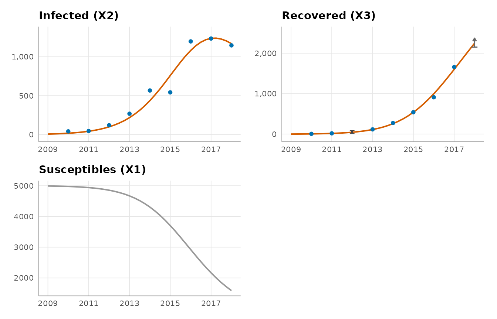
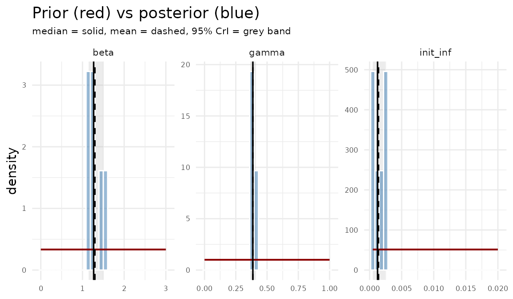
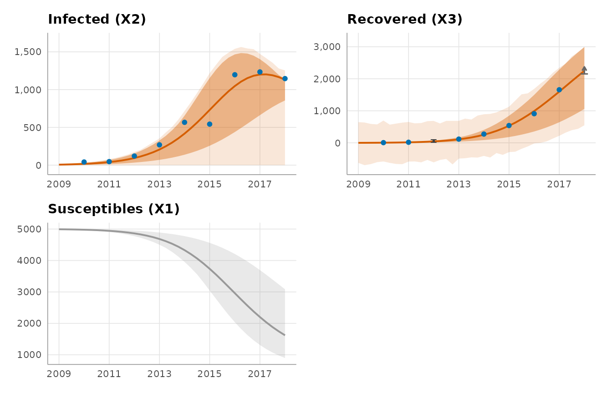
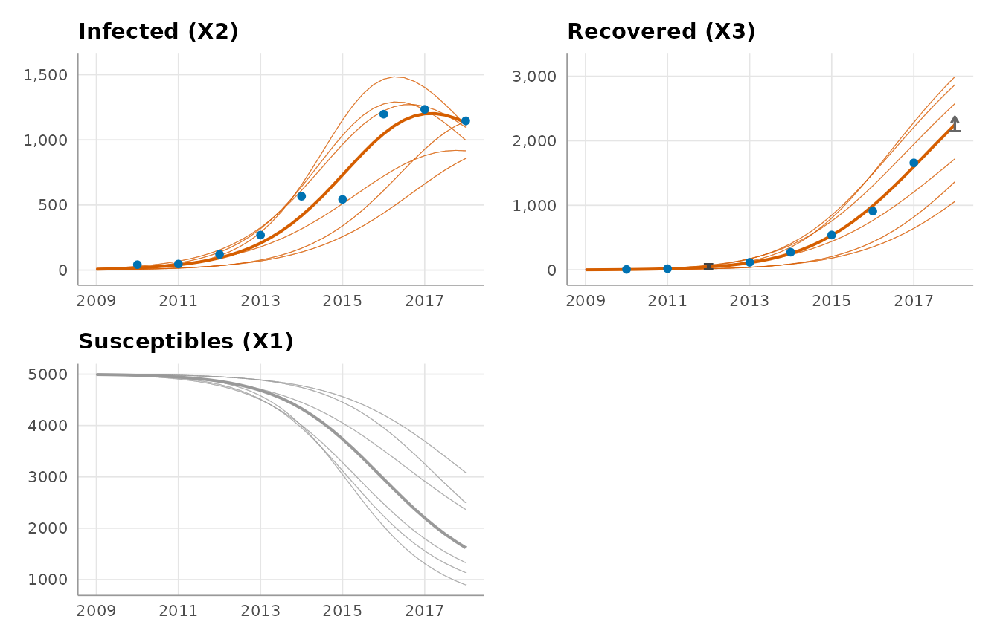
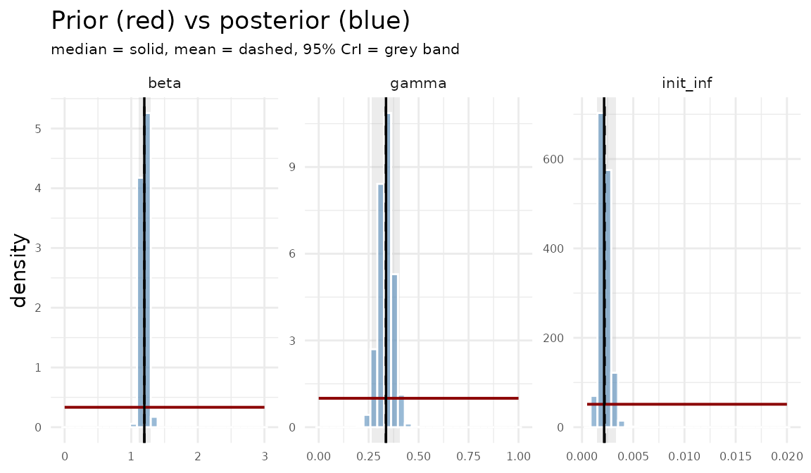
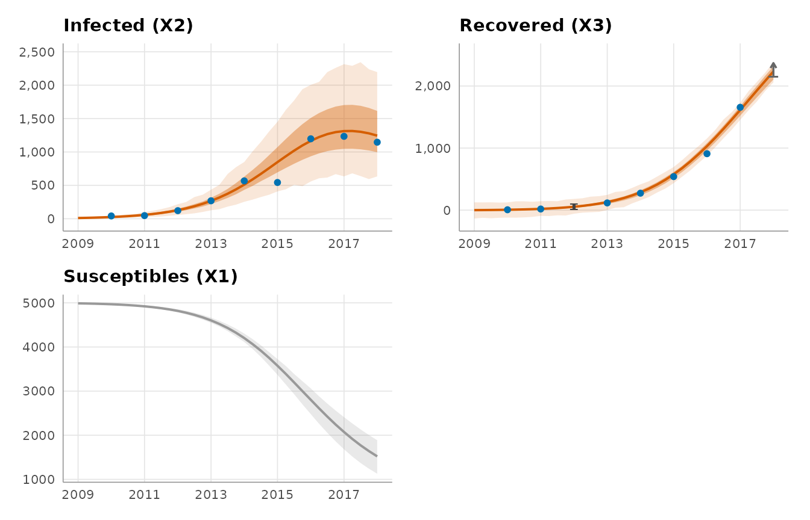
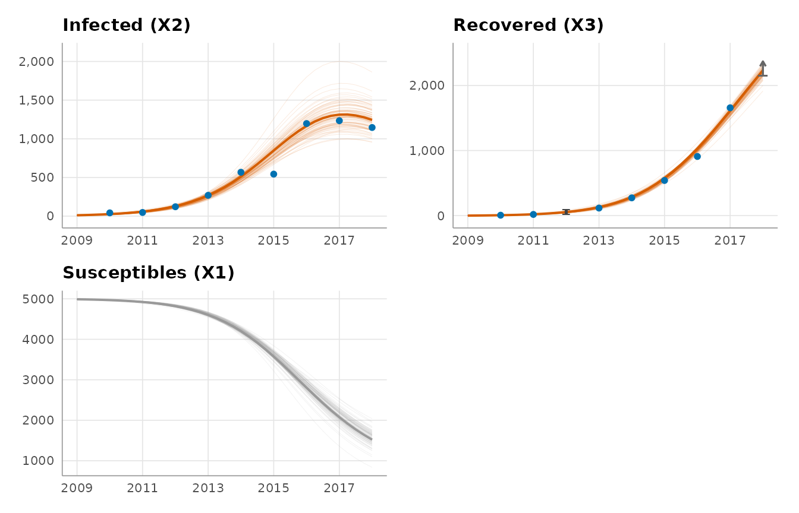

# Fitting an SIR model with compfit

## Introduction

Compartmental models are a fantastic tool to better understand how
epidemics or within-host dynamics of a virus unfold. Either you test
some hypothesis of how the dynamics change if you wiggle a parameter or
some initial conditions, or you want to figure out some unknown
parameters by fitting the model to actual data. If you have less than
ten compartments, there’s usually no hassle in editing some details here
and there, be that in the model set-up or in the loss function used for
calibration. But, in fields like HIV research, where you need
stratifications according to clinical and behavioural markers, it
becomes cumbersome quite fast to go into your many lines of R code to
figure out where you need to change what. Not to mention when you want
to adapt a parameter to be time-varying as piecewise constant, or
linear, or any function, really.

This was the starting point for designing the package `compfit`. Instead
of maintaining (and struggling through) many lines of code and multiple
versions of the same model, it reduces the set-up to three csv or Excel
files, which encode the model structure, the parameters and states, as
well as any data used by the model. This way, one can cleanly iterate on
model versions and try out adaptations in a clean fashion.

### Who this package is for

This package was designed for a spectrum of users, with the two extremes
being

- a user who knows basic R and has a compartmental model they want to
  run or calibrate without the overhead of the entire machinery going
  into it, and
- an experienced user who wants the flexibility and ease of the package
  but who also wants to fall back on the actual code if need be.

If there is any functionality you’re missing, get in touch!

## The example: Susceptible-Infected-Recovered (SIR)

The core functionalities are exemplified using one of the most known
compartmental models, the SIR model. It is used to model the dynamics
and development of an epidemic, be that influenza, COVID-19, measles,
and many more. The population is split into the three subpopulations of
susceptible, infected and recovered individuals. A susceptible
indiviudal becomes infected when interacting with an infected
individual, and an infected individual is recovered after a certain
amount of time; these are the flows between the subpopulations. The
subpopulations are visually shown as boxes, or *compartments*, and the
flows between them are indicated by arrows, compare with the depiction
below.

![](data:image/svg+xml;base64,PHN2ZyB3aWR0aD0iMjQycHQiIGhlaWdodD0iNDRwdCIgdmlld2JveD0iMC4wMCAwLjAwIDI0Mi4wMCA0NC4wMCIgeG1sbnM9Imh0dHA6Ly93d3cudzMub3JnLzIwMDAvc3ZnIiB4bWxuczp4bGluaz0iaHR0cDovL3d3dy53My5vcmcvMTk5OS94bGluayI+PGcgaWQ9ImdyYXBoMCIgY2xhc3M9ImdyYXBoIiB0cmFuc2Zvcm09InNjYWxlKDEgMSkgcm90YXRlKDApIHRyYW5zbGF0ZSg0IDQwKSI+PHRpdGxlPgpTSVIKPC90aXRsZT4KPHBvbHlnb24gZmlsbD0iI2ZmZmZmZiIgc3Ryb2tlPSJ0cmFuc3BhcmVudCIgcG9pbnRzPSItNCw0IC00LC00MCAyMzgsLTQwIDIzOCw0IC00LDQiPjwvcG9seWdvbj48IS0tIFMgLS0+PGcgaWQ9Im5vZGUxIiBjbGFzcz0ibm9kZSI+PHRpdGxlPgpTCjwvdGl0bGU+Cjxwb2x5Z29uIGZpbGw9IiNlZWVlZWUiIHN0cm9rZT0iIzAwMDAwMCIgcG9pbnRzPSI1NCwtMzYgMCwtMzYgMCwwIDU0LDAgNTQsLTM2Ij48L3BvbHlnb24+PHRleHQgdGV4dC1hbmNob3I9Im1pZGRsZSIgeD0iMjciIHk9Ii0xMy44IiBmb250LWZhbWlseT0iSGVsdmV0aWNhLHNhbnMtU2VyaWYiIGZvbnQtc2l6ZT0iMTQuMDAiIGZpbGw9IiMwMDAwMDAiPlM8L3RleHQ+PC9nPjwhLS0gSSAtLT48ZyBpZD0ibm9kZTIiIGNsYXNzPSJub2RlIj48dGl0bGU+CkkKPC90aXRsZT4KPHBvbHlnb24gZmlsbD0iI2VlZWVlZSIgc3Ryb2tlPSIjMDAwMDAwIiBwb2ludHM9IjE0NCwtMzYgOTAsLTM2IDkwLDAgMTQ0LDAgMTQ0LC0zNiI+PC9wb2x5Z29uPjx0ZXh0IHRleHQtYW5jaG9yPSJtaWRkbGUiIHg9IjExNyIgeT0iLTEzLjgiIGZvbnQtZmFtaWx5PSJIZWx2ZXRpY2Esc2Fucy1TZXJpZiIgZm9udC1zaXplPSIxNC4wMCIgZmlsbD0iIzAwMDAwMCI+STwvdGV4dD48L2c+PCEtLSBTJiM0NTsmZ3Q7SSAtLT48ZyBpZD0iZWRnZTEiIGNsYXNzPSJlZGdlIj48dGl0bGU+ClMtJmd0O0kKPC90aXRsZT4KPHBhdGggZmlsbD0ibm9uZSIgc3Ryb2tlPSIjMDAwMDAwIiBkPSJNNTQuMDAzLC0xOEM2Mi4wMjc3LC0xOCA3MC45NjY1LC0xOCA3OS41MzA5LC0xOCIgLz48cG9seWdvbiBmaWxsPSIjMDAwMDAwIiBzdHJva2U9IiMwMDAwMDAiIHBvaW50cz0iNzkuNzA1MSwtMjEuNTAwMSA4OS43MDUsLTE4IDc5LjcwNSwtMTQuNTAwMSA3OS43MDUxLC0yMS41MDAxIj48L3BvbHlnb24+PC9nPjwhLS0gUiAtLT48ZyBpZD0ibm9kZTMiIGNsYXNzPSJub2RlIj48dGl0bGU+ClIKPC90aXRsZT4KPHBvbHlnb24gZmlsbD0iI2VlZWVlZSIgc3Ryb2tlPSIjMDAwMDAwIiBwb2ludHM9IjIzNCwtMzYgMTgwLC0zNiAxODAsMCAyMzQsMCAyMzQsLTM2Ij48L3BvbHlnb24+PHRleHQgdGV4dC1hbmNob3I9Im1pZGRsZSIgeD0iMjA3IiB5PSItMTMuOCIgZm9udC1mYW1pbHk9IkhlbHZldGljYSxzYW5zLVNlcmlmIiBmb250LXNpemU9IjE0LjAwIiBmaWxsPSIjMDAwMDAwIj5SPC90ZXh0PjwvZz48IS0tIEkmIzQ1OyZndDtSIC0tPjxnIGlkPSJlZGdlMiIgY2xhc3M9ImVkZ2UiPjx0aXRsZT4KSS0mZ3Q7Ugo8L3RpdGxlPgo8cGF0aCBmaWxsPSJub25lIiBzdHJva2U9IiMwMDAwMDAiIGQ9Ik0xNDQuMDAzLC0xOEMxNTIuMDI3NywtMTggMTYwLjk2NjUsLTE4IDE2OS41MzA5LC0xOCIgLz48cG9seWdvbiBmaWxsPSIjMDAwMDAwIiBzdHJva2U9IiMwMDAwMDAiIHBvaW50cz0iMTY5LjcwNTEsLTIxLjUwMDEgMTc5LjcwNSwtMTggMTY5LjcwNSwtMTQuNTAwMSAxNjkuNzA1MSwtMjEuNTAwMSI+PC9wb2x5Z29uPjwvZz48L2c+PC9zdmc+)

To describe how the subpopulations change over time in size, we rewrite
this into ordinary differential equations (ODEs):

\begin{align} \tfrac{dS}{dt} &= -\beta SI \\ \tfrac{dI}{dt} &= \beta
SI - \gamma I \\ \tfrac{dR}{dt} &= \gamma I \end{align} The
corresponding figure we designed before can capture this information to
some extent by adding the parameters governing the flows above the
arrow.

![](data:image/svg+xml;base64,PHN2ZyB3aWR0aD0iMjY1cHQiIGhlaWdodD0iNDRwdCIgdmlld2JveD0iMC4wMCAwLjAwIDI2NS4zMiA0NC4wMCIgeG1sbnM9Imh0dHA6Ly93d3cudzMub3JnLzIwMDAvc3ZnIiB4bWxuczp4bGluaz0iaHR0cDovL3d3dy53My5vcmcvMTk5OS94bGluayI+PGcgaWQ9ImdyYXBoMCIgY2xhc3M9ImdyYXBoIiB0cmFuc2Zvcm09InNjYWxlKDEgMSkgcm90YXRlKDApIHRyYW5zbGF0ZSg0IDQwKSI+PHRpdGxlPgpTSVIKPC90aXRsZT4KPHBvbHlnb24gZmlsbD0iI2ZmZmZmZiIgc3Ryb2tlPSJ0cmFuc3BhcmVudCIgcG9pbnRzPSItNCw0IC00LC00MCAyNjEuMzIxMiwtNDAgMjYxLjMyMTIsNCAtNCw0Ij48L3BvbHlnb24+PCEtLSBTIC0tPjxnIGlkPSJub2RlMSIgY2xhc3M9Im5vZGUiPjx0aXRsZT4KUwo8L3RpdGxlPgo8cG9seWdvbiBmaWxsPSIjZWVlZWVlIiBzdHJva2U9IiMwMDAwMDAiIHBvaW50cz0iNTQsLTM2IDAsLTM2IDAsMCA1NCwwIDU0LC0zNiI+PC9wb2x5Z29uPjx0ZXh0IHRleHQtYW5jaG9yPSJtaWRkbGUiIHg9IjI3IiB5PSItMTMuOCIgZm9udC1mYW1pbHk9IkhlbHZldGljYSxzYW5zLVNlcmlmIiBmb250LXNpemU9IjE0LjAwIiBmaWxsPSIjMDAwMDAwIj5TPC90ZXh0PjwvZz48IS0tIEkgLS0+PGcgaWQ9Im5vZGUyIiBjbGFzcz0ibm9kZSI+PHRpdGxlPgpJCjwvdGl0bGU+Cjxwb2x5Z29uIGZpbGw9IiNlZWVlZWUiIHN0cm9rZT0iIzAwMDAwMCIgcG9pbnRzPSIxNTUuNjYwNiwtMzYgMTAxLjY2MDYsLTM2IDEwMS42NjA2LDAgMTU1LjY2MDYsMCAxNTUuNjYwNiwtMzYiPjwvcG9seWdvbj48dGV4dCB0ZXh0LWFuY2hvcj0ibWlkZGxlIiB4PSIxMjguNjYwNiIgeT0iLTEzLjgiIGZvbnQtZmFtaWx5PSJIZWx2ZXRpY2Esc2Fucy1TZXJpZiIgZm9udC1zaXplPSIxNC4wMCIgZmlsbD0iIzAwMDAwMCI+STwvdGV4dD48L2c+PCEtLSBTJiM0NTsmZ3Q7SSAtLT48ZyBpZD0iZWRnZTEiIGNsYXNzPSJlZGdlIj48dGl0bGU+ClMtJmd0O0kKPC90aXRsZT4KPHBhdGggZmlsbD0ibm9uZSIgc3Ryb2tlPSIjMDAwMDAwIiBkPSJNNTQuMjQzMiwtMThDNjUuNTI0NiwtMTggNzguNzk3NywtMTggOTAuOTg2OSwtMTgiIC8+PHBvbHlnb24gZmlsbD0iIzAwMDAwMCIgc3Ryb2tlPSIjMDAwMDAwIiBwb2ludHM9IjkxLjM0MjMsLTIxLjUwMDEgMTAxLjM0MjIsLTE4IDkxLjM0MjIsLTE0LjUwMDEgOTEuMzQyMywtMjEuNTAwMSI+PC9wb2x5Z29uPjx0ZXh0IHRleHQtYW5jaG9yPSJtaWRkbGUiIHg9Ijc3LjgzMDMiIHk9Ii0yMi4yIiBmb250LWZhbWlseT0iVGltZXMsc2VyaWYiIGZvbnQtc2l6ZT0iMTQuMDAiIGZpbGw9IiMwMDAwMDAiPs6yPC90ZXh0PjwvZz48IS0tIFIgLS0+PGcgaWQ9Im5vZGUzIiBjbGFzcz0ibm9kZSI+PHRpdGxlPgpSCjwvdGl0bGU+Cjxwb2x5Z29uIGZpbGw9IiNlZWVlZWUiIHN0cm9rZT0iIzAwMDAwMCIgcG9pbnRzPSIyNTcuMzIxMiwtMzYgMjAzLjMyMTIsLTM2IDIwMy4zMjEyLDAgMjU3LjMyMTIsMCAyNTcuMzIxMiwtMzYiPjwvcG9seWdvbj48dGV4dCB0ZXh0LWFuY2hvcj0ibWlkZGxlIiB4PSIyMzAuMzIxMiIgeT0iLTEzLjgiIGZvbnQtZmFtaWx5PSJIZWx2ZXRpY2Esc2Fucy1TZXJpZiIgZm9udC1zaXplPSIxNC4wMCIgZmlsbD0iIzAwMDAwMCI+UjwvdGV4dD48L2c+PCEtLSBJJiM0NTsmZ3Q7UiAtLT48ZyBpZD0iZWRnZTIiIGNsYXNzPSJlZGdlIj48dGl0bGU+CkktJmd0O1IKPC90aXRsZT4KPHBhdGggZmlsbD0ibm9uZSIgc3Ryb2tlPSIjMDAwMDAwIiBkPSJNMTU1LjkwMzgsLTE4QzE2Ny4xODUyLC0xOCAxODAuNDU4MywtMTggMTkyLjY0NzUsLTE4IiAvPjxwb2x5Z29uIGZpbGw9IiMwMDAwMDAiIHN0cm9rZT0iIzAwMDAwMCIgcG9pbnRzPSIxOTMuMDAyOSwtMjEuNTAwMSAyMDMuMDAyOCwtMTggMTkzLjAwMjgsLTE0LjUwMDEgMTkzLjAwMjksLTIxLjUwMDEiPjwvcG9seWdvbj48dGV4dCB0ZXh0LWFuY2hvcj0ibWlkZGxlIiB4PSIxNzkuNDkwOSIgeT0iLTIyLjIiIGZvbnQtZmFtaWx5PSJUaW1lcyxzZXJpZiIgZm9udC1zaXplPSIxNC4wMCIgZmlsbD0iIzAwMDAwMCI+zrM8L3RleHQ+PC9nPjwvZz48L3N2Zz4=)

Note that some of the parameters can intuitively be understood as
“moving an individual from one compartment to the next by this rate”
(i.e. the \gamma term), but someone from the S compartment is moved to
the I compartment by way of a \beta I term, involving the size of the
infected compartment. This makes complete epidemiological sense; but
mathematically it complicates solving this system of equations, and most
of the time we thus need numerical approaches, especially when the
compartmental model consists of many more compartments with multiple
infection terms.

You can imagine that this model cannot capture the dynamics of every
infectious disease. For HIV, for example, it makes sense to split it up
into susceptibles (S), acute infection (A), chronic infection (C),
diagnosed and under treatment (T). In that case, you also have many more
transmission terms between the susceptibles and all people living with
HIV; important to note is that after transmission, no matter which
compartment it was due, they always move to the compartment of acute
infections. The equations then may look like

\begin{align} \tfrac{dS}{dt} &= -\beta_A SA-\beta_C SC - \beta_T ST \\
\tfrac{dA}{dt} &= \beta_A SA+\beta_C SC + \beta_T ST -\gamma_A A \\
\tfrac{dC}{dt} &= \gamma_A A -\gamma_C C \\ \tfrac{dT}{dt} &= \gamma_C C
\end{align}

You can extend this model in arbitrary ways, to fit the infectious
disease that you are interested in. To actually *solve* it
mathematically in R or Python, you need the values of the parameters
involved as well as the sizes of the compartments at time 0. Usually,
one sets up a pipeline to either

1.  see how the model develops for different values (meaning one knows
    all the parameters and initial values), or
2.  figure out the parameters and initial values needed to explain
    epidemiological data, which we call **model fitting** from now on.

The second objective is very common when you know part of the parameters
and initial values, and want the model to best describe the data you
have. For the HIV example, one can assume a certain value for the
infection terms; indeed, under successful treatment, \beta_T = 0. We can
also say that the acute infection is over after a fairly fixed amount of
time, giving \gamma_A. But it is difficult to know the diagnosis and
treatment rate \gamma_C.

For both objectives, you’d set up the equations in a model function, and
then solve it using `ode()` from the package `deSolve`, or by a similar
method. For model fitting, you’d then set up a loss function based on
this compartmental model function and run
[`optim()`](https://rdrr.io/r/stats/optim.html) over it for a maximum
likelihood estimation (MLE). If instead one leans Bayesian, then one
sets priors on the unknown parameters and initial states, as well as the
likelihood families for the data one has, and then builds a Stan model
or similar.

This is heavy machinery. And heavy machinery means multiple lines of
code to maintain, which is, as said before, very cumbersome. So instead,
below, based on the SIR model, I will outline the functionalities of
`compfit` that bundle up what one wants from simulation, or MLE/Bayes
model fitting.

## Encoding the set-up

First, install and load `compfit`.

``` r

# install.packages("remotes")
remotes::install_github("OWNER/compfit")
library(compfit)
```

The input for the functions of `compfit` consists of three csv files (or
Excel): 1. The model structure, parameters and states encoded in
**modelParams.csv**. 2. The data points used for model fitting and
plotting in **dataCombined.csv** (which is optional if one only wants to
simulate!). 3. The dummy compartments used for inspecting the output of
either a simulation or a model fit, in **dataDummy.csv**. The three
files should be stored in the same folder, which we call “Scenario”. We
read it in using the custom
[`load_scenario()`](../reference/load_scenario.md) function.

``` r

sir_dir <- system.file("extdata", "SIR", package = "compfit")

sc <- load_scenario(
  sir_dir,
  combined_file = "dataCombined.csv",
  dummy_file    = "dataDummy.csv",
  params_file   = "modelParams.csv"
)
```

Using the read-in files, we discuss what needs (and what can) go into
the model files

### Model structure

The file consists of required columns, as well as optional columns.

#### Required

- States
- Parameters
- Constant, Linear\<i\>, Quadratic\<i\>
- Others

| States | Parameters | Linear1 | Quadratic1 | Linear2 | Quadratic2 | Linear3 | Quadratic3 | Others |
|:---|:---|:---|:---|:---|:---|:---|:---|:---|
| \*X1=N0_0\*(1-init_inf_0) | beta=\[0,3\] | 0 | 0 | 0 | 0 | 0 | 0 | startpoint=2010 |
| \*X2=init_inf_0\*N0_0 | gamma=\[0,1\] | 0 | \*2\*-beta | -(gamma_t) | 0 | (gamma_t) | 0 | endpoint=2018 |
| \*X3=0 | \*ramp=0.05 | 0 | 0 | 0 | 0 | 0 | 0 | partition=4 |
|  | \*N0=5000 |  | 0 |  | 0 |  | 0 |  |
|  | init_inf=\[0.0005,0.02\] |  | 0 |  | 0 |  | 0 |  |
|  |  |  | 0 |  | 0 |  | 0 |  |
|  |  |  | 0 |  | 0 |  | 0 |  |
|  |  |  | 0 |  | 0 |  | 0 |  |
|  |  |  | 0 |  | 0 |  | 0 |  |

The **States** column encodes the compartments of the model. In this
example we opted for calling them X1, X2, X3 corresponding to S, I, R,
but you could equally call them S, I, R directly. To keep it well
organised, we rewrite the SIR model equations using the new names for
the states:

\begin{align} \tfrac{dX_1}{dt} &= -\beta X_1X_2 \\ \tfrac{dX_2}{dt} &=
\beta X_1X_2 - \gamma X_2 \\ \tfrac{dX_3}{dt} &= \gamma X_2 \end{align}

The **Parameters** column encodes the parameters used in the model.
Every state and parameter need a value; for the state, this corresponds
to an initial value at time 0. If one writes “X3=0”, then this means
that it’s a fixed value and thus not used for model fitting. The
asterisk is mandatory for fixed values (but I’m open for changes here).
In this case, this means that at the beginning of an epidemic, we have
no recovered individuals.

Writing “beta=\[0,3\]” encodes the fact that we do not know \beta’s true
value but we believe it to lie somewhere in the interval from 0 to 3 (if
it’s a Bayesian framework, then this represents the uniform prior on
that interval). The starting point for that parameter will be the
midpoint of the interval; if one prefers to start from somewhere else,
the syntax is “beta=\[0,3\]\|2”. The set-up is flexible enough to
accommodate for us not knowing how many individuals were infected at the
start, thus the infected compartment having the shape
“X2=init_inf_0\*N0_0”, and the corresponding shape for the susceptible
compartment.

One can also choose different priors on the parameters and initial
states. Here are the options with their syntax:

| Prior      | Sheet syntax            | Support                            |
|------------|-------------------------|------------------------------------|
| Uniform    | `[lo,hi]`               | `[lo,hi]`                          |
| Normal     | `Normal(mu,sd)`         | real line                          |
| Log-normal | `LogNormal(mu,sd)`      | positive                           |
| Beta       | `Beta(a,b)`             | `(0,1)`                            |
| Gamma      | `Gamma(a,b)`            | positive                           |
| Student-t  | `StudentT(nu,mu,sigma)` | real line (heavy tails; `nu` = df) |

Some parameters can appear in the form of functions; indeed, \gamma_t is
an extension of the \gamma term we have in the model. It is entered as
“gamma_t\<-gamma\*(1+ramp\*time)” under **Functions**, which we discuss
below. The gamma in there is estimated, and thus must appear under
**Parameters**. The new model looks like:

\begin{align} \tfrac{dX_1}{dt} &= -\beta X_1X_2 \\ \tfrac{dX_2}{dt} &=
\beta X_1X_2 - \gamma_t X_2 \\ \tfrac{dX_3}{dt} &= \gamma_t X_2
\end{align} where \gamma_t is a function in time.

Since the SIR model has three compartments, we have columns **Linear1,
Quadratic1, Linear2, Quadratic2, Linear3, Quadratic3**. Any pair
Linear\<i\>, Quadratic\<i\> encodes the equation describing that
compartment’s inflow and outflow. For X_1, which is the compartment S,
we only have the outflow -\beta SI = -\beta X_1 X_2, which is a
quadratic term. Thus, the Linear1 column can be left empty. In the
Quadratic1 column, we go to the second row, since the 3(i-1) + j-th row
in corresponds to the parameter in front of the term X_iX_j. So the
entry “-beta” encodes the fact that -\beta X_1 X_2 is the quadratic term
in \tfrac{dX_1}{dt}. The number between asterisks before “-beta” tells
us to where this flows to, which for this model may not look very
relevant, but as discussed before, it comes up in an HIV-type
compartmental model. To see how Linear\<i\> works, look at Linear3. In
the second row, we have the entry “(gamma_t)”, corresponding to the
linear term \gamma_t X_2 in the model equations.

*Note*: one can only fill in the non-zero terms and leave the rest
empty, or fill it with 0’s for book-keeping. In fact, one can even omit
an entire column, which then translates to no terms of that type added
to the equations; in our example, one could entirely omit Quadratic2 and
Quadratic3. However, no error or warning is shown if one writes the
terms in the wrong line or erroneously omits a column.

Not appearing in the model is the **Constant** column, where the first
row adds any constant term to \tfrac{dX_1}{dt}. Examples for such terms
would be birth or migration terms.

Lastly, **Others** is a required column. One has to provide:

- *startpoint*: corresponding to time 0; it has to be an integer,
  usually a year. *Note the convention chosen here that startpoint - 1
  is the time for the initial values for the states!* In this file, we
  start in 2010, and the initial states are from 2009.
- *endpoint*: until when one has data or wants to end the simulation,
  strictly larger than startpoint and the same unit. In the provided
  file that’s 2018.
- *partition*: the number into which we divide one integer; partition =
  365 means we divide a year into days, partition = 12 means the
  division is by months.

#### Optional

- Level\_\<id\>
- Functions
- Conditions

| Level_1 | Functions                       | Conditions  |
|:--------|:--------------------------------|:------------|
| 1       | gamma_t\<-gamma\*(1+ramp\*time) | beta\>gamma |
| 2       |                                 |             |
| 3       |                                 |             |

**Level_1** in our example is optional (but the `Level_` prefix isn’t!),
and it encodes which compartment belongs to which sublevel. A typical
sublevel divison would be by age, or by biological sex, if there is no
uniform mixing. So if we had 2 levels, one would need to specify to
which Level_1 or Level_2 a compartment belongs, either by its
corresponding number or by its name.

We already implicated how **Functions** is used: and indeed, the gamma_t
is used in the model structure equations. The way gamma_t is entered is
using the R language “\<-”. Lastly, one may want to enforce conditions
on some of the parameters and initial states being fixed, which can be
done in **Conditions**.

### Data points

The data streams are optional if one only wants to simulate and not
model fit. The file is organised by **Label**, which is what is
displayed later in the plots for easy referencing, **Formula** which
encodes what the label describes, **Likelihood** describes the
likelihood family we ascribe to the data stream, **Weight** represents
the trust we have in the data source (1 is normal, 2-3 is strong, 4-7 is
very strong), **Average** is used when doing MLE to bring all data
streams to a common magnitude so the solver does not prioritise the
streams which have the relatively largest numbers. **Average** is
optional, and in its absence the data stream is automatically weighted
by the inverse of the data stream mean. **Weight** is also optional and
defaults to 1 on all nonspecified data streams.

Note that **Weight** and **Average** are only used in the MLE fit,
whereas **Likelihood** is only used in a Bayesian fit.

| Label | Formula | Likelihood | Weight | Average | 2010 | 2011 | 2012 | 2013 | 2014 | 2015 | 2016 | 2017 | 2018 |
|:---|:---|:---|:---|:---|:---|:---|:---|:---|:---|:---|:---|:---|:---|
| Infected (X2) | X2 | negbin | 1 | 0.001742 | 42 | 47 | 121 | 269 | 567 | 543 | 1197 | 1234 | 1146 |
| Recovered (X3) | X3 | gaussian | 1 | 0.001573 | 6 | 18 | \[15,95\] | 116 | 273 | 540 | 909 | 1657 | \>=2147 |

Then, one needs to specify the data for each year. Entering a number
means the model fits to that precise number. If one sets \[15,95\] as
for “Recovered (X3)” in 2012, it means that the true value is somewhere
between 15 and 95. And if one writes – as was done in 2018 – that
\>=2147, then this encodes the knowledge that the number is at least
2147. There are more options:

| Cell | Meaning |
|----|----|
| a number | observed value (`0` is a genuine zero) |
| `x` or blank | missing / unobserved |
| `<L` / `<=L` | left-censored: true value strictly / at-or-below `L` |
| `>L` / `>=L` | right-censored: true value strictly / at-or-above `L` |
| `[A,B]` | interval-censored: true value in `[A,B]`, flat within (`A < B`) |
| `[A,B]~s` | **soft** interval: plateau `[A,B]`, exponential shoulders of scale `s` (`~sl,su` for asymmetric shoulders) |
| `A->B` | asymmetric: recorded `A`, soft toward `B` (deviation `\|B-A\|`) |
| `A+` / `A-` | asymmetric: recorded `A`, soft up/down, deviation from the stream’s `Likelihood` column |

### Dummy compartments

Lastly, we have the dummy compartments, which are useful both for
diagnostics when model fitting, but equally useful when examining
certain combinations of subpopulations – this is for “opening the black
box”. The structure is a simpler version of the data streams encoding,
needing just **Label** and **Formula**.

| Label             | Formula |
|:------------------|:--------|
| Susceptibles (X1) | X1      |

## Fit by maximum likelihood

In a maximum likelihood estimation (MLE, done via least squares), we let
a solver deterministically move inside the parameter space to
continually improve the parameter choice. That is why we set method =
“lbfgsb” (L-BFGS stands for Limited memory
Broyden-Fletcher-Goldfarb-Shanno), which is a quasi-Newton solver; a
different option is “deoptim”, where the solver is started multiple
times from different starting points, and should in principle avoid
local optima and find a global one. Usually, “lbfgsb” works fine. Of
course, the time it takes to model fit scales with the number of
compartments, and the number of parameters and states being model fit.

``` r

fit_mle <- fitCompartmentalModel(
    sc$modelParams, sc$dataCombined,
    method = "lbfgsb",
    solver = solver_control(backend = "r"),
  control = optim_control(progress = FALSE)
  )

get_point(fit_mle)
#> $initial_state
#>          X1          X2          X3 
#> 4992.477586    7.522414    0.000000 
#> 
#> $parms
#>         beta        gamma     init_inf         ramp           N0 
#> 1.275448e+00 3.721944e-01 1.504483e-03 5.000000e-02 5.000000e+03
```

The `get_point(fit_mle)` prints the estimations. Using
[`plot_fit()`](../reference/plot_fit.md), we can look at how well the
solver fit to the data, and inspect the dummy variables too.

``` r

plot_fit(fit_mle, data_dummy = sc$dataDummy)$grid
```



We see that with the fitted parameters, the predicted curves fit nicely
through the data points. In principle, one could replace all the
parameters like “beta=\[0,3\]” with “beta=\[0,3\]\|random”, which draws
uniformly from the interval to start the estimation. Then, one can
launch it multiple times, getting a proxy for a confidence interval. The
more natural approach, though, is a Bayesian set-up.

## Fit by Bayesian sampling

If one prefers a Bayesian set-up (and is willing to wait a lot longer
than for an MLE fit), `compfit` provides an `R`, `Julia` or a `Stan`
backend to fit the model instead. This is controlled by the solver, with
options: `backend="r"`, `backend="julia"` or `backend="stan"`. The `R`
backend uses the gradient-free sampler `BayesianTools`, whereas the
Julia path needs a bridge to Julia and uses a No U-Turn sampler (NUTS),
which has to first be initiated. Stan also uses a NUTS. In fact, the `R`
backend is only sensible for really small models but it is slow and
mixes poorly; we illustrate this below and compare it to Julia (and then
Stan), so one should understand the output from the `R` backend as a
cautionary tale.

After setting up the files and reading them in via `load_scenario`, we
can call `fitCompartmentalModel` by providing the model structure, the
data points as well as some other controls. The main one is setting
method to “bayes”, and choosing the backend = “r”. In bayes_control,
choose the number of iterations and the number of chains. Whenever there
is a progress option, it defaults to TRUE and you can see how the solver
progresses.

``` r

fit_bayes <- fitCompartmentalModel(
  sc$modelParams, sc$dataCombined,
  method  = "bayes",
  solver  = solver_control(backend = "r"),
  bayes   = bayes_control(iter = 4000, chains = 3, progress = FALSE)
) 
```

Once the fit is through, we can inspect how well it worked by looking at
the output of [`posterior_report()`](../reference/posterior_report.md):

``` r

posterior_report(fit_bayes)
#> Posterior convergence:
#>   max R-hat: not available (could not be computed for this fit)
#>   min ESS:   0   (target >= 400)   ** below threshold **
#>   low ESS:    beta, gamma, init_inf, sigma, phi1
```

Well, clearly something is off if ESS is zero. We can look at how the
posteriors of the fitted quantities look like using
[`plot_prior_posterior()`](../reference/plot_prior_posterior.md), and
again we see it looks a bit off, though each posterior narrowed and
moved away from the uninformative uniform prior.

``` r

plot_prior_posterior(fit_bayes)
```



At this point, it looks strange, but we persist still and compare the
Bayes median and mean of the parameter posteriors to what we obtained
from the MLE:

``` r

compare_to_mle(fit_bayes, fit_mle) 
#>   parameter  bayes_mean bayes_median         mle rel_diff_mean rel_diff_median
#> 1      beta 1.297517311  1.267868285 1.275447961    0.01730321    -0.005942756
#> 2     gamma 0.386119985  0.386531598 0.372194434    0.03741472     0.038520630
#> 3  init_inf 0.001385799  0.001237978 0.001504483   -0.07888680    -0.177140191
```

The MLE and the Bayes fit are not too far off from each other, which is
encouraging. Since Bayes gives us directly credibility intervals, we
also inspect that using [`plot_fit()`](../reference/plot_fit.md), where
the darker shade is coming from the parameter uncertainty, and the
lighter one from the likelihood families chosen.

``` r

plot_fit(fit_bayes, data_dummy = sc$dataDummy, band_type = "both")$grid
```



Another view of the same fit is a *spaghetti plot*, which draws one line
per posterior draw instead of a summarised band:

``` r

plot_fit(fit_bayes, data_dummy = sc$dataDummy,
         band_type = "spaghetti", spaghetti_draws = 80)$grid
```



Now this is really weird, with this huge CrI and only very few curves
from the spaghetti plot.

## Why the R-backend posterior looks degenerate

The issue is what we mentioned earlier: the R backend uses a
gradient-free sampler and thus barely moves (in fact, it has a really
hard time with the \>=2147 and \[15,95\] information on the data
streams, which leads it to reject a lot of the proposals and makes it
virtually immobile). We can highlight this by inspecting how many
different draws there actually are:

``` r

draws <- posterior_draws(fit_bayes)
nrow(draws)
#> [1] 6006
nrow(unique(round(as.data.frame(draws), 6)))
#> [1] 6
```

Though there are 6006 draws, there are only 6 unique ones. Clearly, we
need to move on to a better sampler.

## The same model with the Julia backend

Julia, which employs the No U-Turn sampler (NUTS) is one option to get
around the mixing problem we observed. Installing Julia on a build
server is heavy, so this article does **not** run it live: the fit is
produced once and saved, then loaded here for display.

``` r

# The number of threads have to be set before, and once they are set, 
# you cannot change it anymore in the session
Sys.setenv(JULIA_NUM_THREADS = 4)

library(compfit)
setup_julia()   
# starts Julia; the first call installs the Julia packages
                # (OrdinaryDiffEq, Turing, Distributions) and takes a few minutes
```

``` r

# The runnable version of this lives in
# data-raw/make_julia_artifacts.R.
fit_julia <- fitCompartmentalModel(
  sc$modelParams, sc$dataCombined,
  method = "bayes",
  solver  = solver_control(backend = "julia"),
  bayes  = bayes_control(chains = 4, iter = 2000)
)
save_fit(fit_julia, "vignettes/articles/julia_fit.rds")
```

``` r

fit_julia <- reload_fit(julia_fit_path, register = FALSE)
posterior_report(fit_julia)
#> Posterior convergence:
#>   max R-hat: 1.003  (target <= 1.01)  OK
#>   min ESS:   2462   (target >= 400)   OK
```

Now this looks much better, and the prior versus the posteriors of the
parameter distributions also looks much more encouraging:

``` r

plot_prior_posterior(fit_julia)
```



The same can be said for the spaghetti plots, now with many more curves
accepted.

![](data:image/svg+xml;base64,PHN2ZyB4bWxucz0iaHR0cDovL3d3dy53My5vcmcvMjAwMC9zdmciIHhtbG5zOnhsaW5rPSJodHRwOi8vd3d3LnczLm9yZy8xOTk5L3hsaW5rIiB3aWR0aD0iNTA0LjAwcHQiIGhlaWdodD0iMzI0LjAwcHQiIHZpZXdib3g9IjAgMCA1MDQuMDAgMzI0LjAwIj48ZyBjbGFzcz0ic3ZnbGl0ZSI+PGRlZnM+PHN0eWxlIHR5cGU9InRleHQvY3NzIj4KICAgIC5zdmdsaXRlIGxpbmUsIC5zdmdsaXRlIHBvbHlsaW5lLCAuc3ZnbGl0ZSBwb2x5Z29uLCAuc3ZnbGl0ZSBwYXRoLCAuc3ZnbGl0ZSByZWN0LCAuc3ZnbGl0ZSBjaXJjbGUgewogICAgICBmaWxsOiBub25lOwogICAgICBzdHJva2U6ICMwMDAwMDA7CiAgICAgIHN0cm9rZS1saW5lY2FwOiByb3VuZDsKICAgICAgc3Ryb2tlLWxpbmVqb2luOiByb3VuZDsKICAgICAgc3Ryb2tlLW1pdGVybGltaXQ6IDEwLjAwOwogICAgfQogICAgLnN2Z2xpdGUgdGV4dCB7CiAgICAgIHdoaXRlLXNwYWNlOiBwcmU7CiAgICB9CiAgICAuc3ZnbGl0ZSBnLmdseXBoZ3JvdXAgcGF0aCB7CiAgICAgIGZpbGw6IGluaGVyaXQ7CiAgICAgIHN0cm9rZTogbm9uZTsKICAgIH0KICA8L3N0eWxlPjwvZGVmcz48cmVjdCB3aWR0aD0iMTAwJSIgaGVpZ2h0PSIxMDAlIiBzdHlsZT0ic3Ryb2tlOiBub25lOyBmaWxsOiAjRkZGRkZGOyIgLz48ZGVmcz48Y2xpcHBhdGggaWQ9ImNwTUM0d01IdzFNRFF1TURCOE1DNHdNSHd6TWpRdU1EQT0iPjxyZWN0IHg9IjAuMDAiIHk9IjAuMDAiIHdpZHRoPSI1MDQuMDAiIGhlaWdodD0iMzI0LjAwIiAvPjwvY2xpcHBhdGg+PC9kZWZzPjxnIGNsaXAtcGF0aD0idXJsKCNjcE1DNHdNSHcxTURRdU1EQjhNQzR3TUh3ek1qUXVNREE9KSI+PHJlY3QgeD0iMC4wMDAwMDAwMDAwMDAwNjQiIHk9IjAuMDAiIHdpZHRoPSI1MDQuMDAiIGhlaWdodD0iMzI0LjAwIiBzdHlsZT0ic3Ryb2tlLXdpZHRoOiAxLjA3OyBzdHJva2U6ICNGRkZGRkY7IGZpbGw6ICNGRkZGRkY7IiAvPjwvZz48ZGVmcz48Y2xpcHBhdGggaWQ9ImNwTXpZdU5ESjhORGt3TGpVMWZESTNMakV6ZkRNd01DNHlNQT09Ij48cmVjdCB4PSIzNi40MiIgeT0iMjcuMTMiIHdpZHRoPSI0NTQuMTMiIGhlaWdodD0iMjczLjA2IiAvPjwvY2xpcHBhdGg+PC9kZWZzPjxnIGNsaXAtcGF0aD0idXJsKCNjcE16WXVOREo4TkRrd0xqVTFmREkzTGpFemZETXdNQzR5TUE9PSkiPjwvZz48ZyBjbGlwLXBhdGg9InVybCgjY3BNQzR3TUh3MU1EUXVNREI4TUM0d01Id3pNalF1TURBPSkiPjwvZz48ZGVmcz48Y2xpcHBhdGggaWQ9ImNwTlM0ME9Id3lOVEl1TURCOE5TNDBPSHd4TmpJdU1EQT0iPjxyZWN0IHg9IjUuNDgiIHk9IjUuNDgiIHdpZHRoPSIyNDYuNTIiIGhlaWdodD0iMTU2LjUyIiAvPjwvY2xpcHBhdGg+PC9kZWZzPjxnIGNsaXAtcGF0aD0idXJsKCNjcE5TNDBPSHd5TlRJdU1EQjhOUzQwT0h3eE5qSXVNREE9KSI+PHJlY3QgeD0iNS40OCIgeT0iNS40OCIgd2lkdGg9IjI0Ni41MiIgaGVpZ2h0PSIxNTYuNTIiIHN0eWxlPSJzdHJva2Utd2lkdGg6IDEuMDc7IHN0cm9rZTogbm9uZTsgZmlsbDogI0ZGRkZGRjsiIC8+PC9nPjxnIGNsaXAtcGF0aD0idXJsKCNjcE1DNHdNSHcxTURRdU1EQjhNQzR3TUh3ek1qUXVNREE9KSI+PC9nPjxkZWZzPjxjbGlwcGF0aCBpZD0iY3BNalV5TGpBd2ZEUTVPQzQxTW53MUxqUTRmREUyTWk0d01BPT0iPjxyZWN0IHg9IjI1Mi4wMCIgeT0iNS40OCIgd2lkdGg9IjI0Ni41MiIgaGVpZ2h0PSIxNTYuNTIiIC8+PC9jbGlwcGF0aD48L2RlZnM+PGcgY2xpcC1wYXRoPSJ1cmwoI2NwTWpVeUxqQXdmRFE1T0M0MU1udzFMalE0ZkRFMk1pNHdNQT09KSI+PHJlY3QgeD0iMjUyLjAwIiB5PSI1LjQ4IiB3aWR0aD0iMjQ2LjUyIiBoZWlnaHQ9IjE1Ni41MiIgc3R5bGU9InN0cm9rZS13aWR0aDogMS4wNzsgc3Ryb2tlOiBub25lOyBmaWxsOiAjRkZGRkZGOyIgLz48L2c+PGcgY2xpcC1wYXRoPSJ1cmwoI2NwTUM0d01IdzFNRFF1TURCOE1DNHdNSHd6TWpRdU1EQT0pIj48L2c+PGRlZnM+PGNsaXBwYXRoIGlkPSJjcE5TNDBPSHd5TlRJdU1EQjhNVFl5TGpBd2ZETXhPQzQxTWc9PSI+PHJlY3QgeD0iNS40OCIgeT0iMTYyLjAwIiB3aWR0aD0iMjQ2LjUyIiBoZWlnaHQ9IjE1Ni41MiIgLz48L2NsaXBwYXRoPjwvZGVmcz48ZyBjbGlwLXBhdGg9InVybCgjY3BOUzQwT0h3eU5USXVNREI4TVRZeUxqQXdmRE14T0M0MU1nPT0pIj48cmVjdCB4PSI1LjQ4IiB5PSIxNjIuMDAiIHdpZHRoPSIyNDYuNTIiIGhlaWdodD0iMTU2LjUyIiBzdHlsZT0ic3Ryb2tlLXdpZHRoOiAxLjA3OyBzdHJva2U6IG5vbmU7IGZpbGw6ICNGRkZGRkY7IiAvPjwvZz48ZyBjbGlwLXBhdGg9InVybCgjY3BNQzR3TUh3MU1EUXVNREI4TUM0d01Id3pNalF1TURBPSkiPjwvZz48ZGVmcz48Y2xpcHBhdGggaWQ9ImNwTXpZdU5ESjhNalEwTGpBemZESTNMakV6ZkRFME15NDJOdz09Ij48cmVjdCB4PSIzNi40MiIgeT0iMjcuMTMiIHdpZHRoPSIyMDcuNjEiIGhlaWdodD0iMTE2LjU0IiAvPjwvY2xpcHBhdGg+PC9kZWZzPjxnIGNsaXAtcGF0aD0idXJsKCNjcE16WXVOREo4TWpRMExqQXpmREkzTGpFemZERTBNeTQyTnc9PSkiPjxwb2x5bGluZSBwb2ludHM9IjM2LjQyLDEzNi4yOSAyNDQuMDMsMTM2LjI5ICIgc3R5bGU9InN0cm9rZS13aWR0aDogMC42NDsgc3Ryb2tlOiAjRTVFNUU1OyBzdHJva2UtbGluZWNhcDogYnV0dDsiPjwvcG9seWxpbmU+PHBvbHlsaW5lIHBvaW50cz0iMzYuNDIsMTA5LjIyIDI0NC4wMywxMDkuMjIgIiBzdHlsZT0ic3Ryb2tlLXdpZHRoOiAwLjY0OyBzdHJva2U6ICNFNUU1RTU7IHN0cm9rZS1saW5lY2FwOiBidXR0OyI+PC9wb2x5bGluZT48cG9seWxpbmUgcG9pbnRzPSIzNi40Miw4Mi4xNCAyNDQuMDMsODIuMTQgIiBzdHlsZT0ic3Ryb2tlLXdpZHRoOiAwLjY0OyBzdHJva2U6ICNFNUU1RTU7IHN0cm9rZS1saW5lY2FwOiBidXR0OyI+PC9wb2x5bGluZT48cG9seWxpbmUgcG9pbnRzPSIzNi40Miw1NS4wNyAyNDQuMDMsNTUuMDcgIiBzdHlsZT0ic3Ryb2tlLXdpZHRoOiAwLjY0OyBzdHJva2U6ICNFNUU1RTU7IHN0cm9rZS1saW5lY2FwOiBidXR0OyI+PC9wb2x5bGluZT48cG9seWxpbmUgcG9pbnRzPSIzNi40MiwyNy45OSAyNDQuMDMsMjcuOTkgIiBzdHlsZT0ic3Ryb2tlLXdpZHRoOiAwLjY0OyBzdHJva2U6ICNFNUU1RTU7IHN0cm9rZS1saW5lY2FwOiBidXR0OyI+PC9wb2x5bGluZT48cG9seWxpbmUgcG9pbnRzPSI2Ni44MSwxNDMuNjcgNjYuODEsMjcuMTMgIiBzdHlsZT0ic3Ryb2tlLXdpZHRoOiAwLjY0OyBzdHJva2U6ICNFNUU1RTU7IHN0cm9rZS1saW5lY2FwOiBidXR0OyI+PC9wb2x5bGluZT48cG9seWxpbmUgcG9pbnRzPSI4Ny43NywxNDMuNjcgODcuNzcsMjcuMTMgIiBzdHlsZT0ic3Ryb2tlLXdpZHRoOiAwLjY0OyBzdHJva2U6ICNFNUU1RTU7IHN0cm9rZS1saW5lY2FwOiBidXR0OyI+PC9wb2x5bGluZT48cG9seWxpbmUgcG9pbnRzPSIxMDguNzksMTQzLjY3IDEwOC43OSwyNy4xMyAiIHN0eWxlPSJzdHJva2Utd2lkdGg6IDAuNjQ7IHN0cm9rZTogI0U1RTVFNTsgc3Ryb2tlLWxpbmVjYXA6IGJ1dHQ7Ij48L3BvbHlsaW5lPjxwb2x5bGluZSBwb2ludHM9IjEyOS43NSwxNDMuNjcgMTI5Ljc1LDI3LjEzICIgc3R5bGU9InN0cm9rZS13aWR0aDogMC42NDsgc3Ryb2tlOiAjRTVFNUU1OyBzdHJva2UtbGluZWNhcDogYnV0dDsiPjwvcG9seWxpbmU+PHBvbHlsaW5lIHBvaW50cz0iMTUwLjcwLDE0My42NyAxNTAuNzAsMjcuMTMgIiBzdHlsZT0ic3Ryb2tlLXdpZHRoOiAwLjY0OyBzdHJva2U6ICNFNUU1RTU7IHN0cm9rZS1saW5lY2FwOiBidXR0OyI+PC9wb2x5bGluZT48cG9seWxpbmUgcG9pbnRzPSIxNzEuNjYsMTQzLjY3IDE3MS42NiwyNy4xMyAiIHN0eWxlPSJzdHJva2Utd2lkdGg6IDAuNjQ7IHN0cm9rZTogI0U1RTVFNTsgc3Ryb2tlLWxpbmVjYXA6IGJ1dHQ7Ij48L3BvbHlsaW5lPjxwb2x5bGluZSBwb2ludHM9IjE5Mi42OCwxNDMuNjcgMTkyLjY4LDI3LjEzICIgc3R5bGU9InN0cm9rZS13aWR0aDogMC42NDsgc3Ryb2tlOiAjRTVFNUU1OyBzdHJva2UtbGluZWNhcDogYnV0dDsiPjwvcG9seWxpbmU+PHBvbHlsaW5lIHBvaW50cz0iMjEzLjY0LDE0My42NyAyMTMuNjQsMjcuMTMgIiBzdHlsZT0ic3Ryb2tlLXdpZHRoOiAwLjY0OyBzdHJva2U6ICNFNUU1RTU7IHN0cm9rZS1saW5lY2FwOiBidXR0OyI+PC9wb2x5bGluZT48cG9seWxpbmUgcG9pbnRzPSIyMzQuNTksMTQzLjY3IDIzNC41OSwyNy4xMyAiIHN0eWxlPSJzdHJva2Utd2lkdGg6IDAuNjQ7IHN0cm9rZTogI0U1RTVFNTsgc3Ryb2tlLWxpbmVjYXA6IGJ1dHQ7Ij48L3BvbHlsaW5lPjxwb2x5bGluZSBwb2ludHM9IjQ1Ljg2LDEzNS40NyA1MS4wOCwxMzUuMjggNTYuMzYsMTM1LjA1IDYxLjU5LDEzNC43OCA2Ni44MSwxMzQuNDUgNzIuMTAsMTM0LjA1IDc3LjMyLDEzMy41NiA4Mi41NSwxMzIuOTggODcuNzcsMTMyLjI4IDkzLjA2LDEzMS40NCA5OC4yOCwxMzAuNDUgMTAzLjUxLDEyOS4yNyAxMDguNzksMTI3Ljg4IDExNC4wMSwxMjYuMjUgMTE5LjI0LDEyNC4zNiAxMjQuNTIsMTIyLjE3IDEyOS43NSwxMTkuNjYgMTM0Ljk3LDExNi44MiAxNDAuMjUsMTEzLjY0IDE0NS40OCwxMTAuMTIgMTUwLjcwLDEwNi4zMCAxNTUuOTMsMTAyLjIxIDE2MS4yMSw5Ny45MyAxNjYuNDQsOTMuNTUgMTcxLjY2LDg5LjE3IDE3Ni45NCw4NC45MyAxODIuMTcsODAuOTQgMTg3LjM5LDc3LjMzIDE5Mi42OCw3NC4yMyAxOTcuOTAsNzEuNzEgMjAzLjEzLDY5Ljg1IDIwOC4zNSw2OC42NyAyMTMuNjQsNjguMTkgMjE4Ljg2LDY4LjM2IDIyNC4wOSw2OS4xNiAyMjkuMzcsNzAuNTEgMjM0LjU5LDcyLjM0ICIgc3R5bGU9InN0cm9rZS13aWR0aDogMC4zODsgc3Ryb2tlOiAjRDU1RTAwOyBzdHJva2Utb3BhY2l0eTogMC4xMjsgc3Ryb2tlLWxpbmVjYXA6IGJ1dHQ7Ij48L3BvbHlsaW5lPjxwb2x5bGluZSBwb2ludHM9IjQ1Ljg2LDEzNS43NCA1MS4wOCwxMzUuNjEgNTYuMzYsMTM1LjQ0IDYxLjU5LDEzNS4yNCA2Ni44MSwxMzUuMDAgNzIuMTAsMTM0LjcwIDc3LjMyLDEzNC4zNCA4Mi41NSwxMzMuOTAgODcuNzcsMTMzLjM2IDkzLjA2LDEzMi43MSA5OC4yOCwxMzEuOTMgMTAzLjUxLDEzMS4wMCAxMDguNzksMTI5Ljg4IDExNC4wMSwxMjguNTUgMTE5LjI0LDEyNi45OSAxMjQuNTIsMTI1LjE2IDEyOS43NSwxMjMuMDMgMTM0Ljk3LDEyMC41OCAxNDAuMjUsMTE3LjgwIDE0NS40OCwxMTQuNjggMTUwLjcwLDExMS4yMyAxNTUuOTMsMTA3LjQ4IDE2MS4yMSwxMDMuNTAgMTY2LjQ0LDk5LjM1IDE3MS42Niw5NS4xNCAxNzYuOTQsOTAuOTkgMTgyLjE3LDg3LjA0IDE4Ny4zOSw4My40MiAxOTIuNjgsODAuMjcgMTk3LjkwLDc3LjY4IDIwMy4xMyw3NS43NCAyMDguMzUsNzQuNDkgMjEzLjY0LDczLjk0IDIxOC44Niw3NC4wOCAyMjQuMDksNzQuODYgMjI5LjM3LDc2LjIwIDIzNC41OSw3OC4wNCAiIHN0eWxlPSJzdHJva2Utd2lkdGg6IDAuMzg7IHN0cm9rZTogI0Q1NUUwMDsgc3Ryb2tlLW9wYWNpdHk6IDAuMTI7IHN0cm9rZS1saW5lY2FwOiBidXR0OyI+PC9wb2x5bGluZT48cG9seWxpbmUgcG9pbnRzPSI0NS44NiwxMzUuODUgNTEuMDgsMTM1LjczIDU2LjM2LDEzNS42MCA2MS41OSwxMzUuNDMgNjYuODEsMTM1LjIxIDcyLjEwLDEzNC45NSA3Ny4zMiwxMzQuNjMgODIuNTUsMTM0LjI0IDg3Ljc3LDEzMy43NSA5My4wNiwxMzMuMTYgOTguMjgsMTMyLjQ0IDEwMy41MSwxMzEuNTYgMTA4Ljc5LDEzMC41MSAxMTQuMDEsMTI5LjIzIDExOS4yNCwxMjcuNzEgMTI0LjUyLDEyNS45MCAxMjkuNzUsMTIzLjc3IDEzNC45NywxMjEuMjkgMTQwLjI1LDExOC40MSAxNDUuNDgsMTE1LjE0IDE1MC43MCwxMTEuNDYgMTU1LjkzLDEwNy40MSAxNjEuMjEsMTAzLjAxIDE2Ni40NCw5OC4zNiAxNzEuNjYsOTMuNTUgMTc2Ljk0LDg4Ljc0IDE4Mi4xNyw4NC4wNyAxODcuMzksNzkuNzEgMTkyLjY4LDc1LjgzIDE5Ny45MCw3Mi41NiAyMDMuMTMsNzAuMDEgMjA4LjM1LDY4LjI2IDIxMy42NCw2Ny4zMiAyMTguODYsNjcuMTkgMjI0LjA5LDY3LjgxIDIyOS4zNyw2OS4xMCAyMzQuNTksNzAuOTggIiBzdHlsZT0ic3Ryb2tlLXdpZHRoOiAwLjM4OyBzdHJva2U6ICNENTVFMDA7IHN0cm9rZS1vcGFjaXR5OiAwLjEyOyBzdHJva2UtbGluZWNhcDogYnV0dDsiPjwvcG9seWxpbmU+PHBvbHlsaW5lIHBvaW50cz0iNDUuODYsMTM1LjcwIDUxLjA4LDEzNS41NiA1Ni4zNiwxMzUuMzggNjEuNTksMTM1LjE3IDY2LjgxLDEzNC45MCA3Mi4xMCwxMzQuNTcgNzcuMzIsMTM0LjE4IDgyLjU1LDEzMy42OSA4Ny43NywxMzMuMTAgOTMuMDYsMTMyLjM3IDk4LjI4LDEzMS41MCAxMDMuNTEsMTMwLjQ1IDEwOC43OSwxMjkuMTkgMTE0LjAxLDEyNy42OSAxMTkuMjQsMTI1LjkxIDEyNC41MiwxMjMuODEgMTI5Ljc1LDEyMS4zNiAxMzQuOTcsMTE4LjUyIDE0MC4yNSwxMTUuMjkgMTQ1LjQ4LDExMS42NCAxNTAuNzAsMTA3LjU5IDE1NS45MywxMDMuMTcgMTYxLjIxLDk4LjQ1IDE2Ni40NCw5My41MSAxNzEuNjYsODguNDkgMTc2Ljk0LDgzLjUyIDE4Mi4xNyw3OC43NyAxODcuMzksNzQuMzkgMTkyLjY4LDcwLjU1IDE5Ny45MCw2Ny4zNyAyMDMuMTMsNjQuOTQgMjA4LjM1LDYzLjMyIDIxMy42NCw2Mi41MSAyMTguODYsNjIuNDkgMjI0LjA5LDYzLjIyIDIyOS4zNyw2NC42MCAyMzQuNTksNjYuNTUgIiBzdHlsZT0ic3Ryb2tlLXdpZHRoOiAwLjM4OyBzdHJva2U6ICNENTVFMDA7IHN0cm9rZS1vcGFjaXR5OiAwLjEyOyBzdHJva2UtbGluZWNhcDogYnV0dDsiPjwvcG9seWxpbmU+PHBvbHlsaW5lIHBvaW50cz0iNDUuODYsMTM1LjU5IDUxLjA4LDEzNS40MyA1Ni4zNiwxMzUuMjMgNjEuNTksMTM1LjAwIDY2LjgxLDEzNC43MSA3Mi4xMCwxMzQuMzcgNzcuMzIsMTMzLjk1IDgyLjU1LDEzMy40NSA4Ny43NywxMzIuODUgOTMuMDYsMTMyLjEzIDk4LjI4LDEzMS4yNyAxMDMuNTEsMTMwLjI0IDEwOC43OSwxMjkuMDQgMTE0LjAxLDEyNy42MSAxMTkuMjQsMTI1Ljk1IDEyNC41MiwxMjQuMDMgMTI5Ljc1LDEyMS44MSAxMzQuOTcsMTE5LjI4IDE0MC4yNSwxMTYuNDMgMTQ1LjQ4LDExMy4yNiAxNTAuNzAsMTA5Ljc3IDE1NS45MywxMDYuMDAgMTYxLjIxLDEwMi4wMSAxNjYuNDQsOTcuODYgMTcxLjY2LDkzLjY1IDE3Ni45NCw4OS40OSAxODIuMTcsODUuNTEgMTg3LjM5LDgxLjgyIDE5Mi42OCw3OC41NCAxOTcuOTAsNzUuNzggMjAzLjEzLDczLjYxIDIwOC4zNSw3Mi4xMCAyMTMuNjQsNzEuMjUgMjE4Ljg2LDcxLjA2IDIyNC4wOSw3MS41MCAyMjkuMzcsNzIuNTEgMjM0LjU5LDc0LjAzICIgc3R5bGU9InN0cm9rZS13aWR0aDogMC4zODsgc3Ryb2tlOiAjRDU1RTAwOyBzdHJva2Utb3BhY2l0eTogMC4xMjsgc3Ryb2tlLWxpbmVjYXA6IGJ1dHQ7Ij48L3BvbHlsaW5lPjxwb2x5bGluZSBwb2ludHM9IjQ1Ljg2LDEzNS42OSA1MS4wOCwxMzUuNTUgNTYuMzYsMTM1LjM4IDYxLjU5LDEzNS4xNyA2Ni44MSwxMzQuOTEgNzIuMTAsMTM0LjU5IDc3LjMyLDEzNC4yMCA4Mi41NSwxMzMuNzMgODcuNzcsMTMzLjE2IDkzLjA2LDEzMi40NyA5OC4yOCwxMzEuNjQgMTAzLjUxLDEzMC42NSAxMDguNzksMTI5LjQ2IDExNC4wMSwxMjguMDUgMTE5LjI0LDEyNi4zOSAxMjQuNTIsMTI0LjQ0IDEyOS43NSwxMjIuMTcgMTM0Ljk3LDExOS41NiAxNDAuMjUsMTE2LjU5IDE0NS40OCwxMTMuMjUgMTUwLjcwLDEwOS41NiAxNTUuOTMsMTA1LjUzIDE2MS4yMSwxMDEuMjMgMTY2LjQ0LDk2Ljc0IDE3MS42Niw5Mi4xNyAxNzYuOTQsODcuNjMgMTgyLjE3LDgzLjI4IDE4Ny4zOSw3OS4yNSAxOTIuNjgsNzUuNjkgMTk3LjkwLDcyLjcxIDIwMy4xMyw3MC40MCAyMDguMzUsNjguODIgMjEzLjY0LDY3Ljk4IDIxOC44Niw2Ny44OCAyMjQuMDksNjguNDYgMjI5LjM3LDY5LjY3IDIzNC41OSw3MS40MiAiIHN0eWxlPSJzdHJva2Utd2lkdGg6IDAuMzg7IHN0cm9rZTogI0Q1NUUwMDsgc3Ryb2tlLW9wYWNpdHk6IDAuMTI7IHN0cm9rZS1saW5lY2FwOiBidXR0OyI+PC9wb2x5bGluZT48cG9seWxpbmUgcG9pbnRzPSI0NS44NiwxMzUuODIgNTEuMDgsMTM1LjcwIDU2LjM2LDEzNS41NSA2MS41OSwxMzUuMzcgNjYuODEsMTM1LjE0IDcyLjEwLDEzNC44NiA3Ny4zMiwxMzQuNTEgODIuNTUsMTM0LjA4IDg3Ljc3LDEzMy41NSA5My4wNiwxMzIuOTAgOTguMjgsMTMyLjExIDEwMy41MSwxMzEuMTUgMTA4Ljc5LDEyOS45OCAxMTQuMDEsMTI4LjU4IDExOS4yNCwxMjYuODkgMTI0LjUyLDEyNC44OSAxMjkuNzUsMTIyLjUyIDEzNC45NywxMTkuNzYgMTQwLjI1LDExNi41OCAxNDUuNDgsMTEyLjk1IDE1MC43MCwxMDguODggMTU1LjkzLDEwNC40MCAxNjEuMjEsOTkuNTcgMTY2LjQ0LDk0LjQ5IDE3MS42Niw4OS4yOSAxNzYuOTQsODQuMTEgMTgyLjE3LDc5LjE1IDE4Ny4zOSw3NC41OSAxOTIuNjgsNzAuNTkgMTk3LjkwLDY3LjMwIDIwMy4xMyw2NC44MiAyMDguMzUsNjMuMjAgMjEzLjY0LDYyLjQ2IDIxOC44Niw2Mi41NyAyMjQuMDksNjMuNDYgMjI5LjM3LDY1LjA0IDIzNC41OSw2Ny4yMCAiIHN0eWxlPSJzdHJva2Utd2lkdGg6IDAuMzg7IHN0cm9rZTogI0Q1NUUwMDsgc3Ryb2tlLW9wYWNpdHk6IDAuMTI7IHN0cm9rZS1saW5lY2FwOiBidXR0OyI+PC9wb2x5bGluZT48cG9seWxpbmUgcG9pbnRzPSI0NS44NiwxMzUuNzkgNTEuMDgsMTM1LjY2IDU2LjM2LDEzNS41MSA2MS41OSwxMzUuMzMgNjYuODEsMTM1LjEwIDcyLjEwLDEzNC44MiA3Ny4zMiwxMzQuNDggODIuNTUsMTM0LjA3IDg3Ljc3LDEzMy41NiA5My4wNiwxMzIuOTQgOTguMjgsMTMyLjIwIDEwMy41MSwxMzEuMzAgMTA4Ljc5LDEzMC4yMiAxMTQuMDEsMTI4LjkzIDExOS4yNCwxMjcuNDAgMTI0LjUyLDEyNS41OSAxMjkuNzUsMTIzLjQ4IDEzNC45NywxMjEuMDIgMTQwLjI1LDExOC4yMCAxNDUuNDgsMTE1LjAwIDE1MC43MCwxMTEuNDIgMTU1LjkzLDEwNy40OCAxNjEuMjEsMTAzLjIyIDE2Ni40NCw5OC43MiAxNzEuNjYsOTQuMDcgMTc2Ljk0LDg5LjM5IDE4Mi4xNyw4NC44NCAxODcuMzksODAuNTUgMTkyLjY4LDc2LjY5IDE5Ny45MCw3My4zNyAyMDMuMTMsNzAuNzIgMjA4LjM1LDY4LjgxIDIxMy42NCw2Ny42NiAyMTguODYsNjcuMjggMjI0LjA5LDY3LjYzIDIyOS4zNyw2OC42NSAyMzQuNTksNzAuMjYgIiBzdHlsZT0ic3Ryb2tlLXdpZHRoOiAwLjM4OyBzdHJva2U6ICNENTVFMDA7IHN0cm9rZS1vcGFjaXR5OiAwLjEyOyBzdHJva2UtbGluZWNhcDogYnV0dDsiPjwvcG9seWxpbmU+PHBvbHlsaW5lIHBvaW50cz0iNDUuODYsMTM1LjY0IDUxLjA4LDEzNS40OCA1Ni4zNiwxMzUuMjggNjEuNTksMTM1LjAzIDY2LjgxLDEzNC43MSA3Mi4xMCwxMzQuMzMgNzcuMzIsMTMzLjg1IDgyLjU1LDEzMy4yNiA4Ny43NywxMzIuNTQgOTMuMDYsMTMxLjY1IDk4LjI4LDEzMC41NiAxMDMuNTEsMTI5LjIzIDEwOC43OSwxMjcuNjMgMTE0LjAxLDEyNS42OSAxMTkuMjQsMTIzLjM3IDEyNC41MiwxMjAuNjEgMTI5Ljc1LDExNy4zNiAxMzQuOTcsMTEzLjU3IDE0MC4yNSwxMDkuMjEgMTQ1LjQ4LDEwNC4yNiAxNTAuNzAsOTguNzUgMTU1LjkzLDkyLjcyIDE2MS4yMSw4Ni4yOCAxNjYuNDQsNzkuNTYgMTcxLjY2LDcyLjc1IDE3Ni45NCw2Ni4wNiAxODIuMTcsNTkuNzIgMTg3LjM5LDUzLjk2IDE5Mi42OCw0OC45NSAxOTcuOTAsNDQuODcgMjAzLjEzLDQxLjc5IDIwOC4zNSwzOS43NyAyMTMuNjQsMzguNzkgMjE4Ljg2LDM4Ljc5IDIyNC4wOSwzOS42OSAyMjkuMzcsNDEuMzcgMjM0LjU5LDQzLjcyICIgc3R5bGU9InN0cm9rZS13aWR0aDogMC4zODsgc3Ryb2tlOiAjRDU1RTAwOyBzdHJva2Utb3BhY2l0eTogMC4xMjsgc3Ryb2tlLWxpbmVjYXA6IGJ1dHQ7Ij48L3BvbHlsaW5lPjxwb2x5bGluZSBwb2ludHM9IjQ1Ljg2LDEzNS42MSA1MS4wOCwxMzUuNDYgNTYuMzYsMTM1LjI3IDYxLjU5LDEzNS4wNCA2Ni44MSwxMzQuNzYgNzIuMTAsMTM0LjQyIDc3LjMyLDEzNC4wMSA4Mi41NSwxMzMuNTIgODcuNzcsMTMyLjkyIDkzLjA2LDEzMi4yMSA5OC4yOCwxMzEuMzUgMTAzLjUxLDEzMC4zMyAxMDguNzksMTI5LjEzIDExNC4wMSwxMjcuNzAgMTE5LjI0LDEyNi4wNCAxMjQuNTIsMTI0LjEwIDEyOS43NSwxMjEuODYgMTM0Ljk3LDExOS4zMSAxNDAuMjUsMTE2LjQyIDE0NS40OCwxMTMuMjAgMTUwLjcwLDEwOS42NSAxNTUuOTMsMTA1LjgyIDE2MS4yMSwxMDEuNzQgMTY2LjQ0LDk3LjUwIDE3MS42Niw5My4yMCAxNzYuOTQsODguOTUgMTgyLjE3LDg0Ljg3IDE4Ny4zOSw4MS4xMCAxOTIuNjgsNzcuNzYgMTk3LjkwLDc0Ljk1IDIwMy4xMyw3Mi43NSAyMDguMzUsNzEuMjMgMjEzLjY0LDcwLjM5IDIxOC44Niw3MC4yMyAyMjQuMDksNzAuNzIgMjI5LjM3LDcxLjc5IDIzNC41OSw3My4zNyAiIHN0eWxlPSJzdHJva2Utd2lkdGg6IDAuMzg7IHN0cm9rZTogI0Q1NUUwMDsgc3Ryb2tlLW9wYWNpdHk6IDAuMTI7IHN0cm9rZS1saW5lY2FwOiBidXR0OyI+PC9wb2x5bGluZT48cG9seWxpbmUgcG9pbnRzPSI0NS44NiwxMzUuNjAgNTEuMDgsMTM1LjQ0IDU2LjM2LDEzNS4yNCA2MS41OSwxMzUuMDAgNjYuODEsMTM0LjcyIDcyLjEwLDEzNC4zNiA3Ny4zMiwxMzMuOTQgODIuNTUsMTMzLjQyIDg3Ljc3LDEzMi44MSA5My4wNiwxMzIuMDYgOTguMjgsMTMxLjE3IDEwMy41MSwxMzAuMTAgMTA4Ljc5LDEyOC44MyAxMTQuMDEsMTI3LjM0IDExOS4yNCwxMjUuNTggMTI0LjUyLDEyMy41MyAxMjkuNzUsMTIxLjE1IDEzNC45NywxMTguNDMgMTQwLjI1LDExNS4zNCAxNDUuNDgsMTExLjg3IDE1MC43MCwxMDguMDUgMTU1LjkzLDEwMy44OSAxNjEuMjEsOTkuNDYgMTY2LjQ0LDk0LjgyIDE3MS42Niw5MC4wOCAxNzYuOTQsODUuMzggMTgyLjE3LDgwLjgzIDE4Ny4zOSw3Ni41OSAxOTIuNjgsNzIuNzkgMTk3LjkwLDY5LjU1IDIwMy4xMyw2Ni45NiAyMDguMzUsNjUuMDggMjEzLjY0LDYzLjk1IDIxOC44Niw2My41NSAyMjQuMDksNjMuODUgMjI5LjM3LDY0LjgwIDIzNC41OSw2Ni4zMiAiIHN0eWxlPSJzdHJva2Utd2lkdGg6IDAuMzg7IHN0cm9rZTogI0Q1NUUwMDsgc3Ryb2tlLW9wYWNpdHk6IDAuMTI7IHN0cm9rZS1saW5lY2FwOiBidXR0OyI+PC9wb2x5bGluZT48cG9seWxpbmUgcG9pbnRzPSI0NS44NiwxMzUuNjggNTEuMDgsMTM1LjU0IDU2LjM2LDEzNS4zNiA2MS41OSwxMzUuMTQgNjYuODEsMTM0Ljg4IDcyLjEwLDEzNC41NSA3Ny4zMiwxMzQuMTUgODIuNTUsMTMzLjY3IDg3Ljc3LDEzMy4wOSA5My4wNiwxMzIuMzggOTguMjgsMTMxLjUyIDEwMy41MSwxMzAuNTAgMTA4Ljc5LDEyOS4yNyAxMTQuMDEsMTI3LjgyIDExOS4yNCwxMjYuMDkgMTI0LjUyLDEyNC4wNyAxMjkuNzUsMTIxLjcyIDEzNC45NywxMTkuMDEgMTQwLjI1LDExNS45MiAxNDUuNDgsMTEyLjQ1IDE1MC43MCwxMDguNTkgMTU1LjkzLDEwNC4zOSAxNjEuMjEsOTkuOTAgMTY2LjQ0LDk1LjIwIDE3MS42Niw5MC40MSAxNzYuOTQsODUuNjYgMTgyLjE3LDgxLjA5IDE4Ny4zOSw3Ni44NSAxOTIuNjgsNzMuMTAgMTk3LjkwLDY5Ljk1IDIwMy4xMyw2Ny41MCAyMDguMzUsNjUuODEgMjEzLjY0LDY0Ljg4IDIxOC44Niw2NC43MiAyMjQuMDksNjUuMjcgMjI5LjM3LDY2LjQ3IDIzNC41OSw2OC4yNCAiIHN0eWxlPSJzdHJva2Utd2lkdGg6IDAuMzg7IHN0cm9rZTogI0Q1NUUwMDsgc3Ryb2tlLW9wYWNpdHk6IDAuMTI7IHN0cm9rZS1saW5lY2FwOiBidXR0OyI+PC9wb2x5bGluZT48cG9seWxpbmUgcG9pbnRzPSI0NS44NiwxMzUuNjUgNTEuMDgsMTM1LjUwIDU2LjM2LDEzNS4zMSA2MS41OSwxMzUuMDggNjYuODEsMTM0LjgxIDcyLjEwLDEzNC40NiA3Ny4zMiwxMzQuMDUgODIuNTUsMTMzLjU1IDg3Ljc3LDEzMi45NCA5My4wNiwxMzIuMjAgOTguMjgsMTMxLjMxIDEwMy41MSwxMzAuMjUgMTA4Ljc5LDEyOC45OCAxMTQuMDEsMTI3LjQ4IDExOS4yNCwxMjUuNzAgMTI0LjUyLDEyMy42MiAxMjkuNzUsMTIxLjIwIDEzNC45NywxMTguNDIgMTQwLjI1LDExNS4yNiAxNDUuNDgsMTExLjcyIDE1MC43MCwxMDcuODAgMTU1LjkzLDEwMy41NSAxNjEuMjEsOTkuMDIgMTY2LjQ0LDk0LjMwIDE3MS42Niw4OS41MSAxNzYuOTQsODQuNzggMTgyLjE3LDgwLjI1IDE4Ny4zOSw3Ni4wOSAxOTIuNjgsNzIuNDMgMTk3LjkwLDY5LjM4IDIwMy4xMyw2Ny4wNCAyMDguMzUsNjUuNDUgMjEzLjY0LDY0LjY0IDIxOC44Niw2NC41OCAyMjQuMDksNjUuMjIgMjI5LjM3LDY2LjUwIDIzNC41OSw2OC4zMiAiIHN0eWxlPSJzdHJva2Utd2lkdGg6IDAuMzg7IHN0cm9rZTogI0Q1NUUwMDsgc3Ryb2tlLW9wYWNpdHk6IDAuMTI7IHN0cm9rZS1saW5lY2FwOiBidXR0OyI+PC9wb2x5bGluZT48cG9seWxpbmUgcG9pbnRzPSI0NS44NiwxMzUuNjYgNTEuMDgsMTM1LjUxIDU2LjM2LDEzNS4zMyA2MS41OSwxMzUuMTIgNjYuODEsMTM0Ljg1IDcyLjEwLDEzNC41MyA3Ny4zMiwxMzQuMTQgODIuNTUsMTMzLjY3IDg3Ljc3LDEzMy4xMSA5My4wNiwxMzIuNDMgOTguMjgsMTMxLjYyIDEwMy41MSwxMzAuNjUgMTA4Ljc5LDEyOS41MCAxMTQuMDEsMTI4LjE0IDExOS4yNCwxMjYuNTUgMTI0LjUyLDEyNC42OSAxMjkuNzUsMTIyLjU0IDEzNC45NywxMjAuMDggMTQwLjI1LDExNy4zMCAxNDUuNDgsMTE0LjE4IDE1MC43MCwxMTAuNzQgMTU1LjkzLDEwNy4wMSAxNjEuMjEsMTAzLjA0IDE2Ni40NCw5OC44OSAxNzEuNjYsOTQuNjYgMTc2Ljk0LDkwLjQ2IDE4Mi4xNyw4Ni40MiAxODcuMzksODIuNjcgMTkyLjY4LDc5LjMyIDE5Ny45MCw3Ni40OSAyMDMuMTMsNzQuMjYgMjA4LjM1LDcyLjY5IDIxMy42NCw3MS44MCAyMTguODYsNzEuNTkgMjI0LjA5LDcyLjAyIDIyOS4zNyw3My4wMyAyMzQuNTksNzQuNTYgIiBzdHlsZT0ic3Ryb2tlLXdpZHRoOiAwLjM4OyBzdHJva2U6ICNENTVFMDA7IHN0cm9rZS1vcGFjaXR5OiAwLjEyOyBzdHJva2UtbGluZWNhcDogYnV0dDsiPjwvcG9seWxpbmU+PHBvbHlsaW5lIHBvaW50cz0iNDUuODYsMTM1LjY5IDUxLjA4LDEzNS41NSA1Ni4zNiwxMzUuMzggNjEuNTksMTM1LjE4IDY2LjgxLDEzNC45MiA3Mi4xMCwxMzQuNjIgNzcuMzIsMTM0LjI0IDgyLjU1LDEzMy43OSA4Ny43NywxMzMuMjUgOTMuMDYsMTMyLjU5IDk4LjI4LDEzMS44MSAxMDMuNTEsMTMwLjg3IDEwOC43OSwxMjkuNzYgMTE0LjAxLDEyOC40NCAxMTkuMjQsMTI2LjkwIDEyNC41MiwxMjUuMTEgMTI5Ljc1LDEyMy4wMyAxMzQuOTcsMTIwLjY2IDE0MC4yNSwxMTcuOTcgMTQ1LjQ4LDExNC45NyAxNTAuNzAsMTExLjY3IDE1NS45MywxMDguMTAgMTYxLjIxLDEwNC4zMiAxNjYuNDQsMTAwLjM4IDE3MS42Niw5Ni4zOSAxNzYuOTQsOTIuNDcgMTgyLjE3LDg4LjcyIDE4Ny4zOSw4NS4yOCAxOTIuNjgsODIuMjcgMTk3LjkwLDc5Ljc3IDIwMy4xMyw3Ny44OCAyMDguMzUsNzYuNjMgMjEzLjY0LDc2LjA0IDIxOC44Niw3Ni4xMCAyMjQuMDksNzYuNzYgMjI5LjM3LDc3Ljk2IDIzNC41OSw3OS42NCAiIHN0eWxlPSJzdHJva2Utd2lkdGg6IDAuMzg7IHN0cm9rZTogI0Q1NUUwMDsgc3Ryb2tlLW9wYWNpdHk6IDAuMTI7IHN0cm9rZS1saW5lY2FwOiBidXR0OyI+PC9wb2x5bGluZT48cG9seWxpbmUgcG9pbnRzPSI0NS44NiwxMzUuNjYgNTEuMDgsMTM1LjUxIDU2LjM2LDEzNS4zMyA2MS41OSwxMzUuMTEgNjYuODEsMTM0Ljg0IDcyLjEwLDEzNC41MSA3Ny4zMiwxMzQuMTEgODIuNTUsMTMzLjYzIDg3Ljc3LDEzMy4wNSA5My4wNiwxMzIuMzUgOTguMjgsMTMxLjUwIDEwMy41MSwxMzAuNTAgMTA4Ljc5LDEyOS4zMCAxMTQuMDEsMTI3Ljg4IDExOS4yNCwxMjYuMjEgMTI0LjUyLDEyNC4yNiAxMjkuNzUsMTIyLjAwIDEzNC45NywxMTkuNDAgMTQwLjI1LDExNi40NiAxNDUuNDgsMTEzLjE2IDE1MC43MCwxMDkuNTEgMTU1LjkzLDEwNS41NCAxNjEuMjEsMTAxLjMyIDE2Ni40NCw5Ni45MCAxNzEuNjYsOTIuNDEgMTc2Ljk0LDg3Ljk1IDE4Mi4xNyw4My42NyAxODcuMzksNzkuNzAgMTkyLjY4LDc2LjE3IDE5Ny45MCw3My4yMSAyMDMuMTMsNzAuODkgMjA4LjM1LDY5LjI3IDIxMy42NCw2OC4zOCAyMTguODYsNjguMjAgMjI0LjA5LDY4LjY5IDIyOS4zNyw2OS44MCAyMzQuNTksNzEuNDUgIiBzdHlsZT0ic3Ryb2tlLXdpZHRoOiAwLjM4OyBzdHJva2U6ICNENTVFMDA7IHN0cm9rZS1vcGFjaXR5OiAwLjEyOyBzdHJva2UtbGluZWNhcDogYnV0dDsiPjwvcG9seWxpbmU+PHBvbHlsaW5lIHBvaW50cz0iNDUuODYsMTM1LjY2IDUxLjA4LDEzNS41MiA1Ni4zNiwxMzUuMzQgNjEuNTksMTM1LjEyIDY2LjgxLDEzNC44NSA3Mi4xMCwxMzQuNTIgNzcuMzIsMTM0LjEzIDgyLjU1LDEzMy42NSA4Ny43NywxMzMuMDcgOTMuMDYsMTMyLjM4IDk4LjI4LDEzMS41NSAxMDMuNTEsMTMwLjU1IDEwOC43OSwxMjkuMzcgMTE0LjAxLDEyNy45NiAxMTkuMjQsMTI2LjMyIDEyNC41MiwxMjQuMzkgMTI5Ljc1LDEyMi4xNyAxMzQuOTcsMTE5LjYxIDE0MC4yNSwxMTYuNzIgMTQ1LjQ4LDExMy40OCAxNTAuNzAsMTA5LjkwIDE1NS45MywxMDYuMDMgMTYxLjIxLDEwMS45MCAxNjYuNDQsOTcuNjAgMTcxLjY2LDkzLjIzIDE3Ni45NCw4OC45MSAxODIuMTcsODQuNzcgMTg3LjM5LDgwLjk1IDE5Mi42OCw3Ny41OCAxOTcuOTAsNzQuNzUgMjAzLjEzLDcyLjU3IDIwOC4zNSw3MS4wOCAyMTMuNjQsNzAuMjkgMjE4Ljg2LDcwLjIwIDIyNC4wOSw3MC43NyAyMjkuMzcsNzEuOTMgMjM0LjU5LDczLjYxICIgc3R5bGU9InN0cm9rZS13aWR0aDogMC4zODsgc3Ryb2tlOiAjRDU1RTAwOyBzdHJva2Utb3BhY2l0eTogMC4xMjsgc3Ryb2tlLWxpbmVjYXA6IGJ1dHQ7Ij48L3BvbHlsaW5lPjxwb2x5bGluZSBwb2ludHM9IjQ1Ljg2LDEzNS45MSA1MS4wOCwxMzUuODEgNTYuMzYsMTM1LjY4IDYxLjU5LDEzNS41MyA2Ni44MSwxMzUuMzQgNzIuMTAsMTM1LjEwIDc3LjMyLDEzNC44MSA4Mi41NSwxMzQuNDUgODcuNzcsMTM0LjAwIDkzLjA2LDEzMy40NSA5OC4yOCwxMzIuNzggMTAzLjUxLDEzMS45NyAxMDguNzksMTMwLjk3IDExNC4wMSwxMjkuNzcgMTE5LjI0LDEyOC4zMyAxMjQuNTIsMTI2LjYxIDEyOS43NSwxMjQuNTggMTM0Ljk3LDEyMi4xOSAxNDAuMjUsMTE5LjQyIDE0NS40OCwxMTYuMjUgMTUwLjcwLDExMi42OCAxNTUuOTMsMTA4LjczIDE2MS4yMSwxMDQuNDMgMTY2LjQ0LDk5Ljg3IDE3MS42Niw5NS4xNiAxNzYuOTQsOTAuNDQgMTgyLjE3LDg1Ljg3IDE4Ny4zOSw4MS42MiAxOTIuNjgsNzcuODYgMTk3LjkwLDc0LjcyIDIwMy4xMyw3Mi4zMyAyMDguMzUsNzAuNzQgMjEzLjY0LDY5Ljk4IDIxOC44Niw3MC4wMiAyMjQuMDksNzAuODEgMjI5LjM3LDcyLjI2IDIzNC41OSw3NC4yOCAiIHN0eWxlPSJzdHJva2Utd2lkdGg6IDAuMzg7IHN0cm9rZTogI0Q1NUUwMDsgc3Ryb2tlLW9wYWNpdHk6IDAuMTI7IHN0cm9rZS1saW5lY2FwOiBidXR0OyI+PC9wb2x5bGluZT48cG9seWxpbmUgcG9pbnRzPSI0NS44NiwxMzUuNzYgNTEuMDgsMTM1LjYzIDU2LjM2LDEzNS40NyA2MS41OSwxMzUuMjYgNjYuODEsMTM1LjAxIDcyLjEwLDEzNC43MCA3Ny4zMiwxMzQuMzEgODIuNTUsMTMzLjg0IDg3Ljc3LDEzMy4yNiA5My4wNiwxMzIuNTQgOTguMjgsMTMxLjY3IDEwMy41MSwxMzAuNjEgMTA4Ljc5LDEyOS4zMiAxMTQuMDEsMTI3Ljc3IDExOS4yNCwxMjUuOTIgMTI0LjUyLDEyMy43MiAxMjkuNzUsMTIxLjEyIDEzNC45NywxMTguMDkgMTQwLjI1LDExNC42MCAxNDUuNDgsMTEwLjYzIDE1MC43MCwxMDYuMTggMTU1LjkzLDEwMS4zMCAxNjEuMjEsOTYuMDQgMTY2LjQ0LDkwLjUyIDE3MS42Niw4NC44OCAxNzYuOTQsNzkuMjggMTgyLjE3LDczLjkzIDE4Ny4zOSw2OS4wMSAxOTIuNjgsNjQuNzAgMTk3LjkwLDYxLjE0IDIwMy4xMyw1OC40NSAyMDguMzUsNTYuNjcgMjEzLjY0LDU1LjgyIDIxOC44Niw1NS44NiAyMjQuMDksNTYuNzEgMjI5LjM3LDU4LjI4IDIzNC41OSw2MC40NyAiIHN0eWxlPSJzdHJva2Utd2lkdGg6IDAuMzg7IHN0cm9rZTogI0Q1NUUwMDsgc3Ryb2tlLW9wYWNpdHk6IDAuMTI7IHN0cm9rZS1saW5lY2FwOiBidXR0OyI+PC9wb2x5bGluZT48cG9seWxpbmUgcG9pbnRzPSI0NS44NiwxMzUuODYgNTEuMDgsMTM1Ljc1IDU2LjM2LDEzNS42MiA2MS41OSwxMzUuNDUgNjYuODEsMTM1LjI1IDcyLjEwLDEzNS4wMCA3Ny4zMiwxMzQuNzAgODIuNTUsMTM0LjMzIDg3Ljc3LDEzMy44OCA5My4wNiwxMzMuMzIgOTguMjgsMTMyLjY1IDEwMy41MSwxMzEuODUgMTA4Ljc5LDEzMC44NyAxMTQuMDEsMTI5LjcwIDExOS4yNCwxMjguMzEgMTI0LjUyLDEyNi42NyAxMjkuNzUsMTI0Ljc0IDEzNC45NywxMjIuNDkgMTQwLjI1LDExOS45MCAxNDUuNDgsMTE2Ljk2IDE1MC43MCwxMTMuNjYgMTU1LjkzLDExMC4wMSAxNjEuMjEsMTA2LjA2IDE2Ni40NCwxMDEuODggMTcxLjY2LDk3LjU0IDE3Ni45NCw5My4xOCAxODIuMTcsODguOTIgMTg3LjM5LDg0LjkxIDE5Mi42OCw4MS4zMCAxOTcuOTAsNzguMjIgMjAzLjEzLDc1Ljc4IDIwOC4zNSw3NC4wMyAyMTMuNjQsNzMuMDMgMjE4Ljg2LDcyLjc2IDIyNC4wOSw3My4yMCAyMjkuMzcsNzQuMjcgMjM0LjU5LDc1LjkxICIgc3R5bGU9InN0cm9rZS13aWR0aDogMC4zODsgc3Ryb2tlOiAjRDU1RTAwOyBzdHJva2Utb3BhY2l0eTogMC4xMjsgc3Ryb2tlLWxpbmVjYXA6IGJ1dHQ7Ij48L3BvbHlsaW5lPjxwb2x5bGluZSBwb2ludHM9IjQ1Ljg2LDEzNS41MCA1MS4wOCwxMzUuMzMgNTYuMzYsMTM1LjExIDYxLjU5LDEzNC44NiA2Ni44MSwxMzQuNTUgNzIuMTAsMTM0LjE4IDc3LjMyLDEzMy43MyA4Mi41NSwxMzMuMTkgODcuNzcsMTMyLjU1IDkzLjA2LDEzMS43OCA5OC4yOCwxMzAuODcgMTAzLjUxLDEyOS43OSAxMDguNzksMTI4LjUzIDExNC4wMSwxMjcuMDQgMTE5LjI0LDEyNS4zMSAxMjQuNTIsMTIzLjMyIDEyOS43NSwxMjEuMDMgMTM0Ljk3LDExOC40MyAxNDAuMjUsMTE1LjUyIDE0NS40OCwxMTIuMjggMTUwLjcwLDEwOC43NCAxNTUuOTMsMTA0LjkzIDE2MS4yMSwxMDAuOTAgMTY2LjQ0LDk2LjczIDE3MS42Niw5Mi41MSAxNzYuOTQsODguMzQgMTgyLjE3LDg0LjM1IDE4Ny4zOSw4MC42NSAxOTIuNjgsNzcuMzYgMTk3LjkwLDc0LjU3IDIwMy4xMyw3Mi4zNyAyMDguMzUsNzAuODAgMjEzLjY0LDY5Ljg5IDIxOC44Niw2OS42MyAyMjQuMDksNjkuOTkgMjI5LjM3LDcwLjkyIDIzNC41OSw3Mi4zNSAiIHN0eWxlPSJzdHJva2Utd2lkdGg6IDAuMzg7IHN0cm9rZTogI0Q1NUUwMDsgc3Ryb2tlLW9wYWNpdHk6IDAuMTI7IHN0cm9rZS1saW5lY2FwOiBidXR0OyI+PC9wb2x5bGluZT48cG9seWxpbmUgcG9pbnRzPSI0NS44NiwxMzUuODIgNTEuMDgsMTM1LjcwIDU2LjM2LDEzNS41NiA2MS41OSwxMzUuMzggNjYuODEsMTM1LjE2IDcyLjEwLDEzNC45MCA3Ny4zMiwxMzQuNTcgODIuNTUsMTM0LjE2IDg3Ljc3LDEzMy42NyA5My4wNiwxMzMuMDYgOTguMjgsMTMyLjMzIDEwMy41MSwxMzEuNDUgMTA4Ljc5LDEzMC4zOCAxMTQuMDEsMTI5LjA5IDExOS4yNCwxMjcuNTYgMTI0LjUyLDEyNS43NSAxMjkuNzUsMTIzLjYxIDEzNC45NywxMjEuMTIgMTQwLjI1LDExOC4yNSAxNDUuNDgsMTE0Ljk4IDE1MC43MCwxMTEuMzAgMTU1LjkzLDEwNy4yMyAxNjEuMjEsMTAyLjgyIDE2Ni40NCw5OC4xNCAxNzEuNjYsOTMuMjggMTc2Ljk0LDg4LjM4IDE4Mi4xNyw4My41OSAxODcuMzksNzkuMDggMTkyLjY4LDc0Ljk5IDE5Ny45MCw3MS40OSAyMDMuMTMsNjguNjggMjA4LjM1LDY2LjY0IDIxMy42NCw2NS40MSAyMTguODYsNjQuOTggMjI0LjA5LDY1LjMzIDIyOS4zNyw2Ni4zNyAyMzQuNTksNjguMDMgIiBzdHlsZT0ic3Ryb2tlLXdpZHRoOiAwLjM4OyBzdHJva2U6ICNENTVFMDA7IHN0cm9rZS1vcGFjaXR5OiAwLjEyOyBzdHJva2UtbGluZWNhcDogYnV0dDsiPjwvcG9seWxpbmU+PHBvbHlsaW5lIHBvaW50cz0iNDUuODYsMTM1LjYxIDUxLjA4LDEzNS40NiA1Ni4zNiwxMzUuMjYgNjEuNTksMTM1LjAzIDY2LjgxLDEzNC43NCA3Mi4xMCwxMzQuMzkgNzcuMzIsMTMzLjk3IDgyLjU1LDEzMy40NSA4Ny43NywxMzIuODMgOTMuMDYsMTMyLjA4IDk4LjI4LDEzMS4xOCAxMDMuNTEsMTMwLjEwIDEwOC43OSwxMjguODIgMTE0LjAxLDEyNy4zMCAxMTkuMjQsMTI1LjUwIDEyNC41MiwxMjMuNDEgMTI5Ljc1LDEyMC45OCAxMzQuOTcsMTE4LjE5IDE0MC4yNSwxMTUuMDIgMTQ1LjQ4LDExMS40NiAxNTAuNzAsMTA3LjUzIDE1NS45MywxMDMuMjYgMTYxLjIxLDk4LjcwIDE2Ni40NCw5My45NCAxNzEuNjYsODkuMDggMTc2Ljk0LDg0LjI3IDE4Mi4xNyw3OS42NCAxODcuMzksNzUuMzQgMTkyLjY4LDcxLjUxIDE5Ny45MCw2OC4yNyAyMDMuMTMsNjUuNzIgMjA4LjM1LDYzLjkxIDIxMy42NCw2Mi44NyAyMTguODYsNjIuNTkgMjI0LjA5LDYzLjAxIDIyOS4zNyw2NC4xMCAyMzQuNTksNjUuNzUgIiBzdHlsZT0ic3Ryb2tlLXdpZHRoOiAwLjM4OyBzdHJva2U6ICNENTVFMDA7IHN0cm9rZS1vcGFjaXR5OiAwLjEyOyBzdHJva2UtbGluZWNhcDogYnV0dDsiPjwvcG9seWxpbmU+PHBvbHlsaW5lIHBvaW50cz0iNDUuODYsMTM1LjczIDUxLjA4LDEzNS41OSA1Ni4zNiwxMzUuNDIgNjEuNTksMTM1LjIwIDY2LjgxLDEzNC45NCA3Mi4xMCwxMzQuNjIgNzcuMzIsMTM0LjIyIDgyLjU1LDEzMy43MyA4Ny43NywxMzMuMTMgOTMuMDYsMTMyLjQwIDk4LjI4LDEzMS41MSAxMDMuNTEsMTMwLjQ0IDEwOC43OSwxMjkuMTMgMTE0LjAxLDEyNy41NyAxMTkuMjQsMTI1LjcxIDEyNC41MiwxMjMuNDkgMTI5Ljc1LDEyMC44OSAxMzQuOTcsMTE3Ljg2IDE0MC4yNSwxMTQuMzYgMTQ1LjQ4LDExMC4zOSAxNTAuNzAsMTA1Ljk1IDE1NS45MywxMDEuMDYgMTYxLjIxLDk1Ljc5IDE2Ni40NCw5MC4yMyAxNzEuNjYsODQuNTIgMTc2Ljk0LDc4LjgyIDE4Mi4xNyw3My4zMSAxODcuMzksNjguMTggMTkyLjY4LDYzLjYyIDE5Ny45MCw1OS43NyAyMDMuMTMsNTYuNzUgMjA4LjM1LDU0LjYyIDIxMy42NCw1My40MCAyMTguODYsNTMuMDggMjI0LjA5LDUzLjYwIDIyOS4zNyw1NC44NyAyMzQuNTksNTYuNzkgIiBzdHlsZT0ic3Ryb2tlLXdpZHRoOiAwLjM4OyBzdHJva2U6ICNENTVFMDA7IHN0cm9rZS1vcGFjaXR5OiAwLjEyOyBzdHJva2UtbGluZWNhcDogYnV0dDsiPjwvcG9seWxpbmU+PHBvbHlsaW5lIHBvaW50cz0iNDUuODYsMTM1LjA0IDUxLjA4LDEzNC43NyA1Ni4zNiwxMzQuNDYgNjEuNTksMTM0LjA3IDY2LjgxLDEzMy42MSA3Mi4xMCwxMzMuMDcgNzcuMzIsMTMyLjQxIDgyLjU1LDEzMS42MyA4Ny43NywxMzAuNzAgOTMuMDYsMTI5LjYxIDk4LjI4LDEyOC4zMSAxMDMuNTEsMTI2LjgwIDEwOC43OSwxMjUuMDMgMTE0LjAxLDEyMi45NyAxMTkuMjQsMTIwLjYwIDEyNC41MiwxMTcuODkgMTI5Ljc1LDExNC44MSAxMzQuOTcsMTExLjM2IDE0MC4yNSwxMDcuNTMgMTQ1LjQ4LDEwMy4zMyAxNTAuNzAsOTguODAgMTU1LjkzLDkzLjk5IDE2MS4yMSw4OC45OCAxNjYuNDQsODMuODcgMTcxLjY2LDc4Ljc3IDE3Ni45NCw3My44MSAxODIuMTcsNjkuMTIgMTg3LjM5LDY0LjgzIDE5Mi42OCw2MS4wNiAxOTcuOTAsNTcuOTAgMjAzLjEzLDU1LjQyIDIwOC4zNSw1My42NiAyMTMuNjQsNTIuNjIgMjE4Ljg2LDUyLjI5IDIyNC4wOSw1Mi42MyAyMjkuMzcsNTMuNTkgMjM0LjU5LDU1LjEwICIgc3R5bGU9InN0cm9rZS13aWR0aDogMC4zODsgc3Ryb2tlOiAjRDU1RTAwOyBzdHJva2Utb3BhY2l0eTogMC4xMjsgc3Ryb2tlLWxpbmVjYXA6IGJ1dHQ7Ij48L3BvbHlsaW5lPjxwb2x5bGluZSBwb2ludHM9IjQ1Ljg2LDEzNS43NCA1MS4wOCwxMzUuNjAgNTYuMzYsMTM1LjQyIDYxLjU5LDEzNS4yMSA2Ni44MSwxMzQuOTQgNzIuMTAsMTM0LjYwIDc3LjMyLDEzNC4xOSA4Mi41NSwxMzMuNjggODcuNzcsMTMzLjA1IDkzLjA2LDEzMi4yOCA5OC4yOCwxMzEuMzMgMTAzLjUxLDEzMC4xOCAxMDguNzksMTI4Ljc3IDExNC4wMSwxMjcuMDcgMTE5LjI0LDEyNS4wNCAxMjQuNTIsMTIyLjYwIDEyOS43NSwxMTkuNzMgMTM0Ljk3LDExNi4zNiAxNDAuMjUsMTEyLjQ3IDE0NS40OCwxMDguMDQgMTUwLjcwLDEwMy4wNiAxNTUuOTMsOTcuNTggMTYxLjIxLDkxLjY3IDE2Ni40NCw4NS40NSAxNzEuNjYsNzkuMTAgMTc2Ljk0LDcyLjc5IDE4Mi4xNyw2Ni43NSAxODcuMzksNjEuMTkgMTkyLjY4LDU2LjMxIDE5Ny45MCw1Mi4yNyAyMDMuMTMsNDkuMTggMjA4LjM1LDQ3LjEwIDIxMy42NCw0Ni4wMyAyMTguODYsNDUuOTMgMjI0LjA5LDQ2LjcyIDIyOS4zNyw0OC4zMCAyMzQuNTksNTAuNTQgIiBzdHlsZT0ic3Ryb2tlLXdpZHRoOiAwLjM4OyBzdHJva2U6ICNENTVFMDA7IHN0cm9rZS1vcGFjaXR5OiAwLjEyOyBzdHJva2UtbGluZWNhcDogYnV0dDsiPjwvcG9seWxpbmU+PHBvbHlsaW5lIHBvaW50cz0iNDUuODYsMTM1LjY1IDUxLjA4LDEzNS41MCA1Ni4zNiwxMzUuMzIgNjEuNTksMTM1LjExIDY2LjgxLDEzNC44NSA3Mi4xMCwxMzQuNTQgNzcuMzIsMTM0LjE2IDgyLjU1LDEzMy43MCA4Ny43NywxMzMuMTYgOTMuMDYsMTMyLjUxIDk4LjI4LDEzMS43MyAxMDMuNTEsMTMwLjgxIDEwOC43OSwxMjkuNzIgMTE0LjAxLDEyOC40NCAxMTkuMjQsMTI2Ljk1IDEyNC41MiwxMjUuMjIgMTI5Ljc1LDEyMy4yMyAxMzQuOTcsMTIwLjk2IDE0MC4yNSwxMTguNDAgMTQ1LjQ4LDExNS41NCAxNTAuNzAsMTEyLjQwIDE1NS45MywxMDkuMDAgMTYxLjIxLDEwNS4zOCAxNjYuNDQsMTAxLjYxIDE3MS42Niw5Ny43NiAxNzYuOTQsOTMuOTQgMTgyLjE3LDkwLjI1IDE4Ny4zOSw4Ni44MSAxOTIuNjgsODMuNzIgMTk3LjkwLDgxLjA4IDIwMy4xMyw3OC45OCAyMDguMzUsNzcuNDcgMjEzLjY0LDc2LjU3IDIxOC44Niw3Ni4yOSAyMjQuMDksNzYuNjAgMjI5LjM3LDc3LjQ2IDIzNC41OSw3OC44MSAiIHN0eWxlPSJzdHJva2Utd2lkdGg6IDAuMzg7IHN0cm9rZTogI0Q1NUUwMDsgc3Ryb2tlLW9wYWNpdHk6IDAuMTI7IHN0cm9rZS1saW5lY2FwOiBidXR0OyI+PC9wb2x5bGluZT48cG9seWxpbmUgcG9pbnRzPSI0NS44NiwxMzUuMzMgNTEuMDgsMTM1LjEzIDU2LjM2LDEzNC44OCA2MS41OSwxMzQuNTkgNjYuODEsMTM0LjIzIDcyLjEwLDEzMy44MiA3Ny4zMiwxMzMuMzIgODIuNTUsMTMyLjcyIDg3Ljc3LDEzMi4wMiA5My4wNiwxMzEuMTkgOTguMjgsMTMwLjIyIDEwMy41MSwxMjkuMDkgMTA4Ljc5LDEyNy43NyAxMTQuMDEsMTI2LjI0IDExOS4yNCwxMjQuNDkgMTI0LjUyLDEyMi41MCAxMjkuNzUsMTIwLjI1IDEzNC45NywxMTcuNzQgMTQwLjI1LDExNC45NiAxNDUuNDgsMTExLjk0IDE1MC43MCwxMDguNjkgMTU1LjkzLDEwNS4yNSAxNjEuMjEsMTAxLjY5IDE2Ni40NCw5OC4wOCAxNzEuNjYsOTQuNTAgMTc2Ljk0LDkxLjA1IDE4Mi4xNyw4Ny44MyAxODcuMzksODQuOTIgMTkyLjY4LDgyLjQyIDE5Ny45MCw4MC4zOSAyMDMuMTMsNzguODkgMjA4LjM1LDc3Ljk0IDIxMy42NCw3Ny41NSAyMTguODYsNzcuNzAgMjI0LjA5LDc4LjM3IDIyOS4zNyw3OS40OSAyMzQuNTksODEuMDIgIiBzdHlsZT0ic3Ryb2tlLXdpZHRoOiAwLjM4OyBzdHJva2U6ICNENTVFMDA7IHN0cm9rZS1vcGFjaXR5OiAwLjEyOyBzdHJva2UtbGluZWNhcDogYnV0dDsiPjwvcG9seWxpbmU+PHBvbHlsaW5lIHBvaW50cz0iNDUuODYsMTM1LjcyIDUxLjA4LDEzNS41NyA1Ni4zNiwxMzUuMzkgNjEuNTksMTM1LjE2IDY2LjgxLDEzNC44OCA3Mi4xMCwxMzQuNTQgNzcuMzIsMTM0LjExIDgyLjU1LDEzMy41NyA4Ny43NywxMzIuOTIgOTMuMDYsMTMyLjExIDk4LjI4LDEzMS4xMiAxMDMuNTEsMTI5LjkxIDEwOC43OSwxMjguNDQgMTE0LjAxLDEyNi42NiAxMTkuMjQsMTI0LjUyIDEyNC41MiwxMjEuOTYgMTI5Ljc1LDExOC45NCAxMzQuOTcsMTE1LjQwIDE0MC4yNSwxMTEuMzAgMTQ1LjQ4LDEwNi42MyAxNTAuNzAsMTAxLjM4IDE1NS45Myw5NS41OSAxNjEuMjEsODkuMzYgMTY2LjQ0LDgyLjgwIDE3MS42Niw3Ni4wOSAxNzYuOTQsNjkuNDMgMTgyLjE3LDYzLjA0IDE4Ny4zOSw1Ny4xNiAxOTIuNjgsNTEuOTggMTk3LjkwLDQ3LjY4IDIwMy4xMyw0NC4zNyAyMDguMzUsNDIuMTAgMjEzLjY0LDQwLjg4IDIxOC44Niw0MC42NyAyMjQuMDksNDEuMzggMjI5LjM3LDQyLjkwIDIzNC41OSw0NS4xMiAiIHN0eWxlPSJzdHJva2Utd2lkdGg6IDAuMzg7IHN0cm9rZTogI0Q1NUUwMDsgc3Ryb2tlLW9wYWNpdHk6IDAuMTI7IHN0cm9rZS1saW5lY2FwOiBidXR0OyI+PC9wb2x5bGluZT48cG9seWxpbmUgcG9pbnRzPSI0NS44NiwxMzUuNzMgNTEuMDgsMTM1LjYwIDU2LjM2LDEzNS40MyA2MS41OSwxMzUuMjMgNjYuODEsMTM0Ljk3IDcyLjEwLDEzNC42NyA3Ny4zMiwxMzQuMjkgODIuNTUsMTMzLjgzIDg3Ljc3LDEzMy4yNyA5My4wNiwxMzIuNTkgOTguMjgsMTMxLjc4IDEwMy41MSwxMzAuNzkgMTA4Ljc5LDEyOS42MiAxMTQuMDEsMTI4LjIyIDExOS4yNCwxMjYuNTYgMTI0LjUyLDEyNC42MiAxMjkuNzUsMTIyLjM2IDEzNC45NywxMTkuNzYgMTQwLjI1LDExNi44MSAxNDUuNDgsMTEzLjUwIDE1MC43MCwxMDkuODQgMTU1LjkzLDEwNS44OSAxNjEuMjEsMTAxLjY4IDE2Ni40NCw5Ny4zMyAxNzEuNjYsOTIuOTQgMTc2Ljk0LDg4LjY1IDE4Mi4xNyw4NC42MCAxODcuMzksODAuOTQgMTkyLjY4LDc3Ljc5IDE5Ny45MCw3NS4yNyAyMDMuMTMsNzMuNDUgMjA4LjM1LDcyLjM2IDIxMy42NCw3Mi4wMSAyMTguODYsNzIuMzcgMjI0LjA5LDczLjM3IDIyOS4zNyw3NC45MyAyMzQuNTksNzYuOTggIiBzdHlsZT0ic3Ryb2tlLXdpZHRoOiAwLjM4OyBzdHJva2U6ICNENTVFMDA7IHN0cm9rZS1vcGFjaXR5OiAwLjEyOyBzdHJva2UtbGluZWNhcDogYnV0dDsiPjwvcG9seWxpbmU+PHBvbHlsaW5lIHBvaW50cz0iNDUuODYsMTM1Ljc0IDUxLjA4LDEzNS42MCA1Ni4zNiwxMzUuNDQgNjEuNTksMTM1LjI1IDY2LjgxLDEzNS4wMCA3Mi4xMCwxMzQuNzEgNzcuMzIsMTM0LjM1IDgyLjU1LDEzMy45MSA4Ny43NywxMzMuMzkgOTMuMDYsMTMyLjc1IDk4LjI4LDEzMS45OCAxMDMuNTEsMTMxLjA2IDEwOC43OSwxMjkuOTYgMTE0LjAxLDEyOC42NSAxMTkuMjQsMTI3LjExIDEyNC41MiwxMjUuMzEgMTI5Ljc1LDEyMy4yMSAxMzQuOTcsMTIwLjgwIDE0MC4yNSwxMTguMDQgMTQ1LjQ4LDExNC45NSAxNTAuNzAsMTExLjUyIDE1NS45MywxMDcuNzcgMTYxLjIxLDEwMy43NyAxNjYuNDQsOTkuNTggMTcxLjY2LDk1LjI5IDE3Ni45NCw5MS4wMyAxODIuMTcsODYuOTIgMTg3LjM5LDgzLjEwIDE5Mi42OCw3OS43MSAxOTcuOTAsNzYuODYgMjAzLjEzLDc0LjY0IDIwOC4zNSw3My4xMCAyMTMuNjQsNzIuMjcgMjE4Ljg2LDcyLjE0IDIyNC4wOSw3Mi42NyAyMjkuMzcsNzMuNzkgMjM0LjU5LDc1LjQ1ICIgc3R5bGU9InN0cm9rZS13aWR0aDogMC4zODsgc3Ryb2tlOiAjRDU1RTAwOyBzdHJva2Utb3BhY2l0eTogMC4xMjsgc3Ryb2tlLWxpbmVjYXA6IGJ1dHQ7Ij48L3BvbHlsaW5lPjxwb2x5bGluZSBwb2ludHM9IjQ1Ljg2LDEzNS42MiA1MS4wOCwxMzUuNDYgNTYuMzYsMTM1LjI3IDYxLjU5LDEzNS4wNCA2Ni44MSwxMzQuNzYgNzIuMTAsMTM0LjQyIDc3LjMyLDEzNC4wMSA4Mi41NSwxMzMuNTEgODcuNzcsMTMyLjkxIDkzLjA2LDEzMi4xOSA5OC4yOCwxMzEuMzIgMTAzLjUxLDEzMC4yOSAxMDguNzksMTI5LjA3IDExNC4wMSwxMjcuNjIgMTE5LjI0LDEyNS45MiAxMjQuNTIsMTIzLjk0IDEyOS43NSwxMjEuNjUgMTM0Ljk3LDExOS4wMyAxNDAuMjUsMTE2LjA2IDE0NS40OCwxMTIuNzMgMTUwLjcwLDEwOS4wNyAxNTUuOTMsMTA1LjA5IDE2MS4yMSwxMDAuODYgMTY2LjQ0LDk2LjQ0IDE3MS42Niw5MS45NSAxNzYuOTQsODcuNDkgMTgyLjE3LDgzLjIxIDE4Ny4zOSw3OS4yNCAxOTIuNjgsNzUuNzAgMTk3LjkwLDcyLjcxIDIwMy4xMyw3MC4zNiAyMDguMzUsNjguNzAgMjEzLjY0LDY3Ljc2IDIxOC44Niw2Ny41MiAyMjQuMDksNjcuOTUgMjI5LjM3LDY5LjAwIDIzNC41OSw3MC41OCAiIHN0eWxlPSJzdHJva2Utd2lkdGg6IDAuMzg7IHN0cm9rZTogI0Q1NUUwMDsgc3Ryb2tlLW9wYWNpdHk6IDAuMTI7IHN0cm9rZS1saW5lY2FwOiBidXR0OyI+PC9wb2x5bGluZT48cG9seWxpbmUgcG9pbnRzPSI0NS44NiwxMzUuODQgNTEuMDgsMTM1LjczIDU2LjM2LDEzNS41OCA2MS41OSwxMzUuNDEgNjYuODEsMTM1LjE5IDcyLjEwLDEzNC45MiA3Ny4zMiwxMzQuNTkgODIuNTUsMTM0LjE4IDg3Ljc3LDEzMy42OCA5My4wNiwxMzMuMDYgOTguMjgsMTMyLjMxIDEwMy41MSwxMzEuMzkgMTA4Ljc5LDEzMC4yOSAxMTQuMDEsMTI4Ljk1IDExOS4yNCwxMjcuMzQgMTI0LjUyLDEyNS40MyAxMjkuNzUsMTIzLjE4IDEzNC45NywxMjAuNTMgMTQwLjI1LDExNy40OCAxNDUuNDgsMTEzLjk4IDE1MC43MCwxMTAuMDUgMTU1LjkzLDEwNS42OSAxNjEuMjEsMTAwLjk3IDE2Ni40NCw5NS45NiAxNzEuNjYsOTAuNzggMTc2Ljk0LDg1LjU4IDE4Mi4xNyw4MC41MyAxODcuMzksNzUuODIgMTkyLjY4LDcxLjYxIDE5Ny45MCw2OC4wNiAyMDMuMTMsNjUuMjggMjA4LjM1LDYzLjM1IDIxMy42NCw2Mi4yOSAyMTguODYsNjIuMDggMjI0LjA5LDYyLjY4IDIyOS4zNyw2NC4wMCAyMzQuNTksNjUuOTQgIiBzdHlsZT0ic3Ryb2tlLXdpZHRoOiAwLjM4OyBzdHJva2U6ICNENTVFMDA7IHN0cm9rZS1vcGFjaXR5OiAwLjEyOyBzdHJva2UtbGluZWNhcDogYnV0dDsiPjwvcG9seWxpbmU+PHBvbHlsaW5lIHBvaW50cz0iNDUuODYsMTM1Ljg2IDUxLjA4LDEzNS43NSA1Ni4zNiwxMzUuNjIgNjEuNTksMTM1LjQ1IDY2LjgxLDEzNS4yNSA3Mi4xMCwxMzUuMDAgNzcuMzIsMTM0LjY5IDgyLjU1LDEzNC4zMSA4Ny43NywxMzMuODUgOTMuMDYsMTMzLjI4IDk4LjI4LDEzMi42MCAxMDMuNTEsMTMxLjc2IDEwOC43OSwxMzAuNzUgMTE0LjAxLDEyOS41NCAxMTkuMjQsMTI4LjA5IDEyNC41MiwxMjYuMzYgMTI5Ljc1LDEyNC4zMyAxMzQuOTcsMTIxLjk2IDE0MC4yNSwxMTkuMjEgMTQ1LjQ4LDExNi4wNyAxNTAuNzAsMTEyLjUyIDE1NS45MywxMDguNTkgMTYxLjIxLDEwNC4zMiAxNjYuNDQsOTkuNzUgMTcxLjY2LDk1LjAxIDE3Ni45NCw5MC4yMCAxODIuMTcsODUuNDcgMTg3LjM5LDgxLjAwIDE5Mi42OCw3Ni45MyAxOTcuOTAsNzMuNDMgMjAzLjEzLDcwLjU5IDIwOC4zNSw2OC41MiAyMTMuNjQsNjcuMjUgMjE4Ljg2LDY2Ljc4IDIyNC4wOSw2Ny4wOCAyMjkuMzcsNjguMDggMjM0LjU5LDY5LjcwICIgc3R5bGU9InN0cm9rZS13aWR0aDogMC4zODsgc3Ryb2tlOiAjRDU1RTAwOyBzdHJva2Utb3BhY2l0eTogMC4xMjsgc3Ryb2tlLWxpbmVjYXA6IGJ1dHQ7Ij48L3BvbHlsaW5lPjxwb2x5bGluZSBwb2ludHM9IjQ1Ljg2LDEzNS42NSA1MS4wOCwxMzUuNTAgNTYuMzYsMTM1LjMyIDYxLjU5LDEzNS4xMCA2Ni44MSwxMzQuODIgNzIuMTAsMTM0LjQ5IDc3LjMyLDEzNC4wOCA4Mi41NSwxMzMuNTkgODcuNzcsMTMzLjAwIDkzLjA2LDEzMi4yOCA5OC4yOCwxMzEuNDEgMTAzLjUxLDEzMC4zOCAxMDguNzksMTI5LjE1IDExNC4wMSwxMjcuNjkgMTE5LjI0LDEyNS45OCAxMjQuNTIsMTIzLjk3IDEyOS43NSwxMjEuNjUgMTM0Ljk3LDExOC45OCAxNDAuMjUsMTE1Ljk2IDE0NS40OCwxMTIuNTcgMTUwLjcwLDEwOC44NCAxNTUuOTMsMTA0Ljc5IDE2MS4yMSwxMDAuNDggMTY2LjQ0LDk2LjAwIDE3MS42Niw5MS40NiAxNzYuOTQsODYuOTkgMTgyLjE3LDgyLjcxIDE4Ny4zOSw3OC43OSAxOTIuNjgsNzUuMzQgMTk3LjkwLDcyLjQ5IDIwMy4xMyw3MC4zMCAyMDguMzUsNjguODQgMjEzLjY0LDY4LjExIDIxOC44Niw2OC4xMCAyMjQuMDksNjguNzcgMjI5LjM3LDcwLjA0IDIzNC41OSw3MS44MyAiIHN0eWxlPSJzdHJva2Utd2lkdGg6IDAuMzg7IHN0cm9rZTogI0Q1NUUwMDsgc3Ryb2tlLW9wYWNpdHk6IDAuMTI7IHN0cm9rZS1saW5lY2FwOiBidXR0OyI+PC9wb2x5bGluZT48cG9seWxpbmUgcG9pbnRzPSI0NS44NiwxMzUuNjMgNTEuMDgsMTM1LjQ4IDU2LjM2LDEzNS4yOSA2MS41OSwxMzUuMDYgNjYuODEsMTM0Ljc4IDcyLjEwLDEzNC40NSA3Ny4zMiwxMzQuMDQgODIuNTUsMTMzLjU1IDg3Ljc3LDEzMi45NSA5My4wNiwxMzIuMjQgOTguMjgsMTMxLjM4IDEwMy41MSwxMzAuMzYgMTA4Ljc5LDEyOS4xNSAxMTQuMDEsMTI3LjcxIDExOS4yNCwxMjYuMDMgMTI0LjUyLDEyNC4wNyAxMjkuNzUsMTIxLjgxIDEzNC45NywxMTkuMjEgMTQwLjI1LDExNi4yOCAxNDUuNDgsMTEyLjk5IDE1MC43MCwxMDkuMzggMTU1LjkzLDEwNS40NiAxNjEuMjEsMTAxLjI5IDE2Ni40NCw5Ni45NSAxNzEuNjYsOTIuNTQgMTc2Ljk0LDg4LjE5IDE4Mi4xNyw4NC4wMSAxODcuMzksODAuMTQgMTkyLjY4LDc2LjcyIDE5Ny45MCw3My44NSAyMDMuMTMsNzEuNjIgMjA4LjM1LDcwLjA3IDIxMy42NCw2OS4yMyAyMTguODYsNjkuMDggMjI0LjA5LDY5LjYwIDIyOS4zNyw3MC43MSAyMzQuNTksNzIuMzQgIiBzdHlsZT0ic3Ryb2tlLXdpZHRoOiAwLjM4OyBzdHJva2U6ICNENTVFMDA7IHN0cm9rZS1vcGFjaXR5OiAwLjEyOyBzdHJva2UtbGluZWNhcDogYnV0dDsiPjwvcG9seWxpbmU+PHBvbHlsaW5lIHBvaW50cz0iNDUuODYsMTM1LjYyIDUxLjA4LDEzNS40NyA1Ni4zNiwxMzUuMjggNjEuNTksMTM1LjA1IDY2LjgxLDEzNC43NyA3Mi4xMCwxMzQuNDMgNzcuMzIsMTM0LjAzIDgyLjU1LDEzMy41MyA4Ny43NywxMzIuOTQgOTMuMDYsMTMyLjIyIDk4LjI4LDEzMS4zNiAxMDMuNTEsMTMwLjM1IDEwOC43OSwxMjkuMTQgMTE0LjAxLDEyNy43MSAxMTkuMjQsMTI2LjA1IDEyNC41MiwxMjQuMTAgMTI5Ljc1LDEyMS44NyAxMzQuOTcsMTE5LjMxIDE0MC4yNSwxMTYuNDMgMTQ1LjQ4LDExMy4yMSAxNTAuNzAsMTA5LjY4IDE1NS45MywxMDUuODcgMTYxLjIxLDEwMS44MyAxNjYuNDQsOTcuNjUgMTcxLjY2LDkzLjQyIDE3Ni45NCw4OS4yNSAxODIuMTcsODUuMjkgMTg3LjM5LDgxLjY1IDE5Mi42OCw3OC40NiAxOTcuOTAsNzUuODIgMjAzLjEzLDczLjgwIDIwOC4zNSw3Mi40NSAyMTMuNjQsNzEuNzkgMjE4Ljg2LDcxLjc5IDIyNC4wOSw3Mi40MiAyMjkuMzcsNzMuNjIgMjM0LjU5LDc1LjMyICIgc3R5bGU9InN0cm9rZS13aWR0aDogMC4zODsgc3Ryb2tlOiAjRDU1RTAwOyBzdHJva2Utb3BhY2l0eTogMC4xMjsgc3Ryb2tlLWxpbmVjYXA6IGJ1dHQ7Ij48L3BvbHlsaW5lPjxwb2x5bGluZSBwb2ludHM9IjQ1Ljg2LDEzNS42MyA1MS4wOCwxMzUuNDggNTYuMzYsMTM1LjI5IDYxLjU5LDEzNS4wNiA2Ni44MSwxMzQuNzggNzIuMTAsMTM0LjQzIDc3LjMyLDEzNC4wMSA4Mi41NSwxMzMuNTAgODcuNzcsMTMyLjg4IDkzLjA2LDEzMi4xNCA5OC4yOCwxMzEuMjQgMTAzLjUxLDEzMC4xNyAxMDguNzksMTI4Ljg4IDExNC4wMSwxMjcuMzYgMTE5LjI0LDEyNS41NiAxMjQuNTIsMTIzLjQ1IDEyOS43NSwxMjEuMDAgMTM0Ljk3LDExOC4xOCAxNDAuMjUsMTE0Ljk3IDE0NS40OCwxMTEuMzYgMTUwLjcwLDEwNy4zNyAxNTUuOTMsMTAzLjAxIDE2MS4yMSw5OC4zNSAxNjYuNDQsOTMuNDggMTcxLjY2LDg4LjUxIDE3Ni45NCw4My41NiAxODIuMTcsNzguODAgMTg3LjM5LDc0LjM3IDE5Mi42OCw3MC40MiAxOTcuOTAsNjcuMDggMjAzLjEzLDY0LjQ1IDIwOC4zNSw2Mi41NyAyMTMuNjQsNjEuNDkgMjE4Ljg2LDYxLjE4IDIyNC4wOSw2MS42MCAyMjkuMzcsNjIuNjkgMjM0LjU5LDY0LjM2ICIgc3R5bGU9InN0cm9rZS13aWR0aDogMC4zODsgc3Ryb2tlOiAjRDU1RTAwOyBzdHJva2Utb3BhY2l0eTogMC4xMjsgc3Ryb2tlLWxpbmVjYXA6IGJ1dHQ7Ij48L3BvbHlsaW5lPjxwb2x5bGluZSBwb2ludHM9IjQ1Ljg2LDEzNS42NyA1MS4wOCwxMzUuNTMgNTYuMzYsMTM1LjM2IDYxLjU5LDEzNS4xNCA2Ni44MSwxMzQuODggNzIuMTAsMTM0LjU3IDc3LjMyLDEzNC4xOCA4Mi41NSwxMzMuNzIgODcuNzcsMTMzLjE2IDkzLjA2LDEzMi40OCA5OC4yOCwxMzEuNjcgMTAzLjUxLDEzMC43MSAxMDguNzksMTI5LjU2IDExNC4wMSwxMjguMjEgMTE5LjI0LDEyNi42MSAxMjQuNTIsMTI0Ljc1IDEyOS43NSwxMjIuNTkgMTM0Ljk3LDEyMC4xMiAxNDAuMjUsMTE3LjMyIDE0NS40OCwxMTQuMTcgMTUwLjcwLDExMC43MCAxNTUuOTMsMTA2LjkzIDE2MS4yMSwxMDIuOTAgMTY2LjQ0LDk4LjY5IDE3MS42Niw5NC4zOSAxNzYuOTQsOTAuMTMgMTgyLjE3LDg2LjAxIDE4Ny4zOSw4Mi4xOSAxOTIuNjgsNzguNzkgMTk3LjkwLDc1LjkwIDIwMy4xMyw3My42NCAyMDguMzUsNzIuMDQgMjEzLjY0LDcxLjEzIDIxOC44Niw3MC45MiAyMjQuMDksNzEuMzYgMjI5LjM3LDcyLjM5IDIzNC41OSw3My45NSAiIHN0eWxlPSJzdHJva2Utd2lkdGg6IDAuMzg7IHN0cm9rZTogI0Q1NUUwMDsgc3Ryb2tlLW9wYWNpdHk6IDAuMTI7IHN0cm9rZS1saW5lY2FwOiBidXR0OyI+PC9wb2x5bGluZT48cG9seWxpbmUgcG9pbnRzPSI0NS44NiwxMzUuNTMgNTEuMDgsMTM1LjM2IDU2LjM2LDEzNS4xNiA2MS41OSwxMzQuOTEgNjYuODEsMTM0LjYyIDcyLjEwLDEzNC4yNiA3Ny4zMiwxMzMuODQgODIuNTUsMTMzLjMzIDg3Ljc3LDEzMi43MiA5My4wNiwxMzIuMDAgOTguMjgsMTMxLjE1IDEwMy41MSwxMzAuMTQgMTA4Ljc5LDEyOC45NiAxMTQuMDEsMTI3LjU4IDExOS4yNCwxMjUuOTggMTI0LjUyLDEyNC4xMyAxMjkuNzUsMTIyLjAzIDEzNC45NywxMTkuNjQgMTQwLjI1LDExNi45OCAxNDUuNDgsMTE0LjAzIDE1MC43MCwxMTAuODIgMTU1LjkzLDEwNy4zNyAxNjEuMjEsMTAzLjc0IDE2Ni40NCw5OS45OSAxNzEuNjYsOTYuMjAgMTc2Ljk0LDkyLjQ4IDE4Mi4xNyw4OC45MyAxODcuMzksODUuNjUgMTkyLjY4LDgyLjc1IDE5Ny45MCw4MC4zMiAyMDMuMTMsNzguNDIgMjA4LjM1LDc3LjEwIDIxMy42NCw3Ni4zOCAyMTguODYsNzYuMjQgMjI0LjA5LDc2LjY3IDIyOS4zNyw3Ny42MiAyMzQuNTksNzkuMDMgIiBzdHlsZT0ic3Ryb2tlLXdpZHRoOiAwLjM4OyBzdHJva2U6ICNENTVFMDA7IHN0cm9rZS1vcGFjaXR5OiAwLjEyOyBzdHJva2UtbGluZWNhcDogYnV0dDsiPjwvcG9seWxpbmU+PHBvbHlsaW5lIHBvaW50cz0iNDUuODYsMTM1LjYzIDUxLjA4LDEzNS40NyA1Ni4zNiwxMzUuMjkgNjEuNTksMTM1LjA3IDY2LjgxLDEzNC44MCA3Mi4xMCwxMzQuNDcgNzcuMzIsMTM0LjA4IDgyLjU1LDEzMy42MSA4Ny43NywxMzMuMDQgOTMuMDYsMTMyLjM3IDk4LjI4LDEzMS41NiAxMDMuNTEsMTMwLjYxIDEwOC43OSwxMjkuNDkgMTE0LjAxLDEyOC4xNyAxMTkuMjQsMTI2LjY0IDEyNC41MiwxMjQuODcgMTI5Ljc1LDEyMi44NCAxMzQuOTcsMTIwLjU1IDE0MC4yNSwxMTcuOTcgMTQ1LjQ4LDExNS4xMiAxNTAuNzAsMTEyLjAxIDE1NS45MywxMDguNjggMTYxLjIxLDEwNS4xNyAxNjYuNDQsMTAxLjU3IDE3MS42Niw5Ny45NSAxNzYuOTQsOTQuNDIgMTgyLjE3LDkxLjA4IDE4Ny4zOSw4OC4wNSAxOTIuNjgsODUuNDIgMTk3LjkwLDgzLjI4IDIwMy4xMyw4MS42OSAyMDguMzUsODAuNjggMjEzLjY0LDgwLjI3IDIxOC44Niw4MC40NCAyMjQuMDksODEuMTUgMjI5LjM3LDgyLjM1IDIzNC41OSw4My45NyAiIHN0eWxlPSJzdHJva2Utd2lkdGg6IDAuMzg7IHN0cm9rZTogI0Q1NUUwMDsgc3Ryb2tlLW9wYWNpdHk6IDAuMTI7IHN0cm9rZS1saW5lY2FwOiBidXR0OyI+PC9wb2x5bGluZT48cG9seWxpbmUgcG9pbnRzPSI0NS44NiwxMzUuNjQgNTEuMDgsMTM1LjQ5IDU2LjM2LDEzNS4zMSA2MS41OSwxMzUuMDkgNjYuODEsMTM0LjgyIDcyLjEwLDEzNC41MCA3Ny4zMiwxMzQuMTAgODIuNTUsMTMzLjYzIDg3Ljc3LDEzMy4wNSA5My4wNiwxMzIuMzcgOTguMjgsMTMxLjU1IDEwMy41MSwxMzAuNTcgMTA4Ljc5LDEyOS40MSAxMTQuMDEsMTI4LjA1IDExOS4yNCwxMjYuNDYgMTI0LjUyLDEyNC42MSAxMjkuNzUsMTIyLjQ4IDEzNC45NywxMjAuMDUgMTQwLjI1LDExNy4zMSAxNDUuNDgsMTE0LjI1IDE1MC43MCwxMTAuOTAgMTU1LjkzLDEwNy4yOSAxNjEuMjEsMTAzLjQ2IDE2Ni40NCw5OS41MCAxNzEuNjYsOTUuNDkgMTc2Ljk0LDkxLjU0IDE4Mi4xNyw4Ny43OCAxODcuMzksODQuMzMgMTkyLjY4LDgxLjMxIDE5Ny45MCw3OC44MCAyMDMuMTMsNzYuODkgMjA4LjM1LDc1LjYxIDIxMy42NCw3NC45OSAyMTguODYsNzUuMDEgMjI0LjA5LDc1LjYzIDIyOS4zNyw3Ni44MCAyMzQuNTksNzguNDQgIiBzdHlsZT0ic3Ryb2tlLXdpZHRoOiAwLjM4OyBzdHJva2U6ICNENTVFMDA7IHN0cm9rZS1vcGFjaXR5OiAwLjEyOyBzdHJva2UtbGluZWNhcDogYnV0dDsiPjwvcG9seWxpbmU+PHBvbHlsaW5lIHBvaW50cz0iNDUuODYsMTM1LjUyIDUxLjA4LDEzNS4zNSA1Ni4zNiwxMzUuMTQgNjEuNTksMTM0LjkwIDY2LjgxLDEzNC42MCA3Mi4xMCwxMzQuMjUgNzcuMzIsMTMzLjgyIDgyLjU1LDEzMy4zMiA4Ny43NywxMzIuNzEgOTMuMDYsMTMyLjAwIDk4LjI4LDEzMS4xNSAxMDMuNTEsMTMwLjE1IDEwOC43OSwxMjguOTggMTE0LjAxLDEyNy42MiAxMTkuMjQsMTI2LjA0IDEyNC41MiwxMjQuMjIgMTI5Ljc1LDEyMi4xNCAxMzQuOTcsMTE5LjgwIDE0MC4yNSwxMTcuMTcgMTQ1LjQ4LDExNC4yNyAxNTAuNzAsMTExLjExIDE1NS45MywxMDcuNzIgMTYxLjIxLDEwNC4xNCAxNjYuNDQsMTAwLjQ0IDE3MS42Niw5Ni43MCAxNzYuOTQsOTMuMDAgMTgyLjE3LDg5LjQ3IDE4Ny4zOSw4Ni4xOSAxOTIuNjgsODMuMjcgMTk3LjkwLDgwLjgwIDIwMy4xMyw3OC44NCAyMDguMzUsNzcuNDUgMjEzLjY0LDc2LjY0IDIxOC44Niw3Ni40MSAyMjQuMDksNzYuNzQgMjI5LjM3LDc3LjU5IDIzNC41OSw3OC45MSAiIHN0eWxlPSJzdHJva2Utd2lkdGg6IDAuMzg7IHN0cm9rZTogI0Q1NUUwMDsgc3Ryb2tlLW9wYWNpdHk6IDAuMTI7IHN0cm9rZS1saW5lY2FwOiBidXR0OyI+PC9wb2x5bGluZT48cG9seWxpbmUgcG9pbnRzPSI0NS44NiwxMzUuNzYgNTEuMDgsMTM1LjYzIDU2LjM2LDEzNS40NyA2MS41OSwxMzUuMjcgNjYuODEsMTM1LjAyIDcyLjEwLDEzNC43MSA3Ny4zMiwxMzQuMzIgODIuNTUsMTMzLjg2IDg3Ljc3LDEzMy4yOCA5My4wNiwxMzIuNTcgOTguMjgsMTMxLjcxIDEwMy41MSwxMzAuNjcgMTA4Ljc5LDEyOS40MCAxMTQuMDEsMTI3Ljg3IDExOS4yNCwxMjYuMDQgMTI0LjUyLDEyMy44NiAxMjkuNzUsMTIxLjI4IDEzNC45NywxMTguMjcgMTQwLjI1LDExNC43OSAxNDUuNDgsMTEwLjgxIDE1MC43MCwxMDYuMzMgMTU1LjkzLDEwMS4zOCAxNjEuMjEsOTYuMDEgMTY2LjQ0LDkwLjMyIDE3MS42Niw4NC40NCAxNzYuOTQsNzguNTQgMTgyLjE3LDcyLjgwIDE4Ny4zOSw2Ny40MiAxOTIuNjgsNjIuNTkgMTk3LjkwLDU4LjQ5IDIwMy4xMyw1NS4yMiAyMDguMzUsNTIuODcgMjEzLjY0LDUxLjQ2IDIxOC44Niw1MC45OCAyMjQuMDksNTEuMzggMjI5LjM3LDUyLjU2IDIzNC41OSw1NC40MyAiIHN0eWxlPSJzdHJva2Utd2lkdGg6IDAuMzg7IHN0cm9rZTogI0Q1NUUwMDsgc3Ryb2tlLW9wYWNpdHk6IDAuMTI7IHN0cm9rZS1saW5lY2FwOiBidXR0OyI+PC9wb2x5bGluZT48cG9seWxpbmUgcG9pbnRzPSI0NS44NiwxMzUuNzAgNTEuMDgsMTM1LjU2IDU2LjM2LDEzNS4zOCA2MS41OSwxMzUuMTcgNjYuODEsMTM0LjkwIDcyLjEwLDEzNC41OCA3Ny4zMiwxMzQuMTkgODIuNTUsMTMzLjcwIDg3Ljc3LDEzMy4xMiA5My4wNiwxMzIuNDAgOTguMjgsMTMxLjU0IDEwMy41MSwxMzAuNTAgMTA4Ljc5LDEyOS4yNiAxMTQuMDEsMTI3Ljc3IDExOS4yNCwxMjYuMDEgMTI0LjUyLDEyMy45MyAxMjkuNzUsMTIxLjUxIDEzNC45NywxMTguNzAgMTQwLjI1LDExNS40OSAxNDUuNDgsMTExLjg3IDE1MC43MCwxMDcuODMgMTU1LjkzLDEwMy40MiAxNjEuMjEsOTguNjkgMTY2LjQ0LDkzLjczIDE3MS42Niw4OC42NSAxNzYuOTQsODMuNTkgMTgyLjE3LDc4LjczIDE4Ny4zOSw3NC4yMSAxOTIuNjgsNzAuMjAgMTk3LjkwLDY2LjgyIDIwMy4xMyw2NC4xOCAyMDguMzUsNjIuMzQgMjEzLjY0LDYxLjMyIDIxOC44Niw2MS4xMCAyMjQuMDksNjEuNjQgMjI5LjM3LDYyLjg2IDIzNC41OSw2NC42NyAiIHN0eWxlPSJzdHJva2Utd2lkdGg6IDAuMzg7IHN0cm9rZTogI0Q1NUUwMDsgc3Ryb2tlLW9wYWNpdHk6IDAuMTI7IHN0cm9rZS1saW5lY2FwOiBidXR0OyI+PC9wb2x5bGluZT48cG9seWxpbmUgcG9pbnRzPSI0NS44NiwxMzUuODcgNTEuMDgsMTM1Ljc2IDU2LjM2LDEzNS42MiA2MS41OSwxMzUuNDQgNjYuODEsMTM1LjIyIDcyLjEwLDEzNC45NCA3Ny4zMiwxMzQuNjAgODIuNTUsMTM0LjE2IDg3Ljc3LDEzMy42MiA5My4wNiwxMzIuOTUgOTguMjgsMTMyLjEzIDEwMy41MSwxMzEuMTAgMTA4Ljc5LDEyOS44NSAxMTQuMDEsMTI4LjMyIDExOS4yNCwxMjYuNDYgMTI0LjUyLDEyNC4yMiAxMjkuNzUsMTIxLjUzIDEzNC45NywxMTguMzYgMTQwLjI1LDExNC42NSAxNDUuNDgsMTEwLjM4IDE1MC43MCwxMDUuNTQgMTU1LjkzLDEwMC4xNiAxNjEuMjEsOTQuMzEgMTY2LjQ0LDg4LjExIDE3MS42Niw4MS43NCAxNzYuOTQsNzUuNDAgMTgyLjE3LDY5LjMyIDE4Ny4zOSw2My43NCAxOTIuNjgsNTguODkgMTk3LjkwLDU0LjkyIDIwMy4xMyw1MS45NyAyMDguMzUsNTAuMDkgMjEzLjY0LDQ5LjI2IDIxOC44Niw0OS40NSAyMjQuMDksNTAuNTUgMjI5LjM3LDUyLjQ0IDIzNC41OSw1NC45OSAiIHN0eWxlPSJzdHJva2Utd2lkdGg6IDAuMzg7IHN0cm9rZTogI0Q1NUUwMDsgc3Ryb2tlLW9wYWNpdHk6IDAuMTI7IHN0cm9rZS1saW5lY2FwOiBidXR0OyI+PC9wb2x5bGluZT48cG9seWxpbmUgcG9pbnRzPSI0NS44NiwxMzUuNzcgNTEuMDgsMTM1LjY1IDU2LjM2LDEzNS41MCA2MS41OSwxMzUuMzEgNjYuODEsMTM1LjA4IDcyLjEwLDEzNC44MCA3Ny4zMiwxMzQuNDUgODIuNTUsMTM0LjA0IDg3Ljc3LDEzMy41MyA5My4wNiwxMzIuOTEgOTguMjgsMTMyLjE3IDEwMy41MSwxMzEuMjcgMTA4Ljc5LDEzMC4yMCAxMTQuMDEsMTI4LjkxIDExOS4yNCwxMjcuMzkgMTI0LjUyLDEyNS42MCAxMjkuNzUsMTIzLjUxIDEzNC45NywxMjEuMDggMTQwLjI1LDExOC4zMCAxNDUuNDgsMTE1LjE0IDE1MC43MCwxMTEuNjEgMTU1LjkzLDEwNy43MyAxNjEuMjEsMTAzLjUzIDE2Ni40NCw5OS4wOSAxNzEuNjYsOTQuNTAgMTc2Ljk0LDg5Ljg4IDE4Mi4xNyw4NS4zNiAxODcuMzksODEuMTAgMTkyLjY4LDc3LjI0IDE5Ny45MCw3My45MSAyMDMuMTMsNzEuMjEgMjA4LjM1LDY5LjIzIDIxMy42NCw2OC4wMCAyMTguODYsNjcuNTMgMjI0LjA5LDY3Ljc4IDIyOS4zNyw2OC42OSAyMzQuNTksNzAuMTkgIiBzdHlsZT0ic3Ryb2tlLXdpZHRoOiAwLjM4OyBzdHJva2U6ICNENTVFMDA7IHN0cm9rZS1vcGFjaXR5OiAwLjEyOyBzdHJva2UtbGluZWNhcDogYnV0dDsiPjwvcG9seWxpbmU+PHBvbHlsaW5lIHBvaW50cz0iNDUuODYsMTM1LjczIDUxLjA4LDEzNS41OSA1Ni4zNiwxMzUuNDMgNjEuNTksMTM1LjIyIDY2LjgxLDEzNC45NyA3Mi4xMCwxMzQuNjYgNzcuMzIsMTM0LjI4IDgyLjU1LDEzMy44MSA4Ny43NywxMzMuMjQgOTMuMDYsMTMyLjU1IDk4LjI4LDEzMS43MSAxMDMuNTEsMTMwLjcwIDEwOC43OSwxMjkuNDggMTE0LjAxLDEyOC4wMiAxMTkuMjQsMTI2LjI5IDEyNC41MiwxMjQuMjQgMTI5Ljc1LDEyMS44MyAxMzQuOTcsMTE5LjAzIDE0MC4yNSwxMTUuODEgMTQ1LjQ4LDExMi4xNSAxNTAuNzAsMTA4LjA1IDE1NS45MywxMDMuNTQgMTYxLjIxLDk4LjY2IDE2Ni40NCw5My41MCAxNzEuNjYsODguMTcgMTc2Ljk0LDgyLjgxIDE4Mi4xNyw3Ny41OSAxODcuMzksNzIuNjggMTkyLjY4LDY4LjI1IDE5Ny45MCw2NC40MyAyMDMuMTMsNjEuMzYgMjA4LjM1LDU5LjExIDIxMy42NCw1Ny43MSAyMTguODYsNTcuMTYgMjI0LjA5LDU3LjQyIDIyOS4zNyw1OC40MSAyMzQuNTksNjAuMDYgIiBzdHlsZT0ic3Ryb2tlLXdpZHRoOiAwLjM4OyBzdHJva2U6ICNENTVFMDA7IHN0cm9rZS1vcGFjaXR5OiAwLjEyOyBzdHJva2UtbGluZWNhcDogYnV0dDsiPjwvcG9seWxpbmU+PHBvbHlsaW5lIHBvaW50cz0iNDUuODYsMTM1LjcwIDUxLjA4LDEzNS41NiA1Ni4zNiwxMzUuMzkgNjEuNTksMTM1LjE4IDY2LjgxLDEzNC45MyA3Mi4xMCwxMzQuNjMgNzcuMzIsMTM0LjI2IDgyLjU1LDEzMy44MSA4Ny43NywxMzMuMjggOTMuMDYsMTMyLjYzIDk4LjI4LDEzMS44NiAxMDMuNTEsMTMwLjk0IDEwOC43OSwxMjkuODUgMTE0LjAxLDEyOC41NiAxMTkuMjQsMTI3LjA0IDEyNC41MiwxMjUuMjggMTI5Ljc1LDEyMy4yNSAxMzQuOTcsMTIwLjkzIDE0MC4yNSwxMTguMjkgMTQ1LjQ4LDExNS4zNSAxNTAuNzAsMTEyLjEyIDE1NS45MywxMDguNjEgMTYxLjIxLDEwNC44OCAxNjYuNDQsMTAxLjAwIDE3MS42Niw5Ny4wNiAxNzYuOTQsOTMuMTcgMTgyLjE3LDg5LjQ0IDE4Ny4zOSw4Ni4wMCAxOTIuNjgsODIuOTYgMTk3LjkwLDgwLjQzIDIwMy4xMyw3OC40NyAyMDguMzUsNzcuMTUgMjEzLjY0LDc2LjQ3IDIxOC44Niw3Ni40NCAyMjQuMDksNzcuMDAgMjI5LjM3LDc4LjEyIDIzNC41OSw3OS43MSAiIHN0eWxlPSJzdHJva2Utd2lkdGg6IDAuMzg7IHN0cm9rZTogI0Q1NUUwMDsgc3Ryb2tlLW9wYWNpdHk6IDAuMTI7IHN0cm9rZS1saW5lY2FwOiBidXR0OyI+PC9wb2x5bGluZT48cG9seWxpbmUgcG9pbnRzPSI0NS44NiwxMzUuNzcgNTEuMDgsMTM1LjY0IDU2LjM2LDEzNS40OSA2MS41OSwxMzUuMjkgNjYuODEsMTM1LjA1IDcyLjEwLDEzNC43NSA3Ny4zMiwxMzQuMzggODIuNTUsMTMzLjkzIDg3Ljc3LDEzMy4zOCA5My4wNiwxMzIuNzEgOTguMjgsMTMxLjg5IDEwMy41MSwxMzAuOTAgMTA4Ljc5LDEyOS43MCAxMTQuMDEsMTI4LjI2IDExOS4yNCwxMjYuNTUgMTI0LjUyLDEyNC41MiAxMjkuNzUsMTIyLjEzIDEzNC45NywxMTkuMzUgMTQwLjI1LDExNi4xNCAxNDUuNDgsMTEyLjUxIDE1MC43MCwxMDguNDMgMTU1LjkzLDEwMy45NSAxNjEuMjEsOTkuMTIgMTY2LjQ0LDk0LjA0IDE3MS42Niw4OC44MSAxNzYuOTQsODMuNTkgMTgyLjE3LDc4LjU2IDE4Ny4zOSw3My44OSAxOTIuNjgsNjkuNzQgMTk3LjkwLDY2LjI2IDIwMy4xMyw2My41NiAyMDguMzUsNjEuNzAgMjEzLjY0LDYwLjcwIDIxOC44Niw2MC41NCAyMjQuMDksNjEuMTcgMjI5LjM3LDYyLjUwIDIzNC41OSw2NC40NCAiIHN0eWxlPSJzdHJva2Utd2lkdGg6IDAuMzg7IHN0cm9rZTogI0Q1NUUwMDsgc3Ryb2tlLW9wYWNpdHk6IDAuMTI7IHN0cm9rZS1saW5lY2FwOiBidXR0OyI+PC9wb2x5bGluZT48cG9seWxpbmUgcG9pbnRzPSI0NS44NiwxMzUuNTEgNTEuMDgsMTM1LjMzIDU2LjM2LDEzNS4xMiA2MS41OSwxMzQuODYgNjYuODEsMTM0LjU0IDcyLjEwLDEzNC4xNSA3Ny4zMiwxMzMuNjkgODIuNTUsMTMzLjEzIDg3Ljc3LDEzMi40NSA5My4wNiwxMzEuNjUgOTguMjgsMTMwLjY4IDEwMy41MSwxMjkuNTQgMTA4Ljc5LDEyOC4xOCAxMTQuMDEsMTI2LjU5IDExOS4yNCwxMjQuNzIgMTI0LjUyLDEyMi41NSAxMjkuNzUsMTIwLjA2IDEzNC45NywxMTcuMjIgMTQwLjI1LDExNC4wMiAxNDUuNDgsMTEwLjQ2IDE1MC43MCwxMDYuNTYgMTU1LjkzLDEwMi4zNSAxNjEuMjEsOTcuOTEgMTY2LjQ0LDkzLjMxIDE3MS42Niw4OC42NiAxNzYuOTQsODQuMDkgMTgyLjE3LDc5LjczIDE4Ny4zOSw3NS43MiAxOTIuNjgsNzIuMTkgMTk3LjkwLDY5LjI1IDIwMy4xMyw2Ni45NiAyMDguMzUsNjUuMzkgMjEzLjY0LDY0LjUzIDIxOC44Niw2NC4zOSAyMjQuMDksNjQuOTIgMjI5LjM3LDY2LjA1IDIzNC41OSw2Ny43MiAiIHN0eWxlPSJzdHJva2Utd2lkdGg6IDAuMzg7IHN0cm9rZTogI0Q1NUUwMDsgc3Ryb2tlLW9wYWNpdHk6IDAuMTI7IHN0cm9rZS1saW5lY2FwOiBidXR0OyI+PC9wb2x5bGluZT48cG9seWxpbmUgcG9pbnRzPSI0NS44NiwxMzUuODcgNTEuMDgsMTM1Ljc2IDU2LjM2LDEzNS42MiA2MS41OSwxMzUuNDUgNjYuODEsMTM1LjIzIDcyLjEwLDEzNC45NiA3Ny4zMiwxMzQuNjIgODIuNTUsMTM0LjIwIDg3Ljc3LDEzMy42OCA5My4wNiwxMzMuMDMgOTguMjgsMTMyLjIzIDEwMy41MSwxMzEuMjUgMTA4Ljc5LDEzMC4wNSAxMTQuMDEsMTI4LjU5IDExOS4yNCwxMjYuODIgMTI0LjUyLDEyNC42OSAxMjkuNzUsMTIyLjE2IDEzNC45NywxMTkuMTggMTQwLjI1LDExNS43MSAxNDUuNDgsMTExLjczIDE1MC43MCwxMDcuMjMgMTU1LjkzLDEwMi4yNiAxNjEuMjEsOTYuODkgMTY2LjQ0LDkxLjIyIDE3MS42Niw4NS40MiAxNzYuOTQsNzkuNjcgMTgyLjE3LDc0LjIwIDE4Ny4zOSw2OS4yMSAxOTIuNjgsNjQuOTEgMTk3LjkwLDYxLjQ0IDIwMy4xMyw1OC45MiAyMDguMzUsNTcuNDAgMjEzLjY0LDU2Ljg1IDIxOC44Niw1Ny4yNCAyMjQuMDksNTguNDcgMjI5LjM3LDYwLjQyIDIzNC41OSw2Mi45NyAiIHN0eWxlPSJzdHJva2Utd2lkdGg6IDAuMzg7IHN0cm9rZTogI0Q1NUUwMDsgc3Ryb2tlLW9wYWNpdHk6IDAuMTI7IHN0cm9rZS1saW5lY2FwOiBidXR0OyI+PC9wb2x5bGluZT48cG9seWxpbmUgcG9pbnRzPSI0NS44NiwxMzUuNTIgNTEuMDgsMTM1LjM1IDU2LjM2LDEzNS4xMyA2MS41OSwxMzQuODcgNjYuODEsMTM0LjU2IDcyLjEwLDEzNC4xOCA3Ny4zMiwxMzMuNzIgODIuNTUsMTMzLjE3IDg3Ljc3LDEzMi41MSA5My4wNiwxMzEuNzEgOTguMjgsMTMwLjc2IDEwMy41MSwxMjkuNjMgMTA4Ljc5LDEyOC4yOSAxMTQuMDEsMTI2LjcyIDExOS4yNCwxMjQuODcgMTI0LjUyLDEyMi43MyAxMjkuNzUsMTIwLjI3IDEzNC45NywxMTcuNDUgMTQwLjI1LDExNC4yOCAxNDUuNDgsMTEwLjc0IDE1MC43MCwxMDYuODYgMTU1LjkzLDEwMi42NiAxNjEuMjEsOTguMjEgMTY2LjQ0LDkzLjYwIDE3MS42Niw4OC45MiAxNzYuOTQsODQuMzAgMTgyLjE3LDc5Ljg3IDE4Ny4zOSw3NS43OCAxOTIuNjgsNzIuMTUgMTk3LjkwLDY5LjA5IDIwMy4xMyw2Ni42OCAyMDguMzUsNjQuOTggMjEzLjY0LDY0LjAwIDIxOC44Niw2My43NCAyMjQuMDksNjQuMTYgMjI5LjM3LDY1LjIwIDIzNC41OSw2Ni43OCAiIHN0eWxlPSJzdHJva2Utd2lkdGg6IDAuMzg7IHN0cm9rZTogI0Q1NUUwMDsgc3Ryb2tlLW9wYWNpdHk6IDAuMTI7IHN0cm9rZS1saW5lY2FwOiBidXR0OyI+PC9wb2x5bGluZT48cG9seWxpbmUgcG9pbnRzPSI0NS44NiwxMzUuNjIgNTEuMDgsMTM1LjQ2IDU2LjM2LDEzNS4yNyA2MS41OSwxMzUuMDMgNjYuODEsMTM0Ljc0IDcyLjEwLDEzNC4zOSA3Ny4zMiwxMzMuOTYgODIuNTUsMTMzLjQzIDg3Ljc3LDEzMi44MCA5My4wNiwxMzIuMDMgOTguMjgsMTMxLjExIDEwMy41MSwxMzAuMDAgMTA4Ljc5LDEyOC42OCAxMTQuMDEsMTI3LjEyIDExOS4yNCwxMjUuMjcgMTI0LjUyLDEyMy4xMSAxMjkuNzUsMTIwLjYwIDEzNC45NywxMTcuNzMgMTQwLjI1LDExNC40NiAxNDUuNDgsMTEwLjgwIDE1MC43MCwxMDYuNzcgMTU1LjkzLDEwMi40MCAxNjEuMjEsOTcuNzUgMTY2LjQ0LDkyLjkzIDE3MS42Niw4OC4wNSAxNzYuOTQsODMuMjUgMTgyLjE3LDc4LjY4IDE4Ny4zOSw3NC41MCAxOTIuNjgsNzAuODQgMTk3LjkwLDY3LjgzIDIwMy4xMyw2NS41NCAyMDguMzUsNjQuMDIgMjEzLjY0LDYzLjI4IDIxOC44Niw2My4zMCAyMjQuMDksNjQuMDIgMjI5LjM3LDY1LjM3IDIzNC41OSw2Ny4yNyAiIHN0eWxlPSJzdHJva2Utd2lkdGg6IDAuMzg7IHN0cm9rZTogI0Q1NUUwMDsgc3Ryb2tlLW9wYWNpdHk6IDAuMTI7IHN0cm9rZS1saW5lY2FwOiBidXR0OyI+PC9wb2x5bGluZT48cG9seWxpbmUgcG9pbnRzPSI0NS44NiwxMzUuNzIgNTEuMDgsMTM1LjU4IDU2LjM2LDEzNS40MiA2MS41OSwxMzUuMjEgNjYuODEsMTM0Ljk2IDcyLjEwLDEzNC42NiA3Ny4zMiwxMzQuMjkgODIuNTUsMTMzLjgzIDg3Ljc3LDEzMy4yOSA5My4wNiwxMzIuNjMgOTguMjgsMTMxLjgzIDEwMy41MSwxMzAuODcgMTA4Ljc5LDEyOS43MyAxMTQuMDEsMTI4LjM4IDExOS4yNCwxMjYuNzcgMTI0LjUyLDEyNC44OSAxMjkuNzUsMTIyLjY5IDEzNC45NywxMjAuMTcgMTQwLjI1LDExNy4yOCAxNDUuNDgsMTE0LjAyIDE1MC43MCwxMTAuNDAgMTU1LjkzLDEwNi40NSAxNjEuMjEsMTAyLjIwIDE2Ni40NCw5Ny43NCAxNzEuNjYsOTMuMTYgMTc2Ljk0LDg4LjU5IDE4Mi4xNyw4NC4xNiAxODcuMzksODAuMDIgMTkyLjY4LDc2LjMxIDE5Ny45MCw3My4xNSAyMDMuMTMsNzAuNjQgMjA4LjM1LDY4Ljg1IDIxMy42NCw2Ny44MCAyMTguODYsNjcuNDkgMjI0LjA5LDY3Ljg4IDIyOS4zNyw2OC45MSAyMzQuNTksNzAuNTEgIiBzdHlsZT0ic3Ryb2tlLXdpZHRoOiAwLjM4OyBzdHJva2U6ICNENTVFMDA7IHN0cm9rZS1vcGFjaXR5OiAwLjEyOyBzdHJva2UtbGluZWNhcDogYnV0dDsiPjwvcG9seWxpbmU+PHBvbHlsaW5lIHBvaW50cz0iNDUuODYsMTM1LjYyIDUxLjA4LDEzNS40NiA1Ni4zNiwxMzUuMjcgNjEuNTksMTM1LjAzIDY2LjgxLDEzNC43NCA3Mi4xMCwxMzQuMzkgNzcuMzIsMTMzLjk2IDgyLjU1LDEzMy40NCA4Ny43NywxMzIuODAgOTMuMDYsMTMyLjA0IDk4LjI4LDEzMS4xMiAxMDMuNTEsMTMwLjAxIDEwOC43OSwxMjguNzAgMTE0LjAxLDEyNy4xNCAxMTkuMjQsMTI1LjMwIDEyNC41MiwxMjMuMTUgMTI5Ljc1LDEyMC42NSAxMzQuOTcsMTE3Ljc5IDE0MC4yNSwxMTQuNTQgMTQ1LjQ4LDExMC45MSAxNTAuNzAsMTA2LjkwIDE1NS45MywxMDIuNTYgMTYxLjIxLDk3Ljk2IDE2Ni40NCw5My4xOSAxNzEuNjYsODguMzYgMTc2Ljk0LDgzLjYyIDE4Mi4xNyw3OS4xMiAxODcuMzksNzUuMDEgMTkyLjY4LDcxLjQyIDE5Ny45MCw2OC40NyAyMDMuMTMsNjYuMjQgMjA4LjM1LDY0Ljc4IDIxMy42NCw2NC4xMCAyMTguODYsNjQuMTYgMjI0LjA5LDY0LjkyIDIyOS4zNyw2Ni4zMCAyMzQuNTksNjguMjIgIiBzdHlsZT0ic3Ryb2tlLXdpZHRoOiAwLjM4OyBzdHJva2U6ICNENTVFMDA7IHN0cm9rZS1vcGFjaXR5OiAwLjEyOyBzdHJva2UtbGluZWNhcDogYnV0dDsiPjwvcG9seWxpbmU+PHBvbHlsaW5lIHBvaW50cz0iNDUuODYsMTM1LjY3IDUxLjA4LDEzNS41MiA1Ni4zNiwxMzUuMzUgNjEuNTksMTM1LjEzIDY2LjgxLDEzNC44NyA3Mi4xMCwxMzQuNTYgNzcuMzIsMTM0LjE3IDgyLjU1LDEzMy43MSA4Ny43NywxMzMuMTYgOTMuMDYsMTMyLjQ5IDk4LjI4LDEzMS42OSAxMDMuNTEsMTMwLjc0IDEwOC43OSwxMjkuNjEgMTE0LjAxLDEyOC4yNyAxMTkuMjQsMTI2LjcxIDEyNC41MiwxMjQuODggMTI5Ljc1LDEyMi43NyAxMzQuOTcsMTIwLjM1IDE0MC4yNSwxMTcuNjAgMTQ1LjQ4LDExNC41MyAxNTAuNzAsMTExLjEzIDE1NS45MywxMDcuNDQgMTYxLjIxLDEwMy40OSAxNjYuNDQsOTkuMzYgMTcxLjY2LDk1LjE0IDE3Ni45NCw5MC45NCAxODIuMTcsODYuODggMTg3LjM5LDgzLjA4IDE5Mi42OCw3OS42NyAxOTcuOTAsNzYuNzYgMjAzLjEzLDc0LjQ1IDIwOC4zNSw3Mi43OCAyMTMuNjQsNzEuNzggMjE4Ljg2LDcxLjQ3IDIyNC4wOSw3MS44MCAyMjkuMzcsNzIuNzIgMjM0LjU5LDc0LjE3ICIgc3R5bGU9InN0cm9rZS13aWR0aDogMC4zODsgc3Ryb2tlOiAjRDU1RTAwOyBzdHJva2Utb3BhY2l0eTogMC4xMjsgc3Ryb2tlLWxpbmVjYXA6IGJ1dHQ7Ij48L3BvbHlsaW5lPjxwb2x5bGluZSBwb2ludHM9IjQ1Ljg2LDEzNS44MiA1MS4wOCwxMzUuNzEgNTYuMzYsMTM1LjU2IDYxLjU5LDEzNS4zOCA2Ni44MSwxMzUuMTYgNzIuMTAsMTM0Ljg4IDc3LjMyLDEzNC41NCA4Mi41NSwxMzQuMTIgODcuNzcsMTMzLjYwIDkzLjA2LDEzMi45NyA5OC4yOCwxMzIuMjAgMTAzLjUxLDEzMS4yNiAxMDguNzksMTMwLjEyIDExNC4wMSwxMjguNzQgMTE5LjI0LDEyNy4xMCAxMjQuNTIsMTI1LjE0IDEyOS43NSwxMjIuODIgMTM0Ljk3LDEyMC4xMSAxNDAuMjUsMTE2Ljk2IDE0NS40OCwxMTMuMzggMTUwLjcwLDEwOS4zMyAxNTUuOTMsMTA0Ljg2IDE2MS4yMSwxMDAuMDAgMTY2LjQ0LDk0Ljg1IDE3MS42Niw4OS41MiAxNzYuOTQsODQuMTYgMTgyLjE3LDc4Ljk2IDE4Ny4zOSw3NC4wOCAxOTIuNjgsNjkuNzIgMTk3LjkwLDY2LjAzIDIwMy4xMyw2My4xMiAyMDguMzUsNjEuMDggMjEzLjY0LDU5LjkyIDIxOC44Niw1OS42MyAyMjQuMDksNjAuMTcgMjI5LjM3LDYxLjQ0IDIzNC41OSw2My4zNSAiIHN0eWxlPSJzdHJva2Utd2lkdGg6IDAuMzg7IHN0cm9rZTogI0Q1NUUwMDsgc3Ryb2tlLW9wYWNpdHk6IDAuMTI7IHN0cm9rZS1saW5lY2FwOiBidXR0OyI+PC9wb2x5bGluZT48cG9seWxpbmUgcG9pbnRzPSI0NS44NiwxMzUuODYgNTEuMDgsMTM1Ljc1IDU2LjM2LDEzNS42MSA2MS41OSwxMzUuNDQgNjYuODEsMTM1LjIyIDcyLjEwLDEzNC45NiA3Ny4zMiwxMzQuNjMgODIuNTUsMTM0LjIyIDg3Ljc3LDEzMy43MSA5My4wNiwxMzMuMDkgOTguMjgsMTMyLjMyIDEwMy41MSwxMzEuMzggMTA4Ljc5LDEzMC4yNCAxMTQuMDEsMTI4Ljg1IDExOS4yNCwxMjcuMTcgMTI0LjUyLDEyNS4xNiAxMjkuNzUsMTIyLjc4IDEzNC45NywxMTkuOTYgMTQwLjI1LDExNi42OSAxNDUuNDgsMTEyLjkxIDE1MC43MCwxMDguNjQgMTU1LjkzLDEwMy44OCAxNjEuMjEsOTguNjkgMTY2LjQ0LDkzLjE1IDE3MS42Niw4Ny40MCAxNzYuOTQsODEuNjAgMTgyLjE3LDc1Ljk0IDE4Ny4zOSw3MC42MyAxOTIuNjgsNjUuODcgMTk3LjkwLDYxLjgzIDIwMy4xMyw1OC42NCAyMDguMzUsNTYuMzkgMjEzLjY0LDU1LjExIDIxOC44Niw1NC43NyAyMjQuMDksNTUuMzEgMjI5LjM3LDU2LjY0IDIzNC41OSw1OC42NiAiIHN0eWxlPSJzdHJva2Utd2lkdGg6IDAuMzg7IHN0cm9rZTogI0Q1NUUwMDsgc3Ryb2tlLW9wYWNpdHk6IDAuMTI7IHN0cm9rZS1saW5lY2FwOiBidXR0OyI+PC9wb2x5bGluZT48cG9seWxpbmUgcG9pbnRzPSI0NS44NiwxMzUuNzUgNTEuMDgsMTM1LjYyIDU2LjM2LDEzNS40NiA2MS41OSwxMzUuMjYgNjYuODEsMTM1LjAyIDcyLjEwLDEzNC43MyA3Ny4zMiwxMzQuMzcgODIuNTUsMTMzLjkzIDg3Ljc3LDEzMy40MCA5My4wNiwxMzIuNzYgOTguMjgsMTMxLjk4IDEwMy41MSwxMzEuMDUgMTA4Ljc5LDEyOS45MyAxMTQuMDEsMTI4LjYwIDExOS4yNCwxMjcuMDMgMTI0LjUyLDEyNS4xNyAxMjkuNzUsMTIzLjAwIDEzNC45NywxMjAuNTAgMTQwLjI1LDExNy42MyAxNDUuNDgsMTE0LjM5IDE1MC43MCwxMTAuNzggMTU1LjkzLDEwNi44MiAxNjEuMjEsMTAyLjU2IDE2Ni40NCw5OC4wNyAxNzEuNjYsOTMuNDUgMTc2Ljk0LDg4LjgyIDE4Mi4xNyw4NC4zMyAxODcuMzksODAuMTIgMTkyLjY4LDc2LjMzIDE5Ny45MCw3My4xMCAyMDMuMTMsNzAuNTMgMjA4LjM1LDY4LjY4IDIxMy42NCw2Ny41OCAyMTguODYsNjcuMjQgMjI0LjA5LDY3LjYxIDIyOS4zNyw2OC42NCAyMzQuNTksNzAuMjQgIiBzdHlsZT0ic3Ryb2tlLXdpZHRoOiAwLjM4OyBzdHJva2U6ICNENTVFMDA7IHN0cm9rZS1vcGFjaXR5OiAwLjEyOyBzdHJva2UtbGluZWNhcDogYnV0dDsiPjwvcG9seWxpbmU+PHBvbHlsaW5lIHBvaW50cz0iNDUuODYsMTM1Ljc2IDUxLjA4LDEzNS42MiA1Ni4zNiwxMzUuNDUgNjEuNTksMTM1LjI0IDY2LjgxLDEzNC45OCA3Mi4xMCwxMzQuNjUgNzcuMzIsMTM0LjI1IDgyLjU1LDEzMy43NiA4Ny43NywxMzMuMTQgOTMuMDYsMTMyLjM5IDk4LjI4LDEzMS40NyAxMDMuNTEsMTMwLjM1IDEwOC43OSwxMjguOTkgMTE0LjAxLDEyNy4zNCAxMTkuMjQsMTI1LjM1IDEyNC41MiwxMjIuOTkgMTI5Ljc1LDEyMC4yMCAxMzQuOTcsMTE2LjkzIDE0MC4yNSwxMTMuMTUgMTQ1LjQ4LDEwOC44NCAxNTAuNzAsMTA0LjAwIDE1NS45Myw5OC42NyAxNjEuMjEsOTIuOTMgMTY2LjQ0LDg2Ljg5IDE3MS42Niw4MC43MiAxNzYuOTQsNzQuNTkgMTgyLjE3LDY4LjcyIDE4Ny4zOSw2My4zMyAxOTIuNjgsNTguNjEgMTk3LjkwLDU0LjcxIDIwMy4xMyw1MS43NCAyMDguMzUsNDkuNzYgMjEzLjY0LDQ4Ljc4IDIxOC44Niw0OC43NSAyMjQuMDksNDkuNTkgMjI5LjM3LDUxLjIwIDIzNC41OSw1My40NyAiIHN0eWxlPSJzdHJva2Utd2lkdGg6IDAuMzg7IHN0cm9rZTogI0Q1NUUwMDsgc3Ryb2tlLW9wYWNpdHk6IDAuMTI7IHN0cm9rZS1saW5lY2FwOiBidXR0OyI+PC9wb2x5bGluZT48cG9seWxpbmUgcG9pbnRzPSI0NS44NiwxMzUuNzUgNTEuMDgsMTM1LjYyIDU2LjM2LDEzNS40NyA2MS41OSwxMzUuMjcgNjYuODEsMTM1LjAzIDcyLjEwLDEzNC43NCA3Ny4zMiwxMzQuMzkgODIuNTUsMTMzLjk2IDg3Ljc3LDEzMy40NCA5My4wNiwxMzIuODAgOTguMjgsMTMyLjA0IDEwMy41MSwxMzEuMTIgMTA4Ljc5LDEzMC4wMyAxMTQuMDEsMTI4LjcyIDExOS4yNCwxMjcuMTggMTI0LjUyLDEyNS4zNiAxMjkuNzUsMTIzLjI1IDEzNC45NywxMjAuODAgMTQwLjI1LDExOC4wMSAxNDUuNDgsMTE0Ljg2IDE1MC43MCwxMTEuMzYgMTU1LjkzLDEwNy41MiAxNjEuMjEsMTAzLjQwIDE2Ni40NCw5OS4wNyAxNzEuNjYsOTQuNjMgMTc2Ljk0LDkwLjE5IDE4Mi4xNyw4NS44OSAxODcuMzksODEuODggMTkyLjY4LDc4LjMwIDE5Ny45MCw3NS4yNiAyMDMuMTMsNzIuODYgMjA4LjM1LDcxLjE3IDIxMy42NCw3MC4yMSAyMTguODYsNjkuOTcgMjI0LjA5LDcwLjQzIDIyOS4zNyw3MS41MSAyMzQuNTksNzMuMTUgIiBzdHlsZT0ic3Ryb2tlLXdpZHRoOiAwLjM4OyBzdHJva2U6ICNENTVFMDA7IHN0cm9rZS1vcGFjaXR5OiAwLjEyOyBzdHJva2UtbGluZWNhcDogYnV0dDsiPjwvcG9seWxpbmU+PHBvbHlsaW5lIHBvaW50cz0iNDUuODYsMTM1Ljc2IDUxLjA4LDEzNS42MyA1Ni4zNiwxMzUuNDcgNjEuNTksMTM1LjI3IDY2LjgxLDEzNS4wMyA3Mi4xMCwxMzQuNzMgNzcuMzIsMTM0LjM2IDgyLjU1LDEzMy45MCA4Ny43NywxMzMuMzUgOTMuMDYsMTMyLjY3IDk4LjI4LDEzMS44NCAxMDMuNTEsMTMwLjg1IDEwOC43OSwxMjkuNjQgMTE0LjAxLDEyOC4yMCAxMTkuMjQsMTI2LjQ3IDEyNC41MiwxMjQuNDIgMTI5Ljc1LDEyMi4wMiAxMzQuOTcsMTE5LjIxIDE0MC4yNSwxMTUuOTggMTQ1LjQ4LDExMi4zMSAxNTAuNzAsMTA4LjE5IDE1NS45MywxMDMuNjQgMTYxLjIxLDk4LjczIDE2Ni40NCw5My41MyAxNzEuNjYsODguMTcgMTc2Ljk0LDgyLjc5IDE4Mi4xNyw3Ny41NyAxODcuMzksNzIuNjggMTkyLjY4LDY4LjI5IDE5Ny45MCw2NC41NiAyMDMuMTMsNjEuNTkgMjA4LjM1LDU5LjQ3IDIxMy42NCw1OC4yMyAyMTguODYsNTcuODQgMjI0LjA5LDU4LjI2IDIyOS4zNyw1OS40MiAyMzQuNTksNjEuMjEgIiBzdHlsZT0ic3Ryb2tlLXdpZHRoOiAwLjM4OyBzdHJva2U6ICNENTVFMDA7IHN0cm9rZS1vcGFjaXR5OiAwLjEyOyBzdHJva2UtbGluZWNhcDogYnV0dDsiPjwvcG9seWxpbmU+PHBvbHlsaW5lIHBvaW50cz0iNDUuODYsMTM1LjczIDUxLjA4LDEzNS41OSA1Ni4zNiwxMzUuNDIgNjEuNTksMTM1LjIxIDY2LjgxLDEzNC45NSA3Mi4xMCwxMzQuNjQgNzcuMzIsMTM0LjI1IDgyLjU1LDEzMy43NyA4Ny43NywxMzMuMTggOTMuMDYsMTMyLjQ3IDk4LjI4LDEzMS42MSAxMDMuNTEsMTMwLjU2IDEwOC43OSwxMjkuMzAgMTE0LjAxLDEyNy43OCAxMTkuMjQsMTI1Ljk4IDEyNC41MiwxMjMuODQgMTI5Ljc1LDEyMS4zMyAxMzQuOTcsMTE4LjQyIDE0MC4yNSwxMTUuMDYgMTQ1LjQ4LDExMS4yNSAxNTAuNzAsMTA2Ljk4IDE1NS45MywxMDIuMjkgMTYxLjIxLDk3LjI0IDE2Ni40NCw5MS45MSAxNzEuNjYsODYuNDMgMTc2Ljk0LDgwLjk1IDE4Mi4xNyw3NS42NSAxODcuMzksNzAuNzIgMTkyLjY4LDY2LjMxIDE5Ny45MCw2Mi41OCAyMDMuMTMsNTkuNjQgMjA4LjM1LDU3LjU1IDIxMy42NCw1Ni4zNSAyMTguODYsNTYuMDIgMjI0LjA5LDU2LjUwIDIyOS4zNyw1Ny43MSAyMzQuNTksNTkuNTYgIiBzdHlsZT0ic3Ryb2tlLXdpZHRoOiAwLjM4OyBzdHJva2U6ICNENTVFMDA7IHN0cm9rZS1vcGFjaXR5OiAwLjEyOyBzdHJva2UtbGluZWNhcDogYnV0dDsiPjwvcG9seWxpbmU+PHBvbHlsaW5lIHBvaW50cz0iNDUuODYsMTM1LjczIDUxLjA4LDEzNS42MCA1Ni4zNiwxMzUuNDMgNjEuNTksMTM1LjIyIDY2LjgxLDEzNC45NiA3Mi4xMCwxMzQuNjQgNzcuMzIsMTM0LjI1IDgyLjU1LDEzMy43NyA4Ny43NywxMzMuMTggOTMuMDYsMTMyLjQ2IDk4LjI4LDEzMS41OSAxMDMuNTEsMTMwLjU0IDEwOC43OSwxMjkuMjYgMTE0LjAxLDEyNy43NCAxMTkuMjQsMTI1LjkyIDEyNC41MiwxMjMuNzYgMTI5Ljc1LDEyMS4yNCAxMzQuOTcsMTE4LjMwIDE0MC4yNSwxMTQuOTIgMTQ1LjQ4LDExMS4wOSAxNTAuNzAsMTA2LjgyIDE1NS45MywxMDIuMTQgMTYxLjIxLDk3LjExIDE2Ni40NCw5MS44MiAxNzEuNjYsODYuNDIgMTc2Ljk0LDgxLjA2IDE4Mi4xNyw3NS45MSAxODcuMzksNzEuMTYgMTkyLjY4LDY2Ljk3IDE5Ny45MCw2My40OCAyMDMuMTMsNjAuODAgMjA4LjM1LDU4Ljk5IDIxMy42NCw1OC4wNSAyMTguODYsNTcuOTYgMjI0LjA5LDU4LjY3IDIyOS4zNyw2MC4wOCAyMzQuNTksNjIuMTAgIiBzdHlsZT0ic3Ryb2tlLXdpZHRoOiAwLjM4OyBzdHJva2U6ICNENTVFMDA7IHN0cm9rZS1vcGFjaXR5OiAwLjEyOyBzdHJva2UtbGluZWNhcDogYnV0dDsiPjwvcG9seWxpbmU+PHBvbHlsaW5lIHBvaW50cz0iNDUuODYsMTM1Ljg0IDUxLjA4LDEzNS43MyA1Ni4zNiwxMzUuNTkgNjEuNTksMTM1LjQyIDY2LjgxLDEzNS4yMCA3Mi4xMCwxMzQuOTQgNzcuMzIsMTM0LjYyIDgyLjU1LDEzNC4yMyA4Ny43NywxMzMuNzUgOTMuMDYsMTMzLjE2IDk4LjI4LDEzMi40NCAxMDMuNTEsMTMxLjU3IDEwOC43OSwxMzAuNTMgMTE0LjAxLDEyOS4yNyAxMTkuMjQsMTI3Ljc3IDEyNC41MiwxMjUuOTkgMTI5Ljc1LDEyMy44OSAxMzQuOTcsMTIxLjQ1IDE0MC4yNSwxMTguNjMgMTQ1LjQ4LDExNS40MSAxNTAuNzAsMTExLjgxIDE1NS45MywxMDcuODIgMTYxLjIxLDEwMy41MSAxNjYuNDQsOTguOTQgMTcxLjY2LDk0LjIxIDE3Ni45NCw4OS40NiAxODIuMTcsODQuODQgMTg3LjM5LDgwLjUxIDE5Mi42OCw3Ni42MiAxOTcuOTAsNzMuMzMgMjAzLjEzLDcwLjczIDIwOC4zNSw2OC45MCAyMTMuNjQsNjcuODggMjE4Ljg2LDY3LjY0IDIyNC4wOSw2OC4xNSAyMjkuMzcsNjkuMzQgMjM0LjU5LDcxLjEyICIgc3R5bGU9InN0cm9rZS13aWR0aDogMC4zODsgc3Ryb2tlOiAjRDU1RTAwOyBzdHJva2Utb3BhY2l0eTogMC4xMjsgc3Ryb2tlLWxpbmVjYXA6IGJ1dHQ7Ij48L3BvbHlsaW5lPjxwb2x5bGluZSBwb2ludHM9IjQ1Ljg2LDEzNS42NCA1MS4wOCwxMzUuNDkgNTYuMzYsMTM1LjMwIDYxLjU5LDEzNS4wOCA2Ni44MSwxMzQuODEgNzIuMTAsMTM0LjQ4IDc3LjMyLDEzNC4wOCA4Mi41NSwxMzMuNTkgODcuNzcsMTMzLjAxIDkzLjA2LDEzMi4zMSA5OC4yOCwxMzEuNDcgMTAzLjUxLDEzMC40NyAxMDguNzksMTI5LjI4IDExNC4wMSwxMjcuODggMTE5LjI0LDEyNi4yMyAxMjQuNTIsMTI0LjMyIDEyOS43NSwxMjIuMTAgMTM0Ljk3LDExOS41NyAxNDAuMjUsMTE2LjY5IDE0NS40OCwxMTMuNDggMTUwLjcwLDEwOS45NCAxNTUuOTMsMTA2LjEwIDE2MS4yMSwxMDIuMDEgMTY2LjQ0LDk3Ljc1IDE3MS42Niw5My40MSAxNzYuOTQsODkuMTEgMTgyLjE3LDg0Ljk4IDE4Ny4zOSw4MS4xNCAxOTIuNjgsNzcuNzMgMTk3LjkwLDc0Ljg2IDIwMy4xMyw3Mi42MCAyMDguMzUsNzEuMDEgMjEzLjY0LDcwLjEyIDIxOC44Niw2OS45MiAyMjQuMDksNzAuMzcgMjI5LjM3LDcxLjQyIDIzNC41OSw3Mi45OSAiIHN0eWxlPSJzdHJva2Utd2lkdGg6IDAuMzg7IHN0cm9rZTogI0Q1NUUwMDsgc3Ryb2tlLW9wYWNpdHk6IDAuMTI7IHN0cm9rZS1saW5lY2FwOiBidXR0OyI+PC9wb2x5bGluZT48cG9seWxpbmUgcG9pbnRzPSI0NS44NiwxMzUuNjggNTEuMDgsMTM1LjUzIDU2LjM2LDEzNS4zNiA2MS41OSwxMzUuMTQgNjYuODEsMTM0Ljg4IDcyLjEwLDEzNC41NyA3Ny4zMiwxMzQuMTkgODIuNTUsMTMzLjcyIDg3Ljc3LDEzMy4xNiA5My4wNiwxMzIuNDkgOTguMjgsMTMxLjY4IDEwMy41MSwxMzAuNzEgMTA4Ljc5LDEyOS41NyAxMTQuMDEsMTI4LjIxIDExOS4yNCwxMjYuNjEgMTI0LjUyLDEyNC43NSAxMjkuNzUsMTIyLjU5IDEzNC45NywxMjAuMTEgMTQwLjI1LDExNy4yOSAxNDUuNDgsMTE0LjE0IDE1MC43MCwxMTAuNjUgMTU1LjkzLDEwNi44NiAxNjEuMjEsMTAyLjgxIDE2Ni40NCw5OC41NyAxNzEuNjYsOTQuMjUgMTc2Ljk0LDg5Ljk1IDE4Mi4xNyw4NS44MSAxODcuMzksODEuOTUgMTkyLjY4LDc4LjUxIDE5Ny45MCw3NS41OSAyMDMuMTMsNzMuMjkgMjA4LjM1LDcxLjY3IDIxMy42NCw3MC43NCAyMTguODYsNzAuNTAgMjI0LjA5LDcwLjkyIDIyOS4zNyw3MS45NSAyMzQuNTksNzMuNTEgIiBzdHlsZT0ic3Ryb2tlLXdpZHRoOiAwLjM4OyBzdHJva2U6ICNENTVFMDA7IHN0cm9rZS1vcGFjaXR5OiAwLjEyOyBzdHJva2UtbGluZWNhcDogYnV0dDsiPjwvcG9seWxpbmU+PHBvbHlsaW5lIHBvaW50cz0iNDUuODYsMTM1Ljg5IDUxLjA4LDEzNS43OCA1Ni4zNiwxMzUuNjUgNjEuNTksMTM1LjQ5IDY2LjgxLDEzNS4yOCA3Mi4xMCwxMzUuMDMgNzcuMzIsMTM0LjcxIDgyLjU1LDEzNC4zMiA4Ny43NywxMzMuODMgOTMuMDYsMTMzLjIzIDk4LjI4LDEzMi40OSAxMDMuNTEsMTMxLjU5IDEwOC43OSwxMzAuNDggMTE0LjAxLDEyOS4xMyAxMTkuMjQsMTI3LjUwIDEyNC41MiwxMjUuNTUgMTI5Ljc1LDEyMy4yMiAxMzQuOTcsMTIwLjQ3IDE0MC4yNSwxMTcuMjYgMTQ1LjQ4LDExMy41NyAxNTAuNzAsMTA5LjM3IDE1NS45MywxMDQuNzAgMTYxLjIxLDk5LjU4IDE2Ni40NCw5NC4xMyAxNzEuNjYsODguNDYgMTc2Ljk0LDgyLjc0IDE4Mi4xNyw3Ny4xNyAxODcuMzksNzEuOTUgMTkyLjY4LDY3LjI5IDE5Ny45MCw2My4zNSAyMDMuMTMsNjAuMjggMjA4LjM1LDU4LjE0IDIxMy42NCw1Ni45NiAyMTguODYsNTYuNzMgMjI0LjA5LDU3LjM3IDIyOS4zNyw1OC44MCAyMzQuNTksNjAuODkgIiBzdHlsZT0ic3Ryb2tlLXdpZHRoOiAwLjM4OyBzdHJva2U6ICNENTVFMDA7IHN0cm9rZS1vcGFjaXR5OiAwLjEyOyBzdHJva2UtbGluZWNhcDogYnV0dDsiPjwvcG9seWxpbmU+PHBvbHlsaW5lIHBvaW50cz0iNDUuODYsMTM1LjY5IDUxLjA4LDEzNS41NSA1Ni4zNiwxMzUuMzcgNjEuNTksMTM1LjE1IDY2LjgxLDEzNC44OCA3Mi4xMCwxMzQuNTYgNzcuMzIsMTM0LjE2IDgyLjU1LDEzMy42NyA4Ny43NywxMzMuMDggOTMuMDYsMTMyLjM2IDk4LjI4LDEzMS40OSAxMDMuNTEsMTMwLjQ1IDEwOC43OSwxMjkuMjAgMTE0LjAxLDEyNy43MSAxMTkuMjQsMTI1Ljk1IDEyNC41MiwxMjMuODcgMTI5Ljc1LDEyMS40NSAxMzQuOTcsMTE4LjY2IDE0MC4yNSwxMTUuNDcgMTQ1LjQ4LDExMS44NyAxNTAuNzAsMTA3Ljg3IDE1NS45MywxMDMuNTIgMTYxLjIxLDk4Ljg1IDE2Ni40NCw5My45OCAxNzEuNjYsODkuMDAgMTc2Ljk0LDg0LjA3IDE4Mi4xNyw3OS4zMyAxODcuMzksNzQuOTUgMTkyLjY4LDcxLjA4IDE5Ny45MCw2Ny44NCAyMDMuMTMsNjUuMzQgMjA4LjM1LDYzLjYyIDIxMy42NCw2Mi43MSAyMTguODYsNjIuNTggMjI0LjA5LDYzLjE5IDIyOS4zNyw2NC40NyAyMzQuNTksNjYuMzEgIiBzdHlsZT0ic3Ryb2tlLXdpZHRoOiAwLjM4OyBzdHJva2U6ICNENTVFMDA7IHN0cm9rZS1vcGFjaXR5OiAwLjEyOyBzdHJva2UtbGluZWNhcDogYnV0dDsiPjwvcG9seWxpbmU+PHBvbHlsaW5lIHBvaW50cz0iNDUuODYsMTM1LjcyIDUxLjA4LDEzNS41OCA1Ni4zNiwxMzUuNDAgNjEuNTksMTM1LjE5IDY2LjgxLDEzNC45MyA3Mi4xMCwxMzQuNjEgNzcuMzIsMTM0LjIxIDgyLjU1LDEzMy43MyA4Ny43NywxMzMuMTMgOTMuMDYsMTMyLjQxIDk4LjI4LDEzMS41NCAxMDMuNTEsMTMwLjQ4IDEwOC43OSwxMjkuMjEgMTE0LjAxLDEyNy42OSAxMTkuMjQsMTI1Ljg4IDEyNC41MiwxMjMuNzMgMTI5Ljc1LDEyMS4yMiAxMzQuOTcsMTE4LjMwIDE0MC4yNSwxMTQuOTUgMTQ1LjQ4LDExMS4xNiAxNTAuNzAsMTA2LjkyIDE1NS45MywxMDIuMjcgMTYxLjIxLDk3LjI3IDE2Ni40NCw5Mi4wMSAxNzEuNjYsODYuNjIgMTc2Ljk0LDgxLjI0IDE4Mi4xNyw3Ni4wNiAxODcuMzksNzEuMjUgMTkyLjY4LDY2Ljk2IDE5Ny45MCw2My4zNiAyMDMuMTMsNjAuNTQgMjA4LjM1LDU4LjU2IDIxMy42NCw1Ny40NSAyMTguODYsNTcuMjAgMjI0LjA5LDU3Ljc0IDIyOS4zNyw1OC45OSAyMzQuNTksNjAuODcgIiBzdHlsZT0ic3Ryb2tlLXdpZHRoOiAwLjM4OyBzdHJva2U6ICNENTVFMDA7IHN0cm9rZS1vcGFjaXR5OiAwLjEyOyBzdHJva2UtbGluZWNhcDogYnV0dDsiPjwvcG9seWxpbmU+PHBvbHlsaW5lIHBvaW50cz0iNDUuODYsMTM1LjY3IDUxLjA4LDEzNS41MiA1Ni4zNiwxMzUuMzUgNjEuNTksMTM1LjEzIDY2LjgxLDEzNC44NyA3Mi4xMCwxMzQuNTYgNzcuMzIsMTM0LjE3IDgyLjU1LDEzMy43MCA4Ny43NywxMzMuMTQgOTMuMDYsMTMyLjQ3IDk4LjI4LDEzMS42NSAxMDMuNTEsMTMwLjY5IDEwOC43OSwxMjkuNTMgMTE0LjAxLDEyOC4xNyAxMTkuMjQsMTI2LjU3IDEyNC41MiwxMjQuNzAgMTI5Ljc1LDEyMi41MyAxMzQuOTcsMTIwLjA1IDE0MC4yNSwxMTcuMjIgMTQ1LjQ4LDExNC4wNSAxNTAuNzAsMTEwLjU1IDE1NS45MywxMDYuNzQgMTYxLjIxLDEwMi42NiAxNjYuNDQsOTguMzkgMTcxLjY2LDk0LjAyIDE3Ni45NCw4OS42NyAxODIuMTcsODUuNDcgMTg3LjM5LDgxLjU0IDE5Mi42OCw3OC4wMyAxOTcuOTAsNzUuMDMgMjAzLjEzLDcyLjY1IDIwOC4zNSw3MC45MyAyMTMuNjQsNjkuOTIgMjE4Ljg2LDY5LjYxIDIyNC4wOSw2OS45NiAyMjkuMzcsNzAuOTIgMjM0LjU5LDcyLjQzICIgc3R5bGU9InN0cm9rZS13aWR0aDogMC4zODsgc3Ryb2tlOiAjRDU1RTAwOyBzdHJva2Utb3BhY2l0eTogMC4xMjsgc3Ryb2tlLWxpbmVjYXA6IGJ1dHQ7Ij48L3BvbHlsaW5lPjxwb2x5bGluZSBwb2ludHM9IjQ1Ljg2LDEzNS42OSA1MS4wOCwxMzUuNTUgNTYuMzYsMTM1LjM5IDYxLjU5LDEzNS4xOSA2Ni44MSwxMzQuOTUgNzIuMTAsMTM0LjY2IDc3LjMyLDEzNC4zMCA4Mi41NSwxMzMuODggODcuNzcsMTMzLjM4IDkzLjA2LDEzMi43NyA5OC4yOCwxMzIuMDUgMTAzLjUxLDEzMS4yMCAxMDguNzksMTMwLjE5IDExNC4wMSwxMjkuMDAgMTE5LjI0LDEyNy42MiAxMjQuNTIsMTI2LjAxIDEyOS43NSwxMjQuMTUgMTM0Ljk3LDEyMi4wNCAxNDAuMjUsMTE5LjY0IDE0NS40OCwxMTYuOTcgMTUwLjcwLDExNC4wMiAxNTUuOTMsMTEwLjgxIDE2MS4yMSwxMDcuMzcgMTY2LjQ0LDEwMy43NyAxNzEuNjYsMTAwLjA4IDE3Ni45NCw5Ni4zOCAxODIuMTcsOTIuNzcgMTg3LjM5LDg5LjM2IDE5Mi42OCw4Ni4yNiAxOTcuOTAsODMuNTcgMjAzLjEzLDgxLjM4IDIwOC4zNSw3OS43MyAyMTMuNjQsNzguNjcgMjE4Ljg2LDc4LjIxIDIyNC4wOSw3OC4zNCAyMjkuMzcsNzkuMDEgMjM0LjU5LDgwLjE3ICIgc3R5bGU9InN0cm9rZS13aWR0aDogMC4zODsgc3Ryb2tlOiAjRDU1RTAwOyBzdHJva2Utb3BhY2l0eTogMC4xMjsgc3Ryb2tlLWxpbmVjYXA6IGJ1dHQ7Ij48L3BvbHlsaW5lPjxwb2x5bGluZSBwb2ludHM9IjQ1Ljg2LDEzNS43NiA1MS4wOCwxMzUuNjMgNTYuMzYsMTM1LjQ3IDYxLjU5LDEzNS4yOCA2Ni44MSwxMzUuMDQgNzIuMTAsMTM0Ljc1IDc3LjMyLDEzNC40MCA4Mi41NSwxMzMuOTcgODcuNzcsMTMzLjQ0IDkzLjA2LDEzMi44MSA5OC4yOCwxMzIuMDUgMTAzLjUxLDEzMS4xMyAxMDguNzksMTMwLjA0IDExNC4wMSwxMjguNzQgMTE5LjI0LDEyNy4yMCAxMjQuNTIsMTI1LjM5IDEyOS43NSwxMjMuMjggMTM0Ljk3LDEyMC44NSAxNDAuMjUsMTE4LjA4IDE0NS40OCwxMTQuOTYgMTUwLjcwLDExMS41MCAxNTUuOTMsMTA3LjczIDE2MS4yMSwxMDMuNjkgMTY2LjQ0LDk5LjQ2IDE3MS42Niw5NS4xNCAxNzYuOTQsOTAuODYgMTgyLjE3LDg2Ljc0IDE4Ny4zOSw4Mi45MyAxOTIuNjgsNzkuNTYgMTk3LjkwLDc2Ljc1IDIwMy4xMyw3NC41OCAyMDguMzUsNzMuMTIgMjEzLjY0LDcyLjM3IDIxOC44Niw3Mi4zNCAyMjQuMDksNzIuOTYgMjI5LjM3LDc0LjE5IDIzNC41OSw3NS45MyAiIHN0eWxlPSJzdHJva2Utd2lkdGg6IDAuMzg7IHN0cm9rZTogI0Q1NUUwMDsgc3Ryb2tlLW9wYWNpdHk6IDAuMTI7IHN0cm9rZS1saW5lY2FwOiBidXR0OyI+PC9wb2x5bGluZT48cG9seWxpbmUgcG9pbnRzPSI0NS44NiwxMzUuNjAgNTEuMDgsMTM1LjQyIDU2LjM2LDEzNS4yMSA2MS41OSwxMzQuOTQgNjYuODEsMTM0LjYxIDcyLjEwLDEzNC4xOSA3Ny4zMiwxMzMuNjkgODIuNTUsMTMzLjA2IDg3Ljc3LDEzMi4yOSA5My4wNiwxMzEuMzUgOTguMjgsMTMwLjE5IDEwMy41MSwxMjguNzkgMTA4Ljc5LDEyNy4wOSAxMTQuMDEsMTI1LjA1IDExOS4yNCwxMjIuNjEgMTI0LjUyLDExOS43MSAxMjkuNzUsMTE2LjMxIDEzNC45NywxMTIuMzYgMTQwLjI1LDEwNy44NCAxNDUuNDgsMTAyLjc0IDE1MC43MCw5Ny4wOCAxNTUuOTMsOTAuOTQgMTYxLjIxLDg0LjQyIDE2Ni40NCw3Ny42NyAxNzEuNjYsNzAuOTAgMTc2Ljk0LDY0LjMyIDE4Mi4xNyw1OC4xNiAxODcuMzksNTIuNjIgMTkyLjY4LDQ3LjkwIDE5Ny45MCw0NC4xMyAyMDMuMTMsNDEuMzggMjA4LjM1LDM5LjY4IDIxMy42NCwzOS4wMSAyMTguODYsMzkuMzAgMjI0LjA5LDQwLjQ1IDIyOS4zNyw0Mi4zNCAyMzQuNTksNDQuODcgIiBzdHlsZT0ic3Ryb2tlLXdpZHRoOiAwLjM4OyBzdHJva2U6ICNENTVFMDA7IHN0cm9rZS1vcGFjaXR5OiAwLjEyOyBzdHJva2UtbGluZWNhcDogYnV0dDsiPjwvcG9seWxpbmU+PHBvbHlsaW5lIHBvaW50cz0iNDUuODYsMTM1LjgxIDUxLjA4LDEzNS42OSA1Ni4zNiwxMzUuNTQgNjEuNTksMTM1LjM1IDY2LjgxLDEzNS4xMiA3Mi4xMCwxMzQuODQgNzcuMzIsMTM0LjQ5IDgyLjU1LDEzNC4wNSA4Ny43NywxMzMuNTIgOTMuMDYsMTMyLjg4IDk4LjI4LDEzMi4wOSAxMDMuNTEsMTMxLjEzIDEwOC43OSwxMjkuOTYgMTE0LjAxLDEyOC41NyAxMTkuMjQsMTI2Ljg5IDEyNC41MiwxMjQuOTAgMTI5Ljc1LDEyMi41NiAxMzQuOTcsMTE5LjgzIDE0MC4yNSwxMTYuNjcgMTQ1LjQ4LDExMy4wOCAxNTAuNzAsMTA5LjA1IDE1NS45MywxMDQuNjIgMTYxLjIxLDk5LjgzIDE2Ni40NCw5NC43OCAxNzEuNjYsODkuNTkgMTc2Ljk0LDg0LjQxIDE4Mi4xNyw3OS40MyAxODcuMzksNzQuODEgMTkyLjY4LDcwLjczIDE5Ny45MCw2Ny4zMyAyMDMuMTMsNjQuNzIgMjA4LjM1LDYyLjk1IDIxMy42NCw2Mi4wNiAyMTguODYsNjIuMDEgMjI0LjA5LDYyLjc1IDIyOS4zNyw2NC4xOSAyMzQuNTksNjYuMjIgIiBzdHlsZT0ic3Ryb2tlLXdpZHRoOiAwLjM4OyBzdHJva2U6ICNENTVFMDA7IHN0cm9rZS1vcGFjaXR5OiAwLjEyOyBzdHJva2UtbGluZWNhcDogYnV0dDsiPjwvcG9seWxpbmU+PHBvbHlsaW5lIHBvaW50cz0iNDUuODYsMTM1LjQ4IDUxLjA4LDEzNS4zMCA1Ni4zNiwxMzUuMDkgNjEuNTksMTM0Ljg0IDY2LjgxLDEzNC41MyA3Mi4xMCwxMzQuMTYgNzcuMzIsMTMzLjcxIDgyLjU1LDEzMy4xOSA4Ny43NywxMzIuNTYgOTMuMDYsMTMxLjgyIDk4LjI4LDEzMC45NCAxMDMuNTEsMTI5LjkwIDEwOC43OSwxMjguNzAgMTE0LjAxLDEyNy4yOSAxMTkuMjQsMTI1LjY3IDEyNC41MiwxMjMuODEgMTI5Ljc1LDEyMS43MCAxMzQuOTcsMTE5LjMyIDE0MC4yNSwxMTYuNjggMTQ1LjQ4LDExMy43NyAxNTAuNzAsMTEwLjYzIDE1NS45MywxMDcuMjggMTYxLjIxLDEwMy43NyAxNjYuNDQsMTAwLjE5IDE3MS42Niw5Ni42MCAxNzYuOTQsOTMuMTEgMTgyLjE3LDg5LjgxIDE4Ny4zOSw4Ni44MiAxOTIuNjgsODQuMjEgMTk3LjkwLDgyLjA2IDIwMy4xMyw4MC40NCAyMDguMzUsNzkuMzggMjEzLjY0LDc4LjkwIDIxOC44Niw3OC45NiAyMjQuMDksNzkuNTYgMjI5LjM3LDgwLjYzIDIzNC41OSw4Mi4xMyAiIHN0eWxlPSJzdHJva2Utd2lkdGg6IDAuMzg7IHN0cm9rZTogI0Q1NUUwMDsgc3Ryb2tlLW9wYWNpdHk6IDAuMTI7IHN0cm9rZS1saW5lY2FwOiBidXR0OyI+PC9wb2x5bGluZT48cG9seWxpbmUgcG9pbnRzPSI0NS44NiwxMzUuNzMgNTEuMDgsMTM1LjU5IDU2LjM2LDEzNS40MyA2MS41OSwxMzUuMjIgNjYuODEsMTM0Ljk3IDcyLjEwLDEzNC42NiA3Ny4zMiwxMzQuMjggODIuNTUsMTMzLjgzIDg3Ljc3LDEzMy4yNyA5My4wNiwxMzIuNTkgOTguMjgsMTMxLjc4IDEwMy41MSwxMzAuODAgMTA4Ljc5LDEyOS42MyAxMTQuMDEsMTI4LjIzIDExOS4yNCwxMjYuNTggMTI0LjUyLDEyNC42NSAxMjkuNzUsMTIyLjM5IDEzNC45NywxMTkuNzkgMTQwLjI1LDExNi44MyAxNDUuNDgsMTEzLjUwIDE1MC43MCwxMDkuODEgMTU1LjkzLDEwNS44MCAxNjEuMjEsMTAxLjUyIDE2Ni40NCw5Ny4wNSAxNzEuNjYsOTIuNTIgMTc2Ljk0LDg4LjA1IDE4Mi4xNyw4My43OSAxODcuMzksNzkuODggMTkyLjY4LDc2LjQ2IDE5Ny45MCw3My42NCAyMDMuMTMsNzEuNTMgMjA4LjM1LDcwLjE1IDIxMy42NCw2OS41MiAyMTguODYsNjkuNjIgMjI0LjA5LDcwLjQwIDIyOS4zNyw3MS43OSAyMzQuNTksNzMuNjkgIiBzdHlsZT0ic3Ryb2tlLXdpZHRoOiAwLjM4OyBzdHJva2U6ICNENTVFMDA7IHN0cm9rZS1vcGFjaXR5OiAwLjEyOyBzdHJva2UtbGluZWNhcDogYnV0dDsiPjwvcG9seWxpbmU+PHBvbHlsaW5lIHBvaW50cz0iNDUuODYsMTM1LjU5IDUxLjA4LDEzNS40MyA1Ni4zNiwxMzUuMjMgNjEuNTksMTM0Ljk5IDY2LjgxLDEzNC43MCA3Mi4xMCwxMzQuMzQgNzcuMzIsMTMzLjkxIDgyLjU1LDEzMy4zOCA4Ny43NywxMzIuNzUgOTMuMDYsMTMxLjk4IDk4LjI4LDEzMS4wNyAxMDMuNTEsMTI5Ljk3IDEwOC43OSwxMjguNjcgMTE0LjAxLDEyNy4xMyAxMTkuMjQsMTI1LjMzIDEyNC41MiwxMjMuMjIgMTI5Ljc1LDEyMC43OSAxMzQuOTcsMTE4LjAwIDE0MC4yNSwxMTQuODQgMTQ1LjQ4LDExMS4zMiAxNTAuNzAsMTA3LjQ0IDE1NS45MywxMDMuMjQgMTYxLjIxLDk4Ljc5IDE2Ni40NCw5NC4xNiAxNzEuNjYsODkuNDggMTc2Ljk0LDg0Ljg3IDE4Mi4xNyw4MC40NyAxODcuMzksNzYuNDMgMTkyLjY4LDcyLjg3IDE5Ny45MCw2OS45MiAyMDMuMTMsNjcuNjQgMjA4LjM1LDY2LjEwIDIxMy42NCw2NS4zMCAyMTguODYsNjUuMjMgMjI0LjA5LDY1LjgzIDIyOS4zNyw2Ny4wNiAyMzQuNTksNjguODIgIiBzdHlsZT0ic3Ryb2tlLXdpZHRoOiAwLjM4OyBzdHJva2U6ICNENTVFMDA7IHN0cm9rZS1vcGFjaXR5OiAwLjEyOyBzdHJva2UtbGluZWNhcDogYnV0dDsiPjwvcG9seWxpbmU+PHBvbHlsaW5lIHBvaW50cz0iNDUuODYsMTM1Ljc4IDUxLjA4LDEzNS42NSA1Ni4zNiwxMzUuNTAgNjEuNTksMTM1LjMyIDY2LjgxLDEzNS4wOSA3Mi4xMCwxMzQuODEgNzcuMzIsMTM0LjQ2IDgyLjU1LDEzNC4wNSA4Ny43NywxMzMuNTQgOTMuMDYsMTMyLjkyIDk4LjI4LDEzMi4xOCAxMDMuNTEsMTMxLjI5IDEwOC43OSwxMzAuMjIgMTE0LjAxLDEyOC45NCAxMTkuMjQsMTI3LjQzIDEyNC41MiwxMjUuNjQgMTI5Ljc1LDEyMy41NiAxMzQuOTcsMTIxLjE1IDE0MC4yNSwxMTguMzkgMTQ1LjQ4LDExNS4yNyAxNTAuNzAsMTExLjc5IDE1NS45MywxMDcuOTcgMTYxLjIxLDEwMy44NSAxNjYuNDQsOTkuNTEgMTcxLjY2LDk1LjA1IDE3Ni45NCw5MC41NyAxODIuMTcsODYuMjMgMTg3LjM5LDgyLjE2IDE5Mi42OCw3OC41MSAxOTcuOTAsNzUuNDEgMjAzLjEzLDcyLjk0IDIwOC4zNSw3MS4xOSAyMTMuNjQsNzAuMTggMjE4Ljg2LDY5LjkwIDIyNC4wOSw3MC4zMiAyMjkuMzcsNzEuMzggMjM0LjU5LDczLjAwICIgc3R5bGU9InN0cm9rZS13aWR0aDogMC4zODsgc3Ryb2tlOiAjRDU1RTAwOyBzdHJva2Utb3BhY2l0eTogMC4xMjsgc3Ryb2tlLWxpbmVjYXA6IGJ1dHQ7Ij48L3BvbHlsaW5lPjxwb2x5bGluZSBwb2ludHM9IjQ1Ljg2LDEzNS43MCA1MS4wOCwxMzUuNTUgNTYuMzYsMTM1LjM4IDYxLjU5LDEzNS4xNiA2Ni44MSwxMzQuOTAgNzIuMTAsMTM0LjU4IDc3LjMyLDEzNC4xOCA4Mi41NSwxMzMuNzAgODcuNzcsMTMzLjEyIDkzLjA2LDEzMi40MSA5OC4yOCwxMzEuNTYgMTAzLjUxLDEzMC41MyAxMDguNzksMTI5LjMxIDExNC4wMSwxMjcuODUgMTE5LjI0LDEyNi4xMiAxMjQuNTIsMTI0LjA5IDEyOS43NSwxMjEuNzIgMTM0Ljk3LDExOS4wMCAxNDAuMjUsMTE1Ljg5IDE0NS40OCwxMTIuMzggMTUwLjcwLDEwOC41MCAxNTUuOTMsMTA0LjI3IDE2MS4yMSw5OS43NSAxNjYuNDQsOTUuMDMgMTcxLjY2LDkwLjIyIDE3Ni45NCw4NS40NiAxODIuMTcsODAuODkgMTg3LjM5LDc2LjY5IDE5Mi42OCw3Mi45OCAxOTcuOTAsNjkuODkgMjAzLjEzLDY3LjUxIDIwOC4zNSw2NS45MSAyMTMuNjQsNjUuMDggMjE4Ljg2LDY1LjAyIDIyNC4wOSw2NS42NyAyMjkuMzcsNjYuOTcgMjM0LjU5LDY4LjgyICIgc3R5bGU9InN0cm9rZS13aWR0aDogMS40OTsgc3Ryb2tlOiAjRDU1RTAwOyBzdHJva2UtbGluZWNhcDogYnV0dDsiPjwvcG9seWxpbmU+PGNpcmNsZSBjeD0iNjYuODEiIGN5PSIxMzQuMDIiIHI9IjEuODUiIHN0eWxlPSJzdHJva2Utd2lkdGg6IDAuNzE7IHN0cm9rZTogIzAwNzJCMjsgZmlsbDogIzAwNzJCMjsiPjwvY2lyY2xlPjxjaXJjbGUgY3g9Ijg3Ljc3IiBjeT0iMTMzLjc1IiByPSIxLjg1IiBzdHlsZT0ic3Ryb2tlLXdpZHRoOiAwLjcxOyBzdHJva2U6ICMwMDcyQjI7IGZpbGw6ICMwMDcyQjI7Ij48L2NpcmNsZT48Y2lyY2xlIGN4PSIxMDguNzkiIGN5PSIxMjkuNzQiIHI9IjEuODUiIHN0eWxlPSJzdHJva2Utd2lkdGg6IDAuNzE7IHN0cm9rZTogIzAwNzJCMjsgZmlsbDogIzAwNzJCMjsiPjwvY2lyY2xlPjxjaXJjbGUgY3g9IjEyOS43NSIgY3k9IjEyMS43MyIgcj0iMS44NSIgc3R5bGU9InN0cm9rZS13aWR0aDogMC43MTsgc3Ryb2tlOiAjMDA3MkIyOyBmaWxsOiAjMDA3MkIyOyI+PC9jaXJjbGU+PGNpcmNsZSBjeD0iMTUwLjcwIiBjeT0iMTA1LjU5IiByPSIxLjg1IiBzdHlsZT0ic3Ryb2tlLXdpZHRoOiAwLjcxOyBzdHJva2U6ICMwMDcyQjI7IGZpbGw6ICMwMDcyQjI7Ij48L2NpcmNsZT48Y2lyY2xlIGN4PSIxNzEuNjYiIGN5PSIxMDYuODkiIHI9IjEuODUiIHN0eWxlPSJzdHJva2Utd2lkdGg6IDAuNzE7IHN0cm9rZTogIzAwNzJCMjsgZmlsbDogIzAwNzJCMjsiPjwvY2lyY2xlPjxjaXJjbGUgY3g9IjE5Mi42OCIgY3k9IjcxLjQ4IiByPSIxLjg1IiBzdHlsZT0ic3Ryb2tlLXdpZHRoOiAwLjcxOyBzdHJva2U6ICMwMDcyQjI7IGZpbGw6ICMwMDcyQjI7Ij48L2NpcmNsZT48Y2lyY2xlIGN4PSIyMTMuNjQiIGN5PSI2OS40NyIgcj0iMS44NSIgc3R5bGU9InN0cm9rZS13aWR0aDogMC43MTsgc3Ryb2tlOiAjMDA3MkIyOyBmaWxsOiAjMDA3MkIyOyI+PC9jaXJjbGU+PGNpcmNsZSBjeD0iMjM0LjU5IiBjeT0iNzQuMjQiIHI9IjEuODUiIHN0eWxlPSJzdHJva2Utd2lkdGg6IDAuNzE7IHN0cm9rZTogIzAwNzJCMjsgZmlsbDogIzAwNzJCMjsiPjwvY2lyY2xlPjwvZz48ZyBjbGlwLXBhdGg9InVybCgjY3BNQzR3TUh3MU1EUXVNREI4TUM0d01Id3pNalF1TURBPSkiPjxwb2x5bGluZSBwb2ludHM9IjM2LjQyLDE0My42NyAzNi40MiwyNy4xMyAiIHN0eWxlPSJzdHJva2Utd2lkdGg6IDAuNjQ7IHN0cm9rZTogIzk5OTk5OTsgc3Ryb2tlLWxpbmVjYXA6IGJ1dHQ7Ij48L3BvbHlsaW5lPjx0ZXh0IHg9IjMxLjQ5IiB5PSIxMzkuMTYiIHRleHQtYW5jaG9yPSJlbmQiIHN0eWxlPSJmb250LXNpemU6IDguMDBweDtmaWxsOiAjNEQ0RDREOyBmb250LWZhbWlseTogJnF1b3Q7QXJpYWwmcXVvdDs7IiB0ZXh0bGVuZ3RoPSI0LjQ1cHgiIGxlbmd0aGFkanVzdD0ic3BhY2luZ0FuZEdseXBocyI+MDwvdGV4dD48dGV4dCB4PSIzMS40OSIgeT0iMTEyLjA4IiB0ZXh0LWFuY2hvcj0iZW5kIiBzdHlsZT0iZm9udC1zaXplOiA4LjAwcHg7ZmlsbDogIzRENEQ0RDsgZm9udC1mYW1pbHk6ICZxdW90O0FyaWFsJnF1b3Q7OyIgdGV4dGxlbmd0aD0iMTMuMzZweCIgbGVuZ3RoYWRqdXN0PSJzcGFjaW5nQW5kR2x5cGhzIj41MDA8L3RleHQ+PHRleHQgeD0iMzEuNDkiIHk9Ijg1LjAxIiB0ZXh0LWFuY2hvcj0iZW5kIiBzdHlsZT0iZm9udC1zaXplOiA4LjAwcHg7ZmlsbDogIzRENEQ0RDsgZm9udC1mYW1pbHk6ICZxdW90O0FyaWFsJnF1b3Q7OyIgdGV4dGxlbmd0aD0iMjAuMDNweCIgbGVuZ3RoYWRqdXN0PSJzcGFjaW5nQW5kR2x5cGhzIj4xLDAwMDwvdGV4dD48dGV4dCB4PSIzMS40OSIgeT0iNTcuOTMiIHRleHQtYW5jaG9yPSJlbmQiIHN0eWxlPSJmb250LXNpemU6IDguMDBweDtmaWxsOiAjNEQ0RDREOyBmb250LWZhbWlseTogJnF1b3Q7QXJpYWwmcXVvdDs7IiB0ZXh0bGVuZ3RoPSIyMC4wM3B4IiBsZW5ndGhhZGp1c3Q9InNwYWNpbmdBbmRHbHlwaHMiPjEsNTAwPC90ZXh0Pjx0ZXh0IHg9IjMxLjQ5IiB5PSIzMC44NiIgdGV4dC1hbmNob3I9ImVuZCIgc3R5bGU9ImZvbnQtc2l6ZTogOC4wMHB4O2ZpbGw6ICM0RDRENEQ7IGZvbnQtZmFtaWx5OiAmcXVvdDtBcmlhbCZxdW90OzsiIHRleHRsZW5ndGg9IjIwLjAzcHgiIGxlbmd0aGFkanVzdD0ic3BhY2luZ0FuZEdseXBocyI+MiwwMDA8L3RleHQ+PHBvbHlsaW5lIHBvaW50cz0iMzYuNDIsMTQzLjY3IDI0NC4wMywxNDMuNjcgIiBzdHlsZT0ic3Ryb2tlLXdpZHRoOiAwLjY0OyBzdHJva2U6ICM5OTk5OTk7IHN0cm9rZS1saW5lY2FwOiBidXR0OyI+PC9wb2x5bGluZT48dGV4dCB4PSI2Ni44MSIgeT0iMTU0LjM0IiB0ZXh0LWFuY2hvcj0ibWlkZGxlIiBzdHlsZT0iZm9udC1zaXplOiA4LjAwcHg7ZmlsbDogIzRENEQ0RDsgZm9udC1mYW1pbHk6ICZxdW90O0FyaWFsJnF1b3Q7OyIgdGV4dGxlbmd0aD0iMTcuODFweCIgbGVuZ3RoYWRqdXN0PSJzcGFjaW5nQW5kR2x5cGhzIj4yMDEwPC90ZXh0Pjx0ZXh0IHg9Ijg3Ljc3IiB5PSIxNTQuMzQiIHRleHQtYW5jaG9yPSJtaWRkbGUiIHN0eWxlPSJmb250LXNpemU6IDguMDBweDtmaWxsOiAjNEQ0RDREOyBmb250LWZhbWlseTogJnF1b3Q7QXJpYWwmcXVvdDs7IiB0ZXh0bGVuZ3RoPSIxNy4yMnB4IiBsZW5ndGhhZGp1c3Q9InNwYWNpbmdBbmRHbHlwaHMiPjIwMTE8L3RleHQ+PHRleHQgeD0iMTA4Ljc5IiB5PSIxNTQuMzQiIHRleHQtYW5jaG9yPSJtaWRkbGUiIHN0eWxlPSJmb250LXNpemU6IDguMDBweDtmaWxsOiAjNEQ0RDREOyBmb250LWZhbWlseTogJnF1b3Q7QXJpYWwmcXVvdDs7IiB0ZXh0bGVuZ3RoPSIxNy44MXB4IiBsZW5ndGhhZGp1c3Q9InNwYWNpbmdBbmRHbHlwaHMiPjIwMTI8L3RleHQ+PHRleHQgeD0iMTI5Ljc1IiB5PSIxNTQuMzQiIHRleHQtYW5jaG9yPSJtaWRkbGUiIHN0eWxlPSJmb250LXNpemU6IDguMDBweDtmaWxsOiAjNEQ0RDREOyBmb250LWZhbWlseTogJnF1b3Q7QXJpYWwmcXVvdDs7IiB0ZXh0bGVuZ3RoPSIxNy44MXB4IiBsZW5ndGhhZGp1c3Q9InNwYWNpbmdBbmRHbHlwaHMiPjIwMTM8L3RleHQ+PHRleHQgeD0iMTUwLjcwIiB5PSIxNTQuMzQiIHRleHQtYW5jaG9yPSJtaWRkbGUiIHN0eWxlPSJmb250LXNpemU6IDguMDBweDtmaWxsOiAjNEQ0RDREOyBmb250LWZhbWlseTogJnF1b3Q7QXJpYWwmcXVvdDs7IiB0ZXh0bGVuZ3RoPSIxNy44MXB4IiBsZW5ndGhhZGp1c3Q9InNwYWNpbmdBbmRHbHlwaHMiPjIwMTQ8L3RleHQ+PHRleHQgeD0iMTcxLjY2IiB5PSIxNTQuMzQiIHRleHQtYW5jaG9yPSJtaWRkbGUiIHN0eWxlPSJmb250LXNpemU6IDguMDBweDtmaWxsOiAjNEQ0RDREOyBmb250LWZhbWlseTogJnF1b3Q7QXJpYWwmcXVvdDs7IiB0ZXh0bGVuZ3RoPSIxNy44MXB4IiBsZW5ndGhhZGp1c3Q9InNwYWNpbmdBbmRHbHlwaHMiPjIwMTU8L3RleHQ+PHRleHQgeD0iMTkyLjY4IiB5PSIxNTQuMzQiIHRleHQtYW5jaG9yPSJtaWRkbGUiIHN0eWxlPSJmb250LXNpemU6IDguMDBweDtmaWxsOiAjNEQ0RDREOyBmb250LWZhbWlseTogJnF1b3Q7QXJpYWwmcXVvdDs7IiB0ZXh0bGVuZ3RoPSIxNy44MXB4IiBsZW5ndGhhZGp1c3Q9InNwYWNpbmdBbmRHbHlwaHMiPjIwMTY8L3RleHQ+PHRleHQgeD0iMjEzLjY0IiB5PSIxNTQuMzQiIHRleHQtYW5jaG9yPSJtaWRkbGUiIHN0eWxlPSJmb250LXNpemU6IDguMDBweDtmaWxsOiAjNEQ0RDREOyBmb250LWZhbWlseTogJnF1b3Q7QXJpYWwmcXVvdDs7IiB0ZXh0bGVuZ3RoPSIxNy44MXB4IiBsZW5ndGhhZGp1c3Q9InNwYWNpbmdBbmRHbHlwaHMiPjIwMTc8L3RleHQ+PHRleHQgeD0iMjM0LjU5IiB5PSIxNTQuMzQiIHRleHQtYW5jaG9yPSJtaWRkbGUiIHN0eWxlPSJmb250LXNpemU6IDguMDBweDtmaWxsOiAjNEQ0RDREOyBmb250LWZhbWlseTogJnF1b3Q7QXJpYWwmcXVvdDs7IiB0ZXh0bGVuZ3RoPSIxNy44MXB4IiBsZW5ndGhhZGp1c3Q9InNwYWNpbmdBbmRHbHlwaHMiPjIwMTg8L3RleHQ+PHRleHQgeD0iMzYuNDIiIHk9IjE5LjMzIiBzdHlsZT0iZm9udC1zaXplOiAxMS4wMHB4OyBmb250LXdlaWdodDogYm9sZDsgZm9udC1mYW1pbHk6ICZxdW90O0FyaWFsJnF1b3Q7OyIgdGV4dGxlbmd0aD0iNjYuMDNweCIgbGVuZ3RoYWRqdXN0PSJzcGFjaW5nQW5kR2x5cGhzIj5JbmZlY3RlZAooWDIpPC90ZXh0PjwvZz48ZGVmcz48Y2xpcHBhdGggaWQ9ImNwTWpneUxqazBmRFE1TUM0MU5Yd3lOeTR4TTN3eE5ETXVOamM9Ij48cmVjdCB4PSIyODIuOTQiIHk9IjI3LjEzIiB3aWR0aD0iMjA3LjYxIiBoZWlnaHQ9IjExNi41NCIgLz48L2NsaXBwYXRoPjwvZGVmcz48ZyBjbGlwLXBhdGg9InVybCgjY3BNamd5TGprMGZEUTVNQzQxTlh3eU55NHhNM3d4TkRNdU5qYz0pIj48cG9seWxpbmUgcG9pbnRzPSIyODIuOTQsMTM1LjkxIDQ5MC41NSwxMzUuOTEgIiBzdHlsZT0ic3Ryb2tlLXdpZHRoOiAwLjY0OyBzdHJva2U6ICNFNUU1RTU7IHN0cm9rZS1saW5lY2FwOiBidXR0OyI+PC9wb2x5bGluZT48cG9seWxpbmUgcG9pbnRzPSIyODIuOTQsOTUuMDIgNDkwLjU1LDk1LjAyICIgc3R5bGU9InN0cm9rZS13aWR0aDogMC42NDsgc3Ryb2tlOiAjRTVFNUU1OyBzdHJva2UtbGluZWNhcDogYnV0dDsiPjwvcG9seWxpbmU+PHBvbHlsaW5lIHBvaW50cz0iMjgyLjk0LDU0LjEzIDQ5MC41NSw1NC4xMyAiIHN0eWxlPSJzdHJva2Utd2lkdGg6IDAuNjQ7IHN0cm9rZTogI0U1RTVFNTsgc3Ryb2tlLWxpbmVjYXA6IGJ1dHQ7Ij48L3BvbHlsaW5lPjxwb2x5bGluZSBwb2ludHM9IjMxMy4zNCwxNDMuNjcgMzEzLjM0LDI3LjEzICIgc3R5bGU9InN0cm9rZS13aWR0aDogMC42NDsgc3Ryb2tlOiAjRTVFNUU1OyBzdHJva2UtbGluZWNhcDogYnV0dDsiPjwvcG9seWxpbmU+PHBvbHlsaW5lIHBvaW50cz0iMzM0LjI5LDE0My42NyAzMzQuMjksMjcuMTMgIiBzdHlsZT0ic3Ryb2tlLXdpZHRoOiAwLjY0OyBzdHJva2U6ICNFNUU1RTU7IHN0cm9rZS1saW5lY2FwOiBidXR0OyI+PC9wb2x5bGluZT48cG9seWxpbmUgcG9pbnRzPSIzNTUuMzEsMTQzLjY3IDM1NS4zMSwyNy4xMyAiIHN0eWxlPSJzdHJva2Utd2lkdGg6IDAuNjQ7IHN0cm9rZTogI0U1RTVFNTsgc3Ryb2tlLWxpbmVjYXA6IGJ1dHQ7Ij48L3BvbHlsaW5lPjxwb2x5bGluZSBwb2ludHM9IjM3Ni4yNywxNDMuNjcgMzc2LjI3LDI3LjEzICIgc3R5bGU9InN0cm9rZS13aWR0aDogMC42NDsgc3Ryb2tlOiAjRTVFNUU1OyBzdHJva2UtbGluZWNhcDogYnV0dDsiPjwvcG9seWxpbmU+PHBvbHlsaW5lIHBvaW50cz0iMzk3LjIyLDE0My42NyAzOTcuMjIsMjcuMTMgIiBzdHlsZT0ic3Ryb2tlLXdpZHRoOiAwLjY0OyBzdHJva2U6ICNFNUU1RTU7IHN0cm9rZS1saW5lY2FwOiBidXR0OyI+PC9wb2x5bGluZT48cG9seWxpbmUgcG9pbnRzPSI0MTguMTgsMTQzLjY3IDQxOC4xOCwyNy4xMyAiIHN0eWxlPSJzdHJva2Utd2lkdGg6IDAuNjQ7IHN0cm9rZTogI0U1RTVFNTsgc3Ryb2tlLWxpbmVjYXA6IGJ1dHQ7Ij48L3BvbHlsaW5lPjxwb2x5bGluZSBwb2ludHM9IjQzOS4yMCwxNDMuNjcgNDM5LjIwLDI3LjEzICIgc3R5bGU9InN0cm9rZS13aWR0aDogMC42NDsgc3Ryb2tlOiAjRTVFNUU1OyBzdHJva2UtbGluZWNhcDogYnV0dDsiPjwvcG9seWxpbmU+PHBvbHlsaW5lIHBvaW50cz0iNDYwLjE2LDE0My42NyA0NjAuMTYsMjcuMTMgIiBzdHlsZT0ic3Ryb2tlLXdpZHRoOiAwLjY0OyBzdHJva2U6ICNFNUU1RTU7IHN0cm9rZS1saW5lY2FwOiBidXR0OyI+PC9wb2x5bGluZT48cG9seWxpbmUgcG9pbnRzPSI0ODEuMTEsMTQzLjY3IDQ4MS4xMSwyNy4xMyAiIHN0eWxlPSJzdHJva2Utd2lkdGg6IDAuNjQ7IHN0cm9rZTogI0U1RTVFNTsgc3Ryb2tlLWxpbmVjYXA6IGJ1dHQ7Ij48L3BvbHlsaW5lPjxwb2x5bGluZSBwb2ludHM9IjI5Mi4zOCwxMzUuOTEgMjk3LjYwLDEzNS44NSAzMDIuODgsMTM1Ljc3IDMwOC4xMSwxMzUuNjggMzEzLjM0LDEzNS41NyAzMTguNjIsMTM1LjQzIDMyMy44NCwxMzUuMjcgMzI5LjA3LDEzNS4wNiAzMzQuMjksMTM0LjgwIDMzOS41OCwxMzQuNDkgMzQ0LjgwLDEzNC4xMSAzNTAuMDMsMTMzLjY1IDM1NS4zMSwxMzMuMDkgMzYwLjUzLDEzMi40MSAzNjUuNzYsMTMxLjU5IDM3MS4wNCwxMzAuNjIgMzc2LjI3LDEyOS40NSAzODEuNDksMTI4LjA2IDM4Ni43NywxMjYuNDMgMzkyLjAwLDEyNC41MiAzOTcuMjIsMTIyLjI5IDQwMi40NSwxMTkuNzMgNDA3LjczLDExNi44MCA0MTIuOTYsMTEzLjQ5IDQxOC4xOCwxMDkuNzkgNDIzLjQ2LDEwNS42OSA0MjguNjksMTAxLjIwIDQzMy45Miw5Ni4zNSA0MzkuMjAsOTEuMTcgNDQ0LjQyLDg1LjY5IDQ0OS42NSw3OS45NyA0NTQuODcsNzQuMDcgNDYwLjE2LDY4LjA0IDQ2NS4zOCw2MS45NCA0NzAuNjEsNTUuODMgNDc1Ljg5LDQ5Ljc2IDQ4MS4xMSw0My43OSAiIHN0eWxlPSJzdHJva2Utd2lkdGg6IDAuMzg7IHN0cm9rZTogI0Q1NUUwMDsgc3Ryb2tlLW9wYWNpdHk6IDAuMTI7IHN0cm9rZS1saW5lY2FwOiBidXR0OyI+PC9wb2x5bGluZT48cG9seWxpbmUgcG9pbnRzPSIyOTIuMzgsMTM1LjkxIDI5Ny42MCwxMzUuODYgMzAyLjg4LDEzNS44MCAzMDguMTEsMTM1LjczIDMxMy4zNCwxMzUuNjUgMzE4LjYyLDEzNS41NCAzMjMuODQsMTM1LjQwIDMyOS4wNywxMzUuMjMgMzM0LjI5LDEzNS4wMiAzMzkuNTgsMTM0Ljc2IDM0NC44MCwxMzQuNDQgMzUwLjAzLDEzNC4wNSAzNTUuMzEsMTMzLjU2IDM2MC41MywxMzIuOTcgMzY1Ljc2LDEzMi4yNSAzNzEuMDQsMTMxLjM4IDM3Ni4yNywxMzAuMzMgMzgxLjQ5LDEyOS4wNyAzODYuNzcsMTI3LjU2IDM5Mi4wMCwxMjUuNzggMzk3LjIyLDEyMy42OCA0MDIuNDUsMTIxLjI0IDQwNy43MywxMTguNDEgNDEyLjk2LDExNS4xOCA0MTguMTgsMTExLjUzIDQyMy40NiwxMDcuNDQgNDI4LjY5LDEwMi45MyA0MzMuOTIsOTguMDEgNDM5LjIwLDkyLjcyIDQ0NC40Miw4Ny4wOSA0NDkuNjUsODEuMTggNDU0Ljg3LDc1LjA3IDQ2MC4xNiw2OC44MCA0NjUuMzgsNjIuNDYgNDcwLjYxLDU2LjExIDQ3NS44OSw0OS44MiA0ODEuMTEsNDMuNjQgIiBzdHlsZT0ic3Ryb2tlLXdpZHRoOiAwLjM4OyBzdHJva2U6ICNENTVFMDA7IHN0cm9rZS1vcGFjaXR5OiAwLjEyOyBzdHJva2UtbGluZWNhcDogYnV0dDsiPjwvcG9seWxpbmU+PHBvbHlsaW5lIHBvaW50cz0iMjkyLjM4LDEzNS45MSAyOTcuNjAsMTM1Ljg3IDMwMi44OCwxMzUuODMgMzA4LjExLDEzNS43NyAzMTMuMzQsMTM1LjcxIDMxOC42MiwxMzUuNjIgMzIzLjg0LDEzNS41MSAzMjkuMDcsMTM1LjM4IDMzNC4yOSwxMzUuMjEgMzM5LjU4LDEzNS4wMCAzNDQuODAsMTM0LjczIDM1MC4wMywxMzQuNDAgMzU1LjMxLDEzNC4wMCAzNjAuNTMsMTMzLjUwIDM2NS43NiwxMzIuODggMzcxLjA0LDEzMi4xMiAzNzYuMjcsMTMxLjIwIDM4MS40OSwxMzAuMDggMzg2Ljc3LDEyOC43MyAzOTIuMDAsMTI3LjEwIDM5Ny4yMiwxMjUuMTcgNDAyLjQ1LDEyMi44OSA0MDcuNzMsMTIwLjIyIDQxMi45NiwxMTcuMTQgNDE4LjE4LDExMy42MSA0MjMuNDYsMTA5LjYyIDQyOC42OSwxMDUuMTYgNDMzLjkyLDEwMC4yNiA0MzkuMjAsOTQuOTMgNDQ0LjQyLDg5LjIzIDQ0OS42NSw4My4yMCA0NTQuODcsNzYuOTIgNDYwLjE2LDcwLjQ1IDQ2NS4zOCw2My44OCA0NzAuNjEsNTcuMjcgNDc1Ljg5LDUwLjY5IDQ4MS4xMSw0NC4yMiAiIHN0eWxlPSJzdHJva2Utd2lkdGg6IDAuMzg7IHN0cm9rZTogI0Q1NUUwMDsgc3Ryb2tlLW9wYWNpdHk6IDAuMTI7IHN0cm9rZS1saW5lY2FwOiBidXR0OyI+PC9wb2x5bGluZT48cG9seWxpbmUgcG9pbnRzPSIyOTIuMzgsMTM1LjkxIDI5Ny42MCwxMzUuODYgMzAyLjg4LDEzNS44MSAzMDguMTEsMTM1Ljc1IDMxMy4zNCwxMzUuNjcgMzE4LjYyLDEzNS41NyAzMjMuODQsMTM1LjQ0IDMyOS4wNywxMzUuMjggMzM0LjI5LDEzNS4wOSAzMzkuNTgsMTM0Ljg0IDM0NC44MCwxMzQuNTQgMzUwLjAzLDEzNC4xNyAzNTUuMzEsMTMzLjcyIDM2MC41MywxMzMuMTYgMzY1Ljc2LDEzMi40NyAzNzEuMDQsMTMxLjY0IDM3Ni4yNywxMzAuNjMgMzgxLjQ5LDEyOS40MSAzODYuNzcsMTI3Ljk1IDM5Mi4wMCwxMjYuMjIgMzk3LjIyLDEyNC4xNyA0MDIuNDUsMTIxLjc3IDQwNy43MywxMTguOTkgNDEyLjk2LDExNS44MCA0MTguMTgsMTEyLjE3IDQyMy40NiwxMDguMTEgNDI4LjY5LDEwMy42MSA0MzMuOTIsOTguNjkgNDM5LjIwLDkzLjM5IDQ0NC40Miw4Ny43NCA0NDkuNjUsODEuODAgNDU0Ljg3LDc1LjYzIDQ2MC4xNiw2OS4zMCA0NjUuMzgsNjIuODggNDcwLjYxLDU2LjQzIDQ3NS44OSw1MC4wMiA0ODEuMTEsNDMuNzEgIiBzdHlsZT0ic3Ryb2tlLXdpZHRoOiAwLjM4OyBzdHJva2U6ICNENTVFMDA7IHN0cm9rZS1vcGFjaXR5OiAwLjEyOyBzdHJva2UtbGluZWNhcDogYnV0dDsiPjwvcG9seWxpbmU+PHBvbHlsaW5lIHBvaW50cz0iMjkyLjM4LDEzNS45MSAyOTcuNjAsMTM1Ljg1IDMwMi44OCwxMzUuNzkgMzA4LjExLDEzNS43MSAzMTMuMzQsMTM1LjYxIDMxOC42MiwxMzUuNDkgMzIzLjg0LDEzNS4zNCAzMjkuMDcsMTM1LjE1IDMzNC4yOSwxMzQuOTMgMzM5LjU4LDEzNC42NSAzNDQuODAsMTM0LjMxIDM1MC4wMywxMzMuOTAgMzU1LjMxLDEzMy40MCAzNjAuNTMsMTMyLjc5IDM2NS43NiwxMzIuMDYgMzcxLjA0LDEzMS4xOCAzNzYuMjcsMTMwLjEzIDM4MS40OSwxMjguODcgMzg2Ljc3LDEyNy4zOSAzOTIuMDAsMTI1LjY1IDM5Ny4yMiwxMjMuNjIgNDAyLjQ1LDEyMS4yNiA0MDcuNzMsMTE4LjU2IDQxMi45NiwxMTUuNDggNDE4LjE4LDExMi4wMiA0MjMuNDYsMTA4LjE2IDQyOC42OSwxMDMuOTEgNDMzLjkyLDk5LjI4IDQzOS4yMCw5NC4zMCA0NDQuNDIsODkuMDAgNDQ5LjY1LDgzLjQzIDQ1NC44Nyw3Ny42NCA0NjAuMTYsNzEuNjkgNDY1LjM4LDY1LjYzIDQ3MC42MSw1OS41NCA0NzUuODksNTMuNDYgNDgxLjExLDQ3LjQ1ICIgc3R5bGU9InN0cm9rZS13aWR0aDogMC4zODsgc3Ryb2tlOiAjRDU1RTAwOyBzdHJva2Utb3BhY2l0eTogMC4xMjsgc3Ryb2tlLWxpbmVjYXA6IGJ1dHQ7Ij48L3BvbHlsaW5lPjxwb2x5bGluZSBwb2ludHM9IjI5Mi4zOCwxMzUuOTEgMjk3LjYwLDEzNS44NiAzMDIuODgsMTM1LjgxIDMwOC4xMSwxMzUuNzQgMzEzLjM0LDEzNS42NSAzMTguNjIsMTM1LjU1IDMyMy44NCwxMzUuNDEgMzI5LjA3LDEzNS4yNSAzMzQuMjksMTM1LjA1IDMzOS41OCwxMzQuNzkgMzQ0LjgwLDEzNC40OSAzNTAuMDMsMTM0LjExIDM1NS4zMSwxMzMuNjQgMzYwLjUzLDEzMy4wNyAzNjUuNzYsMTMyLjM4IDM3MS4wNCwxMzEuNTQgMzc2LjI3LDEzMC41MiAzODEuNDksMTI5LjMxIDM4Ni43NywxMjcuODYgMzkyLjAwLDEyNi4xNCAzOTcuMjIsMTI0LjExIDQwMi40NSwxMjEuNzUgNDA3LjczLDExOS4wMSA0MTIuOTYsMTE1Ljg4IDQxOC4xOCwxMTIuMzQgNDIzLjQ2LDEwOC4zNyA0MjguNjksMTAzLjk3IDQzMy45Miw5OS4xNyA0MzkuMjAsOTMuOTkgNDQ0LjQyLDg4LjQ3IDQ0OS42NSw4Mi42NiA0NTQuODcsNzYuNjIgNDYwLjE2LDcwLjQyIDQ2NS4zOCw2NC4xMiA0NzAuNjEsNTcuNzggNDc1Ljg5LDUxLjQ4IDQ4MS4xMSw0NS4yNSAiIHN0eWxlPSJzdHJva2Utd2lkdGg6IDAuMzg7IHN0cm9rZTogI0Q1NUUwMDsgc3Ryb2tlLW9wYWNpdHk6IDAuMTI7IHN0cm9rZS1saW5lY2FwOiBidXR0OyI+PC9wb2x5bGluZT48cG9seWxpbmUgcG9pbnRzPSIyOTIuMzgsMTM1LjkxIDI5Ny42MCwxMzUuODcgMzAyLjg4LDEzNS44MyAzMDguMTEsMTM1Ljc3IDMxMy4zNCwxMzUuNzAgMzE4LjYyLDEzNS42MiAzMjMuODQsMTM1LjUxIDMyOS4wNywxMzUuMzcgMzM0LjI5LDEzNS4xOSAzMzkuNTgsMTM0Ljk4IDM0NC44MCwxMzQuNzEgMzUwLjAzLDEzNC4zNyAzNTUuMzEsMTMzLjk1IDM2MC41MywxMzMuNDMgMzY1Ljc2LDEzMi43OSAzNzEuMDQsMTMyLjAwIDM3Ni4yNywxMzEuMDQgMzgxLjQ5LDEyOS44NyAzODYuNzcsMTI4LjQ1IDM5Mi4wMCwxMjYuNzUgMzk3LjIyLDEyNC43MyA0MDIuNDUsMTIyLjM0IDQwNy43MywxMTkuNTUgNDEyLjk2LDExNi4zMiA0MTguMTgsMTEyLjYzIDQyMy40NiwxMDguNDcgNDI4LjY5LDEwMy44NCA0MzMuOTIsOTguNzYgNDM5LjIwLDkzLjI2IDQ0NC40Miw4Ny4zOSA0NDkuNjUsODEuMjEgNDU0Ljg3LDc0Ljc5IDQ2MC4xNiw2OC4yMSA0NjUuMzgsNjEuNTQgNDcwLjYxLDU0Ljg2IDQ3NS44OSw0OC4yNCA0ODEuMTEsNDEuNzMgIiBzdHlsZT0ic3Ryb2tlLXdpZHRoOiAwLjM4OyBzdHJva2U6ICNENTVFMDA7IHN0cm9rZS1vcGFjaXR5OiAwLjEyOyBzdHJva2UtbGluZWNhcDogYnV0dDsiPjwvcG9seWxpbmU+PHBvbHlsaW5lIHBvaW50cz0iMjkyLjM4LDEzNS45MSAyOTcuNjAsMTM1Ljg3IDMwMi44OCwxMzUuODIgMzA4LjExLDEzNS43NiAzMTMuMzQsMTM1LjY5IDMxOC42MiwxMzUuNjAgMzIzLjg0LDEzNS40OCAzMjkuMDcsMTM1LjM0IDMzNC4yOSwxMzUuMTYgMzM5LjU4LDEzNC45NCAzNDQuODAsMTM0LjY3IDM1MC4wMywxMzQuMzMgMzU1LjMxLDEzMy45MiAzNjAuNTMsMTMzLjQxIDM2NS43NiwxMzIuNzkgMzcxLjA0LDEzMi4wMyAzNzYuMjcsMTMxLjExIDM4MS40OSwxMzAuMDAgMzg2Ljc3LDEyOC42NyAzOTIuMDAsMTI3LjA3IDM5Ny4yMiwxMjUuMTkgNDAyLjQ1LDEyMi45OCA0MDcuNzMsMTIwLjQwIDQxMi45NiwxMTcuNDMgNDE4LjE4LDExNC4wNCA0MjMuNDYsMTEwLjIxIDQyOC42OSwxMDUuOTUgNDMzLjkyLDEwMS4yNiA0MzkuMjAsOTYuMTcgNDQ0LjQyLDkwLjcxIDQ0OS42NSw4NC45MiA0NTQuODcsNzguODggNDYwLjE2LDcyLjY1IDQ2NS4zOCw2Ni4yOCA0NzAuNjEsNTkuODYgNDc1Ljg5LDUzLjQ1IDQ4MS4xMSw0Ny4xMSAiIHN0eWxlPSJzdHJva2Utd2lkdGg6IDAuMzg7IHN0cm9rZTogI0Q1NUUwMDsgc3Ryb2tlLW9wYWNpdHk6IDAuMTI7IHN0cm9rZS1saW5lY2FwOiBidXR0OyI+PC9wb2x5bGluZT48cG9seWxpbmUgcG9pbnRzPSIyOTIuMzgsMTM1LjkxIDI5Ny42MCwxMzUuODcgMzAyLjg4LDEzNS44MyAzMDguMTEsMTM1Ljc3IDMxMy4zNCwxMzUuNzEgMzE4LjYyLDEzNS42MiAzMjMuODQsMTM1LjUxIDMyOS4wNywxMzUuMzcgMzM0LjI5LDEzNS4yMCAzMzkuNTgsMTM0Ljk5IDM0NC44MCwxMzQuNzIgMzUwLjAzLDEzNC4zOCAzNTUuMzEsMTMzLjk3IDM2MC41MywxMzMuNDUgMzY1Ljc2LDEzMi44MSAzNzEuMDQsMTMyLjAzIDM3Ni4yNywxMzEuMDcgMzgxLjQ5LDEyOS45MSAzODYuNzcsMTI4LjUwIDM5Mi4wMCwxMjYuODEgMzk3LjIyLDEyNC44MCA0MDIuNDUsMTIyLjQ0IDQwNy43MywxMTkuNjggNDEyLjk2LDExNi41MCA0MTguMTgsMTEyLjg5IDQyMy40NiwxMDguODMgNDI4LjY5LDEwNC4zMyA0MzMuOTIsOTkuNDEgNDM5LjIwLDk0LjExIDQ0NC40Miw4OC40NyA0NDkuNjUsODIuNTUgNDU0Ljg3LDc2LjQyIDQ2MC4xNiw3MC4xMyA0NjUuMzgsNjMuNzUgNDcwLjYxLDU3LjM1IDQ3NS44OSw1MC45OCA0ODEuMTEsNDQuNjkgIiBzdHlsZT0ic3Ryb2tlLXdpZHRoOiAwLjM4OyBzdHJva2U6ICNENTVFMDA7IHN0cm9rZS1vcGFjaXR5OiAwLjEyOyBzdHJva2UtbGluZWNhcDogYnV0dDsiPjwvcG9seWxpbmU+PHBvbHlsaW5lIHBvaW50cz0iMjkyLjM4LDEzNS45MSAyOTcuNjAsMTM1Ljg2IDMwMi44OCwxMzUuNzkgMzA4LjExLDEzNS43MiAzMTMuMzQsMTM1LjYyIDMxOC42MiwxMzUuNTAgMzIzLjg0LDEzNS4zNiAzMjkuMDcsMTM1LjE4IDMzNC4yOSwxMzQuOTYgMzM5LjU4LDEzNC42OSAzNDQuODAsMTM0LjM1IDM1MC4wMywxMzMuOTUgMzU1LjMxLDEzMy40NSAzNjAuNTMsMTMyLjg2IDM2NS43NiwxMzIuMTMgMzcxLjA0LDEzMS4yNiAzNzYuMjcsMTMwLjIxIDM4MS40OSwxMjguOTcgMzg2Ljc3LDEyNy40OSAzOTIuMDAsMTI1Ljc1IDM5Ny4yMiwxMjMuNzEgNDAyLjQ1LDEyMS4zNSA0MDcuNzMsMTE4LjYzIDQxMi45NiwxMTUuNTQgNDE4LjE4LDExMi4wNSA0MjMuNDYsMTA4LjE1IDQyOC42OSwxMDMuODYgNDMzLjkyLDk5LjE4IDQzOS4yMCw5NC4xNCA0NDQuNDIsODguNzggNDQ5LjY1LDgzLjE0IDQ1NC44Nyw3Ny4yOCA0NjAuMTYsNzEuMjYgNDY1LjM4LDY1LjE0IDQ3MC42MSw1OC45OSA0NzUuODksNTIuODUgNDgxLjExLDQ2Ljc4ICIgc3R5bGU9InN0cm9rZS13aWR0aDogMC4zODsgc3Ryb2tlOiAjRDU1RTAwOyBzdHJva2Utb3BhY2l0eTogMC4xMjsgc3Ryb2tlLWxpbmVjYXA6IGJ1dHQ7Ij48L3BvbHlsaW5lPjxwb2x5bGluZSBwb2ludHM9IjI5Mi4zOCwxMzUuOTEgMjk3LjYwLDEzNS44NiAzMDIuODgsMTM1LjgwIDMwOC4xMSwxMzUuNzMgMzEzLjM0LDEzNS42NCAzMTguNjIsMTM1LjUzIDMyMy44NCwxMzUuMzkgMzI5LjA3LDEzNS4yMiAzMzQuMjksMTM1LjAyIDMzOS41OCwxMzQuNzYgMzQ0LjgwLDEzNC40NSAzNTAuMDMsMTM0LjA3IDM1NS4zMSwxMzMuNjAgMzYwLjUzLDEzMy4wMyAzNjUuNzYsMTMyLjM1IDM3MS4wNCwxMzEuNTIgMzc2LjI3LDEzMC41MiAzODEuNDksMTI5LjMzIDM4Ni43NywxMjcuOTIgMzkyLjAwLDEyNi4yNCAzOTcuMjIsMTI0LjI5IDQwMi40NSwxMjIuMDEgNDA3LjczLDExOS4zOCA0MTIuOTYsMTE2LjM3IDQxOC4xOCwxMTIuOTcgNDIzLjQ2LDEwOS4xNyA0MjguNjksMTA0Ljk3IDQzMy45MiwxMDAuMzggNDM5LjIwLDk1LjQyIDQ0NC40Miw5MC4xMiA0NDkuNjUsODQuNTQgNDU0Ljg3LDc4LjcyIDQ2MC4xNiw3Mi43MiA0NjUuMzgsNjYuNjEgNDcwLjYxLDYwLjQzIDQ3NS44OSw1NC4yNiA0ODEuMTEsNDguMTQgIiBzdHlsZT0ic3Ryb2tlLXdpZHRoOiAwLjM4OyBzdHJva2U6ICNENTVFMDA7IHN0cm9rZS1vcGFjaXR5OiAwLjEyOyBzdHJva2UtbGluZWNhcDogYnV0dDsiPjwvcG9seWxpbmU+PHBvbHlsaW5lIHBvaW50cz0iMjkyLjM4LDEzNS45MSAyOTcuNjAsMTM1Ljg2IDMwMi44OCwxMzUuODEgMzA4LjExLDEzNS43NCAzMTMuMzQsMTM1LjY2IDMxOC42MiwxMzUuNTUgMzIzLjg0LDEzNS40MiAzMjkuMDcsMTM1LjI2IDMzNC4yOSwxMzUuMDYgMzM5LjU4LDEzNC44MiAzNDQuODAsMTM0LjUxIDM1MC4wMywxMzQuMTQgMzU1LjMxLDEzMy42OCAzNjAuNTMsMTMzLjEyIDM2NS43NiwxMzIuNDQgMzcxLjA0LDEzMS42MSAzNzYuMjcsMTMwLjYxIDM4MS40OSwxMjkuNDAgMzg2Ljc3LDEyNy45NyAzOTIuMDAsMTI2LjI2IDM5Ny4yMiwxMjQuMjUgNDAyLjQ1LDEyMS45MSA0MDcuNzMsMTE5LjE5IDQxMi45NiwxMTYuMDggNDE4LjE4LDExMi41NSA0MjMuNDYsMTA4LjU5IDQyOC42OSwxMDQuMjEgNDMzLjkyLDk5LjQyIDQzOS4yMCw5NC4yNSA0NDQuNDIsODguNzQgNDQ5LjY1LDgyLjkzIDQ1NC44Nyw3Ni44OSA0NjAuMTYsNzAuNjggNDY1LjM4LDY0LjM3IDQ3MC42MSw1OC4wMiA0NzUuODksNTEuNzAgNDgxLjExLDQ1LjQ1ICIgc3R5bGU9InN0cm9rZS13aWR0aDogMC4zODsgc3Ryb2tlOiAjRDU1RTAwOyBzdHJva2Utb3BhY2l0eTogMC4xMjsgc3Ryb2tlLWxpbmVjYXA6IGJ1dHQ7Ij48L3BvbHlsaW5lPjxwb2x5bGluZSBwb2ludHM9IjI5Mi4zOCwxMzUuOTEgMjk3LjYwLDEzNS44NiAzMDIuODgsMTM1LjgwIDMwOC4xMSwxMzUuNzMgMzEzLjM0LDEzNS42NSAzMTguNjIsMTM1LjU0IDMyMy44NCwxMzUuNDAgMzI5LjA3LDEzNS4yMyAzMzQuMjksMTM1LjAzIDMzOS41OCwxMzQuNzcgMzQ0LjgwLDEzNC40NSAzNTAuMDMsMTM0LjA3IDM1NS4zMSwxMzMuNTkgMzYwLjUzLDEzMy4wMSAzNjUuNzYsMTMyLjMwIDM3MS4wNCwxMzEuNDUgMzc2LjI3LDEzMC40MSAzODEuNDksMTI5LjE3IDM4Ni43NywxMjcuNjkgMzkyLjAwLDEyNS45NCAzOTcuMjIsMTIzLjg4IDQwMi40NSwxMjEuNDggNDA3LjczLDExOC43MSA0MTIuOTYsMTE1LjU0IDQxOC4xOCwxMTEuOTUgNDIzLjQ2LDEwNy45NCA0MjguNjksMTAzLjUxIDQzMy45Miw5OC42NyA0MzkuMjAsOTMuNDYgNDQ0LjQyLDg3LjkyIDQ0OS42NSw4Mi4wOSA0NTQuODcsNzYuMDUgNDYwLjE2LDY5Ljg0IDQ2NS4zOCw2My41NCA0NzAuNjEsNTcuMjEgNDc1Ljg5LDUwLjkxIDQ4MS4xMSw0NC42OSAiIHN0eWxlPSJzdHJva2Utd2lkdGg6IDAuMzg7IHN0cm9rZTogI0Q1NUUwMDsgc3Ryb2tlLW9wYWNpdHk6IDAuMTI7IHN0cm9rZS1saW5lY2FwOiBidXR0OyI+PC9wb2x5bGluZT48cG9seWxpbmUgcG9pbnRzPSIyOTIuMzgsMTM1LjkxIDI5Ny42MCwxMzUuODYgMzAyLjg4LDEzNS44MCAzMDguMTEsMTM1LjcyIDMxMy4zNCwxMzUuNjMgMzE4LjYyLDEzNS41MiAzMjMuODQsMTM1LjM4IDMyOS4wNywxMzUuMjAgMzM0LjI5LDEzNC45OSAzMzkuNTgsMTM0LjczIDM0NC44MCwxMzQuNDEgMzUwLjAzLDEzNC4wMiAzNTUuMzEsMTMzLjU0IDM2MC41MywxMzIuOTYgMzY1Ljc2LDEzMi4yNSAzNzEuMDQsMTMxLjQwIDM3Ni4yNywxMzAuMzggMzgxLjQ5LDEyOS4xNyAzODYuNzcsMTI3LjcyIDM5Mi4wMCwxMjYuMDIgMzk3LjIyLDEyNC4wMiA0MDIuNDUsMTIxLjcwIDQwNy43MywxMTkuMDMgNDEyLjk2LDExNS45OCA0MTguMTgsMTEyLjUzIDQyMy40NiwxMDguNjggNDI4LjY5LDEwNC40MiA0MzMuOTIsOTkuNzggNDM5LjIwLDk0Ljc2IDQ0NC40Miw4OS40MiA0NDkuNjUsODMuNzkgNDU0Ljg3LDc3Ljk0IDQ2MC4xNiw3MS45MSA0NjUuMzgsNjUuNzggNDcwLjYxLDU5LjYxIDQ3NS44OSw1My40NSA0ODEuMTEsNDcuMzcgIiBzdHlsZT0ic3Ryb2tlLXdpZHRoOiAwLjM4OyBzdHJva2U6ICNENTVFMDA7IHN0cm9rZS1vcGFjaXR5OiAwLjEyOyBzdHJva2UtbGluZWNhcDogYnV0dDsiPjwvcG9seWxpbmU+PHBvbHlsaW5lIHBvaW50cz0iMjkyLjM4LDEzNS45MSAyOTcuNjAsMTM1Ljg2IDMwMi44OCwxMzUuODAgMzA4LjExLDEzNS43MiAzMTMuMzQsMTM1LjYzIDMxOC42MiwxMzUuNTEgMzIzLjg0LDEzNS4zNiAzMjkuMDcsMTM1LjE4IDMzNC4yOSwxMzQuOTYgMzM5LjU4LDEzNC42OSAzNDQuODAsMTM0LjM2IDM1MC4wMywxMzMuOTUgMzU1LjMxLDEzMy40NSAzNjAuNTMsMTMyLjg1IDM2NS43NiwxMzIuMTEgMzcxLjA0LDEzMS4yMyAzNzYuMjcsMTMwLjE2IDM4MS40OSwxMjguODkgMzg2Ljc3LDEyNy4zOSAzOTIuMDAsMTI1LjYxIDM5Ny4yMiwxMjMuNTIgNDAyLjQ1LDEyMS4xMCA0MDcuNzMsMTE4LjMyIDQxMi45NiwxMTUuMTUgNDE4LjE4LDExMS41NyA0MjMuNDYsMTA3LjU3IDQyOC42OSwxMDMuMTcgNDMzLjkyLDk4LjM4IDQzOS4yMCw5My4yMiA0NDQuNDIsODcuNzUgNDQ5LjY1LDgyLjAwIDQ1NC44Nyw3Ni4wNCA0NjAuMTYsNjkuOTQgNDY1LjM4LDYzLjc1IDQ3MC42MSw1Ny41NCA0NzUuODksNTEuMzggNDgxLjExLDQ1LjMyICIgc3R5bGU9InN0cm9rZS13aWR0aDogMC4zODsgc3Ryb2tlOiAjRDU1RTAwOyBzdHJva2Utb3BhY2l0eTogMC4xMjsgc3Ryb2tlLWxpbmVjYXA6IGJ1dHQ7Ij48L3BvbHlsaW5lPjxwb2x5bGluZSBwb2ludHM9IjI5Mi4zOCwxMzUuOTEgMjk3LjYwLDEzNS44NiAzMDIuODgsMTM1LjgwIDMwOC4xMSwxMzUuNzMgMzEzLjM0LDEzNS42NCAzMTguNjIsMTM1LjUzIDMyMy44NCwxMzUuMzkgMzI5LjA3LDEzNS4yMiAzMzQuMjksMTM1LjAyIDMzOS41OCwxMzQuNzYgMzQ0LjgwLDEzNC40NCAzNTAuMDMsMTM0LjA1IDM1NS4zMSwxMzMuNTggMzYwLjUzLDEzMy4wMCAzNjUuNzYsMTMyLjMwIDM3MS4wNCwxMzEuNDYgMzc2LjI3LDEzMC40NCAzODEuNDksMTI5LjIyIDM4Ni43NywxMjcuNzcgMzkyLjAwLDEyNi4wNiAzOTcuMjIsMTI0LjA0IDQwMi40NSwxMjEuNzAgNDA3LjczLDExOS4wMCA0MTIuOTYsMTE1LjkxIDQxOC4xOCwxMTIuNDEgNDIzLjQ2LDEwOC41MCA0MjguNjksMTA0LjE4IDQzMy45Miw5OS40NiA0MzkuMjAsOTQuMzYgNDQ0LjQyLDg4Ljk0IDQ0OS42NSw4My4yMyA0NTQuODcsNzcuMjkgNDYwLjE2LDcxLjE4IDQ2NS4zOCw2NC45NyA0NzAuNjEsNTguNzEgNDc1Ljg5LDUyLjQ4IDQ4MS4xMSw0Ni4zMyAiIHN0eWxlPSJzdHJva2Utd2lkdGg6IDAuMzg7IHN0cm9rZTogI0Q1NUUwMDsgc3Ryb2tlLW9wYWNpdHk6IDAuMTI7IHN0cm9rZS1saW5lY2FwOiBidXR0OyI+PC9wb2x5bGluZT48cG9seWxpbmUgcG9pbnRzPSIyOTIuMzgsMTM1LjkxIDI5Ny42MCwxMzUuODYgMzAyLjg4LDEzNS44MCAzMDguMTEsMTM1LjczIDMxMy4zNCwxMzUuNjMgMzE4LjYyLDEzNS41MiAzMjMuODQsMTM1LjM4IDMyOS4wNywxMzUuMjEgMzM0LjI5LDEzNS4wMCAzMzkuNTgsMTM0LjczIDM0NC44MCwxMzQuNDEgMzUwLjAzLDEzNC4wMSAzNTUuMzEsMTMzLjUzIDM2MC41MywxMzIuOTQgMzY1Ljc2LDEzMi4yMyAzNzEuMDQsMTMxLjM3IDM3Ni4yNywxMzAuMzMgMzgxLjQ5LDEyOS4wOSAzODYuNzcsMTI3LjYxIDM5Mi4wMCwxMjUuODcgMzk3LjIyLDEyMy44MyA0MDIuNDUsMTIxLjQ1IDQwNy43MywxMTguNzEgNDEyLjk2LDExNS41OCA0MTguMTgsMTEyLjA0IDQyMy40NiwxMDguMDkgNDI4LjY5LDEwMy43MyA0MzMuOTIsOTguOTcgNDM5LjIwLDkzLjg0IDQ0NC40Miw4OC4zOSA0NDkuNjUsODIuNjUgNDU0Ljg3LDc2LjY5IDQ2MC4xNiw3MC41NyA0NjUuMzgsNjQuMzUgNDcwLjYxLDU4LjExIDQ3NS44OSw1MS44OSA0ODEuMTEsNDUuNzUgIiBzdHlsZT0ic3Ryb2tlLXdpZHRoOiAwLjM4OyBzdHJva2U6ICNENTVFMDA7IHN0cm9rZS1vcGFjaXR5OiAwLjEyOyBzdHJva2UtbGluZWNhcDogYnV0dDsiPjwvcG9seWxpbmU+PHBvbHlsaW5lIHBvaW50cz0iMjkyLjM4LDEzNS45MSAyOTcuNjAsMTM1Ljg3IDMwMi44OCwxMzUuODMgMzA4LjExLDEzNS43OCAzMTMuMzQsMTM1LjcyIDMxOC42MiwxMzUuNjQgMzIzLjg0LDEzNS41NCAzMjkuMDcsMTM1LjQxIDMzNC4yOSwxMzUuMjQgMzM5LjU4LDEzNS4wNCAzNDQuODAsMTM0Ljc5IDM1MC4wMywxMzQuNDcgMzU1LjMxLDEzNC4wNyAzNjAuNTMsMTMzLjU4IDM2NS43NiwxMzIuOTcgMzcxLjA0LDEzMi4yMiAzNzYuMjcsMTMxLjMxIDM4MS40OSwxMzAuMTkgMzg2Ljc3LDEyOC44MyAzOTIuMDAsMTI3LjIwIDM5Ny4yMiwxMjUuMjUgNDAyLjQ1LDEyMi45MyA0MDcuNzMsMTIwLjIyIDQxMi45NiwxMTcuMDcgNDE4LjE4LDExMy40NiA0MjMuNDYsMTA5LjM3IDQyOC42OSwxMDQuODAgNDMzLjkyLDk5Ljc1IDQzOS4yMCw5NC4yOCA0NDQuNDIsODguNDEgNDQ5LjY1LDgyLjIyIDQ1NC44Nyw3NS43NyA0NjAuMTYsNjkuMTUgNDY1LjM4LDYyLjQzIDQ3MC42MSw1NS42OSA0NzUuODksNDkuMDEgNDgxLjExLDQyLjQ1ICIgc3R5bGU9InN0cm9rZS13aWR0aDogMC4zODsgc3Ryb2tlOiAjRDU1RTAwOyBzdHJva2Utb3BhY2l0eTogMC4xMjsgc3Ryb2tlLWxpbmVjYXA6IGJ1dHQ7Ij48L3BvbHlsaW5lPjxwb2x5bGluZSBwb2ludHM9IjI5Mi4zOCwxMzUuOTEgMjk3LjYwLDEzNS44NyAzMDIuODgsMTM1LjgzIDMwOC4xMSwxMzUuNzcgMzEzLjM0LDEzNS43MCAzMTguNjIsMTM1LjYxIDMyMy44NCwxMzUuNTAgMzI5LjA3LDEzNS4zNiAzMzQuMjksMTM1LjE5IDMzOS41OCwxMzQuOTcgMzQ0LjgwLDEzNC43MCAzNTAuMDMsMTM0LjM2IDM1NS4zMSwxMzMuOTQgMzYwLjUzLDEzMy40MiAzNjUuNzYsMTMyLjc4IDM3MS4wNCwxMzEuOTkgMzc2LjI3LDEzMS4wMyAzODEuNDksMTI5Ljg2IDM4Ni43NywxMjguNDUgMzkyLjAwLDEyNi43NSAzOTcuMjIsMTI0LjczIDQwMi40NSwxMjIuMzUgNDA3LjczLDExOS41NyA0MTIuOTYsMTE2LjM3IDQxOC4xOCwxMTIuNzAgNDIzLjQ2LDEwOC41OCA0MjguNjksMTAzLjk5IDQzMy45Miw5OC45NiA0MzkuMjAsOTMuNTIgNDQ0LjQyLDg3LjcyIDQ0OS42NSw4MS42MiA0NTQuODcsNzUuMjggNDYwLjE2LDY4Ljc3IDQ2NS4zOCw2Mi4xOCA0NzAuNjEsNTUuNTYgNDc1Ljg5LDQ4Ljk5IDQ4MS4xMSw0Mi41MiAiIHN0eWxlPSJzdHJva2Utd2lkdGg6IDAuMzg7IHN0cm9rZTogI0Q1NUUwMDsgc3Ryb2tlLW9wYWNpdHk6IDAuMTI7IHN0cm9rZS1saW5lY2FwOiBidXR0OyI+PC9wb2x5bGluZT48cG9seWxpbmUgcG9pbnRzPSIyOTIuMzgsMTM1LjkxIDI5Ny42MCwxMzUuODcgMzAyLjg4LDEzNS44MyAzMDguMTEsMTM1Ljc3IDMxMy4zNCwxMzUuNzAgMzE4LjYyLDEzNS42MSAzMjMuODQsMTM1LjUwIDMyOS4wNywxMzUuMzYgMzM0LjI5LDEzNS4xOSAzMzkuNTgsMTM0Ljk4IDM0NC44MCwxMzQuNzEgMzUwLjAzLDEzNC4zOCAzNTUuMzEsMTMzLjk4IDM2MC41MywxMzMuNDggMzY1Ljc2LDEzMi44NiAzNzEuMDQsMTMyLjEyIDM3Ni4yNywxMzEuMjEgMzgxLjQ5LDEzMC4xMSAzODYuNzcsMTI4Ljc4IDM5Mi4wMCwxMjcuMjAgMzk3LjIyLDEyNS4zMiA0MDIuNDUsMTIzLjExIDQwNy43MywxMjAuNTIgNDEyLjk2LDExNy41NCA0MTguMTgsMTE0LjEzIDQyMy40NiwxMTAuMjcgNDI4LjY5LDEwNS45NyA0MzMuOTIsMTAxLjIzIDQzOS4yMCw5Ni4wNyA0NDQuNDIsOTAuNTQgNDQ5LjY1LDg0LjY4IDQ1NC44Nyw3OC41NiA0NjAuMTYsNzIuMjUgNDY1LjM4LDY1LjgyIDQ3MC42MSw1OS4zNCA0NzUuODksNTIuODggNDgxLjExLDQ2LjUwICIgc3R5bGU9InN0cm9rZS13aWR0aDogMC4zODsgc3Ryb2tlOiAjRDU1RTAwOyBzdHJva2Utb3BhY2l0eTogMC4xMjsgc3Ryb2tlLWxpbmVjYXA6IGJ1dHQ7Ij48L3BvbHlsaW5lPjxwb2x5bGluZSBwb2ludHM9IjI5Mi4zOCwxMzUuOTEgMjk3LjYwLDEzNS44NSAzMDIuODgsMTM1Ljc4IDMwOC4xMSwxMzUuNzAgMzEzLjM0LDEzNS41OSAzMTguNjIsMTM1LjQ2IDMyMy44NCwxMzUuMzAgMzI5LjA3LDEzNS4xMSAzMzQuMjksMTM0Ljg3IDMzOS41OCwxMzQuNTggMzQ0LjgwLDEzNC4yMyAzNTAuMDMsMTMzLjgwIDM1NS4zMSwxMzMuMjkgMzYwLjUzLDEzMi42NiAzNjUuNzYsMTMxLjkxIDM3MS4wNCwxMzEuMDIgMzc2LjI3LDEyOS45NSAzODEuNDksMTI4LjY4IDM4Ni43NywxMjcuMTkgMzkyLjAwLDEyNS40NCAzOTcuMjIsMTIzLjQxIDQwMi40NSwxMjEuMDYgNDA3LjczLDExOC4zNyA0MTIuOTYsMTE1LjMzIDQxOC4xOCwxMTEuOTAgNDIzLjQ2LDEwOC4xMCA0MjguNjksMTAzLjkxIDQzMy45Miw5OS4zNyA0MzkuMjAsOTQuNDcgNDQ0LjQyLDg5LjI4IDQ0OS42NSw4My44MSA0NTQuODcsNzguMTMgNDYwLjE2LDcyLjMwIDQ2NS4zOCw2Ni4zNSA0NzAuNjEsNjAuMzYgNDc1Ljg5LDU0LjM3IDQ4MS4xMSw0OC40NCAiIHN0eWxlPSJzdHJva2Utd2lkdGg6IDAuMzg7IHN0cm9rZTogI0Q1NUUwMDsgc3Ryb2tlLW9wYWNpdHk6IDAuMTI7IHN0cm9rZS1saW5lY2FwOiBidXR0OyI+PC9wb2x5bGluZT48cG9seWxpbmUgcG9pbnRzPSIyOTIuMzgsMTM1LjkxIDI5Ny42MCwxMzUuODcgMzAyLjg4LDEzNS44MyAzMDguMTEsMTM1Ljc3IDMxMy4zNCwxMzUuNzEgMzE4LjYyLDEzNS42MiAzMjMuODQsMTM1LjUxIDMyOS4wNywxMzUuMzggMzM0LjI5LDEzNS4yMSAzMzkuNTgsMTM1LjAwIDM0NC44MCwxMzQuNzUgMzUwLjAzLDEzNC40MyAzNTUuMzEsMTM0LjAzIDM2MC41MywxMzMuNTQgMzY1Ljc2LDEzMi45NCAzNzEuMDQsMTMyLjIxIDM3Ni4yNywxMzEuMzIgMzgxLjQ5LDEzMC4yNCAzODYuNzcsMTI4Ljk0IDM5Mi4wMCwxMjcuMzggMzk3LjIyLDEyNS41MyA0MDIuNDUsMTIzLjM0IDQwNy43MywxMjAuNzkgNDEyLjk2LDExNy44NCA0MTguMTgsMTE0LjQ1IDQyMy40NiwxMTAuNjMgNDI4LjY5LDEwNi4zNSA0MzMuOTIsMTAxLjYzIDQzOS4yMCw5Ni41MCA0NDQuNDIsOTAuOTkgNDQ5LjY1LDg1LjE0IDQ1NC44Nyw3OS4wMyA0NjAuMTYsNzIuNzEgNDY1LjM4LDY2LjI2IDQ3MC42MSw1OS43NiA0NzUuODksNTMuMjYgNDgxLjExLDQ2LjgyICIgc3R5bGU9InN0cm9rZS13aWR0aDogMC4zODsgc3Ryb2tlOiAjRDU1RTAwOyBzdHJva2Utb3BhY2l0eTogMC4xMjsgc3Ryb2tlLWxpbmVjYXA6IGJ1dHQ7Ij48L3BvbHlsaW5lPjxwb2x5bGluZSBwb2ludHM9IjI5Mi4zOCwxMzUuOTEgMjk3LjYwLDEzNS44NiAzMDIuODgsMTM1LjgwIDMwOC4xMSwxMzUuNzMgMzEzLjM0LDEzNS42NSAzMTguNjIsMTM1LjU0IDMyMy44NCwxMzUuNDAgMzI5LjA3LDEzNS4yNCAzMzQuMjksMTM1LjAzIDMzOS41OCwxMzQuNzggMzQ0LjgwLDEzNC40NiAzNTAuMDMsMTM0LjA4IDM1NS4zMSwxMzMuNjIgMzYwLjUzLDEzMy4wNSAzNjUuNzYsMTMyLjM2IDM3MS4wNCwxMzEuNTIgMzc2LjI3LDEzMC41MiAzODEuNDksMTI5LjMxIDM4Ni43NywxMjcuODggMzkyLjAwLDEyNi4xOCAzOTcuMjIsMTI0LjE5IDQwMi40NSwxMjEuODcgNDA3LjczLDExOS4xOSA0MTIuOTYsMTE2LjEyIDQxOC4xOCwxMTIuNjYgNDIzLjQ2LDEwOC43OCA0MjguNjksMTA0LjQ5IDQzMy45Miw5OS44MCA0MzkuMjAsOTQuNzQgNDQ0LjQyLDg5LjM0IDQ0OS42NSw4My42NiA0NTQuODcsNzcuNzUgNDYwLjE2LDcxLjY2IDQ2NS4zOCw2NS40NiA0NzAuNjEsNTkuMjIgNDc1Ljg5LDUyLjk4IDQ4MS4xMSw0Ni44MSAiIHN0eWxlPSJzdHJva2Utd2lkdGg6IDAuMzg7IHN0cm9rZTogI0Q1NUUwMDsgc3Ryb2tlLW9wYWNpdHk6IDAuMTI7IHN0cm9rZS1saW5lY2FwOiBidXR0OyI+PC9wb2x5bGluZT48cG9seWxpbmUgcG9pbnRzPSIyOTIuMzgsMTM1LjkxIDI5Ny42MCwxMzUuODcgMzAyLjg4LDEzNS44MyAzMDguMTEsMTM1Ljc3IDMxMy4zNCwxMzUuNzAgMzE4LjYyLDEzNS42MSAzMjMuODQsMTM1LjUwIDMyOS4wNywxMzUuMzcgMzM0LjI5LDEzNS4xOSAzMzkuNTgsMTM0Ljk4IDM0NC44MCwxMzQuNzEgMzUwLjAzLDEzNC4zOCAzNTUuMzEsMTMzLjk4IDM2MC41MywxMzMuNDcgMzY1Ljc2LDEzMi44NSAzNzEuMDQsMTMyLjA5IDM3Ni4yNywxMzEuMTcgMzgxLjQ5LDEzMC4wNSAzODYuNzcsMTI4LjcwIDM5Mi4wMCwxMjcuMDggMzk3LjIyLDEyNS4xNiA0MDIuNDUsMTIyLjkwIDQwNy43MywxMjAuMjUgNDEyLjk2LDExNy4yMCA0MTguMTgsMTEzLjcyIDQyMy40NiwxMDkuNzkgNDI4LjY5LDEwNS40MiA0MzMuOTIsMTAwLjYyIDQzOS4yMCw5NS40MSA0NDQuNDIsODkuODQgNDQ5LjY1LDgzLjk2IDQ1NC44Nyw3Ny44MiA0NjAuMTYsNzEuNTEgNDY1LjM4LDY1LjA4IDQ3MC42MSw1OC42MCA0NzUuODksNTIuMTMgNDgxLjExLDQ1LjczICIgc3R5bGU9InN0cm9rZS13aWR0aDogMC4zODsgc3Ryb2tlOiAjRDU1RTAwOyBzdHJva2Utb3BhY2l0eTogMC4xMjsgc3Ryb2tlLWxpbmVjYXA6IGJ1dHQ7Ij48L3BvbHlsaW5lPjxwb2x5bGluZSBwb2ludHM9IjI5Mi4zOCwxMzUuOTEgMjk3LjYwLDEzNS44NCAzMDIuODgsMTM1Ljc2IDMwOC4xMSwxMzUuNjYgMzEzLjM0LDEzNS41MyAzMTguNjIsMTM1LjM4IDMyMy44NCwxMzUuMjAgMzI5LjA3LDEzNC45OCAzMzQuMjksMTM0LjcxIDMzOS41OCwxMzQuMzggMzQ0LjgwLDEzMy45OCAzNTAuMDMsMTMzLjUxIDM1NS4zMSwxMzIuOTMgMzYwLjUzLDEzMi4yNSAzNjUuNzYsMTMxLjQzIDM3MS4wNCwxMzAuNDYgMzc2LjI3LDEyOS4zMSAzODEuNDksMTI3Ljk2IDM4Ni43NywxMjYuMzggMzkyLjAwLDEyNC41NSAzOTcuMjIsMTIyLjQzIDQwMi40NSwxMjAuMDEgNDA3LjczLDExNy4yNiA0MTIuOTYsMTE0LjE4IDQxOC4xOCwxMTAuNzQgNDIzLjQ2LDEwNi45NSA0MjguNjksMTAyLjgyIDQzMy45Miw5OC4zNiA0MzkuMjAsOTMuNTkgNDQ0LjQyLDg4LjU2IDQ0OS42NSw4My4yOSA0NTQuODcsNzcuODMgNDYwLjE2LDcyLjIyIDQ2NS4zOCw2Ni41MiA0NzAuNjEsNjAuNzcgNDc1Ljg5LDU1LjAyIDQ4MS4xMSw0OS4zMCAiIHN0eWxlPSJzdHJva2Utd2lkdGg6IDAuMzg7IHN0cm9rZTogI0Q1NUUwMDsgc3Ryb2tlLW9wYWNpdHk6IDAuMTI7IHN0cm9rZS1saW5lY2FwOiBidXR0OyI+PC9wb2x5bGluZT48cG9seWxpbmUgcG9pbnRzPSIyOTIuMzgsMTM1LjkxIDI5Ny42MCwxMzUuODcgMzAyLjg4LDEzNS44MyAzMDguMTEsMTM1Ljc4IDMxMy4zNCwxMzUuNzIgMzE4LjYyLDEzNS42MyAzMjMuODQsMTM1LjUzIDMyOS4wNywxMzUuNDAgMzM0LjI5LDEzNS4yNCAzMzkuNTgsMTM1LjAzIDM0NC44MCwxMzQuNzcgMzUwLjAzLDEzNC40NSAzNTUuMzEsMTM0LjA2IDM2MC41MywxMzMuNTYgMzY1Ljc2LDEzMi45NSAzNzEuMDQsMTMyLjE5IDM3Ni4yNywxMzEuMjcgMzgxLjQ5LDEzMC4xNCAzODYuNzcsMTI4Ljc4IDM5Mi4wMCwxMjcuMTMgMzk3LjIyLDEyNS4xNyA0MDIuNDUsMTIyLjg2IDQwNy43MywxMjAuMTUgNDEyLjk2LDExNy4wMSA0MTguMTgsMTEzLjQyIDQyMy40NiwxMDkuMzggNDI4LjY5LDEwNC44NyA0MzMuOTIsOTkuOTMgNDM5LjIwLDk0LjU4IDQ0NC40Miw4OC44NiA0NDkuNjUsODIuODUgNDU0Ljg3LDc2LjU5IDQ2MC4xNiw3MC4xNyA0NjUuMzgsNjMuNjUgNDcwLjYxLDU3LjA5IDQ3NS44OSw1MC41NyA0ODEuMTEsNDQuMTMgIiBzdHlsZT0ic3Ryb2tlLXdpZHRoOiAwLjM4OyBzdHJva2U6ICNENTVFMDA7IHN0cm9rZS1vcGFjaXR5OiAwLjEyOyBzdHJva2UtbGluZWNhcDogYnV0dDsiPjwvcG9seWxpbmU+PHBvbHlsaW5lIHBvaW50cz0iMjkyLjM4LDEzNS45MSAyOTcuNjAsMTM1Ljg1IDMwMi44OCwxMzUuNzkgMzA4LjExLDEzNS43MSAzMTMuMzQsMTM1LjYyIDMxOC42MiwxMzUuNTAgMzIzLjg0LDEzNS4zNSAzMjkuMDcsMTM1LjE3IDMzNC4yOSwxMzQuOTUgMzM5LjU4LDEzNC42OCAzNDQuODAsMTM0LjM1IDM1MC4wMywxMzMuOTUgMzU1LjMxLDEzMy40NiAzNjAuNTMsMTMyLjg3IDM2NS43NiwxMzIuMTYgMzcxLjA0LDEzMS4zMSAzNzYuMjcsMTMwLjI5IDM4MS40OSwxMjkuMDggMzg2Ljc3LDEyNy42NSAzOTIuMDAsMTI1Ljk2IDM5Ny4yMiwxMjQuMDAgNDAyLjQ1LDEyMS43MyA0MDcuNzMsMTE5LjExIDQxMi45NiwxMTYuMTQgNDE4LjE4LDExMi43OCA0MjMuNDYsMTA5LjA0IDQyOC42OSwxMDQuOTEgNDMzLjkyLDEwMC40MSA0MzkuMjAsOTUuNTUgNDQ0LjQyLDkwLjM2IDQ0OS42NSw4NC45MSA0NTQuODcsNzkuMjIgNDYwLjE2LDczLjM3IDQ2NS4zOCw2Ny40MCA0NzAuNjEsNjEuMzggNDc1Ljg5LDU1LjM3IDQ4MS4xMSw0OS40MiAiIHN0eWxlPSJzdHJva2Utd2lkdGg6IDAuMzg7IHN0cm9rZTogI0Q1NUUwMDsgc3Ryb2tlLW9wYWNpdHk6IDAuMTI7IHN0cm9rZS1saW5lY2FwOiBidXR0OyI+PC9wb2x5bGluZT48cG9seWxpbmUgcG9pbnRzPSIyOTIuMzgsMTM1LjkxIDI5Ny42MCwxMzUuODMgMzAyLjg4LDEzNS43NCAzMDguMTEsMTM1LjYzIDMxMy4zNCwxMzUuNDkgMzE4LjYyLDEzNS4zMyAzMjMuODQsMTM1LjEyIDMyOS4wNywxMzQuODggMzM0LjI5LDEzNC41OCAzMzkuNTgsMTM0LjIyIDM0NC44MCwxMzMuNzkgMzUwLjAzLDEzMy4yNiAzNTUuMzEsMTMyLjY0IDM2MC41MywxMzEuODkgMzY1Ljc2LDEzMS4wMSAzNzEuMDQsMTI5Ljk2IDM3Ni4yNywxMjguNzIgMzgxLjQ5LDEyNy4yNyAzODYuNzcsMTI1LjU4IDM5Mi4wMCwxMjMuNjIgMzk3LjIyLDEyMS4zOCA0MDIuNDUsMTE4LjgxIDQwNy43MywxMTUuOTIgNDEyLjk2LDExMi42NyA0MTguMTgsMTA5LjA3IDQyMy40NiwxMDUuMTEgNDI4LjY5LDEwMC44MSA0MzMuOTIsOTYuMTggNDM5LjIwLDkxLjI2IDQ0NC40Miw4Ni4wNyA0NDkuNjUsODAuNjcgNDU0Ljg3LDc1LjEwIDQ2MC4xNiw2OS40MiA0NjUuMzgsNjMuNjggNDcwLjYxLDU3LjkyIDQ3NS44OSw1Mi4yMCA0ODEuMTEsNDYuNTcgIiBzdHlsZT0ic3Ryb2tlLXdpZHRoOiAwLjM4OyBzdHJva2U6ICNENTVFMDA7IHN0cm9rZS1vcGFjaXR5OiAwLjEyOyBzdHJva2UtbGluZWNhcDogYnV0dDsiPjwvcG9seWxpbmU+PHBvbHlsaW5lIHBvaW50cz0iMjkyLjM4LDEzNS45MSAyOTcuNjAsMTM1Ljg3IDMwMi44OCwxMzUuODMgMzA4LjExLDEzNS43OCAzMTMuMzQsMTM1LjcyIDMxOC42MiwxMzUuNjQgMzIzLjg0LDEzNS41NCAzMjkuMDcsMTM1LjQyIDMzNC4yOSwxMzUuMjYgMzM5LjU4LDEzNS4wNiAzNDQuODAsMTM0LjgxIDM1MC4wMywxMzQuNDkgMzU1LjMxLDEzNC4xMSAzNjAuNTMsMTMzLjYyIDM2NS43NiwxMzMuMDMgMzcxLjA0LDEzMi4yOSAzNzYuMjcsMTMxLjM5IDM4MS40OSwxMzAuMjkgMzg2Ljc3LDEyOC45NSAzOTIuMDAsMTI3LjM0IDM5Ny4yMiwxMjUuNDIgNDAyLjQ1LDEyMy4xNSA0MDcuNzMsMTIwLjQ5IDQxMi45NiwxMTcuNDEgNDE4LjE4LDExMy44OSA0MjMuNDYsMTA5LjkyIDQyOC42OSwxMDUuNDkgNDMzLjkyLDEwMC42MyA0MzkuMjAsOTUuMzcgNDQ0LjQyLDg5Ljc1IDQ0OS42NSw4My44MyA0NTQuODcsNzcuNjggNDYwLjE2LDcxLjM1IDQ2NS4zOCw2NC45MSA0NzAuNjEsNTguNDQgNDc1Ljg5LDUxLjk4IDQ4MS4xMSw0NS42MCAiIHN0eWxlPSJzdHJva2Utd2lkdGg6IDAuMzg7IHN0cm9rZTogI0Q1NUUwMDsgc3Ryb2tlLW9wYWNpdHk6IDAuMTI7IHN0cm9rZS1saW5lY2FwOiBidXR0OyI+PC9wb2x5bGluZT48cG9seWxpbmUgcG9pbnRzPSIyOTIuMzgsMTM1LjkxIDI5Ny42MCwxMzUuODYgMzAyLjg4LDEzNS44MCAzMDguMTEsMTM1LjczIDMxMy4zNCwxMzUuNjQgMzE4LjYyLDEzNS41MyAzMjMuODQsMTM1LjQwIDMyOS4wNywxMzUuMjIgMzM0LjI5LDEzNS4wMSAzMzkuNTgsMTM0Ljc1IDM0NC44MCwxMzQuNDIgMzUwLjAzLDEzNC4wMSAzNTUuMzEsMTMzLjUyIDM2MC41MywxMzIuOTEgMzY1Ljc2LDEzMi4xNyAzNzEuMDQsMTMxLjI3IDM3Ni4yNywxMzAuMTggMzgxLjQ5LDEyOC44NyAzODYuNzcsMTI3LjMwIDM5Mi4wMCwxMjUuNDUgMzk3LjIyLDEyMy4yNiA0MDIuNDUsMTIwLjcxIDQwNy43MywxMTcuNzcgNDEyLjk2LDExNC40MCA0MTguMTgsMTEwLjU5IDQyMy40NiwxMDYuMzUgNDI4LjY5LDEwMS42NiA0MzMuOTIsOTYuNTcgNDM5LjIwLDkxLjEwIDQ0NC40Miw4NS4zMCA0NDkuNjUsNzkuMjQgNDU0Ljg3LDcyLjk4IDQ2MC4xNiw2Ni41OSA0NjUuMzgsNjAuMTQgNDcwLjYxLDUzLjcxIDQ3NS44OSw0Ny4zNSA0ODEuMTEsNDEuMTMgIiBzdHlsZT0ic3Ryb2tlLXdpZHRoOiAwLjM4OyBzdHJva2U6ICNENTVFMDA7IHN0cm9rZS1vcGFjaXR5OiAwLjEyOyBzdHJva2UtbGluZWNhcDogYnV0dDsiPjwvcG9seWxpbmU+PHBvbHlsaW5lIHBvaW50cz0iMjkyLjM4LDEzNS45MSAyOTcuNjAsMTM1Ljg2IDMwMi44OCwxMzUuODEgMzA4LjExLDEzNS43NCAzMTMuMzQsMTM1LjY2IDMxOC42MiwxMzUuNTUgMzIzLjg0LDEzNS40MiAzMjkuMDcsMTM1LjI2IDMzNC4yOSwxMzUuMDYgMzM5LjU4LDEzNC44MSAzNDQuODAsMTM0LjUwIDM1MC4wMywxMzQuMTMgMzU1LjMxLDEzMy42NyAzNjAuNTMsMTMzLjExIDM2NS43NiwxMzIuNDMgMzcxLjA0LDEzMS42MCAzNzYuMjcsMTMwLjYwIDM4MS40OSwxMjkuNDEgMzg2Ljc3LDEyNy45OCAzOTIuMDAsMTI2LjI5IDM5Ny4yMiwxMjQuMjkgNDAyLjQ1LDEyMS45NyA0MDcuNzMsMTE5LjI3IDQxMi45NiwxMTYuMTkgNDE4LjE4LDExMi42OSA0MjMuNDYsMTA4Ljc3IDQyOC42OSwxMDQuNDMgNDMzLjkyLDk5LjY3IDQzOS4yMCw5NC41NCA0NDQuNDIsODkuMDYgNDQ5LjY1LDgzLjI5IDQ1NC44Nyw3Ny4yOSA0NjAuMTYsNzEuMTEgNDY1LjM4LDY0Ljg0IDQ3MC42MSw1OC41MiA0NzUuODksNTIuMjQgNDgxLjExLDQ2LjA0ICIgc3R5bGU9InN0cm9rZS13aWR0aDogMC4zODsgc3Ryb2tlOiAjRDU1RTAwOyBzdHJva2Utb3BhY2l0eTogMC4xMjsgc3Ryb2tlLWxpbmVjYXA6IGJ1dHQ7Ij48L3BvbHlsaW5lPjxwb2x5bGluZSBwb2ludHM9IjI5Mi4zOCwxMzUuOTEgMjk3LjYwLDEzNS44NiAzMDIuODgsMTM1LjgwIDMwOC4xMSwxMzUuNzIgMzEzLjM0LDEzNS42MyAzMTguNjIsMTM1LjUyIDMyMy44NCwxMzUuMzggMzI5LjA3LDEzNS4yMCAzMzQuMjksMTM0Ljk5IDMzOS41OCwxMzQuNzMgMzQ0LjgwLDEzNC40MSAzNTAuMDMsMTM0LjAxIDM1NS4zMSwxMzMuNTMgMzYwLjUzLDEzMi45NSAzNjUuNzYsMTMyLjI0IDM3MS4wNCwxMzEuMzkgMzc2LjI3LDEzMC4zNyAzODEuNDksMTI5LjE1IDM4Ni43NywxMjcuNjkgMzkyLjAwLDEyNS45OCAzOTcuMjIsMTIzLjk3IDQwMi40NSwxMjEuNjQgNDA3LjczLDExOC45NSA0MTIuOTYsMTE1Ljg5IDQxOC4xOCwxMTIuNDIgNDIzLjQ2LDEwOC41NSA0MjguNjksMTA0LjI4IDQzMy45Miw5OS42MSA0MzkuMjAsOTQuNTggNDQ0LjQyLDg5LjIyIDQ0OS42NSw4My41OCA0NTQuODcsNzcuNzEgNDYwLjE2LDcxLjY3IDQ2NS4zOCw2NS41MiA0NzAuNjEsNTkuMzMgNDc1Ljg5LDUzLjE1IDQ4MS4xMSw0Ny4wNCAiIHN0eWxlPSJzdHJva2Utd2lkdGg6IDAuMzg7IHN0cm9rZTogI0Q1NUUwMDsgc3Ryb2tlLW9wYWNpdHk6IDAuMTI7IHN0cm9rZS1saW5lY2FwOiBidXR0OyI+PC9wb2x5bGluZT48cG9seWxpbmUgcG9pbnRzPSIyOTIuMzgsMTM1LjkxIDI5Ny42MCwxMzUuODcgMzAyLjg4LDEzNS44MyAzMDguMTEsMTM1Ljc4IDMxMy4zNCwxMzUuNzEgMzE4LjYyLDEzNS42MyAzMjMuODQsMTM1LjUzIDMyOS4wNywxMzUuNDAgMzM0LjI5LDEzNS4yNCAzMzkuNTgsMTM1LjAzIDM0NC44MCwxMzQuNzggMzUwLjAzLDEzNC40NiAzNTUuMzEsMTM0LjA3IDM2MC41MywxMzMuNTggMzY1Ljc2LDEzMi45OCAzNzEuMDQsMTMyLjI0IDM3Ni4yNywxMzEuMzMgMzgxLjQ5LDEzMC4yMyAzODYuNzcsMTI4LjkwIDM5Mi4wMCwxMjcuMzAgMzk3LjIyLDEyNS4zOSA0MDIuNDUsMTIzLjEzIDQwNy43MywxMjAuNDggNDEyLjk2LDExNy40MiA0MTguMTgsMTEzLjkwIDQyMy40NiwxMDkuOTIgNDI4LjY5LDEwNS40NyA0MzMuOTIsMTAwLjU3IDQzOS4yMCw5NS4yNCA0NDQuNDIsODkuNTIgNDQ5LjY1LDgzLjQ4IDQ1NC44Nyw3Ny4xOCA0NjAuMTYsNzAuNjggNDY1LjM4LDY0LjA4IDQ3MC42MSw1Ny40MyA0NzUuODksNTAuODEgNDgxLjExLDQ0LjI4ICIgc3R5bGU9InN0cm9rZS13aWR0aDogMC4zODsgc3Ryb2tlOiAjRDU1RTAwOyBzdHJva2Utb3BhY2l0eTogMC4xMjsgc3Ryb2tlLWxpbmVjYXA6IGJ1dHQ7Ij48L3BvbHlsaW5lPjxwb2x5bGluZSBwb2ludHM9IjI5Mi4zOCwxMzUuOTEgMjk3LjYwLDEzNS44NyAzMDIuODgsMTM1LjgzIDMwOC4xMSwxMzUuNzggMzEzLjM0LDEzNS43MSAzMTguNjIsMTM1LjYzIDMyMy44NCwxMzUuNTMgMzI5LjA3LDEzNS40MCAzMzQuMjksMTM1LjI0IDMzOS41OCwxMzUuMDQgMzQ0LjgwLDEzNC43OSAzNTAuMDMsMTM0LjQ5IDM1NS4zMSwxMzQuMTAgMzYwLjUzLDEzMy42MyAzNjUuNzYsMTMzLjA1IDM3MS4wNCwxMzIuMzQgMzc2LjI3LDEzMS40OCAzODEuNDksMTMwLjQyIDM4Ni43NywxMjkuMTUgMzkyLjAwLDEyNy42MyAzOTcuMjIsMTI1LjgxIDQwMi40NSwxMjMuNjcgNDA3LjczLDEyMS4xNSA0MTIuOTYsMTE4LjI0IDQxOC4xOCwxMTQuODkgNDIzLjQ2LDExMS4xMCA0MjguNjksMTA2Ljg1IDQzMy45MiwxMDIuMTUgNDM5LjIwLDk3LjAzIDQ0NC40Miw5MS41MiA0NDkuNjUsODUuNjYgNDU0Ljg3LDc5LjUzIDQ2MC4xNiw3My4xOSA0NjUuMzgsNjYuNzEgNDcwLjYxLDYwLjE2IDQ3NS44OSw1My42MiA0ODEuMTEsNDcuMTUgIiBzdHlsZT0ic3Ryb2tlLXdpZHRoOiAwLjM4OyBzdHJva2U6ICNENTVFMDA7IHN0cm9rZS1vcGFjaXR5OiAwLjEyOyBzdHJva2UtbGluZWNhcDogYnV0dDsiPjwvcG9seWxpbmU+PHBvbHlsaW5lIHBvaW50cz0iMjkyLjM4LDEzNS45MSAyOTcuNjAsMTM1Ljg2IDMwMi44OCwxMzUuODAgMzA4LjExLDEzNS43MyAzMTMuMzQsMTM1LjY0IDMxOC42MiwxMzUuNTIgMzIzLjg0LDEzNS4zOCAzMjkuMDcsMTM1LjIxIDMzNC4yOSwxMzUuMDAgMzM5LjU4LDEzNC43MyAzNDQuODAsMTM0LjQxIDM1MC4wMywxMzQuMDEgMzU1LjMxLDEzMy41MyAzNjAuNTMsMTMyLjkzIDM2NS43NiwxMzIuMjEgMzcxLjA0LDEzMS4zNCAzNzYuMjcsMTMwLjI5IDM4MS40OSwxMjkuMDMgMzg2Ljc3LDEyNy41MyAzOTIuMDAsMTI1Ljc2IDM5Ny4yMiwxMjMuNjggNDAyLjQ1LDEyMS4yNyA0MDcuNzMsMTE4LjQ4IDQxMi45NiwxMTUuMjkgNDE4LjE4LDExMS42OSA0MjMuNDYsMTA3LjY3IDQyOC42OSwxMDMuMjMgNDMzLjkyLDk4LjM5IDQzOS4yMCw5My4xOSA0NDQuNDIsODcuNjUgNDQ5LjY1LDgxLjg0IDQ1NC44Nyw3NS44MSA0NjAuMTYsNjkuNjMgNDY1LjM4LDYzLjM1IDQ3MC42MSw1Ny4wNSA0NzUuODksNTAuNzkgNDgxLjExLDQ0LjYyICIgc3R5bGU9InN0cm9rZS13aWR0aDogMC4zODsgc3Ryb2tlOiAjRDU1RTAwOyBzdHJva2Utb3BhY2l0eTogMC4xMjsgc3Ryb2tlLWxpbmVjYXA6IGJ1dHQ7Ij48L3BvbHlsaW5lPjxwb2x5bGluZSBwb2ludHM9IjI5Mi4zOCwxMzUuOTEgMjk3LjYwLDEzNS44NiAzMDIuODgsMTM1LjgwIDMwOC4xMSwxMzUuNzIgMzEzLjM0LDEzNS42MyAzMTguNjIsMTM1LjUxIDMyMy44NCwxMzUuMzcgMzI5LjA3LDEzNS4yMCAzMzQuMjksMTM0Ljk4IDMzOS41OCwxMzQuNzEgMzQ0LjgwLDEzNC4zOSAzNTAuMDMsMTMzLjk5IDM1NS4zMSwxMzMuNTAgMzYwLjUzLDEzMi45MSAzNjUuNzYsMTMyLjE5IDM3MS4wNCwxMzEuMzIgMzc2LjI3LDEzMC4yOSAzODEuNDksMTI5LjA1IDM4Ni43NywxMjcuNTcgMzkyLjAwLDEyNS44MyAzOTcuMjIsMTIzLjgwIDQwMi40NSwxMjEuNDMgNDA3LjczLDExOC43MSA0MTIuOTYsMTE1LjYwIDQxOC4xOCwxMTIuMDkgNDIzLjQ2LDEwOC4xNyA0MjguNjksMTAzLjg1IDQzMy45Miw5OS4xMyA0MzkuMjAsOTQuMDYgNDQ0LjQyLDg4LjY1IDQ0OS42NSw4Mi45NyA0NTQuODcsNzcuMDYgNDYwLjE2LDcwLjk5IDQ2NS4zOCw2NC44MiA0NzAuNjEsNTguNjIgNDc1Ljg5LDUyLjQ0IDQ4MS4xMSw0Ni4zMyAiIHN0eWxlPSJzdHJva2Utd2lkdGg6IDAuMzg7IHN0cm9rZTogI0Q1NUUwMDsgc3Ryb2tlLW9wYWNpdHk6IDAuMTI7IHN0cm9rZS1saW5lY2FwOiBidXR0OyI+PC9wb2x5bGluZT48cG9seWxpbmUgcG9pbnRzPSIyOTIuMzgsMTM1LjkxIDI5Ny42MCwxMzUuODUgMzAyLjg4LDEzNS43OSAzMDguMTEsMTM1LjcxIDMxMy4zNCwxMzUuNjIgMzE4LjYyLDEzNS40OSAzMjMuODQsMTM1LjM1IDMyOS4wNywxMzUuMTYgMzM0LjI5LDEzNC45MyAzMzkuNTgsMTM0LjY2IDM0NC44MCwxMzQuMzIgMzUwLjAzLDEzMy45MCAzNTUuMzEsMTMzLjM5IDM2MC41MywxMzIuNzggMzY1Ljc2LDEzMi4wMyAzNzEuMDQsMTMxLjEzIDM3Ni4yNywxMzAuMDYgMzgxLjQ5LDEyOC43NyAzODYuNzcsMTI3LjI1IDM5Mi4wMCwxMjUuNDYgMzk3LjIyLDEyMy4zNiA0MDIuNDUsMTIwLjkzIDQwNy43MywxMTguMTQgNDEyLjk2LDExNC45NiA0MTguMTgsMTExLjM4IDQyMy40NiwxMDcuMzkgNDI4LjY5LDEwMy4wMCA0MzMuOTIsOTguMjIgNDM5LjIwLDkzLjA5IDQ0NC40Miw4Ny42NCA0NDkuNjUsODEuOTIgNDU0Ljg3LDc1Ljk5IDQ2MC4xNiw2OS45MSA0NjUuMzgsNjMuNzUgNDcwLjYxLDU3LjU2IDQ3NS44OSw1MS40MSA0ODEuMTEsNDUuMzUgIiBzdHlsZT0ic3Ryb2tlLXdpZHRoOiAwLjM4OyBzdHJva2U6ICNENTVFMDA7IHN0cm9rZS1vcGFjaXR5OiAwLjEyOyBzdHJva2UtbGluZWNhcDogYnV0dDsiPjwvcG9seWxpbmU+PHBvbHlsaW5lIHBvaW50cz0iMjkyLjM4LDEzNS45MSAyOTcuNjAsMTM1Ljg2IDMwMi44OCwxMzUuODEgMzA4LjExLDEzNS43NCAzMTMuMzQsMTM1LjY1IDMxOC42MiwxMzUuNTUgMzIzLjg0LDEzNS40MiAzMjkuMDcsMTM1LjI2IDMzNC4yOSwxMzUuMDYgMzM5LjU4LDEzNC44MSAzNDQuODAsMTM0LjUxIDM1MC4wMywxMzQuMTQgMzU1LjMxLDEzMy42OCAzNjAuNTMsMTMzLjEyIDM2NS43NiwxMzIuNDUgMzcxLjA0LDEzMS42MyAzNzYuMjcsMTMwLjY0IDM4MS40OSwxMjkuNDUgMzg2Ljc3LDEyOC4wMyAzOTIuMDAsMTI2LjM1IDM5Ny4yMiwxMjQuMzggNDAyLjQ1LDEyMi4wNyA0MDcuNzMsMTE5LjQwIDQxMi45NiwxMTYuMzUgNDE4LjE4LDExMi44OSA0MjMuNDYsMTA5LjAxIDQyOC42OSwxMDQuNzIgNDMzLjkyLDEwMC4wMiA0MzkuMjAsOTQuOTQgNDQ0LjQyLDg5LjUzIDQ0OS42NSw4My44MiA0NTQuODcsNzcuODggNDYwLjE2LDcxLjc2IDQ2NS4zOCw2NS41MyA0NzAuNjEsNTkuMjUgNDc1Ljg5LDUyLjk4IDQ4MS4xMSw0Ni43NyAiIHN0eWxlPSJzdHJva2Utd2lkdGg6IDAuMzg7IHN0cm9rZTogI0Q1NUUwMDsgc3Ryb2tlLW9wYWNpdHk6IDAuMTI7IHN0cm9rZS1saW5lY2FwOiBidXR0OyI+PC9wb2x5bGluZT48cG9seWxpbmUgcG9pbnRzPSIyOTIuMzgsMTM1LjkxIDI5Ny42MCwxMzUuODYgMzAyLjg4LDEzNS44MCAzMDguMTEsMTM1LjczIDMxMy4zNCwxMzUuNjQgMzE4LjYyLDEzNS41MyAzMjMuODQsMTM1LjM5IDMyOS4wNywxMzUuMjIgMzM0LjI5LDEzNS4wMSAzMzkuNTgsMTM0Ljc2IDM0NC44MCwxMzQuNDQgMzUwLjAzLDEzNC4wNSAzNTUuMzEsMTMzLjU4IDM2MC41MywxMzMuMDEgMzY1Ljc2LDEzMi4zMSAzNzEuMDQsMTMxLjQ3IDM3Ni4yNywxMzAuNDYgMzgxLjQ5LDEyOS4yNSAzODYuNzcsMTI3LjgyIDM5Mi4wMCwxMjYuMTIgMzk3LjIyLDEyNC4xMyA0MDIuNDUsMTIxLjgxIDQwNy43MywxMTkuMTQgNDEyLjk2LDExNi4wOSA0MTguMTgsMTEyLjY0IDQyMy40NiwxMDguNzcgNDI4LjY5LDEwNC41MCA0MzMuOTIsOTkuODMgNDM5LjIwLDk0Ljc5IDQ0NC40Miw4OS40MiA0NDkuNjUsODMuNzYgNDU0Ljg3LDc3Ljg3IDQ2MC4xNiw3MS44MSA0NjUuMzgsNjUuNjQgNDcwLjYxLDU5LjQzIDQ3NS44OSw1My4yMyA0ODEuMTEsNDcuMTEgIiBzdHlsZT0ic3Ryb2tlLXdpZHRoOiAwLjM4OyBzdHJva2U6ICNENTVFMDA7IHN0cm9rZS1vcGFjaXR5OiAwLjEyOyBzdHJva2UtbGluZWNhcDogYnV0dDsiPjwvcG9seWxpbmU+PHBvbHlsaW5lIHBvaW50cz0iMjkyLjM4LDEzNS45MSAyOTcuNjAsMTM1Ljg1IDMwMi44OCwxMzUuNzcgMzA4LjExLDEzNS42OCAzMTMuMzQsMTM1LjU3IDMxOC42MiwxMzUuNDQgMzIzLjg0LDEzNS4yNyAzMjkuMDcsMTM1LjA3IDMzNC4yOSwxMzQuODIgMzM5LjU4LDEzNC41MiAzNDQuODAsMTM0LjE1IDM1MC4wMywxMzMuNzEgMzU1LjMxLDEzMy4xNyAzNjAuNTMsMTMyLjUzIDM2NS43NiwxMzEuNzUgMzcxLjA0LDEzMC44MyAzNzYuMjcsMTI5Ljc0IDM4MS40OSwxMjguNDQgMzg2Ljc3LDEyNi45MiAzOTIuMDAsMTI1LjE0IDM5Ny4yMiwxMjMuMDcgNDAyLjQ1LDEyMC42OSA0MDcuNzMsMTE3Ljk4IDQxMi45NiwxMTQuOTEgNDE4LjE4LDExMS40NyA0MjMuNDYsMTA3LjY2IDQyOC42OSwxMDMuNDcgNDMzLjkyLDk4LjkzIDQzOS4yMCw5NC4wNSA0NDQuNDIsODguODggNDQ5LjY1LDgzLjQ1IDQ1NC44Nyw3Ny44MiA0NjAuMTYsNzIuMDQgNDY1LjM4LDY2LjE2IDQ3MC42MSw2MC4yNSA0NzUuODksNTQuMzUgNDgxLjExLDQ4LjUyICIgc3R5bGU9InN0cm9rZS13aWR0aDogMC4zODsgc3Ryb2tlOiAjRDU1RTAwOyBzdHJva2Utb3BhY2l0eTogMC4xMjsgc3Ryb2tlLWxpbmVjYXA6IGJ1dHQ7Ij48L3BvbHlsaW5lPjxwb2x5bGluZSBwb2ludHM9IjI5Mi4zOCwxMzUuOTEgMjk3LjYwLDEzNS44NSAzMDIuODgsMTM1Ljc4IDMwOC4xMSwxMzUuNjkgMzEzLjM0LDEzNS41OCAzMTguNjIsMTM1LjQ1IDMyMy44NCwxMzUuMjkgMzI5LjA3LDEzNS4wOCAzMzQuMjksMTM0Ljg0IDMzOS41OCwxMzQuNTMgMzQ0LjgwLDEzNC4xNyAzNTAuMDMsMTMzLjcyIDM1NS4zMSwxMzMuMTcgMzYwLjUzLDEzMi41MSAzNjUuNzYsMTMxLjcyIDM3MS4wNCwxMzAuNzcgMzc2LjI3LDEyOS42NCAzODEuNDksMTI4LjMwIDM4Ni43NywxMjYuNzIgMzkyLjAwLDEyNC44NiAzOTcuMjIsMTIyLjcxIDQwMi40NSwxMjAuMjIgNDA3LjczLDExNy4zNyA0MTIuOTYsMTE0LjE1IDQxOC4xOCwxMTAuNTQgNDIzLjQ2LDEwNi41NCA0MjguNjksMTAyLjE1IDQzMy45Miw5Ny40MCA0MzkuMjAsOTIuMzEgNDQ0LjQyLDg2LjkzIDQ0OS42NSw4MS4zMCA0NTQuODcsNzUuNDggNDYwLjE2LDY5LjU0IDQ2NS4zOCw2My41MiA0NzAuNjEsNTcuNTEgNDc1Ljg5LDUxLjU0IDQ4MS4xMSw0NS42OCAiIHN0eWxlPSJzdHJva2Utd2lkdGg6IDAuMzg7IHN0cm9rZTogI0Q1NUUwMDsgc3Ryb2tlLW9wYWNpdHk6IDAuMTI7IHN0cm9rZS1saW5lY2FwOiBidXR0OyI+PC9wb2x5bGluZT48cG9seWxpbmUgcG9pbnRzPSIyOTIuMzgsMTM1LjkxIDI5Ny42MCwxMzUuODUgMzAyLjg4LDEzNS43OSAzMDguMTEsMTM1LjcxIDMxMy4zNCwxMzUuNjEgMzE4LjYyLDEzNS40OSAzMjMuODQsMTM1LjM0IDMyOS4wNywxMzUuMTUgMzM0LjI5LDEzNC45MiAzMzkuNTgsMTM0LjY0IDM0NC44MCwxMzQuMzAgMzUwLjAzLDEzMy44OCAzNTUuMzEsMTMzLjM3IDM2MC41MywxMzIuNzUgMzY1Ljc2LDEzMi4wMCAzNzEuMDQsMTMxLjEwIDM3Ni4yNywxMzAuMDIgMzgxLjQ5LDEyOC43NCAzODYuNzcsMTI3LjIyIDM5Mi4wMCwxMjUuNDMgMzk3LjIyLDEyMy4zNCA0MDIuNDUsMTIwLjkxIDQwNy43MywxMTguMTMgNDEyLjk2LDExNC45NiA0MTguMTgsMTExLjQwIDQyMy40NiwxMDcuNDMgNDI4LjY5LDEwMy4wNiA0MzMuOTIsOTguMzEgNDM5LjIwLDkzLjIxIDQ0NC40Miw4Ny43OSA0NDkuNjUsODIuMTAgNDU0Ljg3LDc2LjIxIDQ2MC4xNiw3MC4xNyA0NjUuMzgsNjQuMDUgNDcwLjYxLDU3LjkwIDQ3NS44OSw1MS43OSA0ODEuMTEsNDUuNzcgIiBzdHlsZT0ic3Ryb2tlLXdpZHRoOiAwLjM4OyBzdHJva2U6ICNENTVFMDA7IHN0cm9rZS1vcGFjaXR5OiAwLjEyOyBzdHJva2UtbGluZWNhcDogYnV0dDsiPjwvcG9seWxpbmU+PHBvbHlsaW5lIHBvaW50cz0iMjkyLjM4LDEzNS45MSAyOTcuNjAsMTM1Ljg1IDMwMi44OCwxMzUuNzcgMzA4LjExLDEzNS42OCAzMTMuMzQsMTM1LjU3IDMxOC42MiwxMzUuNDMgMzIzLjg0LDEzNS4yNyAzMjkuMDcsMTM1LjA3IDMzNC4yOSwxMzQuODIgMzM5LjU4LDEzNC41MiAzNDQuODAsMTM0LjE1IDM1MC4wMywxMzMuNzEgMzU1LjMxLDEzMy4xOCAzNjAuNTMsMTMyLjU1IDM2NS43NiwxMzEuNzggMzcxLjA0LDEzMC44NyAzNzYuMjcsMTI5Ljc5IDM4MS40OSwxMjguNTIgMzg2Ljc3LDEyNy4wMiAzOTIuMDAsMTI1LjI3IDM5Ny4yMiwxMjMuMjQgNDAyLjQ1LDEyMC45MSA0MDcuNzMsMTE4LjI1IDQxMi45NiwxMTUuMjQgNDE4LjE4LDExMS44NiA0MjMuNDYsMTA4LjEyIDQyOC42OSwxMDQuMDEgNDMzLjkyLDk5LjU1IDQzOS4yMCw5NC43NSA0NDQuNDIsODkuNjYgNDQ5LjY1LDg0LjMyIDQ1NC44Nyw3OC43NiA0NjAuMTYsNzMuMDUgNDY1LjM4LDY3LjIzIDQ3MC42MSw2MS4zNyA0NzUuODksNTUuNTIgNDgxLjExLDQ5LjcyICIgc3R5bGU9InN0cm9rZS13aWR0aDogMC4zODsgc3Ryb2tlOiAjRDU1RTAwOyBzdHJva2Utb3BhY2l0eTogMC4xMjsgc3Ryb2tlLWxpbmVjYXA6IGJ1dHQ7Ij48L3BvbHlsaW5lPjxwb2x5bGluZSBwb2ludHM9IjI5Mi4zOCwxMzUuOTEgMjk3LjYwLDEzNS44NyAzMDIuODgsMTM1LjgzIDMwOC4xMSwxMzUuNzggMzEzLjM0LDEzNS43MiAzMTguNjIsMTM1LjY0IDMyMy44NCwxMzUuNTMgMzI5LjA3LDEzNS40MSAzMzQuMjksMTM1LjI1IDMzOS41OCwxMzUuMDUgMzQ0LjgwLDEzNC44MCAzNTAuMDMsMTM0LjQ5IDM1NS4zMSwxMzQuMTAgMzYwLjUzLDEzMy42MyAzNjUuNzYsMTMzLjA0IDM3MS4wNCwxMzIuMzIgMzc2LjI3LDEzMS40NCAzODEuNDksMTMwLjM3IDM4Ni43NywxMjkuMDggMzkyLjAwLDEyNy41MiAzOTcuMjIsMTI1LjY3IDQwMi40NSwxMjMuNDggNDA3LjczLDEyMC45MSA0MTIuOTYsMTE3LjkzIDQxOC4xOCwxMTQuNTMgNDIzLjQ2LDExMC42NyA0MjguNjksMTA2LjM3IDQzMy45MiwxMDEuNjIgNDM5LjIwLDk2LjQ2IDQ0NC40Miw5MC45MiA0NDkuNjUsODUuMDYgNDU0Ljg3LDc4Ljk0IDQ2MC4xNiw3Mi42MiA0NjUuMzgsNjYuMTcgNDcwLjYxLDU5LjY2IDQ3NS44OSw1My4xNiA0ODEuMTEsNDYuNzIgIiBzdHlsZT0ic3Ryb2tlLXdpZHRoOiAwLjM4OyBzdHJva2U6ICNENTVFMDA7IHN0cm9rZS1vcGFjaXR5OiAwLjEyOyBzdHJva2UtbGluZWNhcDogYnV0dDsiPjwvcG9seWxpbmU+PHBvbHlsaW5lIHBvaW50cz0iMjkyLjM4LDEzNS45MSAyOTcuNjAsMTM1Ljg3IDMwMi44OCwxMzUuODIgMzA4LjExLDEzNS43NSAzMTMuMzQsMTM1LjY3IDMxOC42MiwxMzUuNTggMzIzLjg0LDEzNS40NSAzMjkuMDcsMTM1LjMwIDMzNC4yOSwxMzUuMTEgMzM5LjU4LDEzNC44OCAzNDQuODAsMTM0LjU5IDM1MC4wMywxMzQuMjMgMzU1LjMxLDEzMy43OSAzNjAuNTMsMTMzLjI1IDM2NS43NiwxMzIuNTkgMzcxLjA0LDEzMS43OCAzNzYuMjcsMTMwLjgxIDM4MS40OSwxMjkuNjQgMzg2Ljc3LDEyOC4yMyAzOTIuMDAsMTI2LjU1IDM5Ny4yMiwxMjQuNTcgNDAyLjQ1LDEyMi4yNiA0MDcuNzMsMTE5LjU2IDQxMi45NiwxMTYuNDcgNDE4LjE4LDExMi45NiA0MjMuNDYsMTA5LjAxIDQyOC42OSwxMDQuNjMgNDMzLjkyLDk5LjgzIDQzOS4yMCw5NC42MyA0NDQuNDIsODkuMDkgNDQ5LjY1LDgzLjI1IDQ1NC44Nyw3Ny4xNyA0NjAuMTYsNzAuOTEgNDY1LjM4LDY0LjU0IDQ3MC42MSw1OC4xNCA0NzUuODksNTEuNzUgNDgxLjExLDQ1LjQ0ICIgc3R5bGU9InN0cm9rZS13aWR0aDogMC4zODsgc3Ryb2tlOiAjRDU1RTAwOyBzdHJva2Utb3BhY2l0eTogMC4xMjsgc3Ryb2tlLWxpbmVjYXA6IGJ1dHQ7Ij48L3BvbHlsaW5lPjxwb2x5bGluZSBwb2ludHM9IjI5Mi4zOCwxMzUuOTEgMjk3LjYwLDEzNS44OCAzMDIuODgsMTM1Ljg0IDMwOC4xMSwxMzUuODAgMzEzLjM0LDEzNS43NCAzMTguNjIsMTM1LjY3IDMyMy44NCwxMzUuNTggMzI5LjA3LDEzNS40NyAzMzQuMjksMTM1LjMyIDMzOS41OCwxMzUuMTQgMzQ0LjgwLDEzNC45MCAzNTAuMDMsMTM0LjYxIDM1NS4zMSwxMzQuMjMgMzYwLjUzLDEzMy43NyAzNjUuNzYsMTMzLjE5IDM3MS4wNCwxMzIuNDcgMzc2LjI3LDEzMS41NyAzODEuNDksMTMwLjQ3IDM4Ni43NywxMjkuMTIgMzkyLjAwLDEyNy40OSAzOTcuMjIsMTI1LjUyIDQwMi40NSwxMjMuMTcgNDA3LjczLDEyMC40MCA0MTIuOTYsMTE3LjE3IDQxOC4xOCwxMTMuNDUgNDIzLjQ2LDEwOS4yMiA0MjguNjksMTA0LjUwIDQzMy45Miw5OS4zMCA0MzkuMjAsOTMuNjUgNDQ0LjQyLDg3LjYyIDQ0OS42NSw4MS4yNiA0NTQuODcsNzQuNjYgNDYwLjE2LDY3LjkwIDQ2NS4zOCw2MS4wNSA0NzAuNjEsNTQuMTkgNDc1Ljg5LDQ3LjM5IDQ4MS4xMSw0MC43MSAiIHN0eWxlPSJzdHJva2Utd2lkdGg6IDAuMzg7IHN0cm9rZTogI0Q1NUUwMDsgc3Ryb2tlLW9wYWNpdHk6IDAuMTI7IHN0cm9rZS1saW5lY2FwOiBidXR0OyI+PC9wb2x5bGluZT48cG9seWxpbmUgcG9pbnRzPSIyOTIuMzgsMTM1LjkxIDI5Ny42MCwxMzUuODcgMzAyLjg4LDEzNS44MiAzMDguMTEsMTM1Ljc2IDMxMy4zNCwxMzUuNjkgMzE4LjYyLDEzNS41OSAzMjMuODQsMTM1LjQ4IDMyOS4wNywxMzUuMzMgMzM0LjI5LDEzNS4xNSAzMzkuNTgsMTM0LjkzIDM0NC44MCwxMzQuNjYgMzUwLjAzLDEzNC4zMiAzNTUuMzEsMTMzLjkxIDM2MC41MywxMzMuNDAgMzY1Ljc2LDEzMi43OCAzNzEuMDQsMTMyLjAzIDM3Ni4yNywxMzEuMTIgMzgxLjQ5LDEzMC4wMiAzODYuNzcsMTI4LjcwIDM5Mi4wMCwxMjcuMTMgMzk3LjIyLDEyNS4yNyA0MDIuNDUsMTIzLjA5IDQwNy43MywxMjAuNTUgNDEyLjk2LDExNy42MyA0MTguMTgsMTE0LjI5IDQyMy40NiwxMTAuNTMgNDI4LjY5LDEwNi4zNCA0MzMuOTIsMTAxLjczIDQzOS4yMCw5Ni43MSA0NDQuNDIsOTEuMzMgNDQ5LjY1LDg1LjYzIDQ1NC44Nyw3OS42NyA0NjAuMTYsNzMuNTEgNDY1LjM4LDY3LjIxIDQ3MC42MSw2MC44NSA0NzUuODksNTQuNDkgNDgxLjExLDQ4LjE4ICIgc3R5bGU9InN0cm9rZS13aWR0aDogMC4zODsgc3Ryb2tlOiAjRDU1RTAwOyBzdHJva2Utb3BhY2l0eTogMC4xMjsgc3Ryb2tlLWxpbmVjYXA6IGJ1dHQ7Ij48L3BvbHlsaW5lPjxwb2x5bGluZSBwb2ludHM9IjI5Mi4zOCwxMzUuOTEgMjk3LjYwLDEzNS44NyAzMDIuODgsMTM1LjgyIDMwOC4xMSwxMzUuNzcgMzEzLjM0LDEzNS43MCAzMTguNjIsMTM1LjYxIDMyMy44NCwxMzUuNTAgMzI5LjA3LDEzNS4zNiAzMzQuMjksMTM1LjE5IDMzOS41OCwxMzQuOTcgMzQ0LjgwLDEzNC43MSAzNTAuMDMsMTM0LjM4IDM1NS4zMSwxMzMuOTggMzYwLjUzLDEzMy40OCAzNjUuNzYsMTMyLjg3IDM3MS4wNCwxMzIuMTMgMzc2LjI3LDEzMS4yMyAzODEuNDksMTMwLjE0IDM4Ni43NywxMjguODMgMzkyLjAwLDEyNy4yNyAzOTcuMjIsMTI1LjQxIDQwMi40NSwxMjMuMjMgNDA3LjczLDEyMC42OCA0MTIuOTYsMTE3Ljc0IDQxOC4xOCwxMTQuMzkgNDIzLjQ2LDExMC42MCA0MjguNjksMTA2LjM4IDQzMy45MiwxMDEuNzMgNDM5LjIwLDk2LjY4IDQ0NC40Miw5MS4yNiA0NDkuNjUsODUuNTIgNDU0Ljg3LDc5LjUyIDQ2MC4xNiw3My4zMiA0NjUuMzgsNjYuOTkgNDcwLjYxLDYwLjU5IDQ3NS44OSw1NC4xOSA0ODEuMTEsNDcuODQgIiBzdHlsZT0ic3Ryb2tlLXdpZHRoOiAwLjM4OyBzdHJva2U6ICNENTVFMDA7IHN0cm9rZS1vcGFjaXR5OiAwLjEyOyBzdHJva2UtbGluZWNhcDogYnV0dDsiPjwvcG9seWxpbmU+PHBvbHlsaW5lIHBvaW50cz0iMjkyLjM4LDEzNS45MSAyOTcuNjAsMTM1Ljg2IDMwMi44OCwxMzUuODAgMzA4LjExLDEzNS43MiAzMTMuMzQsMTM1LjYzIDMxOC42MiwxMzUuNTEgMzIzLjg0LDEzNS4zNyAzMjkuMDcsMTM1LjE5IDMzNC4yOSwxMzQuOTcgMzM5LjU4LDEzNC43MCAzNDQuODAsMTM0LjM3IDM1MC4wMywxMzMuOTcgMzU1LjMxLDEzMy40OCAzNjAuNTMsMTMyLjg4IDM2NS43NiwxMzIuMTYgMzcxLjA0LDEzMS4yOSAzNzYuMjcsMTMwLjI0IDM4MS40OSwxMjkuMDAgMzg2Ljc3LDEyNy41MiAzOTIuMDAsMTI1Ljc3IDM5Ny4yMiwxMjMuNzMgNDAyLjQ1LDEyMS4zNSA0MDcuNzMsMTE4LjYyIDQxMi45NiwxMTUuNTAgNDE4LjE4LDExMS45OSA0MjMuNDYsMTA4LjA2IDQyOC42OSwxMDMuNzMgNDMzLjkyLDk5LjAyIDQzOS4yMCw5My45MyA0NDQuNDIsODguNTMgNDQ5LjY1LDgyLjg1IDQ1NC44Nyw3Ni45NSA0NjAuMTYsNzAuOTAgNDY1LjM4LDY0Ljc2IDQ3MC42MSw1OC41OSA0NzUuODksNTIuNDUgNDgxLjExLDQ2LjQxICIgc3R5bGU9InN0cm9rZS13aWR0aDogMC4zODsgc3Ryb2tlOiAjRDU1RTAwOyBzdHJva2Utb3BhY2l0eTogMC4xMjsgc3Ryb2tlLWxpbmVjYXA6IGJ1dHQ7Ij48L3BvbHlsaW5lPjxwb2x5bGluZSBwb2ludHM9IjI5Mi4zOCwxMzUuOTEgMjk3LjYwLDEzNS44NyAzMDIuODgsMTM1LjgyIDMwOC4xMSwxMzUuNzcgMzEzLjM0LDEzNS43MCAzMTguNjIsMTM1LjYxIDMyMy44NCwxMzUuNDkgMzI5LjA3LDEzNS4zNSAzMzQuMjksMTM1LjE4IDMzOS41OCwxMzQuOTYgMzQ0LjgwLDEzNC42OSAzNTAuMDMsMTM0LjM1IDM1NS4zMSwxMzMuOTMgMzYwLjUzLDEzMy40MiAzNjUuNzYsMTMyLjc4IDM3MS4wNCwxMzIuMDEgMzc2LjI3LDEzMS4wNiAzODEuNDksMTI5LjkyIDM4Ni43NywxMjguNTQgMzkyLjAwLDEyNi44OSAzOTcuMjIsMTI0LjkzIDQwMi40NSwxMjIuNjIgNDA3LjczLDExOS45MiA0MTIuOTYsMTE2LjgxIDQxOC4xOCwxMTMuMjYgNDIzLjQ2LDEwOS4yNiA0MjguNjksMTA0LjgxIDQzMy45Miw5OS45MiA0MzkuMjAsOTQuNjEgNDQ0LjQyLDg4Ljk1IDQ0OS42NSw4Mi45NyA0NTQuODcsNzYuNzQgNDYwLjE2LDcwLjMzIDQ2NS4zOCw2My44MiA0NzAuNjEsNTcuMjcgNDc1Ljg5LDUwLjc1IDQ4MS4xMSw0NC4zMiAiIHN0eWxlPSJzdHJva2Utd2lkdGg6IDAuMzg7IHN0cm9rZTogI0Q1NUUwMDsgc3Ryb2tlLW9wYWNpdHk6IDAuMTI7IHN0cm9rZS1saW5lY2FwOiBidXR0OyI+PC9wb2x5bGluZT48cG9seWxpbmUgcG9pbnRzPSIyOTIuMzgsMTM1LjkxIDI5Ny42MCwxMzUuODUgMzAyLjg4LDEzNS43OSAzMDguMTEsMTM1LjcxIDMxMy4zNCwxMzUuNjEgMzE4LjYyLDEzNS40OCAzMjMuODQsMTM1LjMzIDMyOS4wNywxMzUuMTQgMzM0LjI5LDEzNC45MSAzMzkuNTgsMTM0LjYzIDM0NC44MCwxMzQuMjkgMzUwLjAzLDEzMy44NyAzNTUuMzEsMTMzLjM1IDM2MC41MywxMzIuNzQgMzY1Ljc2LDEzMS45OSAzNzEuMDQsMTMxLjA5IDM3Ni4yNywxMzAuMDEgMzgxLjQ5LDEyOC43MyAzODYuNzcsMTI3LjIxIDM5Mi4wMCwxMjUuNDMgMzk3LjIyLDEyMy4zNSA0MDIuNDUsMTIwLjk0IDQwNy43MywxMTguMTggNDEyLjk2LDExNS4wNCA0MTguMTgsMTExLjUwIDQyMy40NiwxMDcuNTcgNDI4LjY5LDEwMy4yNSA0MzMuOTIsOTguNTQgNDM5LjIwLDkzLjQ5IDQ0NC40Miw4OC4xMyA0NDkuNjUsODIuNTAgNDU0Ljg3LDc2LjY2IDQ2MC4xNiw3MC42NiA0NjUuMzgsNjQuNTcgNDcwLjYxLDU4LjQ0IDQ3NS44OSw1Mi4zMiA0ODEuMTEsNDYuMjggIiBzdHlsZT0ic3Ryb2tlLXdpZHRoOiAwLjM4OyBzdHJva2U6ICNENTVFMDA7IHN0cm9rZS1vcGFjaXR5OiAwLjEyOyBzdHJva2UtbGluZWNhcDogYnV0dDsiPjwvcG9seWxpbmU+PHBvbHlsaW5lIHBvaW50cz0iMjkyLjM4LDEzNS45MSAyOTcuNjAsMTM1Ljg4IDMwMi44OCwxMzUuODQgMzA4LjExLDEzNS43OSAzMTMuMzQsMTM1LjczIDMxOC42MiwxMzUuNjUgMzIzLjg0LDEzNS41NSAzMjkuMDcsMTM1LjQzIDMzNC4yOSwxMzUuMjcgMzM5LjU4LDEzNS4wNyAzNDQuODAsMTM0LjgyIDM1MC4wMywxMzQuNTAgMzU1LjMxLDEzNC4xMCAzNjAuNTMsMTMzLjYwIDM2NS43NiwxMzIuOTkgMzcxLjA0LDEzMi4yMiAzNzYuMjcsMTMxLjI3IDM4MS40OSwxMzAuMTEgMzg2Ljc3LDEyOC42OSAzOTIuMDAsMTI2Ljk3IDM5Ny4yMiwxMjQuOTEgNDAyLjQ1LDEyMi40NyA0MDcuNzMsMTE5LjU5IDQxMi45NiwxMTYuMjQgNDE4LjE4LDExMi40MCA0MjMuNDYsMTA4LjA2IDQyOC42OSwxMDMuMjIgNDMzLjkyLDk3LjkwIDQzOS4yMCw5Mi4xNCA0NDQuNDIsODYuMDAgNDQ5LjY1LDc5LjU1IDQ1NC44Nyw3Mi44NyA0NjAuMTYsNjYuMDQgNDY1LjM4LDU5LjE0IDQ3MC42MSw1Mi4yNiA0NzUuODksNDUuNDUgNDgxLjExLDM4Ljc5ICIgc3R5bGU9InN0cm9rZS13aWR0aDogMC4zODsgc3Ryb2tlOiAjRDU1RTAwOyBzdHJva2Utb3BhY2l0eTogMC4xMjsgc3Ryb2tlLWxpbmVjYXA6IGJ1dHQ7Ij48L3BvbHlsaW5lPjxwb2x5bGluZSBwb2ludHM9IjI5Mi4zOCwxMzUuOTEgMjk3LjYwLDEzNS44NSAzMDIuODgsMTM1Ljc5IDMwOC4xMSwxMzUuNzEgMzEzLjM0LDEzNS42MSAzMTguNjIsMTM1LjQ5IDMyMy44NCwxMzUuMzQgMzI5LjA3LDEzNS4xNiAzMzQuMjksMTM0Ljk0IDMzOS41OCwxMzQuNjYgMzQ0LjgwLDEzNC4zMyAzNTAuMDMsMTMzLjkyIDM1NS4zMSwxMzMuNDIgMzYwLjUzLDEzMi44MiAzNjUuNzYsMTMyLjA5IDM3MS4wNCwxMzEuMjEgMzc2LjI3LDEzMC4xNiAzODEuNDksMTI4LjkxIDM4Ni43NywxMjcuNDMgMzkyLjAwLDEyNS42OSAzOTcuMjIsMTIzLjY1IDQwMi40NSwxMjEuMzAgNDA3LjczLDExOC41OSA0MTIuOTYsMTE1LjUxIDQxOC4xOCwxMTIuMDQgNDIzLjQ2LDEwOC4xOCA0MjguNjksMTAzLjkyIDQzMy45Miw5OS4yOCA0MzkuMjAsOTQuMjkgNDQ0LjQyLDg4Ljk4IDQ0OS42NSw4My40MSA0NTQuODcsNzcuNjEgNDYwLjE2LDcxLjY0IDQ2NS4zOCw2NS41NyA0NzAuNjEsNTkuNDYgNDc1Ljg5LDUzLjM1IDQ4MS4xMSw0Ny4zMSAiIHN0eWxlPSJzdHJva2Utd2lkdGg6IDAuMzg7IHN0cm9rZTogI0Q1NUUwMDsgc3Ryb2tlLW9wYWNpdHk6IDAuMTI7IHN0cm9rZS1saW5lY2FwOiBidXR0OyI+PC9wb2x5bGluZT48cG9seWxpbmUgcG9pbnRzPSIyOTIuMzgsMTM1LjkxIDI5Ny42MCwxMzUuODYgMzAyLjg4LDEzNS44MCAzMDguMTEsMTM1LjczIDMxMy4zNCwxMzUuNjQgMzE4LjYyLDEzNS41MyAzMjMuODQsMTM1LjM5IDMyOS4wNywxMzUuMjIgMzM0LjI5LDEzNS4wMCAzMzkuNTgsMTM0Ljc0IDM0NC44MCwxMzQuNDIgMzUwLjAzLDEzNC4wMiAzNTUuMzEsMTMzLjUzIDM2MC41MywxMzIuOTQgMzY1Ljc2LDEzMi4yMiAzNzEuMDQsMTMxLjM0IDM3Ni4yNywxMzAuMjkgMzgxLjQ5LDEyOS4wMiAzODYuNzcsMTI3LjUxIDM5Mi4wMCwxMjUuNzMgMzk3LjIyLDEyMy42MyA0MDIuNDUsMTIxLjE4IDQwNy43MywxMTguMzYgNDEyLjk2LDExNS4xNCA0MTguMTgsMTExLjUxIDQyMy40NiwxMDcuNDQgNDI4LjY5LDEwMi45NiA0MzMuOTIsOTguMDggNDM5LjIwLDkyLjgzIDQ0NC40Miw4Ny4yNSA0NDkuNjUsODEuMzkgNDU0Ljg3LDc1LjMyIDQ2MC4xNiw2OS4xMCA0NjUuMzgsNjIuODAgNDcwLjYxLDU2LjQ3IDQ3NS44OSw1MC4xNyA0ODEuMTEsNDMuOTcgIiBzdHlsZT0ic3Ryb2tlLXdpZHRoOiAwLjM4OyBzdHJva2U6ICNENTVFMDA7IHN0cm9rZS1vcGFjaXR5OiAwLjEyOyBzdHJva2UtbGluZWNhcDogYnV0dDsiPjwvcG9seWxpbmU+PHBvbHlsaW5lIHBvaW50cz0iMjkyLjM4LDEzNS45MSAyOTcuNjAsMTM1Ljg2IDMwMi44OCwxMzUuODEgMzA4LjExLDEzNS43NSAzMTMuMzQsMTM1LjY2IDMxOC42MiwxMzUuNTYgMzIzLjg0LDEzNS40NCAzMjkuMDcsMTM1LjI4IDMzNC4yOSwxMzUuMDkgMzM5LjU4LDEzNC44NSAzNDQuODAsMTM0LjU2IDM1MC4wMywxMzQuMTkgMzU1LjMxLDEzMy43NSAzNjAuNTMsMTMzLjIxIDM2NS43NiwxMzIuNTUgMzcxLjA0LDEzMS43NSAzNzYuMjcsMTMwLjc4IDM4MS40OSwxMjkuNjIgMzg2Ljc3LDEyOC4yNCAzOTIuMDAsMTI2LjU5IDM5Ny4yMiwxMjQuNjUgNDAyLjQ1LDEyMi4zOCA0MDcuNzMsMTE5Ljc1IDQxMi45NiwxMTYuNzQgNDE4LjE4LDExMy4zMSA0MjMuNDYsMTA5LjQ2IDQyOC42OSwxMDUuMTkgNDMzLjkyLDEwMC41MSA0MzkuMjAsOTUuNDQgNDQ0LjQyLDkwLjAyIDQ0OS42NSw4NC4zMCA0NTQuODcsNzguMzMgNDYwLjE2LDcyLjE4IDQ2NS4zOCw2NS45MSA0NzAuNjEsNTkuNjAgNDc1Ljg5LDUzLjI5IDQ4MS4xMSw0Ny4wNSAiIHN0eWxlPSJzdHJva2Utd2lkdGg6IDAuMzg7IHN0cm9rZTogI0Q1NUUwMDsgc3Ryb2tlLW9wYWNpdHk6IDAuMTI7IHN0cm9rZS1saW5lY2FwOiBidXR0OyI+PC9wb2x5bGluZT48cG9seWxpbmUgcG9pbnRzPSIyOTIuMzgsMTM1LjkxIDI5Ny42MCwxMzUuODYgMzAyLjg4LDEzNS44MCAzMDguMTEsMTM1LjczIDMxMy4zNCwxMzUuNjQgMzE4LjYyLDEzNS41MiAzMjMuODQsMTM1LjM4IDMyOS4wNywxMzUuMjEgMzM0LjI5LDEzNC45OSAzMzkuNTgsMTM0LjczIDM0NC44MCwxMzQuNDAgMzUwLjAzLDEzNC4wMCAzNTUuMzEsMTMzLjUxIDM2MC41MywxMzIuOTEgMzY1Ljc2LDEzMi4xOCAzNzEuMDQsMTMxLjI5IDM3Ni4yNywxMzAuMjMgMzgxLjQ5LDEyOC45NSAzODYuNzcsMTI3LjQzIDM5Mi4wMCwxMjUuNjMgMzk3LjIyLDEyMy41MSA0MDIuNDUsMTIxLjA1IDQwNy43MywxMTguMjEgNDEyLjk2LDExNC45NyA0MTguMTgsMTExLjMxIDQyMy40NiwxMDcuMjIgNDI4LjY5LDEwMi43MiA0MzMuOTIsOTcuODEgNDM5LjIwLDkyLjU0IDQ0NC40Miw4Ni45NCA0NDkuNjUsODEuMDcgNDU0Ljg3LDc0Ljk5IDQ2MC4xNiw2OC43NiA0NjUuMzgsNjIuNDUgNDcwLjYxLDU2LjEyIDQ3NS44OSw0OS44MyA0ODEuMTEsNDMuNjMgIiBzdHlsZT0ic3Ryb2tlLXdpZHRoOiAwLjM4OyBzdHJva2U6ICNENTVFMDA7IHN0cm9rZS1vcGFjaXR5OiAwLjEyOyBzdHJva2UtbGluZWNhcDogYnV0dDsiPjwvcG9seWxpbmU+PHBvbHlsaW5lIHBvaW50cz0iMjkyLjM4LDEzNS45MSAyOTcuNjAsMTM1Ljg2IDMwMi44OCwxMzUuODAgMzA4LjExLDEzNS43MyAzMTMuMzQsMTM1LjY0IDMxOC42MiwxMzUuNTMgMzIzLjg0LDEzNS4zOSAzMjkuMDcsMTM1LjIyIDMzNC4yOSwxMzUuMDEgMzM5LjU4LDEzNC43NSAzNDQuODAsMTM0LjQ0IDM1MC4wMywxMzQuMDUgMzU1LjMxLDEzMy41OSAzNjAuNTMsMTMzLjAyIDM2NS43NiwxMzIuMzMgMzcxLjA0LDEzMS41MCAzNzYuMjcsMTMwLjUwIDM4MS40OSwxMjkuMzEgMzg2Ljc3LDEyNy45MCAzOTIuMDAsMTI2LjIzIDM5Ny4yMiwxMjQuMjggNDAyLjQ1LDEyMi4wMSA0MDcuNzMsMTE5LjM5IDQxMi45NiwxMTYuMzkgNDE4LjE4LDExMy4wMSA0MjMuNDYsMTA5LjIyIDQyOC42OSwxMDUuMDMgNDMzLjkyLDEwMC40NCA0MzkuMjAsOTUuNDkgNDQ0LjQyLDkwLjIxIDQ0OS42NSw4NC42MyA0NTQuODcsNzguODMgNDYwLjE2LDcyLjg0IDQ2NS4zOCw2Ni43NCA0NzAuNjEsNjAuNTggNDc1Ljg5LDU0LjQzIDQ4MS4xMSw0OC4zNSAiIHN0eWxlPSJzdHJva2Utd2lkdGg6IDAuMzg7IHN0cm9rZTogI0Q1NUUwMDsgc3Ryb2tlLW9wYWNpdHk6IDAuMTI7IHN0cm9rZS1saW5lY2FwOiBidXR0OyI+PC9wb2x5bGluZT48cG9seWxpbmUgcG9pbnRzPSIyOTIuMzgsMTM1LjkxIDI5Ny42MCwxMzUuODcgMzAyLjg4LDEzNS44MyAzMDguMTEsMTM1Ljc4IDMxMy4zNCwxMzUuNzIgMzE4LjYyLDEzNS42MyAzMjMuODQsMTM1LjUzIDMyOS4wNywxMzUuNDAgMzM0LjI5LDEzNS4yNCAzMzkuNTgsMTM1LjA0IDM0NC44MCwxMzQuNzkgMzUwLjAzLDEzNC40NyAzNTUuMzEsMTM0LjA4IDM2MC41MywxMzMuNjAgMzY1Ljc2LDEzMy4wMCAzNzEuMDQsMTMyLjI3IDM3Ni4yNywxMzEuMzggMzgxLjQ5LDEzMC4yOSAzODYuNzcsMTI4Ljk3IDM5Mi4wMCwxMjcuMzggMzk3LjIyLDEyNS40OSA0MDIuNDUsMTIzLjI1IDQwNy43MywxMjAuNjMgNDEyLjk2LDExNy41OSA0MTguMTgsMTE0LjExIDQyMy40NiwxMTAuMTcgNDI4LjY5LDEwNS43NiA0MzMuOTIsMTAwLjkwIDQzOS4yMCw5NS42MSA0NDQuNDIsODkuOTQgNDQ5LjY1LDgzLjk0IDQ1NC44Nyw3Ny42OCA0NjAuMTYsNzEuMjMgNDY1LjM4LDY0LjY1IDQ3MC42MSw1OC4wMyA0NzUuODksNTEuNDMgNDgxLjExLDQ0LjkxICIgc3R5bGU9InN0cm9rZS13aWR0aDogMC4zODsgc3Ryb2tlOiAjRDU1RTAwOyBzdHJva2Utb3BhY2l0eTogMC4xMjsgc3Ryb2tlLWxpbmVjYXA6IGJ1dHQ7Ij48L3BvbHlsaW5lPjxwb2x5bGluZSBwb2ludHM9IjI5Mi4zOCwxMzUuOTEgMjk3LjYwLDEzNS44OCAzMDIuODgsMTM1Ljg0IDMwOC4xMSwxMzUuNzkgMzEzLjM0LDEzNS43NCAzMTguNjIsMTM1LjY2IDMyMy44NCwxMzUuNTcgMzI5LjA3LDEzNS40NSAzMzQuMjksMTM1LjMwIDMzOS41OCwxMzUuMTIgMzQ0LjgwLDEzNC44OSAzNTAuMDMsMTM0LjU5IDM1NS4zMSwxMzQuMjMgMzYwLjUzLDEzMy43OCAzNjUuNzYsMTMzLjIyIDM3MS4wNCwxMzIuNTIgMzc2LjI3LDEzMS42NyAzODEuNDksMTMwLjYyIDM4Ni43NywxMjkuMzUgMzkyLjAwLDEyNy44MSAzOTcuMjIsMTI1Ljk3IDQwMi40NSwxMjMuNzggNDA3LjczLDEyMS4yMCA0MTIuOTYsMTE4LjE5IDQxOC4xOCwxMTQuNzIgNDIzLjQ2LDExMC43OSA0MjguNjksMTA2LjM3IDQzMy45MiwxMDEuNDggNDM5LjIwLDk2LjE2IDQ0NC40Miw5MC40NCA0NDkuNjUsODQuMzcgNDU0Ljg3LDc4LjAzIDQ2MC4xNiw3MS41MCA0NjUuMzgsNjQuODMgNDcwLjYxLDU4LjEyIDQ3NS44OSw1MS40MiA0ODEuMTEsNDQuODEgIiBzdHlsZT0ic3Ryb2tlLXdpZHRoOiAwLjM4OyBzdHJva2U6ICNENTVFMDA7IHN0cm9rZS1vcGFjaXR5OiAwLjEyOyBzdHJva2UtbGluZWNhcDogYnV0dDsiPjwvcG9seWxpbmU+PHBvbHlsaW5lIHBvaW50cz0iMjkyLjM4LDEzNS45MSAyOTcuNjAsMTM1Ljg3IDMwMi44OCwxMzUuODIgMzA4LjExLDEzNS43NSAzMTMuMzQsMTM1LjY4IDMxOC42MiwxMzUuNTggMzIzLjg0LDEzNS40NiAzMjkuMDcsMTM1LjMxIDMzNC4yOSwxMzUuMTIgMzM5LjU4LDEzNC44OSAzNDQuODAsMTM0LjYxIDM1MC4wMywxMzQuMjUgMzU1LjMxLDEzMy44MiAzNjAuNTMsMTMzLjMwIDM2NS43NiwxMzIuNjUgMzcxLjA0LDEzMS44NyAzNzYuMjcsMTMwLjkzIDM4MS40OSwxMjkuNzkgMzg2Ljc3LDEyOC40MiAzOTIuMDAsMTI2LjgwIDM5Ny4yMiwxMjQuODkgNDAyLjQ1LDEyMi42NCA0MDcuNzMsMTIwLjAzIDQxMi45NiwxMTcuMDQgNDE4LjE4LDExMy42MiA0MjMuNDYsMTA5Ljc5IDQyOC42OSwxMDUuNTIgNDMzLjkyLDEwMC44MyA0MzkuMjAsOTUuNzUgNDQ0LjQyLDkwLjMxIDQ0OS42NSw4NC41NyA0NTQuODcsNzguNTcgNDYwLjE2LDcyLjM4IDQ2NS4zOCw2Ni4wNyA0NzAuNjEsNTkuNzEgNDc1Ljg5LDUzLjM2IDQ4MS4xMSw0Ny4wNyAiIHN0eWxlPSJzdHJva2Utd2lkdGg6IDAuMzg7IHN0cm9rZTogI0Q1NUUwMDsgc3Ryb2tlLW9wYWNpdHk6IDAuMTI7IHN0cm9rZS1saW5lY2FwOiBidXR0OyI+PC9wb2x5bGluZT48cG9seWxpbmUgcG9pbnRzPSIyOTIuMzgsMTM1LjkxIDI5Ny42MCwxMzUuODcgMzAyLjg4LDEzNS44MyAzMDguMTEsMTM1Ljc4IDMxMy4zNCwxMzUuNzEgMzE4LjYyLDEzNS42MyAzMjMuODQsMTM1LjUzIDMyOS4wNywxMzUuNDAgMzM0LjI5LDEzNS4yMyAzMzkuNTgsMTM1LjAyIDM0NC44MCwxMzQuNzYgMzUwLjAzLDEzNC40NCAzNTUuMzEsMTM0LjA0IDM2MC41MywxMzMuNTQgMzY1Ljc2LDEzMi45MiAzNzEuMDQsMTMyLjE2IDM3Ni4yNywxMzEuMjIgMzgxLjQ5LDEzMC4wOCAzODYuNzcsMTI4LjcwIDM5Mi4wMCwxMjcuMDQgMzk3LjIyLDEyNS4wNiA0MDIuNDUsMTIyLjcyIDQwNy43MywxMTkuOTggNDEyLjk2LDExNi44MSA0MTguMTgsMTEzLjE5IDQyMy40NiwxMDkuMTAgNDI4LjY5LDEwNC41NCA0MzMuOTIsOTkuNTUgNDM5LjIwLDk0LjE0IDQ0NC40Miw4OC4zNyA0NDkuNjUsODIuMzAgNDU0Ljg3LDc1Ljk5IDQ2MC4xNiw2OS41MSA0NjUuMzgsNjIuOTMgNDcwLjYxLDU2LjMzIDQ3NS44OSw0OS43NyA0ODEuMTEsNDMuMjkgIiBzdHlsZT0ic3Ryb2tlLXdpZHRoOiAwLjM4OyBzdHJva2U6ICNENTVFMDA7IHN0cm9rZS1vcGFjaXR5OiAwLjEyOyBzdHJva2UtbGluZWNhcDogYnV0dDsiPjwvcG9seWxpbmU+PHBvbHlsaW5lIHBvaW50cz0iMjkyLjM4LDEzNS45MSAyOTcuNjAsMTM1Ljg2IDMwMi44OCwxMzUuODEgMzA4LjExLDEzNS43NSAzMTMuMzQsMTM1LjY3IDMxOC42MiwxMzUuNTcgMzIzLjg0LDEzNS40NCAzMjkuMDcsMTM1LjI5IDMzNC4yOSwxMzUuMTAgMzM5LjU4LDEzNC44NiAzNDQuODAsMTM0LjU3IDM1MC4wMywxMzQuMjEgMzU1LjMxLDEzMy43NyAzNjAuNTMsMTMzLjIzIDM2NS43NiwxMzIuNTcgMzcxLjA0LDEzMS43NyAzNzYuMjcsMTMwLjgwIDM4MS40OSwxMjkuNjQgMzg2Ljc3LDEyOC4yNSAzOTIuMDAsMTI2LjU5IDM5Ny4yMiwxMjQuNjUgNDAyLjQ1LDEyMi4zNiA0MDcuNzMsMTE5LjcyIDQxMi45NiwxMTYuNjggNDE4LjE4LDExMy4yMiA0MjMuNDYsMTA5LjM0IDQyOC42OSwxMDUuMDMgNDMzLjkyLDEwMC4zMSA0MzkuMjAsOTUuMTkgNDQ0LjQyLDg5LjcyIDQ0OS42NSw4My45NSA0NTQuODcsNzcuOTMgNDYwLjE2LDcxLjc0IDQ2NS4zOCw2NS40MyA0NzAuNjEsNTkuMDcgNDc1Ljg5LDUyLjc0IDQ4MS4xMSw0Ni40OCAiIHN0eWxlPSJzdHJva2Utd2lkdGg6IDAuMzg7IHN0cm9rZTogI0Q1NUUwMDsgc3Ryb2tlLW9wYWNpdHk6IDAuMTI7IHN0cm9rZS1saW5lY2FwOiBidXR0OyI+PC9wb2x5bGluZT48cG9seWxpbmUgcG9pbnRzPSIyOTIuMzgsMTM1LjkxIDI5Ny42MCwxMzUuODcgMzAyLjg4LDEzNS44MyAzMDguMTEsMTM1Ljc3IDMxMy4zNCwxMzUuNzAgMzE4LjYyLDEzNS42MSAzMjMuODQsMTM1LjUxIDMyOS4wNywxMzUuMzcgMzM0LjI5LDEzNS4yMCAzMzkuNTgsMTM0Ljk5IDM0NC44MCwxMzQuNzIgMzUwLjAzLDEzNC40MCAzNTUuMzEsMTM0LjAwIDM2MC41MywxMzMuNTAgMzY1Ljc2LDEzMi44OSAzNzEuMDQsMTMyLjE0IDM3Ni4yNywxMzEuMjMgMzgxLjQ5LDEzMC4xMyAzODYuNzcsMTI4LjgwIDM5Mi4wMCwxMjcuMjEgMzk3LjIyLDEyNS4zMiA0MDIuNDUsMTIzLjA5IDQwNy43MywxMjAuNDkgNDEyLjk2LDExNy40OCA0MTguMTgsMTE0LjA0IDQyMy40NiwxMTAuMTYgNDI4LjY5LDEwNS44MyA0MzMuOTIsMTAxLjA3IDQzOS4yMCw5NS45MCA0NDQuNDIsOTAuMzUgNDQ5LjY1LDg0LjQ5IDQ1NC44Nyw3OC4zNyA0NjAuMTYsNzIuMDUgNDY1LjM4LDY1LjYxIDQ3MC42MSw1OS4xMiA0NzUuODksNTIuNjQgNDgxLjExLDQ2LjIyICIgc3R5bGU9InN0cm9rZS13aWR0aDogMC4zODsgc3Ryb2tlOiAjRDU1RTAwOyBzdHJva2Utb3BhY2l0eTogMC4xMjsgc3Ryb2tlLWxpbmVjYXA6IGJ1dHQ7Ij48L3BvbHlsaW5lPjxwb2x5bGluZSBwb2ludHM9IjI5Mi4zOCwxMzUuOTEgMjk3LjYwLDEzNS44NyAzMDIuODgsMTM1LjgyIDMwOC4xMSwxMzUuNzcgMzEzLjM0LDEzNS43MCAzMTguNjIsMTM1LjYxIDMyMy44NCwxMzUuNDkgMzI5LjA3LDEzNS4zNSAzMzQuMjksMTM1LjE4IDMzOS41OCwxMzQuOTYgMzQ0LjgwLDEzNC42OSAzNTAuMDMsMTM0LjM2IDM1NS4zMSwxMzMuOTQgMzYwLjUzLDEzMy40NCAzNjUuNzYsMTMyLjgxIDM3MS4wNCwxMzIuMDUgMzc2LjI3LDEzMS4xMiAzODEuNDksMTI5Ljk5IDM4Ni43NywxMjguNjQgMzkyLjAwLDEyNy4wMiAzOTcuMjIsMTI1LjEwIDQwMi40NSwxMjIuODQgNDA3LjczLDEyMC4yMCA0MTIuOTYsMTE3LjE2IDQxOC4xOCwxMTMuNjkgNDIzLjQ2LDEwOS43OCA0MjguNjksMTA1LjQzIDQzMy45MiwxMDAuNjUgNDM5LjIwLDk1LjQ2IDQ0NC40Miw4OS45MSA0NDkuNjUsODQuMDUgNDU0Ljg3LDc3LjkzIDQ2MC4xNiw3MS42NCA0NjUuMzgsNjUuMjIgNDcwLjYxLDU4Ljc1IDQ3NS44OSw1Mi4zMCA0ODEuMTEsNDUuOTIgIiBzdHlsZT0ic3Ryb2tlLXdpZHRoOiAwLjM4OyBzdHJva2U6ICNENTVFMDA7IHN0cm9rZS1vcGFjaXR5OiAwLjEyOyBzdHJva2UtbGluZWNhcDogYnV0dDsiPjwvcG9seWxpbmU+PHBvbHlsaW5lIHBvaW50cz0iMjkyLjM4LDEzNS45MSAyOTcuNjAsMTM1Ljg3IDMwMi44OCwxMzUuODIgMzA4LjExLDEzNS43NiAzMTMuMzQsMTM1LjY5IDMxOC42MiwxMzUuNjAgMzIzLjg0LDEzNS40OCAzMjkuMDcsMTM1LjM0IDMzNC4yOSwxMzUuMTUgMzM5LjU4LDEzNC45MyAzNDQuODAsMTM0LjY1IDM1MC4wMywxMzQuMzAgMzU1LjMxLDEzMy44NyAzNjAuNTMsMTMzLjM0IDM2NS43NiwxMzIuNjkgMzcxLjA0LDEzMS45MCAzNzYuMjcsMTMwLjkzIDM4MS40OSwxMjkuNzYgMzg2Ljc3LDEyOC4zNCAzOTIuMDAsMTI2LjY2IDM5Ny4yMiwxMjQuNjYgNDAyLjQ1LDEyMi4zMCA0MDcuNzMsMTE5LjU2IDQxMi45NiwxMTYuNDEgNDE4LjE4LDExMi44MSA0MjMuNDYsMTA4Ljc2IDQyOC42OSwxMDQuMjcgNDMzLjkyLDk5LjM0IDQzOS4yMCw5NC4wMSA0NDQuNDIsODguMzMgNDQ5LjY1LDgyLjM0IDQ1NC44Nyw3Ni4xMiA0NjAuMTYsNjkuNzIgNDY1LjM4LDYzLjIzIDQ3MC42MSw1Ni43MSA0NzUuODksNTAuMjEgNDgxLjExLDQzLjgxICIgc3R5bGU9InN0cm9rZS13aWR0aDogMC4zODsgc3Ryb2tlOiAjRDU1RTAwOyBzdHJva2Utb3BhY2l0eTogMC4xMjsgc3Ryb2tlLWxpbmVjYXA6IGJ1dHQ7Ij48L3BvbHlsaW5lPjxwb2x5bGluZSBwb2ludHM9IjI5Mi4zOCwxMzUuOTEgMjk3LjYwLDEzNS44NyAzMDIuODgsMTM1LjgzIDMwOC4xMSwxMzUuNzcgMzEzLjM0LDEzNS43MCAzMTguNjIsMTM1LjYyIDMyMy44NCwxMzUuNTEgMzI5LjA3LDEzNS4zNyAzMzQuMjksMTM1LjIwIDMzOS41OCwxMzQuOTkgMzQ0LjgwLDEzNC43MyAzNTAuMDMsMTM0LjQwIDM1NS4zMSwxMzQuMDAgMzYwLjUzLDEzMy41MCAzNjUuNzYsMTMyLjg5IDM3MS4wNCwxMzIuMTQgMzc2LjI3LDEzMS4yMyAzODEuNDksMTMwLjEyIDM4Ni43NywxMjguNzggMzkyLjAwLDEyNy4xOCAzOTcuMjIsMTI1LjI4IDQwMi40NSwxMjMuMDMgNDA3LjczLDEyMC40MSA0MTIuOTYsMTE3LjM4IDQxOC4xOCwxMTMuOTEgNDIzLjQ2LDEwOS45OCA0MjguNjksMTA1LjYwIDQzMy45MiwxMDAuNzggNDM5LjIwLDk1LjU0IDQ0NC40Miw4OS45MSA0NDkuNjUsODMuOTcgNDU0Ljg3LDc3Ljc2IDQ2MC4xNiw3MS4zNiA0NjUuMzgsNjQuODQgNDcwLjYxLDU4LjI5IDQ3NS44OSw1MS43NSA0ODEuMTEsNDUuMzAgIiBzdHlsZT0ic3Ryb2tlLXdpZHRoOiAwLjM4OyBzdHJva2U6ICNENTVFMDA7IHN0cm9rZS1vcGFjaXR5OiAwLjEyOyBzdHJva2UtbGluZWNhcDogYnV0dDsiPjwvcG9seWxpbmU+PHBvbHlsaW5lIHBvaW50cz0iMjkyLjM4LDEzNS45MSAyOTcuNjAsMTM1Ljg2IDMwMi44OCwxMzUuODAgMzA4LjExLDEzNS43MiAzMTMuMzQsMTM1LjYzIDMxOC42MiwxMzUuNTIgMzIzLjg0LDEzNS4zNyAzMjkuMDcsMTM1LjIwIDMzNC4yOSwxMzQuOTggMzM5LjU4LDEzNC43MiAzNDQuODAsMTM0LjQwIDM1MC4wMywxMzQuMDAgMzU1LjMxLDEzMy41MiAzNjAuNTMsMTMyLjkzIDM2NS43NiwxMzIuMjMgMzcxLjA0LDEzMS4zNyAzNzYuMjcsMTMwLjM0IDM4MS40OSwxMjkuMTIgMzg2Ljc3LDEyNy42NiAzOTIuMDAsMTI1Ljk1IDM5Ny4yMiwxMjMuOTQgNDAyLjQ1LDEyMS42MCA0MDcuNzMsMTE4LjkxIDQxMi45NiwxMTUuODQgNDE4LjE4LDExMi4zNyA0MjMuNDYsMTA4LjQ5IDQyOC42OSwxMDQuMjIgNDMzLjkyLDk5LjU1IDQzOS4yMCw5NC41MSA0NDQuNDIsODkuMTUgNDQ5LjY1LDgzLjUxIDQ1NC44Nyw3Ny42NCA0NjAuMTYsNzEuNjAgNDY1LjM4LDY1LjQ2IDQ3MC42MSw1OS4yOCA0NzUuODksNTMuMTEgNDgxLjExLDQ3LjAxICIgc3R5bGU9InN0cm9rZS13aWR0aDogMC4zODsgc3Ryb2tlOiAjRDU1RTAwOyBzdHJva2Utb3BhY2l0eTogMC4xMjsgc3Ryb2tlLWxpbmVjYXA6IGJ1dHQ7Ij48L3BvbHlsaW5lPjxwb2x5bGluZSBwb2ludHM9IjI5Mi4zOCwxMzUuOTEgMjk3LjYwLDEzNS44NiAzMDIuODgsMTM1LjgwIDMwOC4xMSwxMzUuNzMgMzEzLjM0LDEzNS42NCAzMTguNjIsMTM1LjUzIDMyMy44NCwxMzUuNDAgMzI5LjA3LDEzNS4yMyAzMzQuMjksMTM1LjAyIDMzOS41OCwxMzQuNzYgMzQ0LjgwLDEzNC40NSAzNTAuMDMsMTM0LjA3IDM1NS4zMSwxMzMuNjAgMzYwLjUzLDEzMy4wMyAzNjUuNzYsMTMyLjM0IDM3MS4wNCwxMzEuNTAgMzc2LjI3LDEzMC41MCAzODEuNDksMTI5LjI5IDM4Ni43NywxMjcuODYgMzkyLjAwLDEyNi4xOCAzOTcuMjIsMTI0LjE5IDQwMi40NSwxMjEuODggNDA3LjczLDExOS4yMiA0MTIuOTYsMTE2LjE4IDQxOC4xOCwxMTIuNzMgNDIzLjQ2LDEwOC44NyA0MjguNjksMTA0LjYxIDQzMy45Miw5OS45NSA0MzkuMjAsOTQuOTEgNDQ0LjQyLDg5LjU0IDQ0OS42NSw4My44OSA0NTQuODcsNzcuOTkgNDYwLjE2LDcxLjkzIDQ2NS4zOCw2NS43NiA0NzAuNjEsNTkuNTQgNDc1Ljg5LDUzLjM0IDQ4MS4xMSw0Ny4yMSAiIHN0eWxlPSJzdHJva2Utd2lkdGg6IDAuMzg7IHN0cm9rZTogI0Q1NUUwMDsgc3Ryb2tlLW9wYWNpdHk6IDAuMTI7IHN0cm9rZS1saW5lY2FwOiBidXR0OyI+PC9wb2x5bGluZT48cG9seWxpbmUgcG9pbnRzPSIyOTIuMzgsMTM1LjkxIDI5Ny42MCwxMzUuODggMzAyLjg4LDEzNS44NCAzMDguMTEsMTM1LjgwIDMxMy4zNCwxMzUuNzQgMzE4LjYyLDEzNS42NyAzMjMuODQsMTM1LjU4IDMyOS4wNywxMzUuNDYgMzM0LjI5LDEzNS4zMiAzMzkuNTgsMTM1LjEzIDM0NC44MCwxMzQuOTAgMzUwLjAzLDEzNC42MSAzNTUuMzEsMTM0LjI1IDM2MC41MywxMzMuODAgMzY1Ljc2LDEzMy4yNCAzNzEuMDQsMTMyLjU0IDM3Ni4yNywxMzEuNjkgMzgxLjQ5LDEzMC42NCAzODYuNzcsMTI5LjM2IDM5Mi4wMCwxMjcuODEgMzk3LjIyLDEyNS45NSA0MDIuNDUsMTIzLjc0IDQwNy43MywxMjEuMTMgNDEyLjk2LDExOC4wOCA0MTguMTgsMTE0LjU3IDQyMy40NiwxMTAuNTcgNDI4LjY5LDEwNi4wOSA0MzMuOTIsMTAxLjEzIDQzOS4yMCw5NS43MiA0NDQuNDIsODkuOTAgNDQ5LjY1LDgzLjc0IDQ1NC44Nyw3Ny4zMSA0NjAuMTYsNzAuNjkgNDY1LjM4LDYzLjk0IDQ3MC42MSw1Ny4xNSA0NzUuODksNTAuMzkgNDgxLjExLDQzLjczICIgc3R5bGU9InN0cm9rZS13aWR0aDogMC4zODsgc3Ryb2tlOiAjRDU1RTAwOyBzdHJva2Utb3BhY2l0eTogMC4xMjsgc3Ryb2tlLWxpbmVjYXA6IGJ1dHQ7Ij48L3BvbHlsaW5lPjxwb2x5bGluZSBwb2ludHM9IjI5Mi4zOCwxMzUuOTEgMjk3LjYwLDEzNS44NiAzMDIuODgsMTM1LjgxIDMwOC4xMSwxMzUuNzUgMzEzLjM0LDEzNS42NyAzMTguNjIsMTM1LjU2IDMyMy44NCwxMzUuNDQgMzI5LjA3LDEzNS4yOCAzMzQuMjksMTM1LjA4IDMzOS41OCwxMzQuODQgMzQ0LjgwLDEzNC41NCAzNTAuMDMsMTM0LjE4IDM1NS4zMSwxMzMuNzIgMzYwLjUzLDEzMy4xNyAzNjUuNzYsMTMyLjQ5IDM3MS4wNCwxMzEuNjcgMzc2LjI3LDEzMC42NyAzODEuNDksMTI5LjQ3IDM4Ni43NywxMjguMDMgMzkyLjAwLDEyNi4zMiAzOTcuMjIsMTI0LjMxIDQwMi40NSwxMjEuOTUgNDA3LjczLDExOS4yMSA0MTIuOTYsMTE2LjA4IDQxOC4xOCwxMTIuNTIgNDIzLjQ2LDEwOC41MyA0MjguNjksMTA0LjEwIDQzMy45Miw5OS4yNiA0MzkuMjAsOTQuMDQgNDQ0LjQyLDg4LjQ3IDQ0OS42NSw4Mi42MCA0NTQuODcsNzYuNTEgNDYwLjE2LDcwLjI0IDQ2NS4zOCw2My44OCA0NzAuNjEsNTcuNDggNDc1Ljg5LDUxLjEwIDQ4MS4xMSw0NC44MSAiIHN0eWxlPSJzdHJva2Utd2lkdGg6IDAuMzg7IHN0cm9rZTogI0Q1NUUwMDsgc3Ryb2tlLW9wYWNpdHk6IDAuMTI7IHN0cm9rZS1saW5lY2FwOiBidXR0OyI+PC9wb2x5bGluZT48cG9seWxpbmUgcG9pbnRzPSIyOTIuMzgsMTM1LjkxIDI5Ny42MCwxMzUuODcgMzAyLjg4LDEzNS44MiAzMDguMTEsMTM1Ljc2IDMxMy4zNCwxMzUuNjkgMzE4LjYyLDEzNS42MCAzMjMuODQsMTM1LjQ4IDMyOS4wNywxMzUuMzMgMzM0LjI5LDEzNS4xNSAzMzkuNTgsMTM0LjkzIDM0NC44MCwxMzQuNjUgMzUwLjAzLDEzNC4zMSAzNTUuMzEsMTMzLjg5IDM2MC41MywxMzMuMzYgMzY1Ljc2LDEzMi43MiAzNzEuMDQsMTMxLjk0IDM3Ni4yNywxMzAuOTkgMzgxLjQ5LDEyOS44NSAzODYuNzcsMTI4LjQ2IDM5Mi4wMCwxMjYuODIgMzk3LjIyLDEyNC44NiA0MDIuNDUsMTIyLjU3IDQwNy43MywxMTkuOTAgNDEyLjk2LDExNi44MiA0MTguMTgsMTEzLjMxIDQyMy40NiwxMDkuMzYgNDI4LjY5LDEwNC45NyA0MzMuOTIsMTAwLjE2IDQzOS4yMCw5NC45NSA0NDQuNDIsODkuMzggNDQ5LjY1LDgzLjUwIDQ1NC44Nyw3Ny4zOCA0NjAuMTYsNzEuMDcgNDY1LjM4LDY0LjY2IDQ3MC42MSw1OC4yMCA0NzUuODksNTEuNzYgNDgxLjExLDQ1LjQwICIgc3R5bGU9InN0cm9rZS13aWR0aDogMC4zODsgc3Ryb2tlOiAjRDU1RTAwOyBzdHJva2Utb3BhY2l0eTogMC4xMjsgc3Ryb2tlLWxpbmVjYXA6IGJ1dHQ7Ij48L3BvbHlsaW5lPjxwb2x5bGluZSBwb2ludHM9IjI5Mi4zOCwxMzUuOTEgMjk3LjYwLDEzNS44NiAzMDIuODgsMTM1LjgwIDMwOC4xMSwxMzUuNzMgMzEzLjM0LDEzNS42NCAzMTguNjIsMTM1LjUzIDMyMy44NCwxMzUuNDAgMzI5LjA3LDEzNS4yMyAzMzQuMjksMTM1LjAzIDMzOS41OCwxMzQuNzcgMzQ0LjgwLDEzNC40NiAzNTAuMDMsMTM0LjA4IDM1NS4zMSwxMzMuNjIgMzYwLjUzLDEzMy4wNiAzNjUuNzYsMTMyLjM3IDM3MS4wNCwxMzEuNTUgMzc2LjI3LDEzMC41NiAzODEuNDksMTI5LjM3IDM4Ni43NywxMjcuOTYgMzkyLjAwLDEyNi4yOSAzOTcuMjIsMTI0LjM0IDQwMi40NSwxMjIuMDYgNDA3LjczLDExOS40MyA0MTIuOTYsMTE2LjQyIDQxOC4xOCwxMTMuMDEgNDIzLjQ2LDEwOS4yMCA0MjguNjksMTA0Ljk4IDQzMy45MiwxMDAuMzYgNDM5LjIwLDk1LjM3IDQ0NC40Miw5MC4wNCA0NDkuNjUsODQuNDMgNDU0Ljg3LDc4LjU3IDQ2MC4xNiw3Mi41NCA0NjUuMzgsNjYuMzkgNDcwLjYxLDYwLjE5IDQ3NS44OSw1My45OSA0ODEuMTEsNDcuODYgIiBzdHlsZT0ic3Ryb2tlLXdpZHRoOiAwLjM4OyBzdHJva2U6ICNENTVFMDA7IHN0cm9rZS1vcGFjaXR5OiAwLjEyOyBzdHJva2UtbGluZWNhcDogYnV0dDsiPjwvcG9seWxpbmU+PHBvbHlsaW5lIHBvaW50cz0iMjkyLjM4LDEzNS45MSAyOTcuNjAsMTM1Ljg2IDMwMi44OCwxMzUuODAgMzA4LjExLDEzNS43MiAzMTMuMzQsMTM1LjYzIDMxOC42MiwxMzUuNTIgMzIzLjg0LDEzNS4zOCAzMjkuMDcsMTM1LjIwIDMzNC4yOSwxMzQuOTkgMzM5LjU4LDEzNC43NCAzNDQuODAsMTM0LjQyIDM1MC4wMywxMzQuMDQgMzU1LjMxLDEzMy41OCAzNjAuNTMsMTMzLjAyIDM2NS43NiwxMzIuMzUgMzcxLjA0LDEzMS41NCAzNzYuMjcsMTMwLjU3IDM4MS40OSwxMjkuNDIgMzg2Ljc3LDEyOC4wNiAzOTIuMDAsMTI2LjQ2IDM5Ny4yMiwxMjQuNTkgNDAyLjQ1LDEyMi40MiA0MDcuNzMsMTE5LjkzIDQxMi45NiwxMTcuMDggNDE4LjE4LDExMy44NyA0MjMuNDYsMTEwLjI3IDQyOC42OSwxMDYuMjkgNDMzLjkyLDEwMS45MyA0MzkuMjAsOTcuMjIgNDQ0LjQyLDkyLjE3IDQ0OS42NSw4Ni44NCA0NTQuODcsODEuMjcgNDYwLjE2LDc1LjUxIDQ2NS4zOCw2OS42MiA0NzAuNjEsNjMuNjYgNDc1Ljg5LDU3LjY5IDQ4MS4xMSw1MS43NiAiIHN0eWxlPSJzdHJva2Utd2lkdGg6IDAuMzg7IHN0cm9rZTogI0Q1NUUwMDsgc3Ryb2tlLW9wYWNpdHk6IDAuMTI7IHN0cm9rZS1saW5lY2FwOiBidXR0OyI+PC9wb2x5bGluZT48cG9seWxpbmUgcG9pbnRzPSIyOTIuMzgsMTM1LjkxIDI5Ny42MCwxMzUuODYgMzAyLjg4LDEzNS44MSAzMDguMTEsMTM1Ljc0IDMxMy4zNCwxMzUuNjYgMzE4LjYyLDEzNS41NiAzMjMuODQsMTM1LjQzIDMyOS4wNywxMzUuMjcgMzM0LjI5LDEzNS4wNyAzMzkuNTgsMTM0LjgyIDM0NC44MCwxMzQuNTIgMzUwLjAzLDEzNC4xNSAzNTUuMzEsMTMzLjY5IDM2MC41MywxMzMuMTMgMzY1Ljc2LDEzMi40NCAzNzEuMDQsMTMxLjYxIDM3Ni4yNywxMzAuNjEgMzgxLjQ5LDEyOS40MCAzODYuNzcsMTI3Ljk2IDM5Mi4wMCwxMjYuMjQgMzk3LjIyLDEyNC4yMiA0MDIuNDUsMTIxLjg2IDQwNy43MywxMTkuMTMgNDEyLjk2LDExNi4wMCA0MTguMTgsMTEyLjQ0IDQyMy40NiwxMDguNDUgNDI4LjY5LDEwNC4wNCA0MzMuOTIsOTkuMjEgNDM5LjIwLDkzLjk5IDQ0NC40Miw4OC40MiA0NDkuNjUsODIuNTcgNDU0Ljg3LDc2LjQ5IDQ2MC4xNiw3MC4yNCA0NjUuMzgsNjMuODkgNDcwLjYxLDU3LjUzIDQ3NS44OSw1MS4xOSA0ODEuMTEsNDQuOTYgIiBzdHlsZT0ic3Ryb2tlLXdpZHRoOiAwLjM4OyBzdHJva2U6ICNENTVFMDA7IHN0cm9rZS1vcGFjaXR5OiAwLjEyOyBzdHJva2UtbGluZWNhcDogYnV0dDsiPjwvcG9seWxpbmU+PHBvbHlsaW5lIHBvaW50cz0iMjkyLjM4LDEzNS45MSAyOTcuNjAsMTM1Ljg3IDMwMi44OCwxMzUuODIgMzA4LjExLDEzNS43NiAzMTMuMzQsMTM1LjY5IDMxOC42MiwxMzUuNjAgMzIzLjg0LDEzNS40OCAzMjkuMDcsMTM1LjMzIDMzNC4yOSwxMzUuMTUgMzM5LjU4LDEzNC45MiAzNDQuODAsMTM0LjYzIDM1MC4wMywxMzQuMjcgMzU1LjMxLDEzMy44MyAzNjAuNTMsMTMzLjI3IDM2NS43NiwxMzIuNTkgMzcxLjA0LDEzMS43NiAzNzYuMjcsMTMwLjc0IDM4MS40OSwxMjkuNTEgMzg2Ljc3LDEyOC4wMiAzOTIuMDAsMTI2LjIzIDM5Ny4yMiwxMjQuMTIgNDAyLjQ1LDEyMS42NCA0MDcuNzMsMTE4Ljc1IDQxMi45NiwxMTUuNDQgNDE4LjE4LDExMS42OSA0MjMuNDYsMTA3LjQ5IDQyOC42OSwxMDIuODYgNDMzLjkyLDk3LjgyIDQzOS4yMCw5Mi40MSA0NDQuNDIsODYuNjggNDQ5LjY1LDgwLjY4IDQ1NC44Nyw3NC40OSA0NjAuMTYsNjguMTcgNDY1LjM4LDYxLjc3IDQ3MC42MSw1NS4zNyA0NzUuODksNDkuMDIgNDgxLjExLDQyLjc1ICIgc3R5bGU9InN0cm9rZS13aWR0aDogMC4zODsgc3Ryb2tlOiAjRDU1RTAwOyBzdHJva2Utb3BhY2l0eTogMC4xMjsgc3Ryb2tlLWxpbmVjYXA6IGJ1dHQ7Ij48L3BvbHlsaW5lPjxwb2x5bGluZSBwb2ludHM9IjI5Mi4zOCwxMzUuOTEgMjk3LjYwLDEzNS44NyAzMDIuODgsMTM1LjgzIDMwOC4xMSwxMzUuNzcgMzEzLjM0LDEzNS43MCAzMTguNjIsMTM1LjYyIDMyMy44NCwxMzUuNTEgMzI5LjA3LDEzNS4zNyAzMzQuMjksMTM1LjIwIDMzOS41OCwxMzQuOTggMzQ0LjgwLDEzNC43MSAzNTAuMDMsMTM0LjM4IDM1NS4zMSwxMzMuOTYgMzYwLjUzLDEzMy40NSAzNjUuNzYsMTMyLjgyIDM3MS4wNCwxMzIuMDUgMzc2LjI3LDEzMS4xMCAzODEuNDksMTI5Ljk2IDM4Ni43NywxMjguNTcgMzkyLjAwLDEyNi45MSAzOTcuMjIsMTI0LjkzIDQwMi40NSwxMjIuNjAgNDA3LjczLDExOS44NyA0MTIuOTYsMTE2LjcxIDQxOC4xOCwxMTMuMTEgNDIzLjQ2LDEwOS4wNCA0MjguNjksMTA0LjUxIDQzMy45Miw5OS41NCA0MzkuMjAsOTQuMTQgNDQ0LjQyLDg4LjM3IDQ0OS42NSw4Mi4yOSA0NTQuODcsNzUuOTcgNDYwLjE2LDY5LjQ3IDQ2NS4zOCw2Mi44NyA0NzAuNjEsNTYuMjQgNDc1Ljg5LDQ5LjY1IDQ4MS4xMSw0My4xNyAiIHN0eWxlPSJzdHJva2Utd2lkdGg6IDAuMzg7IHN0cm9rZTogI0Q1NUUwMDsgc3Ryb2tlLW9wYWNpdHk6IDAuMTI7IHN0cm9rZS1saW5lY2FwOiBidXR0OyI+PC9wb2x5bGluZT48cG9seWxpbmUgcG9pbnRzPSIyOTIuMzgsMTM1LjkxIDI5Ny42MCwxMzUuODQgMzAyLjg4LDEzNS43NiAzMDguMTEsMTM1LjY2IDMxMy4zNCwxMzUuNTQgMzE4LjYyLDEzNS4zOSAzMjMuODQsMTM1LjIxIDMyOS4wNywxMzQuOTkgMzM0LjI5LDEzNC43MiAzMzkuNTgsMTM0LjM5IDM0NC44MCwxMzQuMDAgMzUwLjAzLDEzMy41MiAzNTUuMzEsMTMyLjk0IDM2MC41MywxMzIuMjUgMzY1Ljc2LDEzMS40MiAzNzEuMDQsMTMwLjQ0IDM3Ni4yNywxMjkuMjcgMzgxLjQ5LDEyNy45MCAzODYuNzcsMTI2LjI5IDM5Mi4wMCwxMjQuNDIgMzk3LjIyLDEyMi4yNiA0MDIuNDUsMTE5Ljc4IDQwNy43MywxMTYuOTYgNDEyLjk2LDExMy43OCA0MTguMTgsMTEwLjI0IDQyMy40NiwxMDYuMzMgNDI4LjY5LDEwMi4wNSA0MzMuOTIsOTcuNDQgNDM5LjIwLDkyLjUwIDQ0NC40Miw4Ny4yOSA0NDkuNjUsODEuODUgNDU0Ljg3LDc2LjIyIDQ2MC4xNiw3MC40NiA0NjUuMzgsNjQuNjMgNDcwLjYxLDU4Ljc4IDQ3NS44OSw1Mi45NiA0ODEuMTEsNDcuMjMgIiBzdHlsZT0ic3Ryb2tlLXdpZHRoOiAwLjM4OyBzdHJva2U6ICNENTVFMDA7IHN0cm9rZS1vcGFjaXR5OiAwLjEyOyBzdHJva2UtbGluZWNhcDogYnV0dDsiPjwvcG9seWxpbmU+PHBvbHlsaW5lIHBvaW50cz0iMjkyLjM4LDEzNS45MSAyOTcuNjAsMTM1Ljg2IDMwMi44OCwxMzUuODEgMzA4LjExLDEzNS43NCAzMTMuMzQsMTM1LjY1IDMxOC42MiwxMzUuNTUgMzIzLjg0LDEzNS40MiAzMjkuMDcsMTM1LjI1IDMzNC4yOSwxMzUuMDUgMzM5LjU4LDEzNC44MCAzNDQuODAsMTM0LjQ4IDM1MC4wMywxMzQuMTAgMzU1LjMxLDEzMy42MyAzNjAuNTMsMTMzLjA1IDM2NS43NiwxMzIuMzQgMzcxLjA0LDEzMS40OCAzNzYuMjcsMTMwLjQ1IDM4MS40OSwxMjkuMjAgMzg2Ljc3LDEyNy43MSAzOTIuMDAsMTI1Ljk0IDM5Ny4yMiwxMjMuODUgNDAyLjQ1LDEyMS40MSA0MDcuNzMsMTE4LjU5IDQxMi45NiwxMTUuMzYgNDE4LjE4LDExMS43MCA0MjMuNDYsMTA3LjYxIDQyOC42OSwxMDMuMDggNDMzLjkyLDk4LjEzIDQzOS4yMCw5Mi44MCA0NDQuNDIsODcuMTQgNDQ5LjY1LDgxLjE5IDQ1NC44Nyw3NS4wMiA0NjAuMTYsNjguNzAgNDY1LjM4LDYyLjMwIDQ3MC42MSw1NS44OSA0NzUuODksNDkuNTMgNDgxLjExLDQzLjI3ICIgc3R5bGU9InN0cm9rZS13aWR0aDogMC4zODsgc3Ryb2tlOiAjRDU1RTAwOyBzdHJva2Utb3BhY2l0eTogMC4xMjsgc3Ryb2tlLWxpbmVjYXA6IGJ1dHQ7Ij48L3BvbHlsaW5lPjxwb2x5bGluZSBwb2ludHM9IjI5Mi4zOCwxMzUuOTEgMjk3LjYwLDEzNS44NiAzMDIuODgsMTM1LjgwIDMwOC4xMSwxMzUuNzIgMzEzLjM0LDEzNS42MyAzMTguNjIsMTM1LjUxIDMyMy44NCwxMzUuMzcgMzI5LjA3LDEzNS4xOSAzMzQuMjksMTM0Ljk3IDMzOS41OCwxMzQuNzAgMzQ0LjgwLDEzNC4zNyAzNTAuMDMsMTMzLjk3IDM1NS4zMSwxMzMuNDcgMzYwLjUzLDEzMi44NyAzNjUuNzYsMTMyLjE0IDM3MS4wNCwxMzEuMjYgMzc2LjI3LDEzMC4yMCAzODEuNDksMTI4Ljk0IDM4Ni43NywxMjcuNDQgMzkyLjAwLDEyNS42NiAzOTcuMjIsMTIzLjU5IDQwMi40NSwxMjEuMTcgNDA3LjczLDExOC4zOSA0MTIuOTYsMTE1LjIyIDQxOC4xOCwxMTEuNjUgNDIzLjQ2LDEwNy42NiA0MjguNjksMTAzLjI3IDQzMy45Miw5OC40OCA0MzkuMjAsOTMuMzMgNDQ0LjQyLDg3Ljg2IDQ0OS42NSw4Mi4xMSA0NTQuODcsNzYuMTUgNDYwLjE2LDcwLjAzIDQ2NS4zOCw2My44MiA0NzAuNjEsNTcuNTggNDc1Ljg5LDUxLjM2IDQ4MS4xMSw0NS4yMyAiIHN0eWxlPSJzdHJva2Utd2lkdGg6IDAuMzg7IHN0cm9rZTogI0Q1NUUwMDsgc3Ryb2tlLW9wYWNpdHk6IDAuMTI7IHN0cm9rZS1saW5lY2FwOiBidXR0OyI+PC9wb2x5bGluZT48cG9seWxpbmUgcG9pbnRzPSIyOTIuMzgsMTM1LjkxIDI5Ny42MCwxMzUuODcgMzAyLjg4LDEzNS44MiAzMDguMTEsMTM1Ljc2IDMxMy4zNCwxMzUuNjggMzE4LjYyLDEzNS41OCAzMjMuODQsMTM1LjQ2IDMyOS4wNywxMzUuMzEgMzM0LjI5LDEzNS4xMyAzMzkuNTgsMTM0LjkwIDM0NC44MCwxMzQuNjEgMzUwLjAzLDEzNC4yNyAzNTUuMzEsMTMzLjg0IDM2MC41MywxMzMuMzEgMzY1Ljc2LDEzMi42NyAzNzEuMDQsMTMxLjg5IDM3Ni4yNywxMzAuOTQgMzgxLjQ5LDEyOS44MCAzODYuNzcsMTI4LjQzIDM5Mi4wMCwxMjYuODEgMzk3LjIyLDEyNC44OSA0MDIuNDUsMTIyLjYzIDQwNy43MywxMjAuMDEgNDEyLjk2LDExNy4wMCA0MTguMTgsMTEzLjU3IDQyMy40NiwxMDkuNzEgNDI4LjY5LDEwNS40MiA0MzMuOTIsMTAwLjcwIDQzOS4yMCw5NS41OSA0NDQuNDIsOTAuMTEgNDQ5LjY1LDg0LjMzIDQ1NC44Nyw3OC4zMCA0NjAuMTYsNzIuMDggNDY1LjM4LDY1Ljc0IDQ3MC42MSw1OS4zNSA0NzUuODksNTIuOTggNDgxLjExLDQ2LjY5ICIgc3R5bGU9InN0cm9rZS13aWR0aDogMC4zODsgc3Ryb2tlOiAjRDU1RTAwOyBzdHJva2Utb3BhY2l0eTogMC4xMjsgc3Ryb2tlLWxpbmVjYXA6IGJ1dHQ7Ij48L3BvbHlsaW5lPjxwb2x5bGluZSBwb2ludHM9IjI5Mi4zOCwxMzUuOTEgMjk3LjYwLDEzNS44NiAzMDIuODgsMTM1LjgxIDMwOC4xMSwxMzUuNzQgMzEzLjM0LDEzNS42NiAzMTguNjIsMTM1LjU2IDMyMy44NCwxMzUuNDMgMzI5LjA3LDEzNS4yNyAzMzQuMjksMTM1LjA3IDMzOS41OCwxMzQuODIgMzQ0LjgwLDEzNC41MSAzNTAuMDMsMTM0LjE0IDM1NS4zMSwxMzMuNjggMzYwLjUzLDEzMy4xMSAzNjUuNzYsMTMyLjQyIDM3MS4wNCwxMzEuNTkgMzc2LjI3LDEzMC41NyAzODEuNDksMTI5LjM2IDM4Ni43NywxMjcuOTAgMzkyLjAwLDEyNi4xNyAzOTcuMjIsMTI0LjEzIDQwMi40NSwxMjEuNzUgNDA3LjczLDExOC45OSA0MTIuOTYsMTE1LjgzIDQxOC4xOCwxMTIuMjQgNDIzLjQ2LDEwOC4yMiA0MjguNjksMTAzLjc3IDQzMy45Miw5OC45MSA0MzkuMjAsOTMuNjYgNDQ0LjQyLDg4LjA3IDQ0OS42NSw4Mi4yMCA0NTQuODcsNzYuMDkgNDYwLjE2LDY5LjgyIDQ2NS4zOCw2My40NSA0NzAuNjEsNTcuMDYgNDc1Ljg5LDUwLjcwIDQ4MS4xMSw0NC40MyAiIHN0eWxlPSJzdHJva2Utd2lkdGg6IDEuNDk7IHN0cm9rZTogI0Q1NUUwMDsgc3Ryb2tlLWxpbmVjYXA6IGJ1dHQ7Ij48L3BvbHlsaW5lPjxjaXJjbGUgY3g9IjMxMy4zNCIgY3k9IjEzNS42NiIgcj0iMS44NSIgc3R5bGU9InN0cm9rZS13aWR0aDogMC43MTsgc3Ryb2tlOiAjMDA3MkIyOyBmaWxsOiAjMDA3MkIyOyI+PC9jaXJjbGU+PGNpcmNsZSBjeD0iMzM0LjI5IiBjeT0iMTM1LjE3IiByPSIxLjg1IiBzdHlsZT0ic3Ryb2tlLXdpZHRoOiAwLjcxOyBzdHJva2U6ICMwMDcyQjI7IGZpbGw6ICMwMDcyQjI7Ij48L2NpcmNsZT48Y2lyY2xlIGN4PSIzNzYuMjciIGN5PSIxMzEuMTYiIHI9IjEuODUiIHN0eWxlPSJzdHJva2Utd2lkdGg6IDAuNzE7IHN0cm9rZTogIzAwNzJCMjsgZmlsbDogIzAwNzJCMjsiPjwvY2lyY2xlPjxjaXJjbGUgY3g9IjM5Ny4yMiIgY3k9IjEyNC43NCIgcj0iMS44NSIgc3R5bGU9InN0cm9rZS13aWR0aDogMC43MTsgc3Ryb2tlOiAjMDA3MkIyOyBmaWxsOiAjMDA3MkIyOyI+PC9jaXJjbGU+PGNpcmNsZSBjeD0iNDE4LjE4IiBjeT0iMTEzLjgzIiByPSIxLjg1IiBzdHlsZT0ic3Ryb2tlLXdpZHRoOiAwLjcxOyBzdHJva2U6ICMwMDcyQjI7IGZpbGw6ICMwMDcyQjI7Ij48L2NpcmNsZT48Y2lyY2xlIGN4PSI0MzkuMjAiIGN5PSI5OC43NCIgcj0iMS44NSIgc3R5bGU9InN0cm9rZS13aWR0aDogMC43MTsgc3Ryb2tlOiAjMDA3MkIyOyBmaWxsOiAjMDA3MkIyOyI+PC9jaXJjbGU+PGNpcmNsZSBjeD0iNDYwLjE2IiBjeT0iNjguMTUiIHI9IjEuODUiIHN0eWxlPSJzdHJva2Utd2lkdGg6IDAuNzE7IHN0cm9rZTogIzAwNzJCMjsgZmlsbDogIzAwNzJCMjsiPjwvY2lyY2xlPjx0ZXh0IHg9IjQ4MS4xMSIgeT0iNDYuMDYiIHRleHQtYW5jaG9yPSJtaWRkbGUiIHN0eWxlPSJmb250LXNpemU6IDEyLjMzcHg7ZmlsbDogIzY2NjY2NjsgZm9udC1mYW1pbHk6ICZxdW90O0FyaWFsJnF1b3Q7OyIgdGV4dGxlbmd0aD0iNi44NHB4IiBsZW5ndGhhZGp1c3Q9InNwYWNpbmdBbmRHbHlwaHMiPjxlbT48L2VtPjwvdGV4dD48bGluZSB4MT0iNDgxLjExIiB5MT0iNDguMTIiIHgyPSI0ODEuMTEiIHkyPSIzOC45NyIgc3R5bGU9InN0cm9rZS13aWR0aDogMS4yODsgc3Ryb2tlOiAjNjY2NjY2OyBzdHJva2UtbGluZWNhcDogYnV0dDsiPjwvbGluZT48cG9seWxpbmUgcG9pbnRzPSI0ODIuOTEsNDIuMDkgNDgxLjExLDM4Ljk3IDQ3OS4zMSw0Mi4wOSAiIHN0eWxlPSJzdHJva2Utd2lkdGg6IDEuMjg7IHN0cm9rZTogIzY2NjY2Njsgc3Ryb2tlLWxpbmVjYXA6IGJ1dHQ7Ij48L3BvbHlsaW5lPjxsaW5lIHgxPSIzNTUuMzEiIHkxPSIxMzUuMjkiIHgyPSIzNTUuMzEiIHkyPSIxMzIuMDIiIHN0eWxlPSJzdHJva2Utd2lkdGg6IDEuNzE7IHN0cm9rZTogIzY2NjY2Njsgc3Ryb2tlLWxpbmVjYXA6IGJ1dHQ7Ij48L2xpbmU+PHRleHQgeD0iMzU1LjMxIiB5PSIxMzMuNzEiIHRleHQtYW5jaG9yPSJtaWRkbGUiIHN0eWxlPSJmb250LXNpemU6IDkuNDhweDtmaWxsOiAjNjY2NjY2OyBmb250LWZhbWlseTogJnF1b3Q7QXJpYWwmcXVvdDs7IiB0ZXh0bGVuZ3RoPSI1LjI3cHgiIGxlbmd0aGFkanVzdD0ic3BhY2luZ0FuZEdseXBocyI+PC90ZXh0Pjx0ZXh0IHg9IjM1NS4zMSIgeT0iMTMwLjQ0IiB0ZXh0LWFuY2hvcj0ibWlkZGxlIiBzdHlsZT0iZm9udC1zaXplOiA5LjQ4cHg7ZmlsbDogIzY2NjY2NjsgZm9udC1mYW1pbHk6ICZxdW90O0FyaWFsJnF1b3Q7OyIgdGV4dGxlbmd0aD0iNS4yN3B4IiBsZW5ndGhhZGp1c3Q9InNwYWNpbmdBbmRHbHlwaHMiPl88L3RleHQ+PC9nPjxnIGNsaXAtcGF0aD0idXJsKCNjcE1DNHdNSHcxTURRdU1EQjhNQzR3TUh3ek1qUXVNREE9KSI+PHBvbHlsaW5lIHBvaW50cz0iMjgyLjk0LDE0My42NyAyODIuOTQsMjcuMTMgIiBzdHlsZT0ic3Ryb2tlLXdpZHRoOiAwLjY0OyBzdHJva2U6ICM5OTk5OTk7IHN0cm9rZS1saW5lY2FwOiBidXR0OyI+PC9wb2x5bGluZT48dGV4dCB4PSIyNzguMDEiIHk9IjEzOC43NyIgdGV4dC1hbmNob3I9ImVuZCIgc3R5bGU9ImZvbnQtc2l6ZTogOC4wMHB4O2ZpbGw6ICM0RDRENEQ7IGZvbnQtZmFtaWx5OiAmcXVvdDtBcmlhbCZxdW90OzsiIHRleHRsZW5ndGg9IjQuNDVweCIgbGVuZ3RoYWRqdXN0PSJzcGFjaW5nQW5kR2x5cGhzIj4wPC90ZXh0Pjx0ZXh0IHg9IjI3OC4wMSIgeT0iOTcuODgiIHRleHQtYW5jaG9yPSJlbmQiIHN0eWxlPSJmb250LXNpemU6IDguMDBweDtmaWxsOiAjNEQ0RDREOyBmb250LWZhbWlseTogJnF1b3Q7QXJpYWwmcXVvdDs7IiB0ZXh0bGVuZ3RoPSIyMC4wM3B4IiBsZW5ndGhhZGp1c3Q9InNwYWNpbmdBbmRHbHlwaHMiPjEsMDAwPC90ZXh0Pjx0ZXh0IHg9IjI3OC4wMSIgeT0iNTYuOTkiIHRleHQtYW5jaG9yPSJlbmQiIHN0eWxlPSJmb250LXNpemU6IDguMDBweDtmaWxsOiAjNEQ0RDREOyBmb250LWZhbWlseTogJnF1b3Q7QXJpYWwmcXVvdDs7IiB0ZXh0bGVuZ3RoPSIyMC4wM3B4IiBsZW5ndGhhZGp1c3Q9InNwYWNpbmdBbmRHbHlwaHMiPjIsMDAwPC90ZXh0Pjxwb2x5bGluZSBwb2ludHM9IjI4Mi45NCwxNDMuNjcgNDkwLjU1LDE0My42NyAiIHN0eWxlPSJzdHJva2Utd2lkdGg6IDAuNjQ7IHN0cm9rZTogIzk5OTk5OTsgc3Ryb2tlLWxpbmVjYXA6IGJ1dHQ7Ij48L3BvbHlsaW5lPjx0ZXh0IHg9IjMxMy4zNCIgeT0iMTU0LjM0IiB0ZXh0LWFuY2hvcj0ibWlkZGxlIiBzdHlsZT0iZm9udC1zaXplOiA4LjAwcHg7ZmlsbDogIzRENEQ0RDsgZm9udC1mYW1pbHk6ICZxdW90O0FyaWFsJnF1b3Q7OyIgdGV4dGxlbmd0aD0iMTcuODFweCIgbGVuZ3RoYWRqdXN0PSJzcGFjaW5nQW5kR2x5cGhzIj4yMDEwPC90ZXh0Pjx0ZXh0IHg9IjMzNC4yOSIgeT0iMTU0LjM0IiB0ZXh0LWFuY2hvcj0ibWlkZGxlIiBzdHlsZT0iZm9udC1zaXplOiA4LjAwcHg7ZmlsbDogIzRENEQ0RDsgZm9udC1mYW1pbHk6ICZxdW90O0FyaWFsJnF1b3Q7OyIgdGV4dGxlbmd0aD0iMTcuMjJweCIgbGVuZ3RoYWRqdXN0PSJzcGFjaW5nQW5kR2x5cGhzIj4yMDExPC90ZXh0Pjx0ZXh0IHg9IjM1NS4zMSIgeT0iMTU0LjM0IiB0ZXh0LWFuY2hvcj0ibWlkZGxlIiBzdHlsZT0iZm9udC1zaXplOiA4LjAwcHg7ZmlsbDogIzRENEQ0RDsgZm9udC1mYW1pbHk6ICZxdW90O0FyaWFsJnF1b3Q7OyIgdGV4dGxlbmd0aD0iMTcuODFweCIgbGVuZ3RoYWRqdXN0PSJzcGFjaW5nQW5kR2x5cGhzIj4yMDEyPC90ZXh0Pjx0ZXh0IHg9IjM3Ni4yNyIgeT0iMTU0LjM0IiB0ZXh0LWFuY2hvcj0ibWlkZGxlIiBzdHlsZT0iZm9udC1zaXplOiA4LjAwcHg7ZmlsbDogIzRENEQ0RDsgZm9udC1mYW1pbHk6ICZxdW90O0FyaWFsJnF1b3Q7OyIgdGV4dGxlbmd0aD0iMTcuODFweCIgbGVuZ3RoYWRqdXN0PSJzcGFjaW5nQW5kR2x5cGhzIj4yMDEzPC90ZXh0Pjx0ZXh0IHg9IjM5Ny4yMiIgeT0iMTU0LjM0IiB0ZXh0LWFuY2hvcj0ibWlkZGxlIiBzdHlsZT0iZm9udC1zaXplOiA4LjAwcHg7ZmlsbDogIzRENEQ0RDsgZm9udC1mYW1pbHk6ICZxdW90O0FyaWFsJnF1b3Q7OyIgdGV4dGxlbmd0aD0iMTcuODFweCIgbGVuZ3RoYWRqdXN0PSJzcGFjaW5nQW5kR2x5cGhzIj4yMDE0PC90ZXh0Pjx0ZXh0IHg9IjQxOC4xOCIgeT0iMTU0LjM0IiB0ZXh0LWFuY2hvcj0ibWlkZGxlIiBzdHlsZT0iZm9udC1zaXplOiA4LjAwcHg7ZmlsbDogIzRENEQ0RDsgZm9udC1mYW1pbHk6ICZxdW90O0FyaWFsJnF1b3Q7OyIgdGV4dGxlbmd0aD0iMTcuODFweCIgbGVuZ3RoYWRqdXN0PSJzcGFjaW5nQW5kR2x5cGhzIj4yMDE1PC90ZXh0Pjx0ZXh0IHg9IjQzOS4yMCIgeT0iMTU0LjM0IiB0ZXh0LWFuY2hvcj0ibWlkZGxlIiBzdHlsZT0iZm9udC1zaXplOiA4LjAwcHg7ZmlsbDogIzRENEQ0RDsgZm9udC1mYW1pbHk6ICZxdW90O0FyaWFsJnF1b3Q7OyIgdGV4dGxlbmd0aD0iMTcuODFweCIgbGVuZ3RoYWRqdXN0PSJzcGFjaW5nQW5kR2x5cGhzIj4yMDE2PC90ZXh0Pjx0ZXh0IHg9IjQ2MC4xNiIgeT0iMTU0LjM0IiB0ZXh0LWFuY2hvcj0ibWlkZGxlIiBzdHlsZT0iZm9udC1zaXplOiA4LjAwcHg7ZmlsbDogIzRENEQ0RDsgZm9udC1mYW1pbHk6ICZxdW90O0FyaWFsJnF1b3Q7OyIgdGV4dGxlbmd0aD0iMTcuODFweCIgbGVuZ3RoYWRqdXN0PSJzcGFjaW5nQW5kR2x5cGhzIj4yMDE3PC90ZXh0Pjx0ZXh0IHg9IjQ4MS4xMSIgeT0iMTU0LjM0IiB0ZXh0LWFuY2hvcj0ibWlkZGxlIiBzdHlsZT0iZm9udC1zaXplOiA4LjAwcHg7ZmlsbDogIzRENEQ0RDsgZm9udC1mYW1pbHk6ICZxdW90O0FyaWFsJnF1b3Q7OyIgdGV4dGxlbmd0aD0iMTcuODFweCIgbGVuZ3RoYWRqdXN0PSJzcGFjaW5nQW5kR2x5cGhzIj4yMDE4PC90ZXh0Pjx0ZXh0IHg9IjI4Mi45NCIgeT0iMTkuMzMiIHN0eWxlPSJmb250LXNpemU6IDExLjAwcHg7IGZvbnQtd2VpZ2h0OiBib2xkOyBmb250LWZhbWlseTogJnF1b3Q7QXJpYWwmcXVvdDs7IiB0ZXh0bGVuZ3RoPSI4MC4xMnB4IiBsZW5ndGhhZGp1c3Q9InNwYWNpbmdBbmRHbHlwaHMiPlJlY292ZXJlZAooWDMpPC90ZXh0PjwvZz48ZGVmcz48Y2xpcHBhdGggaWQ9ImNwTXpZdU5ESjhNalEwTGpBemZERTRNeTQyTlh3ek1EQXVNakE9Ij48cmVjdCB4PSIzNi40MiIgeT0iMTgzLjY1IiB3aWR0aD0iMjA3LjYxIiBoZWlnaHQ9IjExNi41NCIgLz48L2NsaXBwYXRoPjwvZGVmcz48ZyBjbGlwLXBhdGg9InVybCgjY3BNell1TkRKOE1qUTBMakF6ZkRFNE15NDJOWHd6TURBdU1qQT0pIj48cG9seWxpbmUgcG9pbnRzPSIzNi40MiwyOTUuODAgMjQ0LjAzLDI5NS44MCAiIHN0eWxlPSJzdHJva2Utd2lkdGg6IDAuNjQ7IHN0cm9rZTogI0U1RTVFNTsgc3Ryb2tlLWxpbmVjYXA6IGJ1dHQ7Ij48L3BvbHlsaW5lPjxwb2x5bGluZSBwb2ludHM9IjM2LjQyLDI2OS4wNCAyNDQuMDMsMjY5LjA0ICIgc3R5bGU9InN0cm9rZS13aWR0aDogMC42NDsgc3Ryb2tlOiAjRTVFNUU1OyBzdHJva2UtbGluZWNhcDogYnV0dDsiPjwvcG9seWxpbmU+PHBvbHlsaW5lIHBvaW50cz0iMzYuNDIsMjQyLjI4IDI0NC4wMywyNDIuMjggIiBzdHlsZT0ic3Ryb2tlLXdpZHRoOiAwLjY0OyBzdHJva2U6ICNFNUU1RTU7IHN0cm9rZS1saW5lY2FwOiBidXR0OyI+PC9wb2x5bGluZT48cG9seWxpbmUgcG9pbnRzPSIzNi40MiwyMTUuNTIgMjQ0LjAzLDIxNS41MiAiIHN0eWxlPSJzdHJva2Utd2lkdGg6IDAuNjQ7IHN0cm9rZTogI0U1RTVFNTsgc3Ryb2tlLWxpbmVjYXA6IGJ1dHQ7Ij48L3BvbHlsaW5lPjxwb2x5bGluZSBwb2ludHM9IjM2LjQyLDE4OC43NiAyNDQuMDMsMTg4Ljc2ICIgc3R5bGU9InN0cm9rZS13aWR0aDogMC42NDsgc3Ryb2tlOiAjRTVFNUU1OyBzdHJva2UtbGluZWNhcDogYnV0dDsiPjwvcG9seWxpbmU+PHBvbHlsaW5lIHBvaW50cz0iNDUuOTEsMzAwLjIwIDQ1LjkxLDE4My42NSAiIHN0eWxlPSJzdHJva2Utd2lkdGg6IDAuNjQ7IHN0cm9rZTogI0U1RTVFNTsgc3Ryb2tlLWxpbmVjYXA6IGJ1dHQ7Ij48L3BvbHlsaW5lPjxwb2x5bGluZSBwb2ludHM9Ijg3LjgzLDMwMC4yMCA4Ny44MywxODMuNjUgIiBzdHlsZT0ic3Ryb2tlLXdpZHRoOiAwLjY0OyBzdHJva2U6ICNFNUU1RTU7IHN0cm9rZS1saW5lY2FwOiBidXR0OyI+PC9wb2x5bGluZT48cG9seWxpbmUgcG9pbnRzPSIxMjkuODAsMzAwLjIwIDEyOS44MCwxODMuNjUgIiBzdHlsZT0ic3Ryb2tlLXdpZHRoOiAwLjY0OyBzdHJva2U6ICNFNUU1RTU7IHN0cm9rZS1saW5lY2FwOiBidXR0OyI+PC9wb2x5bGluZT48cG9seWxpbmUgcG9pbnRzPSIxNzEuNzIsMzAwLjIwIDE3MS43MiwxODMuNjUgIiBzdHlsZT0ic3Ryb2tlLXdpZHRoOiAwLjY0OyBzdHJva2U6ICNFNUU1RTU7IHN0cm9rZS1saW5lY2FwOiBidXR0OyI+PC9wb2x5bGluZT48cG9seWxpbmUgcG9pbnRzPSIyMTMuNjksMzAwLjIwIDIxMy42OSwxODMuNjUgIiBzdHlsZT0ic3Ryb2tlLXdpZHRoOiAwLjY0OyBzdHJva2U6ICNFNUU1RTU7IHN0cm9rZS1saW5lY2FwOiBidXR0OyI+PC9wb2x5bGluZT48cG9seWxpbmUgcG9pbnRzPSI0NS44NiwxODkuMTcgNTEuMDgsMTg5LjMwIDU2LjM2LDE4OS40NiA2MS41OSwxODkuNjUgNjYuODEsMTg5Ljg5IDcyLjEwLDE5MC4xOCA3Ny4zMiwxOTAuNTMgODIuNTUsMTkwLjk1IDg3Ljc3LDE5MS40NiA5My4wNiwxOTIuMDggOTguMjgsMTkyLjgyIDEwMy41MSwxOTMuNzAgMTA4Ljc5LDE5NC43NiAxMTQuMDEsMTk2LjAxIDExOS4yNCwxOTcuNDggMTI0LjUyLDE5OS4yMCAxMjkuNzUsMjAxLjIwIDEzNC45NywyMDMuNTIgMTQwLjI1LDIwNi4xNiAxNDUuNDgsMjA5LjE1IDE1MC43MCwyMTIuNDkgMTU1LjkzLDIxNi4xOSAxNjEuMjEsMjIwLjIyIDE2Ni40NCwyMjQuNTUgMTcxLjY2LDIyOS4xNCAxNzYuOTQsMjMzLjkyIDE4Mi4xNywyMzguODIgMTg3LjM5LDI0My43OCAxOTIuNjgsMjQ4LjcxIDE5Ny45MCwyNTMuNTQgMjAzLjEzLDI1OC4yMCAyMDguMzUsMjYyLjY0IDIxMy42NCwyNjYuODMgMjE4Ljg2LDI3MC43MyAyMjQuMDksMjc0LjM0IDIyOS4zNywyNzcuNjQgMjM0LjU5LDI4MC42NSAiIHN0eWxlPSJzdHJva2Utd2lkdGg6IDAuMzg7IHN0cm9rZTogIzk5OTk5OTsgc3Ryb2tlLW9wYWNpdHk6IDAuMTI7IHN0cm9rZS1saW5lY2FwOiBidXR0OyI+PC9wb2x5bGluZT48cG9seWxpbmUgcG9pbnRzPSI0NS44NiwxODkuMDMgNTEuMDgsMTg5LjEzIDU2LjM2LDE4OS4yNCA2MS41OSwxODkuMzkgNjYuODEsMTg5LjU3IDcyLjEwLDE4OS43OSA3Ny4zMiwxOTAuMDUgODIuNTUsMTkwLjM4IDg3Ljc3LDE5MC43OSA5My4wNiwxOTEuMjggOTguMjgsMTkxLjg3IDEwMy41MSwxOTIuNTkgMTA4Ljc5LDE5My40NiAxMTQuMDEsMTk0LjUwIDExOS4yNCwxOTUuNzUgMTI0LjUyLDE5Ny4yMiAxMjkuNzUsMTk4Ljk2IDEzNC45NywyMDEuMDAgMTQwLjI1LDIwMy4zNiAxNDUuNDgsMjA2LjA3IDE1MC43MCwyMDkuMTQgMTU1LjkzLDIxMi41OSAxNjEuMjEsMjE2LjQxIDE2Ni40NCwyMjAuNTggMTcxLjY2LDIyNS4wNSAxNzYuOTQsMjI5Ljc3IDE4Mi4xNywyMzQuNjggMTg3LjM5LDIzOS42OCAxOTIuNjgsMjQ0LjcxIDE5Ny45MCwyNDkuNjcgMjAzLjEzLDI1NC41MCAyMDguMzUsMjU5LjEyIDIxMy42NCwyNjMuNDkgMjE4Ljg2LDI2Ny41NyAyMjQuMDksMjcxLjM0IDIyOS4zNywyNzQuNzkgMjM0LjU5LDI3Ny45MyAiIHN0eWxlPSJzdHJva2Utd2lkdGg6IDAuMzg7IHN0cm9rZTogIzk5OTk5OTsgc3Ryb2tlLW9wYWNpdHk6IDAuMTI7IHN0cm9rZS1saW5lY2FwOiBidXR0OyI+PC9wb2x5bGluZT48cG9seWxpbmUgcG9pbnRzPSI0NS44NiwxODguOTggNTEuMDgsMTg5LjA2IDU2LjM2LDE4OS4xNSA2MS41OSwxODkuMjcgNjYuODEsMTg5LjQyIDcyLjEwLDE4OS42MSA3Ny4zMiwxODkuODQgODIuNTUsMTkwLjEyIDg3Ljc3LDE5MC40NyA5My4wNiwxOTAuOTAgOTguMjgsMTkxLjQzIDEwMy41MSwxOTIuMDggMTA4Ljc5LDE5Mi44NyAxMTQuMDEsMTkzLjgyIDExOS4yNCwxOTQuOTggMTI0LjUyLDE5Ni4zNyAxMjkuNzUsMTk4LjAyIDEzNC45NywxOTkuOTkgMTQwLjI1LDIwMi4yOSAxNDUuNDgsMjA0Ljk3IDE1MC43MCwyMDguMDUgMTU1LjkzLDIxMS41NSAxNjEuMjEsMjE1LjQ3IDE2Ni40NCwyMTkuNzkgMTcxLjY2LDIyNC40NyAxNzYuOTQsMjI5LjQ2IDE4Mi4xNywyMzQuNjggMTg3LjM5LDI0MC4wNSAxOTIuNjgsMjQ1LjQ1IDE5Ny45MCwyNTAuODAgMjAzLjEzLDI1Ni4wMCAyMDguMzUsMjYwLjk4IDIxMy42NCwyNjUuNjggMjE4Ljg2LDI3MC4wNSAyMjQuMDksMjc0LjA3IDIyOS4zNywyNzcuNzMgMjM0LjU5LDI4MS4wNCAiIHN0eWxlPSJzdHJva2Utd2lkdGg6IDAuMzg7IHN0cm9rZTogIzk5OTk5OTsgc3Ryb2tlLW9wYWNpdHk6IDAuMTI7IHN0cm9rZS1saW5lY2FwOiBidXR0OyI+PC9wb2x5bGluZT48cG9seWxpbmUgcG9pbnRzPSI0NS44NiwxODkuMDUgNTEuMDgsMTg5LjE1IDU2LjM2LDE4OS4yNyA2MS41OSwxODkuNDIgNjYuODEsMTg5LjYwIDcyLjEwLDE4OS44MyA3Ny4zMiwxOTAuMTEgODIuNTUsMTkwLjQ1IDg3Ljc3LDE5MC44NyA5My4wNiwxOTEuMzkgOTguMjgsMTkyLjAyIDEwMy41MSwxOTIuNzggMTA4Ljc5LDE5My43MCAxMTQuMDEsMTk0LjgxIDExOS4yNCwxOTYuMTQgMTI0LjUyLDE5Ny43MiAxMjkuNzUsMTk5LjU5IDEzNC45NywyMDEuNzkgMTQwLjI1LDIwNC4zNCAxNDUuNDgsMjA3LjI4IDE1MC43MCwyMTAuNjIgMTU1LjkzLDIxNC4zOCAxNjEuMjEsMjE4LjUzIDE2Ni40NCwyMjMuMDYgMTcxLjY2LDIyNy45MSAxNzYuOTQsMjMzLjAzIDE4Mi4xNywyMzguMzIgMTg3LjM5LDI0My43MCAxOTIuNjgsMjQ5LjA3IDE5Ny45MCwyNTQuMzQgMjAzLjEzLDI1OS40MyAyMDguMzUsMjY0LjI3IDIxMy42NCwyNjguODEgMjE4Ljg2LDI3My4wMiAyMjQuMDksMjc2Ljg4IDIyOS4zNywyODAuMzkgMjM0LjU5LDI4My41NiAiIHN0eWxlPSJzdHJva2Utd2lkdGg6IDAuMzg7IHN0cm9rZTogIzk5OTk5OTsgc3Ryb2tlLW9wYWNpdHk6IDAuMTI7IHN0cm9rZS1saW5lY2FwOiBidXR0OyI+PC9wb2x5bGluZT48cG9seWxpbmUgcG9pbnRzPSI0NS44NiwxODkuMTEgNTEuMDgsMTg5LjIyIDU2LjM2LDE4OS4zNiA2MS41OSwxODkuNTMgNjYuODEsMTg5LjczIDcyLjEwLDE4OS45OCA3Ny4zMiwxOTAuMjkgODIuNTUsMTkwLjY1IDg3Ljc3LDE5MS4xMCA5My4wNiwxOTEuNjQgOTguMjgsMTkyLjI5IDEwMy41MSwxOTMuMDYgMTA4Ljc5LDE5My45OSAxMTQuMDEsMTk1LjA4IDExOS4yNCwxOTYuMzggMTI0LjUyLDE5Ny45MSAxMjkuNzUsMTk5LjcwIDEzNC45NywyMDEuNzcgMTQwLjI1LDIwNC4xNCAxNDUuNDgsMjA2Ljg1IDE1MC43MCwyMDkuOTEgMTU1LjkzLDIxMy4zMSAxNjEuMjEsMjE3LjA1IDE2Ni40NCwyMjEuMTEgMTcxLjY2LDIyNS40NiAxNzYuOTQsMjMwLjA0IDE4Mi4xNywyMzQuNzkgMTg3LjM5LDIzOS42NSAxOTIuNjgsMjQ0LjUzIDE5Ny45MCwyNDkuMzYgMjAzLjEzLDI1NC4wNyAyMDguMzUsMjU4LjYxIDIxMy42NCwyNjIuOTMgMjE4Ljg2LDI2Ni45OSAyMjQuMDksMjcwLjc2IDIyOS4zNywyNzQuMjQgMjM0LjU5LDI3Ny40MiAiIHN0eWxlPSJzdHJva2Utd2lkdGg6IDAuMzg7IHN0cm9rZTogIzk5OTk5OTsgc3Ryb2tlLW9wYWNpdHk6IDAuMTI7IHN0cm9rZS1saW5lY2FwOiBidXR0OyI+PC9wb2x5bGluZT48cG9seWxpbmUgcG9pbnRzPSI0NS44NiwxODkuMDUgNTEuMDgsMTg5LjE1IDU2LjM2LDE4OS4yNyA2MS41OSwxODkuNDIgNjYuODEsMTg5LjYxIDcyLjEwLDE4OS44NCA3Ny4zMiwxOTAuMTEgODIuNTUsMTkwLjQ1IDg3Ljc3LDE5MC44NyA5My4wNiwxOTEuMzcgOTguMjgsMTkxLjk4IDEwMy41MSwxOTIuNzIgMTA4Ljc5LDE5My42MiAxMTQuMDEsMTk0LjY4IDExOS4yNCwxOTUuOTYgMTI0LjUyLDE5Ny40NyAxMjkuNzUsMTk5LjI2IDEzNC45NywyMDEuMzQgMTQwLjI1LDIwMy43NiAxNDUuNDgsMjA2LjU0IDE1MC43MCwyMDkuNjkgMTU1LjkzLDIxMy4yMyAxNjEuMjEsMjE3LjE0IDE2Ni40NCwyMjEuNDEgMTcxLjY2LDIyNS45OSAxNzYuOTQsMjMwLjgzIDE4Mi4xNywyMzUuODYgMTg3LjM5LDI0MC45OSAxOTIuNjgsMjQ2LjE0IDE5Ny45MCwyNTEuMjIgMjAzLjEzLDI1Ni4xNyAyMDguMzUsMjYwLjkwIDIxMy42NCwyNjUuMzcgMjE4Ljg2LDI2OS41NSAyMjQuMDksMjczLjQxIDIyOS4zNywyNzYuOTQgMjM0LjU5LDI4MC4xNCAiIHN0eWxlPSJzdHJva2Utd2lkdGg6IDAuMzg7IHN0cm9rZTogIzk5OTk5OTsgc3Ryb2tlLW9wYWNpdHk6IDAuMTI7IHN0cm9rZS1saW5lY2FwOiBidXR0OyI+PC9wb2x5bGluZT48cG9seWxpbmUgcG9pbnRzPSI0NS44NiwxODguOTkgNTEuMDgsMTg5LjA3IDU2LjM2LDE4OS4xNyA2MS41OSwxODkuMzAgNjYuODEsMTg5LjQ2IDcyLjEwLDE4OS42NiA3Ny4zMiwxODkuOTAgODIuNTUsMTkwLjIwIDg3Ljc3LDE5MC41OCA5My4wNiwxOTEuMDQgOTguMjgsMTkxLjYxIDEwMy41MSwxOTIuMzEgMTA4Ljc5LDE5My4xNiAxMTQuMDEsMTk0LjE5IDExOS4yNCwxOTUuNDQgMTI0LjUyLDE5Ni45NSAxMjkuNzUsMTk4Ljc1IDEzNC45NywyMDAuODggMTQwLjI1LDIwMy4zOCAxNDUuNDgsMjA2LjI4IDE1MC43MCwyMDkuNjIgMTU1LjkzLDIxMy40MCAxNjEuMjEsMjE3LjYxIDE2Ni40NCwyMjIuMjMgMTcxLjY2LDIyNy4yMiAxNzYuOTQsMjMyLjUwIDE4Mi4xNywyMzcuOTggMTg3LjM5LDI0My41NiAxOTIuNjgsMjQ5LjE0IDE5Ny45MCwyNTQuNjEgMjAzLjEzLDI1OS44OCAyMDguMzUsMjY0Ljg3IDIxMy42NCwyNjkuNTQgMjE4Ljg2LDI3My44NSAyMjQuMDksMjc3Ljc5IDIyOS4zNywyODEuMzQgMjM0LjU5LDI4NC41NCAiIHN0eWxlPSJzdHJva2Utd2lkdGg6IDAuMzg7IHN0cm9rZTogIzk5OTk5OTsgc3Ryb2tlLW9wYWNpdHk6IDAuMTI7IHN0cm9rZS1saW5lY2FwOiBidXR0OyI+PC9wb2x5bGluZT48cG9seWxpbmUgcG9pbnRzPSI0NS44NiwxODkuMDEgNTEuMDgsMTg5LjA5IDU2LjM2LDE4OS4yMCA2MS41OSwxODkuMzMgNjYuODEsMTg5LjQ5IDcyLjEwLDE4OS42OSA3Ny4zMiwxODkuOTMgODIuNTUsMTkwLjIzIDg3Ljc3LDE5MC42MCA5My4wNiwxOTEuMDQgOTguMjgsMTkxLjU5IDEwMy41MSwxOTIuMjUgMTA4Ljc5LDE5My4wNiAxMTQuMDEsMTk0LjAzIDExOS4yNCwxOTUuMTkgMTI0LjUyLDE5Ni41OCAxMjkuNzUsMTk4LjIzIDEzNC45NywyMDAuMTcgMTQwLjI1LDIwMi40NCAxNDUuNDgsMjA1LjA2IDE1MC43MCwyMDguMDYgMTU1LjkzLDIxMS40NiAxNjEuMjEsMjE1LjI1IDE2Ni40NCwyMTkuNDIgMTcxLjY2LDIyMy45NCAxNzYuOTQsMjI4Ljc1IDE4Mi4xNywyMzMuNzkgMTg3LjM5LDIzOC45OCAxOTIuNjgsMjQ0LjIyIDE5Ny45MCwyNDkuNDMgMjAzLjEzLDI1NC41MiAyMDguMzUsMjU5LjQzIDIxMy42NCwyNjQuMDcgMjE4Ljg2LDI2OC40MyAyMjQuMDksMjcyLjQ1IDIyOS4zNywyNzYuMTUgMjM0LjU5LDI3OS41MSAiIHN0eWxlPSJzdHJva2Utd2lkdGg6IDAuMzg7IHN0cm9rZTogIzk5OTk5OTsgc3Ryb2tlLW9wYWNpdHk6IDAuMTI7IHN0cm9rZS1saW5lY2FwOiBidXR0OyI+PC9wb2x5bGluZT48cG9seWxpbmUgcG9pbnRzPSI0NS44NiwxODkuMDggNTEuMDgsMTg5LjE4IDU2LjM2LDE4OS4zMSA2MS41OSwxODkuNDcgNjYuODEsMTg5LjY3IDcyLjEwLDE4OS45MiA3Ny4zMiwxOTAuMjIgODIuNTUsMTkwLjYwIDg3Ljc3LDE5MS4wOCA5My4wNiwxOTEuNjYgOTguMjgsMTkyLjM3IDEwMy41MSwxOTMuMjQgMTA4Ljc5LDE5NC4zMSAxMTQuMDEsMTk1LjYxIDExOS4yNCwxOTcuMTcgMTI0LjUyLDE5OS4wNSAxMjkuNzUsMjAxLjI4IDEzNC45NywyMDMuOTEgMTQwLjI1LDIwNi45OSAxNDUuNDgsMjEwLjU0IDE1MC43MCwyMTQuNTggMTU1LjkzLDIxOS4xMCAxNjEuMjEsMjI0LjA5IDE2Ni40NCwyMjkuNDkgMTcxLjY2LDIzNS4yMiAxNzYuOTQsMjQxLjE4IDE4Mi4xNywyNDcuMjYgMTg3LjM5LDI1My4zMyAxOTIuNjgsMjU5LjI3IDE5Ny45MCwyNjQuOTggMjAzLjEzLDI3MC4zNyAyMDguMzUsMjc1LjM5IDIxMy42NCwyNzkuOTkgMjE4Ljg2LDI4NC4xNiAyMjQuMDksMjg3LjkxIDIyOS4zNywyOTEuMjQgMjM0LjU5LDI5NC4yMCAiIHN0eWxlPSJzdHJva2Utd2lkdGg6IDAuMzg7IHN0cm9rZTogIzk5OTk5OTsgc3Ryb2tlLW9wYWNpdHk6IDAuMTI7IHN0cm9rZS1saW5lY2FwOiBidXR0OyI+PC9wb2x5bGluZT48cG9seWxpbmUgcG9pbnRzPSI0NS44NiwxODkuMDkgNTEuMDgsMTg5LjIwIDU2LjM2LDE4OS4zNCA2MS41OSwxODkuNTAgNjYuODEsMTg5LjcwIDcyLjEwLDE4OS45NSA3Ny4zMiwxOTAuMjQgODIuNTUsMTkwLjYxIDg3Ljc3LDE5MS4wNSA5My4wNiwxOTEuNTggOTguMjgsMTkyLjIyIDEwMy41MSwxOTIuOTggMTA4Ljc5LDE5My45MCAxMTQuMDEsMTk1LjAwIDExOS4yNCwxOTYuMzAgMTI0LjUyLDE5Ny44MiAxMjkuNzUsMTk5LjYxIDEzNC45NywyMDEuNjkgMTQwLjI1LDIwNC4wOCAxNDUuNDgsMjA2LjgyIDE1MC43MCwyMDkuOTAgMTU1LjkzLDIxMy4zNCAxNjEuMjEsMjE3LjE0IDE2Ni40NCwyMjEuMjYgMTcxLjY2LDIyNS42NyAxNzYuOTQsMjMwLjMyIDE4Mi4xNywyMzUuMTQgMTg3LjM5LDI0MC4wNyAxOTIuNjgsMjQ1LjAyIDE5Ny45MCwyNDkuOTIgMjAzLjEzLDI1NC42OSAyMDguMzUsMjU5LjI4IDIxMy42NCwyNjMuNjMgMjE4Ljg2LDI2Ny43MSAyMjQuMDksMjcxLjUwIDIyOS4zNywyNzQuOTkgMjM0LjU5LDI3OC4xOCAiIHN0eWxlPSJzdHJva2Utd2lkdGg6IDAuMzg7IHN0cm9rZTogIzk5OTk5OTsgc3Ryb2tlLW9wYWNpdHk6IDAuMTI7IHN0cm9rZS1saW5lY2FwOiBidXR0OyI+PC9wb2x5bGluZT48cG9seWxpbmUgcG9pbnRzPSI0NS44NiwxODkuMTAgNTEuMDgsMTg5LjIxIDU2LjM2LDE4OS4zNSA2MS41OSwxODkuNTEgNjYuODEsMTg5LjcxIDcyLjEwLDE4OS45NiA3Ny4zMiwxOTAuMjYgODIuNTUsMTkwLjYyIDg3Ljc3LDE5MS4wNiA5My4wNiwxOTEuNjAgOTguMjgsMTkyLjI0IDEwMy41MSwxOTMuMDIgMTA4Ljc5LDE5My45NSAxMTQuMDEsMTk1LjA2IDExOS4yNCwxOTYuMzggMTI0LjUyLDE5Ny45NCAxMjkuNzUsMTk5Ljc2IDEzNC45NywyMDEuODkgMTQwLjI1LDIwNC4zNCAxNDUuNDgsMjA3LjE1IDE1MC43MCwyMTAuMzIgMTU1LjkzLDIxMy44NyAxNjEuMjEsMjE3Ljc4IDE2Ni40NCwyMjIuMDQgMTcxLjY2LDIyNi42MCAxNzYuOTQsMjMxLjQxIDE4Mi4xNywyMzYuNDEgMTg3LjM5LDI0MS41MSAxOTIuNjgsMjQ2LjY0IDE5Ny45MCwyNTEuNzEgMjAzLjEzLDI1Ni42NCAyMDguMzUsMjYxLjM3IDIxMy42NCwyNjUuODYgMjE4Ljg2LDI3MC4wNiAyMjQuMDksMjczLjk1IDIyOS4zNywyNzcuNTIgMjM0LjU5LDI4MC43NyAiIHN0eWxlPSJzdHJva2Utd2lkdGg6IDAuMzg7IHN0cm9rZTogIzk5OTk5OTsgc3Ryb2tlLW9wYWNpdHk6IDAuMTI7IHN0cm9rZS1saW5lY2FwOiBidXR0OyI+PC9wb2x5bGluZT48cG9seWxpbmUgcG9pbnRzPSI0NS44NiwxODkuMDYgNTEuMDgsMTg5LjE2IDU2LjM2LDE4OS4yOCA2MS41OSwxODkuNDMgNjYuODEsMTg5LjYyIDcyLjEwLDE4OS44NSA3Ny4zMiwxOTAuMTMgODIuNTUsMTkwLjQ3IDg3Ljc3LDE5MC44OSA5My4wNiwxOTEuNDEgOTguMjgsMTkyLjAzIDEwMy41MSwxOTIuNzggMTA4Ljc5LDE5My42OCAxMTQuMDEsMTk0Ljc3IDExOS4yNCwxOTYuMDcgMTI0LjUyLDE5Ny42MSAxMjkuNzUsMTk5LjQzIDEzNC45NywyMDEuNTUgMTQwLjI1LDIwNC4wMiAxNDUuNDgsMjA2Ljg1IDE1MC43MCwyMTAuMDcgMTU1LjkzLDIxMy42OCAxNjEuMjEsMjE3LjY4IDE2Ni40NCwyMjIuMDQgMTcxLjY2LDIyNi43MiAxNzYuOTQsMjMxLjY2IDE4Mi4xNywyMzYuNzggMTg3LjM5LDI0Mi4wMSAxOTIuNjgsMjQ3LjI1IDE5Ny45MCwyNTIuNDEgMjAzLjEzLDI1Ny40MiAyMDguMzUsMjYyLjIxIDIxMy42NCwyNjYuNzMgMjE4Ljg2LDI3MC45NCAyMjQuMDksMjc0LjgyIDIyOS4zNywyNzguMzcgMjM0LjU5LDI4MS41OSAiIHN0eWxlPSJzdHJva2Utd2lkdGg6IDAuMzg7IHN0cm9rZTogIzk5OTk5OTsgc3Ryb2tlLW9wYWNpdHk6IDAuMTI7IHN0cm9rZS1saW5lY2FwOiBidXR0OyI+PC9wb2x5bGluZT48cG9seWxpbmUgcG9pbnRzPSI0NS44NiwxODkuMDggNTEuMDgsMTg5LjE4IDU2LjM2LDE4OS4zMSA2MS41OSwxODkuNDcgNjYuODEsMTg5LjY2IDcyLjEwLDE4OS45MCA3Ny4zMiwxOTAuMjAgODIuNTUsMTkwLjU1IDg3Ljc3LDE5MC45OSA5My4wNiwxOTEuNTIgOTguMjgsMTkyLjE3IDEwMy41MSwxOTIuOTUgMTA4Ljc5LDE5My44OSAxMTQuMDEsMTk1LjAxIDExOS4yNCwxOTYuMzUgMTI0LjUyLDE5Ny45NCAxMjkuNzUsMTk5LjgxIDEzNC45NywyMDIuMDAgMTQwLjI1LDIwNC41MiAxNDUuNDgsMjA3LjQyIDE1MC43MCwyMTAuNzAgMTU1LjkzLDIxNC4zOCAxNjEuMjEsMjE4LjQzIDE2Ni40NCwyMjIuODQgMTcxLjY2LDIyNy41NSAxNzYuOTQsMjMyLjUyIDE4Mi4xNywyMzcuNjUgMTg3LjM5LDI0Mi44NyAxOTIuNjgsMjQ4LjEwIDE5Ny45MCwyNTMuMjMgMjAzLjEzLDI1OC4yMCAyMDguMzUsMjYyLjk0IDIxMy42NCwyNjcuNDAgMjE4Ljg2LDI3MS41NiAyMjQuMDksMjc1LjM4IDIyOS4zNywyNzguODggMjM0LjU5LDI4Mi4wNCAiIHN0eWxlPSJzdHJva2Utd2lkdGg6IDAuMzg7IHN0cm9rZTogIzk5OTk5OTsgc3Ryb2tlLW9wYWNpdHk6IDAuMTI7IHN0cm9rZS1saW5lY2FwOiBidXR0OyI+PC9wb2x5bGluZT48cG9seWxpbmUgcG9pbnRzPSI0NS44NiwxODkuMDcgNTEuMDgsMTg5LjE4IDU2LjM2LDE4OS4zMCA2MS41OSwxODkuNDYgNjYuODEsMTg5LjY1IDcyLjEwLDE4OS44OCA3Ny4zMiwxOTAuMTcgODIuNTUsMTkwLjUxIDg3Ljc3LDE5MC45MyA5My4wNiwxOTEuNDQgOTguMjgsMTkyLjA1IDEwMy41MSwxOTIuNzggMTA4Ljc5LDE5My42NyAxMTQuMDEsMTk0LjcyIDExOS4yNCwxOTUuOTcgMTI0LjUyLDE5Ny40NCAxMjkuNzUsMTk5LjE3IDEzNC45NywyMDEuMTggMTQwLjI1LDIwMy41MCAxNDUuNDgsMjA2LjE1IDE1MC43MCwyMDkuMTYgMTU1LjkzLDIxMi41MiAxNjEuMjEsMjE2LjI0IDE2Ni40NCwyMjAuMjggMTcxLjY2LDIyNC42MyAxNzYuOTQsMjI5LjIyIDE4Mi4xNywyMzQuMDAgMTg3LjM5LDIzOC45MCAxOTIuNjgsMjQzLjg0IDE5Ny45MCwyNDguNzMgMjAzLjEzLDI1My41MiAyMDguMzUsMjU4LjEyIDIxMy42NCwyNjIuNTEgMjE4Ljg2LDI2Ni42MiAyMjQuMDksMjcwLjQ1IDIyOS4zNywyNzMuOTggMjM0LjU5LDI3Ny4yMSAiIHN0eWxlPSJzdHJva2Utd2lkdGg6IDAuMzg7IHN0cm9rZTogIzk5OTk5OTsgc3Ryb2tlLW9wYWNpdHk6IDAuMTI7IHN0cm9rZS1saW5lY2FwOiBidXR0OyI+PC9wb2x5bGluZT48cG9seWxpbmUgcG9pbnRzPSI0NS44NiwxODkuMDUgNTEuMDgsMTg5LjE1IDU2LjM2LDE4OS4yOCA2MS41OSwxODkuNDMgNjYuODEsMTg5LjYyIDcyLjEwLDE4OS44NSA3Ny4zMiwxOTAuMTMgODIuNTUsMTkwLjQ3IDg3Ljc3LDE5MC44OCA5My4wNiwxOTEuMzggOTguMjgsMTkxLjk5IDEwMy41MSwxOTIuNzIgMTA4Ljc5LDE5My41OSAxMTQuMDEsMTk0LjY0IDExOS4yNCwxOTUuODggMTI0LjUyLDE5Ny4zNSAxMjkuNzUsMTk5LjA3IDEzNC45NywyMDEuMDcgMTQwLjI1LDIwMy4zOSAxNDUuNDgsMjA2LjAzIDE1MC43MCwyMDkuMDMgMTU1LjkzLDIxMi4zNyAxNjEuMjEsMjE2LjA3IDE2Ni40NCwyMjAuMDkgMTcxLjY2LDIyNC40MCAxNzYuOTQsMjI4Ljk2IDE4Mi4xNywyMzMuNjkgMTg3LjM5LDIzOC41MyAxOTIuNjgsMjQzLjM5IDE5Ny45MCwyNDguMjEgMjAzLjEzLDI1Mi45MCAyMDguMzUsMjU3LjQyIDIxMy42NCwyNjEuNzEgMjE4Ljg2LDI2NS43MyAyMjQuMDksMjY5LjQ2IDIyOS4zNywyNzIuOTAgMjM0LjU5LDI3Ni4wNCAiIHN0eWxlPSJzdHJva2Utd2lkdGg6IDAuMzg7IHN0cm9rZTogIzk5OTk5OTsgc3Ryb2tlLW9wYWNpdHk6IDAuMTI7IHN0cm9rZS1saW5lY2FwOiBidXR0OyI+PC9wb2x5bGluZT48cG9seWxpbmUgcG9pbnRzPSI0NS44NiwxODkuMDcgNTEuMDgsMTg5LjE4IDU2LjM2LDE4OS4zMCA2MS41OSwxODkuNDYgNjYuODEsMTg5LjY1IDcyLjEwLDE4OS44OCA3Ny4zMiwxOTAuMTcgODIuNTUsMTkwLjUyIDg3Ljc3LDE5MC45NCA5My4wNiwxOTEuNDYgOTguMjgsMTkyLjA4IDEwMy41MSwxOTIuODMgMTA4Ljc5LDE5My43NCAxMTQuMDEsMTk0LjgxIDExOS4yNCwxOTYuMTAgMTI0LjUyLDE5Ny42MiAxMjkuNzUsMTk5LjQwIDEzNC45NywyMDEuNDggMTQwLjI1LDIwMy44OCAxNDUuNDgsMjA2LjY0IDE1MC43MCwyMDkuNzYgMTU1LjkzLDIxMy4yNSAxNjEuMjEsMjE3LjExIDE2Ni40NCwyMjEuMzEgMTcxLjY2LDIyNS44MiAxNzYuOTQsMjMwLjU4IDE4Mi4xNywyMzUuNTMgMTg3LjM5LDI0MC41OCAxOTIuNjgsMjQ1LjY1IDE5Ny45MCwyNTAuNjcgMjAzLjEzLDI1NS41NiAyMDguMzUsMjYwLjI0IDIxMy42NCwyNjQuNjggMjE4Ljg2LDI2OC44MyAyMjQuMDksMjcyLjY4IDIyOS4zNywyNzYuMjEgMjM0LjU5LDI3OS40MyAiIHN0eWxlPSJzdHJva2Utd2lkdGg6IDAuMzg7IHN0cm9rZTogIzk5OTk5OTsgc3Ryb2tlLW9wYWNpdHk6IDAuMTI7IHN0cm9rZS1saW5lY2FwOiBidXR0OyI+PC9wb2x5bGluZT48cG9seWxpbmUgcG9pbnRzPSI0NS44NiwxODkuMDcgNTEuMDgsMTg5LjE3IDU2LjM2LDE4OS4zMCA2MS41OSwxODkuNDYgNjYuODEsMTg5LjY1IDcyLjEwLDE4OS44OCA3Ny4zMiwxOTAuMTcgODIuNTUsMTkwLjUyIDg3Ljc3LDE5MC45NCA5My4wNiwxOTEuNDYgOTguMjgsMTkyLjA4IDEwMy41MSwxOTIuODMgMTA4Ljc5LDE5My43NCAxMTQuMDEsMTk0LjgxIDExOS4yNCwxOTYuMDkgMTI0LjUyLDE5Ny42MSAxMjkuNzUsMTk5LjM5IDEzNC45NywyMDEuNDYgMTQwLjI1LDIwMy44NiAxNDUuNDgsMjA2LjYwIDE1MC43MCwyMDkuNzAgMTU1LjkzLDIxMy4xNyAxNjEuMjEsMjE3LjAxIDE2Ni40NCwyMjEuMTggMTcxLjY2LDIyNS42NSAxNzYuOTQsMjMwLjM3IDE4Mi4xNywyMzUuMjcgMTg3LjM5LDI0MC4yOCAxOTIuNjgsMjQ1LjMwIDE5Ny45MCwyNTAuMjcgMjAzLjEzLDI1NS4xMCAyMDguMzUsMjU5Ljc0IDIxMy42NCwyNjQuMTMgMjE4Ljg2LDI2OC4yNSAyMjQuMDksMjcyLjA1IDIyOS4zNywyNzUuNTUgMjM0LjU5LDI3OC43NCAiIHN0eWxlPSJzdHJva2Utd2lkdGg6IDAuMzg7IHN0cm9rZTogIzk5OTk5OTsgc3Ryb2tlLW9wYWNpdHk6IDAuMTI7IHN0cm9rZS1saW5lY2FwOiBidXR0OyI+PC9wb2x5bGluZT48cG9seWxpbmUgcG9pbnRzPSI0NS44NiwxODguOTUgNTEuMDgsMTg5LjAyIDU2LjM2LDE4OS4xMSA2MS41OSwxODkuMjIgNjYuODEsMTg5LjM1IDcyLjEwLDE4OS41MiA3Ny4zMiwxODkuNzMgODIuNTUsMTkwLjAwIDg3Ljc3LDE5MC4zMiA5My4wNiwxOTAuNzMgOTguMjgsMTkxLjIyIDEwMy41MSwxOTEuODQgMTA4Ljc5LDE5Mi41OSAxMTQuMDEsMTkzLjUwIDExOS4yNCwxOTQuNjEgMTI0LjUyLDE5NS45NSAxMjkuNzUsMTk3LjU2IDEzNC45NywxOTkuNDcgMTQwLjI1LDIwMS43MiAxNDUuNDgsMjA0LjM2IDE1MC43MCwyMDcuNDAgMTU1LjkzLDIxMC44NyAxNjEuMjEsMjE0Ljc3IDE2Ni40NCwyMTkuMDggMTcxLjY2LDIyMy43NyAxNzYuOTQsMjI4Ljc4IDE4Mi4xNywyMzQuMDQgMTg3LjM5LDIzOS40MyAxOTIuNjgsMjQ0Ljg4IDE5Ny45MCwyNTAuMjcgMjAzLjEzLDI1NS41MCAyMDguMzUsMjYwLjUxIDIxMy42NCwyNjUuMjIgMjE4Ljg2LDI2OS42MCAyMjQuMDksMjczLjYyIDIyOS4zNywyNzcuMjcgMjM0LjU5LDI4MC41NiAiIHN0eWxlPSJzdHJva2Utd2lkdGg6IDAuMzg7IHN0cm9rZTogIzk5OTk5OTsgc3Ryb2tlLW9wYWNpdHk6IDAuMTI7IHN0cm9rZS1saW5lY2FwOiBidXR0OyI+PC9wb2x5bGluZT48cG9seWxpbmUgcG9pbnRzPSI0NS44NiwxODkuMDIgNTEuMDgsMTg5LjExIDU2LjM2LDE4OS4yMiA2MS41OSwxODkuMzUgNjYuODEsMTg5LjUyIDcyLjEwLDE4OS43NCA3Ny4zMiwxOTAuMDAgODIuNTUsMTkwLjMzIDg3Ljc3LDE5MC43MyA5My4wNiwxOTEuMjIgOTguMjgsMTkxLjgzIDEwMy41MSwxOTIuNTggMTA4Ljc5LDE5My40OSAxMTQuMDEsMTk0LjU5IDExOS4yNCwxOTUuOTMgMTI0LjUyLDE5Ny41MyAxMjkuNzUsMTk5LjQ1IDEzNC45NywyMDEuNzEgMTQwLjI1LDIwNC4zNiAxNDUuNDgsMjA3LjQzIDE1MC43MCwyMTAuOTUgMTU1LjkzLDIxNC45MiAxNjEuMjEsMjE5LjM0IDE2Ni40NCwyMjQuMTcgMTcxLjY2LDIyOS4zNSAxNzYuOTQsMjM0LjgxIDE4Mi4xNywyNDAuNDYgMTg3LjM5LDI0Ni4xOSAxOTIuNjgsMjUxLjg4IDE5Ny45MCwyNTcuNDMgMjAzLjEzLDI2Mi43NSAyMDguMzUsMjY3Ljc4IDIxMy42NCwyNzIuNDYgMjE4Ljg2LDI3Ni43NiAyMjQuMDksMjgwLjY3IDIyOS4zNywyODQuMTkgMjM0LjU5LDI4Ny4zNCAiIHN0eWxlPSJzdHJva2Utd2lkdGg6IDAuMzg7IHN0cm9rZTogIzk5OTk5OTsgc3Ryb2tlLW9wYWNpdHk6IDAuMTI7IHN0cm9rZS1saW5lY2FwOiBidXR0OyI+PC9wb2x5bGluZT48cG9seWxpbmUgcG9pbnRzPSI0NS44NiwxODguOTcgNTEuMDgsMTg5LjA1IDU2LjM2LDE4OS4xNSA2MS41OSwxODkuMjYgNjYuODEsMTg5LjQxIDcyLjEwLDE4OS41OSA3Ny4zMiwxODkuODEgODIuNTUsMTkwLjA4IDg3Ljc3LDE5MC40MiA5My4wNiwxOTAuODMgOTguMjgsMTkxLjM0IDEwMy41MSwxOTEuOTUgMTA4Ljc5LDE5Mi43MCAxMTQuMDEsMTkzLjYwIDExOS4yNCwxOTQuNjkgMTI0LjUyLDE5NS45OSAxMjkuNzUsMTk3LjU0IDEzNC45NywxOTkuMzcgMTQwLjI1LDIwMS41MiAxNDUuNDgsMjA0LjAxIDE1MC43MCwyMDYuODcgMTU1LjkzLDIxMC4xMiAxNjEuMjEsMjEzLjc2IDE2Ni40NCwyMTcuNzkgMTcxLjY2LDIyMi4xNiAxNzYuOTQsMjI2Ljg0IDE4Mi4xNywyMzEuNzYgMTg3LjM5LDIzNi44NCAxOTIuNjgsMjQyLjAwIDE5Ny45MCwyNDcuMTQgMjAzLjEzLDI1Mi4xOSAyMDguMzUsMjU3LjA1IDIxMy42NCwyNjEuNjggMjE4Ljg2LDI2Ni4wMiAyMjQuMDksMjcwLjA1IDIyOS4zNywyNzMuNzUgMjM0LjU5LDI3Ny4xMSAiIHN0eWxlPSJzdHJva2Utd2lkdGg6IDAuMzg7IHN0cm9rZTogIzk5OTk5OTsgc3Ryb2tlLW9wYWNpdHk6IDAuMTI7IHN0cm9rZS1saW5lY2FwOiBidXR0OyI+PC9wb2x5bGluZT48cG9seWxpbmUgcG9pbnRzPSI0NS44NiwxODkuMTUgNTEuMDgsMTg5LjI3IDU2LjM2LDE4OS40MiA2MS41OSwxODkuNjAgNjYuODEsMTg5LjgzIDcyLjEwLDE5MC4wOSA3Ny4zMiwxOTAuNDIgODIuNTUsMTkwLjgxIDg3Ljc3LDE5MS4yOSA5My4wNiwxOTEuODUgOTguMjgsMTkyLjUzIDEwMy41MSwxOTMuMzUgMTA4Ljc5LDE5NC4zMSAxMTQuMDEsMTk1LjQ1IDExOS4yNCwxOTYuODAgMTI0LjUyLDE5OC4zNyAxMjkuNzUsMjAwLjIwIDEzNC45NywyMDIuMzEgMTQwLjI1LDIwNC43MyAxNDUuNDgsMjA3LjQ3IDE1MC43MCwyMTAuNTUgMTU1LjkzLDIxMy45NyAxNjEuMjEsMjE3LjcyIDE2Ni40NCwyMjEuNzggMTcxLjY2LDIyNi4xMCAxNzYuOTQsMjMwLjY1IDE4Mi4xNywyMzUuMzYgMTg3LjM5LDI0MC4xNyAxOTIuNjgsMjQ1LjAwIDE5Ny45MCwyNDkuNzggMjAzLjEzLDI1NC40NCAyMDguMzUsMjU4LjkzIDIxMy42NCwyNjMuMjAgMjE4Ljg2LDI2Ny4yMiAyMjQuMDksMjcwLjk3IDIyOS4zNywyNzQuNDIgMjM0LjU5LDI3Ny42MCAiIHN0eWxlPSJzdHJva2Utd2lkdGg6IDAuMzg7IHN0cm9rZTogIzk5OTk5OTsgc3Ryb2tlLW9wYWNpdHk6IDAuMTI7IHN0cm9rZS1saW5lY2FwOiBidXR0OyI+PC9wb2x5bGluZT48cG9seWxpbmUgcG9pbnRzPSI0NS44NiwxODguOTkgNTEuMDgsMTg5LjA3IDU2LjM2LDE4OS4xNyA2MS41OSwxODkuMjkgNjYuODEsMTg5LjQ1IDcyLjEwLDE4OS42NCA3Ny4zMiwxODkuODcgODIuNTUsMTkwLjE2IDg3Ljc3LDE5MC41MSA5My4wNiwxOTAuOTQgOTguMjgsMTkxLjQ3IDEwMy41MSwxOTIuMTIgMTA4Ljc5LDE5Mi45MSAxMTQuMDEsMTkzLjg2IDExOS4yNCwxOTUuMDEgMTI0LjUyLDE5Ni4zOSAxMjkuNzUsMTk4LjAyIDEzNC45NywxOTkuOTYgMTQwLjI1LDIwMi4yMyAxNDUuNDgsMjA0Ljg3IDE1MC43MCwyMDcuOTAgMTU1LjkzLDIxMS4zNCAxNjEuMjEsMjE1LjE5IDE2Ni40NCwyMTkuNDQgMTcxLjY2LDIyNC4wNSAxNzYuOTQsMjI4Ljk4IDE4Mi4xNywyMzQuMTQgMTg3LjM5LDIzOS40NiAxOTIuNjgsMjQ0Ljg0IDE5Ny45MCwyNTAuMTggMjAzLjEzLDI1NS4zOSAyMDguMzUsMjYwLjQwIDIxMy42NCwyNjUuMTQgMjE4Ljg2LDI2OS41NyAyMjQuMDksMjczLjY2IDIyOS4zNywyNzcuNDAgMjM0LjU5LDI4MC43OSAiIHN0eWxlPSJzdHJva2Utd2lkdGg6IDAuMzg7IHN0cm9rZTogIzk5OTk5OTsgc3Ryb2tlLW9wYWNpdHk6IDAuMTI7IHN0cm9rZS1saW5lY2FwOiBidXR0OyI+PC9wb2x5bGluZT48cG9seWxpbmUgcG9pbnRzPSI0NS44NiwxODkuMDkgNTEuMDgsMTg5LjIwIDU2LjM2LDE4OS4zMyA2MS41OSwxODkuNTAgNjYuODEsMTg5LjcwIDcyLjEwLDE4OS45NCA3Ny4zMiwxOTAuMjQgODIuNTUsMTkwLjYwIDg3Ljc3LDE5MS4wNCA5My4wNiwxOTEuNTggOTguMjgsMTkyLjIzIDEwMy41MSwxOTMuMDEgMTA4Ljc5LDE5My45NSAxMTQuMDEsMTk1LjA3IDExOS4yNCwxOTYuNDEgMTI0LjUyLDE5Ny45OSAxMjkuNzUsMTk5Ljg1IDEzNC45NywyMDIuMDIgMTQwLjI1LDIwNC41MiAxNDUuNDgsMjA3LjM5IDE1MC43MCwyMTAuNjQgMTU1LjkzLDIxNC4yNyAxNjEuMjEsMjE4LjI4IDE2Ni40NCwyMjIuNjMgMTcxLjY2LDIyNy4zMCAxNzYuOTQsMjMyLjIyIDE4Mi4xNywyMzcuMzIgMTg3LjM5LDI0Mi41MSAxOTIuNjgsMjQ3LjcyIDE5Ny45MCwyNTIuODUgMjAzLjEzLDI1Ny44MyAyMDguMzUsMjYyLjU5IDIxMy42NCwyNjcuMDkgMjE4Ljg2LDI3MS4yOCAyMjQuMDksMjc1LjE2IDIyOS4zNywyNzguNzAgMjM0LjU5LDI4MS45MyAiIHN0eWxlPSJzdHJva2Utd2lkdGg6IDAuMzg7IHN0cm9rZTogIzk5OTk5OTsgc3Ryb2tlLW9wYWNpdHk6IDAuMTI7IHN0cm9rZS1saW5lY2FwOiBidXR0OyI+PC9wb2x5bGluZT48cG9seWxpbmUgcG9pbnRzPSI0NS44NiwxODkuMDQgNTEuMDgsMTg5LjEzIDU2LjM2LDE4OS4yNCA2MS41OSwxODkuMzkgNjYuODEsMTg5LjU2IDcyLjEwLDE4OS43OCA3Ny4zMiwxOTAuMDUgODIuNTUsMTkwLjM4IDg3Ljc3LDE5MC43OSA5My4wNiwxOTEuMjkgOTguMjgsMTkxLjkwIDEwMy41MSwxOTIuNjUgMTA4Ljc5LDE5My41NiAxMTQuMDEsMTk0LjY2IDExOS4yNCwxOTUuOTkgMTI0LjUyLDE5Ny41OCAxMjkuNzUsMTk5LjQ3IDEzNC45NywyMDEuNzAgMTQwLjI1LDIwNC4zMSAxNDUuNDgsMjA3LjMzIDE1MC43MCwyMTAuNzkgMTU1LjkzLDIxNC42OCAxNjEuMjEsMjE5LjAyIDE2Ni40NCwyMjMuNzYgMTcxLjY2LDIyOC44NiAxNzYuOTQsMjM0LjI1IDE4Mi4xNywyMzkuODMgMTg3LjM5LDI0NS41MSAxOTIuNjgsMjUxLjE3IDE5Ny45MCwyNTYuNzIgMjAzLjEzLDI2Mi4wNyAyMDguMzUsMjY3LjEzIDIxMy42NCwyNzEuODYgMjE4Ljg2LDI3Ni4yMyAyMjQuMDksMjgwLjIyIDIyOS4zNywyODMuODIgMjM0LjU5LDI4Ny4wNiAiIHN0eWxlPSJzdHJva2Utd2lkdGg6IDAuMzg7IHN0cm9rZTogIzk5OTk5OTsgc3Ryb2tlLW9wYWNpdHk6IDAuMTI7IHN0cm9rZS1saW5lY2FwOiBidXR0OyI+PC9wb2x5bGluZT48cG9seWxpbmUgcG9pbnRzPSI0NS44NiwxODkuMzggNTEuMDgsMTg5LjU1IDU2LjM2LDE4OS43NiA2MS41OSwxOTAuMDIgNjYuODEsMTkwLjMzIDcyLjEwLDE5MC43MCA3Ny4zMiwxOTEuMTQgODIuNTUsMTkxLjY3IDg3Ljc3LDE5Mi4zMSA5My4wNiwxOTMuMDYgOTguMjgsMTkzLjk2IDEwMy41MSwxOTUuMDIgMTA4Ljc5LDE5Ni4yNyAxMTQuMDEsMTk3LjczIDExOS4yNCwxOTkuNDQgMTI0LjUyLDIwMS40MiAxMjkuNzUsMjAzLjY5IDEzNC45NywyMDYuMjggMTQwLjI1LDIwOS4yMSAxNDUuNDgsMjEyLjQ4IDE1MC43MCwyMTYuMTAgMTU1LjkzLDIyMC4wNiAxNjEuMjEsMjI0LjM0IDE2Ni40NCwyMjguODggMTcxLjY2LDIzMy42NSAxNzYuOTQsMjM4LjU5IDE4Mi4xNywyNDMuNjEgMTg3LjM5LDI0OC42NCAxOTIuNjgsMjUzLjYzIDE5Ny45MCwyNTguNDggMjAzLjEzLDI2My4xNiAyMDguMzUsMjY3LjYwIDIxMy42NCwyNzEuNzggMjE4Ljg2LDI3NS42OCAyMjQuMDksMjc5LjI3IDIyOS4zNywyODIuNTYgMjM0LjU5LDI4NS41NiAiIHN0eWxlPSJzdHJva2Utd2lkdGg6IDAuMzg7IHN0cm9rZTogIzk5OTk5OTsgc3Ryb2tlLW9wYWNpdHk6IDAuMTI7IHN0cm9rZS1saW5lY2FwOiBidXR0OyI+PC9wb2x5bGluZT48cG9seWxpbmUgcG9pbnRzPSI0NS44NiwxODkuMDMgNTEuMDgsMTg5LjEyIDU2LjM2LDE4OS4yMyA2MS41OSwxODkuMzggNjYuODEsMTg5LjU1IDcyLjEwLDE4OS43NyA3Ny4zMiwxOTAuMDQgODIuNTUsMTkwLjM4IDg3Ljc3LDE5MC44MCA5My4wNiwxOTEuMzEgOTguMjgsMTkxLjk1IDEwMy41MSwxOTIuNzMgMTA4Ljc5LDE5My42OSAxMTQuMDEsMTk0Ljg1IDExOS4yNCwxOTYuMjYgMTI0LjUyLDE5Ny45NSAxMjkuNzUsMTk5Ljk4IDEzNC45NywyMDIuMzggMTQwLjI1LDIwNS4xOSAxNDUuNDgsMjA4LjQ2IDE1MC43MCwyMTIuMjEgMTU1LjkzLDIxNi40MyAxNjEuMjEsMjIxLjEyIDE2Ni40NCwyMjYuMjUgMTcxLjY2LDIzMS43NCAxNzYuOTQsMjM3LjUwIDE4Mi4xNywyNDMuNDMgMTg3LjM5LDI0OS40MiAxOTIuNjgsMjU1LjMzIDE5Ny45MCwyNjEuMDcgMjAzLjEzLDI2Ni41MyAyMDguMzUsMjcxLjY1IDIxMy42NCwyNzYuMzggMjE4Ljg2LDI4MC43MCAyMjQuMDksMjg0LjYwIDIyOS4zNywyODguMDkgMjM0LjU5LDI5MS4yMCAiIHN0eWxlPSJzdHJva2Utd2lkdGg6IDAuMzg7IHN0cm9rZTogIzk5OTk5OTsgc3Ryb2tlLW9wYWNpdHk6IDAuMTI7IHN0cm9rZS1saW5lY2FwOiBidXR0OyI+PC9wb2x5bGluZT48cG9seWxpbmUgcG9pbnRzPSI0NS44NiwxODkuMDggNTEuMDgsMTg5LjE4IDU2LjM2LDE4OS4zMSA2MS41OSwxODkuNDcgNjYuODEsMTg5LjY2IDcyLjEwLDE4OS44OSA3Ny4zMiwxOTAuMTggODIuNTUsMTkwLjUyIDg3Ljc3LDE5MC45MyA5My4wNiwxOTEuNDMgOTguMjgsMTkyLjAzIDEwMy41MSwxOTIuNzUgMTA4Ljc5LDE5My42MSAxMTQuMDEsMTk0LjYyIDExOS4yNCwxOTUuODIgMTI0LjUyLDE5Ny4yNCAxMjkuNzUsMTk4Ljg5IDEzNC45NywyMDAuODAgMTQwLjI1LDIwMy4wMCAxNDUuNDgsMjA1LjUyIDE1MC43MCwyMDguMzUgMTU1LjkzLDIxMS41MiAxNjEuMjEsMjE1LjAyIDE2Ni40NCwyMTguODMgMTcxLjY2LDIyMi45MyAxNzYuOTQsMjI3LjI3IDE4Mi4xNywyMzEuNzkgMTg3LjM5LDIzNi40NSAxOTIuNjgsMjQxLjE1IDE5Ny45MCwyNDUuODQgMjAzLjEzLDI1MC40NiAyMDguMzUsMjU0LjkyIDIxMy42NCwyNTkuMjAgMjE4Ljg2LDI2My4yNCAyMjQuMDksMjY3LjAzIDIyOS4zNywyNzAuNTQgMjM0LjU5LDI3My43NiAiIHN0eWxlPSJzdHJva2Utd2lkdGg6IDAuMzg7IHN0cm9rZTogIzk5OTk5OTsgc3Ryb2tlLW9wYWNpdHk6IDAuMTI7IHN0cm9rZS1saW5lY2FwOiBidXR0OyI+PC9wb2x5bGluZT48cG9seWxpbmUgcG9pbnRzPSI0NS44NiwxODkuMjMgNTEuMDgsMTg5LjM4IDU2LjM2LDE4OS41NiA2MS41OSwxODkuNzggNjYuODEsMTkwLjA1IDcyLjEwLDE5MC4zNiA3Ny4zMiwxOTAuNzQgODIuNTUsMTkxLjE5IDg3Ljc3LDE5MS43NCA5My4wNiwxOTIuMzggOTguMjgsMTkzLjE0IDEwMy41MSwxOTQuMDUgMTA4Ljc5LDE5NS4xMSAxMTQuMDEsMTk2LjM1IDExOS4yNCwxOTcuNzkgMTI0LjUyLDE5OS40NyAxMjkuNzUsMjAxLjM5IDEzNC45NywyMDMuNTggMTQwLjI1LDIwNi4wNiAxNDUuNDgsMjA4LjgzIDE1MC43MCwyMTEuOTEgMTU1LjkzLDIxNS4yOCAxNjEuMjEsMjE4Ljk0IDE2Ni40NCwyMjIuODUgMTcxLjY2LDIyNi45NyAxNzYuOTQsMjMxLjI3IDE4Mi4xNywyMzUuNjggMTg3LjM5LDI0MC4xNCAxOTIuNjgsMjQ0LjYwIDE5Ny45MCwyNDkuMDAgMjAzLjEzLDI1My4yNyAyMDguMzUsMjU3LjM5IDIxMy42NCwyNjEuMzAgMjE4Ljg2LDI2NC45OCAyMjQuMDksMjY4LjQyIDIyOS4zNywyNzEuNjAgMjM0LjU5LDI3NC41MyAiIHN0eWxlPSJzdHJva2Utd2lkdGg6IDAuMzg7IHN0cm9rZTogIzk5OTk5OTsgc3Ryb2tlLW9wYWNpdHk6IDAuMTI7IHN0cm9rZS1saW5lY2FwOiBidXR0OyI+PC9wb2x5bGluZT48cG9seWxpbmUgcG9pbnRzPSI0NS44NiwxODkuMDQgNTEuMDgsMTg5LjE0IDU2LjM2LDE4OS4yNSA2MS41OSwxODkuMzkgNjYuODEsMTg5LjU3IDcyLjEwLDE4OS44MCA3Ny4zMiwxOTAuMDggODIuNTUsMTkwLjQyIDg3Ljc3LDE5MC44NSA5My4wNiwxOTEuMzggOTguMjgsMTkyLjAzIDEwMy41MSwxOTIuODQgMTA4Ljc5LDE5My44MiAxMTQuMDEsMTk1LjAxIDExOS4yNCwxOTYuNDYgMTI0LjUyLDE5OC4yMSAxMjkuNzUsMjAwLjI5IDEzNC45NywyMDIuNzYgMTQwLjI1LDIwNS42NiAxNDUuNDgsMjA5LjAyIDE1MC43MCwyMTIuODcgMTU1LjkzLDIxNy4yMiAxNjEuMjEsMjIyLjA0IDE2Ni40NCwyMjcuMzAgMTcxLjY2LDIzMi45MiAxNzYuOTQsMjM4LjgxIDE4Mi4xNywyNDQuODYgMTg3LjM5LDI1MC45NSAxOTIuNjgsMjU2Ljk1IDE5Ny45MCwyNjIuNzUgMjAzLjEzLDI2OC4yNiAyMDguMzUsMjczLjQxIDIxMy42NCwyNzguMTYgMjE4Ljg2LDI4Mi40OCAyMjQuMDksMjg2LjM2IDIyOS4zNywyODkuODMgMjM0LjU5LDI5Mi45MSAiIHN0eWxlPSJzdHJva2Utd2lkdGg6IDAuMzg7IHN0cm9rZTogIzk5OTk5OTsgc3Ryb2tlLW9wYWNpdHk6IDAuMTI7IHN0cm9rZS1saW5lY2FwOiBidXR0OyI+PC9wb2x5bGluZT48cG9seWxpbmUgcG9pbnRzPSI0NS44NiwxODkuMDMgNTEuMDgsMTg5LjEzIDU2LjM2LDE4OS4yNSA2MS41OSwxODkuNDAgNjYuODEsMTg5LjU4IDcyLjEwLDE4OS44MCA3Ny4zMiwxOTAuMDggODIuNTUsMTkwLjQyIDg3Ljc3LDE5MC44NCA5My4wNiwxOTEuMzQgOTguMjgsMTkxLjk2IDEwMy41MSwxOTIuNzEgMTA4Ljc5LDE5My42MiAxMTQuMDEsMTk0LjcxIDExOS4yNCwxOTYuMDEgMTI0LjUyLDE5Ny41NiAxMjkuNzUsMTk5LjM5IDEzNC45NywyMDEuNTMgMTQwLjI1LDIwNC4wMiAxNDUuNDgsMjA2Ljg3IDE1MC43MCwyMTAuMTAgMTU1LjkzLDIxMy43MyAxNjEuMjEsMjE3LjczIDE2Ni40NCwyMjIuMDkgMTcxLjY2LDIyNi43NSAxNzYuOTQsMjMxLjY1IDE4Mi4xNywyMzYuNzEgMTg3LjM5LDI0MS44NiAxOTIuNjgsMjQ2Ljk5IDE5Ny45MCwyNTIuMDMgMjAzLjEzLDI1Ni45MCAyMDguMzUsMjYxLjUzIDIxMy42NCwyNjUuODkgMjE4Ljg2LDI2OS45MyAyMjQuMDksMjczLjY1IDIyOS4zNywyNzcuMDMgMjM0LjU5LDI4MC4xMCAiIHN0eWxlPSJzdHJva2Utd2lkdGg6IDAuMzg7IHN0cm9rZTogIzk5OTk5OTsgc3Ryb2tlLW9wYWNpdHk6IDAuMTI7IHN0cm9rZS1saW5lY2FwOiBidXR0OyI+PC9wb2x5bGluZT48cG9seWxpbmUgcG9pbnRzPSI0NS44NiwxODkuMDMgNTEuMDgsMTg5LjEzIDU2LjM2LDE4OS4yNCA2MS41OSwxODkuMzggNjYuODEsMTg5LjU2IDcyLjEwLDE4OS43NyA3Ny4zMiwxOTAuMDQgODIuNTUsMTkwLjM2IDg3Ljc3LDE5MC43NSA5My4wNiwxOTEuMjMgOTguMjgsMTkxLjgxIDEwMy41MSwxOTIuNTEgMTA4Ljc5LDE5My4zNSAxMTQuMDEsMTk0LjM2IDExOS4yNCwxOTUuNTcgMTI0LjUyLDE5Ny4wMCAxMjkuNzUsMTk4LjY5IDEzNC45NywyMDAuNjcgMTQwLjI1LDIwMi45NiAxNDUuNDgsMjA1LjYwIDE1MC43MCwyMDguNjAgMTU1LjkzLDIxMS45NyAxNjEuMjEsMjE1LjcxIDE2Ni40NCwyMTkuODEgMTcxLjY2LDIyNC4yMSAxNzYuOTQsMjI4Ljg5IDE4Mi4xNywyMzMuNzYgMTg3LjM5LDIzOC43NSAxOTIuNjgsMjQzLjc5IDE5Ny45MCwyNDguNzggMjAzLjEzLDI1My42NiAyMDguMzUsMjU4LjM1IDIxMy42NCwyNjIuODAgMjE4Ljg2LDI2Ni45NyAyMjQuMDksMjcwLjg0IDIyOS4zNywyNzQuNDAgMjM0LjU5LDI3Ny42NCAiIHN0eWxlPSJzdHJva2Utd2lkdGg6IDAuMzg7IHN0cm9rZTogIzk5OTk5OTsgc3Ryb2tlLW9wYWNpdHk6IDAuMTI7IHN0cm9rZS1saW5lY2FwOiBidXR0OyI+PC9wb2x5bGluZT48cG9seWxpbmUgcG9pbnRzPSI0NS44NiwxODkuMDkgNTEuMDgsMTg5LjIwIDU2LjM2LDE4OS4zMyA2MS41OSwxODkuNDkgNjYuODEsMTg5LjY5IDcyLjEwLDE4OS45NCA3Ny4zMiwxOTAuMjMgODIuNTUsMTkwLjU5IDg3Ljc3LDE5MS4wMyA5My4wNiwxOTEuNTYgOTguMjgsMTkyLjE5IDEwMy41MSwxOTIuOTYgMTA4Ljc5LDE5My44OCAxMTQuMDEsMTk0Ljk4IDExOS4yNCwxOTYuMjggMTI0LjUyLDE5Ny44MiAxMjkuNzUsMTk5LjYyIDEzNC45NywyMDEuNzEgMTQwLjI1LDIwNC4xMyAxNDUuNDgsMjA2LjkwIDE1MC43MCwyMTAuMDIgMTU1LjkzLDIxMy41MSAxNjEuMjEsMjE3LjM2IDE2Ni40NCwyMjEuNTUgMTcxLjY2LDIyNi4wNCAxNzYuOTQsMjMwLjc3IDE4Mi4xNywyMzUuNjkgMTg3LjM5LDI0MC43MSAxOTIuNjgsMjQ1Ljc1IDE5Ny45MCwyNTAuNzMgMjAzLjEzLDI1NS41OCAyMDguMzUsMjYwLjI1IDIxMy42NCwyNjQuNjcgMjE4Ljg2LDI2OC44MCAyMjQuMDksMjcyLjY0IDIyOS4zNywyNzYuMTcgMjM0LjU5LDI3OS4zOSAiIHN0eWxlPSJzdHJva2Utd2lkdGg6IDAuMzg7IHN0cm9rZTogIzk5OTk5OTsgc3Ryb2tlLW9wYWNpdHk6IDAuMTI7IHN0cm9rZS1saW5lY2FwOiBidXR0OyI+PC9wb2x5bGluZT48cG9seWxpbmUgcG9pbnRzPSI0NS44NiwxODguOTggNTEuMDgsMTg5LjA2IDU2LjM2LDE4OS4xNiA2MS41OSwxODkuMjggNjYuODEsMTg5LjQzIDcyLjEwLDE4OS42MSA3Ny4zMiwxODkuODUgODIuNTUsMTkwLjEzIDg3Ljc3LDE5MC40OSA5My4wNiwxOTAuOTMgOTguMjgsMTkxLjQ2IDEwMy41MSwxOTIuMTIgMTA4Ljc5LDE5Mi45MyAxMTQuMDEsMTkzLjkxIDExOS4yNCwxOTUuMTAgMTI0LjUyLDE5Ni41MiAxMjkuNzUsMTk4LjIzIDEzNC45NywyMDAuMjYgMTQwLjI1LDIwMi42NCAxNDUuNDgsMjA1LjQxIDE1MC43MCwyMDguNjEgMTU1LjkzLDIxMi4yNCAxNjEuMjEsMjE2LjMxIDE2Ni40NCwyMjAuNzkgMTcxLjY2LDIyNS42NSAxNzYuOTQsMjMwLjgzIDE4Mi4xNywyMzYuMjMgMTg3LjM5LDI0MS43NyAxOTIuNjgsMjQ3LjM0IDE5Ny45MCwyNTIuODQgMjAzLjEzLDI1OC4xNiAyMDguMzUsMjYzLjI0IDIxMy42NCwyNjguMDIgMjE4Ljg2LDI3Mi40NCAyMjQuMDksMjc2LjQ5IDIyOS4zNywyODAuMTcgMjM0LjU5LDI4My40OSAiIHN0eWxlPSJzdHJva2Utd2lkdGg6IDAuMzg7IHN0cm9rZTogIzk5OTk5OTsgc3Ryb2tlLW9wYWNpdHk6IDAuMTI7IHN0cm9rZS1saW5lY2FwOiBidXR0OyI+PC9wb2x5bGluZT48cG9seWxpbmUgcG9pbnRzPSI0NS44NiwxODguOTcgNTEuMDgsMTg5LjA1IDU2LjM2LDE4OS4xNCA2MS41OSwxODkuMjYgNjYuODEsMTg5LjQwIDcyLjEwLDE4OS41OCA3Ny4zMiwxODkuODAgODIuNTUsMTkwLjA3IDg3Ljc3LDE5MC40MCA5My4wNiwxOTAuODEgOTguMjgsMTkxLjMxIDEwMy41MSwxOTEuOTMgMTA4Ljc5LDE5Mi42OCAxMTQuMDEsMTkzLjU4IDExOS4yNCwxOTQuNjggMTI0LjUyLDE5Ni4wMCAxMjkuNzUsMTk3LjU3IDEzNC45NywxOTkuNDMgMTQwLjI1LDIwMS42MiAxNDUuNDgsMjA0LjE3IDE1MC43MCwyMDcuMTEgMTU1LjkzLDIxMC40NSAxNjEuMjEsMjE0LjIxIDE2Ni40NCwyMTguMzggMTcxLjY2LDIyMi45MSAxNzYuOTQsMjI3Ljc3IDE4Mi4xNywyMzIuODkgMTg3LjM5LDIzOC4xNyAxOTIuNjgsMjQzLjUzIDE5Ny45MCwyNDguODggMjAzLjEzLDI1NC4xMSAyMDguMzUsMjU5LjE0IDIxMy42NCwyNjMuOTIgMjE4Ljg2LDI2OC40MCAyMjQuMDksMjcyLjUzIDIyOS4zNywyNzYuMzIgMjM0LjU5LDI3OS43NSAiIHN0eWxlPSJzdHJva2Utd2lkdGg6IDAuMzg7IHN0cm9rZTogIzk5OTk5OTsgc3Ryb2tlLW9wYWNpdHk6IDAuMTI7IHN0cm9rZS1saW5lY2FwOiBidXR0OyI+PC9wb2x5bGluZT48cG9seWxpbmUgcG9pbnRzPSI0NS44NiwxODkuMDcgNTEuMDgsMTg5LjE4IDU2LjM2LDE4OS4zMSA2MS41OSwxODkuNDcgNjYuODEsMTg5LjY2IDcyLjEwLDE4OS45MCA3Ny4zMiwxOTAuMTkgODIuNTUsMTkwLjU1IDg3Ljc3LDE5MC45OCA5My4wNiwxOTEuNTEgOTguMjgsMTkyLjE1IDEwMy41MSwxOTIuOTIgMTA4Ljc5LDE5My44NCAxMTQuMDEsMTk0Ljk1IDExOS4yNCwxOTYuMjcgMTI0LjUyLDE5Ny44MyAxMjkuNzUsMTk5LjY3IDEzNC45NywyMDEuODEgMTQwLjI1LDIwNC4yOSAxNDUuNDgsMjA3LjEyIDE1MC43MCwyMTAuMzIgMTU1LjkzLDIxMy45MSAxNjEuMjEsMjE3Ljg2IDE2Ni40NCwyMjIuMTYgMTcxLjY2LDIyNi43NiAxNzYuOTQsMjMxLjYwIDE4Mi4xNywyMzYuNjIgMTg3LjM5LDI0MS43MiAxOTIuNjgsMjQ2LjgzIDE5Ny45MCwyNTEuODcgMjAzLjEzLDI1Ni43NSAyMDguMzUsMjYxLjQyIDIxMy42NCwyNjUuODMgMjE4Ljg2LDI2OS45NCAyMjQuMDksMjczLjczIDIyOS4zNywyNzcuMjAgMjM0LjU5LDI4MC4zNiAiIHN0eWxlPSJzdHJva2Utd2lkdGg6IDAuMzg7IHN0cm9rZTogIzk5OTk5OTsgc3Ryb2tlLW9wYWNpdHk6IDAuMTI7IHN0cm9rZS1saW5lY2FwOiBidXR0OyI+PC9wb2x5bGluZT48cG9seWxpbmUgcG9pbnRzPSI0NS44NiwxODkuMDkgNTEuMDgsMTg5LjE5IDU2LjM2LDE4OS4zMyA2MS41OSwxODkuNDkgNjYuODEsMTg5LjY4IDcyLjEwLDE4OS45MyA3Ny4zMiwxOTAuMjIgODIuNTUsMTkwLjU4IDg3Ljc3LDE5MS4wMiA5My4wNiwxOTEuNTQgOTguMjgsMTkyLjE4IDEwMy41MSwxOTIuOTUgMTA4Ljc5LDE5My44NiAxMTQuMDEsMTk0Ljk2IDExOS4yNCwxOTYuMjYgMTI0LjUyLDE5Ny44MCAxMjkuNzUsMTk5LjU5IDEzNC45NywyMDEuNjkgMTQwLjI1LDIwNC4xMCAxNDUuNDgsMjA2Ljg2IDE1MC43MCwyMDkuOTggMTU1LjkzLDIxMy40NyAxNjEuMjEsMjE3LjMxIDE2Ni40NCwyMjEuNDkgMTcxLjY2LDIyNS45NiAxNzYuOTQsMjMwLjY4IDE4Mi4xNywyMzUuNTggMTg3LjM5LDI0MC41NyAxOTIuNjgsMjQ1LjU4IDE5Ny45MCwyNTAuNTQgMjAzLjEzLDI1NS4zNiAyMDguMzUsMjU5Ljk5IDIxMy42NCwyNjQuMzggMjE4Ljg2LDI2OC40OSAyMjQuMDksMjcyLjMwIDIyOS4zNywyNzUuODAgMjM0LjU5LDI3OC45OSAiIHN0eWxlPSJzdHJva2Utd2lkdGg6IDAuMzg7IHN0cm9rZTogIzk5OTk5OTsgc3Ryb2tlLW9wYWNpdHk6IDAuMTI7IHN0cm9rZS1saW5lY2FwOiBidXR0OyI+PC9wb2x5bGluZT48cG9seWxpbmUgcG9pbnRzPSI0NS44NiwxODkuMDkgNTEuMDgsMTg5LjIwIDU2LjM2LDE4OS4zMyA2MS41OSwxODkuNTAgNjYuODEsMTg5LjcwIDcyLjEwLDE4OS45NSA3Ny4zMiwxOTAuMjUgODIuNTUsMTkwLjYxIDg3Ljc3LDE5MS4wNSA5My4wNiwxOTEuNTkgOTguMjgsMTkyLjIzIDEwMy41MSwxOTMuMDEgMTA4Ljc5LDE5My45NCAxMTQuMDEsMTk1LjA1IDExOS4yNCwxOTYuMzYgMTI0LjUyLDE5Ny45MCAxMjkuNzUsMTk5LjcxIDEzNC45NywyMDEuODIgMTQwLjI1LDIwNC4yNCAxNDUuNDgsMjA3LjAwIDE1MC43MCwyMTAuMTIgMTU1LjkzLDIxMy41OSAxNjEuMjEsMjE3LjQyIDE2Ni40NCwyMjEuNTYgMTcxLjY2LDIyNi4wMCAxNzYuOTQsMjMwLjY2IDE4Mi4xNywyMzUuNTAgMTg3LjM5LDI0MC40MiAxOTIuNjgsMjQ1LjM2IDE5Ny45MCwyNTAuMjMgMjAzLjEzLDI1NC45NyAyMDguMzUsMjU5LjUyIDIxMy42NCwyNjMuODIgMjE4Ljg2LDI2Ny44NiAyMjQuMDksMjcxLjU5IDIyOS4zNywyNzUuMDMgMjM0LjU5LDI3OC4xNiAiIHN0eWxlPSJzdHJva2Utd2lkdGg6IDAuMzg7IHN0cm9rZTogIzk5OTk5OTsgc3Ryb2tlLW9wYWNpdHk6IDAuMTI7IHN0cm9rZS1saW5lY2FwOiBidXR0OyI+PC9wb2x5bGluZT48cG9seWxpbmUgcG9pbnRzPSI0NS44NiwxODkuMDggNTEuMDgsMTg5LjE5IDU2LjM2LDE4OS4zMiA2MS41OSwxODkuNDggNjYuODEsMTg5LjY3IDcyLjEwLDE4OS45MSA3Ny4zMiwxOTAuMjAgODIuNTUsMTkwLjU2IDg3Ljc3LDE5MS4wMCA5My4wNiwxOTEuNTMgOTguMjgsMTkyLjE3IDEwMy41MSwxOTIuOTQgMTA4Ljc5LDE5My44OCAxMTQuMDEsMTk0Ljk5IDExOS4yNCwxOTYuMzMgMTI0LjUyLDE5Ny45MCAxMjkuNzUsMTk5Ljc2IDEzNC45NywyMDEuOTMgMTQwLjI1LDIwNC40NSAxNDUuNDgsMjA3LjMzIDE1MC43MCwyMTAuNjAgMTU1LjkzLDIxNC4yNiAxNjEuMjEsMjE4LjMxIDE2Ni40NCwyMjIuNzEgMTcxLjY2LDIyNy40NCAxNzYuOTQsMjMyLjQyIDE4Mi4xNywyMzcuNTggMTg3LjM5LDI0Mi44NCAxOTIuNjgsMjQ4LjEyIDE5Ny45MCwyNTMuMzEgMjAzLjEzLDI1OC4zNSAyMDguMzUsMjYzLjE2IDIxMy42NCwyNjcuNzAgMjE4Ljg2LDI3MS45MyAyMjQuMDksMjc1Ljg0IDIyOS4zNywyNzkuNDAgMjM0LjU5LDI4Mi42NCAiIHN0eWxlPSJzdHJva2Utd2lkdGg6IDAuMzg7IHN0cm9rZTogIzk5OTk5OTsgc3Ryb2tlLW9wYWNpdHk6IDAuMTI7IHN0cm9rZS1saW5lY2FwOiBidXR0OyI+PC9wb2x5bGluZT48cG9seWxpbmUgcG9pbnRzPSI0NS44NiwxODkuMDYgNTEuMDgsMTg5LjE3IDU2LjM2LDE4OS4yOSA2MS41OSwxODkuNDQgNjYuODEsMTg5LjYzIDcyLjEwLDE4OS44NiA3Ny4zMiwxOTAuMTQgODIuNTUsMTkwLjQ4IDg3Ljc3LDE5MC44OSA5My4wNiwxOTEuMzkgOTguMjgsMTkyLjAwIDEwMy41MSwxOTIuNzMgMTA4Ljc5LDE5My42MSAxMTQuMDEsMTk0LjY1IDExOS4yNCwxOTUuODkgMTI0LjUyLDE5Ny4zNiAxMjkuNzUsMTk5LjA5IDEzNC45NywyMDEuMTAgMTQwLjI1LDIwMy40MyAxNDUuNDgsMjA2LjA5IDE1MC43MCwyMDkuMTEgMTU1LjkzLDIxMi40OSAxNjEuMjEsMjE2LjIzIDE2Ni40NCwyMjAuMzEgMTcxLjY2LDIyNC42OSAxNzYuOTQsMjI5LjMzIDE4Mi4xNywyMzQuMTYgMTg3LjM5LDIzOS4xMCAxOTIuNjgsMjQ0LjA4IDE5Ny45MCwyNDkuMDIgMjAzLjEzLDI1My44NSAyMDguMzUsMjU4LjQ5IDIxMy42NCwyNjIuOTEgMjE4Ljg2LDI2Ny4wNSAyMjQuMDksMjcwLjkwIDIyOS4zNywyNzQuNDQgMjM0LjU5LDI3Ny42OCAiIHN0eWxlPSJzdHJva2Utd2lkdGg6IDAuMzg7IHN0cm9rZTogIzk5OTk5OTsgc3Ryb2tlLW9wYWNpdHk6IDAuMTI7IHN0cm9rZS1saW5lY2FwOiBidXR0OyI+PC9wb2x5bGluZT48cG9seWxpbmUgcG9pbnRzPSI0NS44NiwxODkuMTQgNTEuMDgsMTg5LjI2IDU2LjM2LDE4OS40MSA2MS41OSwxODkuNTkgNjYuODEsMTg5LjgwIDcyLjEwLDE5MC4wNyA3Ny4zMiwxOTAuMzkgODIuNTUsMTkwLjc3IDg3Ljc3LDE5MS4yMyA5My4wNiwxOTEuNzkgOTguMjgsMTkyLjQ1IDEwMy41MSwxOTMuMjQgMTA4Ljc5LDE5NC4xNyAxMTQuMDEsMTk1LjI4IDExOS4yNCwxOTYuNTcgMTI0LjUyLDE5OC4wOSAxMjkuNzUsMTk5Ljg1IDEzNC45NywyMDEuODcgMTQwLjI1LDIwNC4xOSAxNDUuNDgsMjA2LjgxIDE1MC43MCwyMDkuNzUgMTU1LjkzLDIxMy4wMSAxNjEuMjEsMjE2LjU4IDE2Ni40NCwyMjAuNDQgMTcxLjY2LDIyNC41NiAxNzYuOTQsMjI4LjkwIDE4Mi4xNywyMzMuMzkgMTg3LjM5LDIzNy45OCAxOTIuNjgsMjQyLjYxIDE5Ny45MCwyNDcuMTkgMjAzLjEzLDI1MS42OSAyMDguMzUsMjU2LjAyIDIxMy42NCwyNjAuMTcgMjE4Ljg2LDI2NC4wOCAyMjQuMDksMjY3LjczIDIyOS4zNywyNzEuMTIgMjM0LjU5LDI3NC4yNCAiIHN0eWxlPSJzdHJva2Utd2lkdGg6IDAuMzg7IHN0cm9rZTogIzk5OTk5OTsgc3Ryb2tlLW9wYWNpdHk6IDAuMTI7IHN0cm9rZS1saW5lY2FwOiBidXR0OyI+PC9wb2x5bGluZT48cG9seWxpbmUgcG9pbnRzPSI0NS44NiwxODkuMDkgNTEuMDgsMTg5LjIwIDU2LjM2LDE4OS4zNCA2MS41OSwxODkuNTAgNjYuODEsMTg5LjcxIDcyLjEwLDE4OS45NiA3Ny4zMiwxOTAuMjYgODIuNTUsMTkwLjYyIDg3Ljc3LDE5MS4wNiA5My4wNiwxOTEuNjAgOTguMjgsMTkyLjI0IDEwMy41MSwxOTMuMDAgMTA4Ljc5LDE5My45MSAxMTQuMDEsMTk0Ljk5IDExOS4yNCwxOTYuMjcgMTI0LjUyLDE5Ny43NiAxMjkuNzUsMTk5LjUwIDEzNC45NywyMDEuNTIgMTQwLjI1LDIwMy44MyAxNDUuNDgsMjA2LjQ1IDE1MC43MCwyMDkuNDAgMTU1LjkzLDIxMi42NyAxNjEuMjEsMjE2LjI3IDE2Ni40NCwyMjAuMTYgMTcxLjY2LDIyNC4zMSAxNzYuOTQsMjI4LjY3IDE4Mi4xNywyMzMuMTkgMTg3LjM5LDIzNy44MCAxOTIuNjgsMjQyLjQzIDE5Ny45MCwyNDcuMDEgMjAzLjEzLDI1MS40OCAyMDguMzUsMjU1Ljc4IDIxMy42NCwyNTkuODggMjE4Ljg2LDI2My43MyAyMjQuMDksMjY3LjMxIDIyOS4zNywyNzAuNjMgMjM0LjU5LDI3My42NiAiIHN0eWxlPSJzdHJva2Utd2lkdGg6IDAuMzg7IHN0cm9rZTogIzk5OTk5OTsgc3Ryb2tlLW9wYWNpdHk6IDAuMTI7IHN0cm9rZS1saW5lY2FwOiBidXR0OyI+PC9wb2x5bGluZT48cG9seWxpbmUgcG9pbnRzPSI0NS44NiwxODkuMDggNTEuMDgsMTg5LjE5IDU2LjM2LDE4OS4zMiA2MS41OSwxODkuNDggNjYuODEsMTg5LjY4IDcyLjEwLDE4OS45MiA3Ny4zMiwxOTAuMjEgODIuNTUsMTkwLjU3IDg3Ljc3LDE5MS4wMCA5My4wNiwxOTEuNTIgOTguMjgsMTkyLjE1IDEwMy41MSwxOTIuOTEgMTA4Ljc5LDE5My44MiAxMTQuMDEsMTk0Ljg5IDExOS4yNCwxOTYuMTcgMTI0LjUyLDE5Ny42NyAxMjkuNzUsMTk5LjQzIDEzNC45NywyMDEuNDcgMTQwLjI1LDIwMy44MyAxNDUuNDgsMjA2LjUxIDE1MC43MCwyMDkuNTMgMTU1LjkzLDIxMi45MCAxNjEuMjEsMjE2LjYyIDE2Ni40NCwyMjAuNjUgMTcxLjY2LDIyNC45NiAxNzYuOTQsMjI5LjUxIDE4Mi4xNywyMzQuMjIgMTg3LjM5LDIzOS4wNCAxOTIuNjgsMjQzLjg4IDE5Ny45MCwyNDguNjYgMjAzLjEzLDI1My4zMyAyMDguMzUsMjU3LjgxIDIxMy42NCwyNjIuMDcgMjE4Ljg2LDI2Ni4wNyAyMjQuMDksMjY5Ljc4IDIyOS4zNywyNzMuMjEgMjM0LjU5LDI3Ni4zMyAiIHN0eWxlPSJzdHJva2Utd2lkdGg6IDAuMzg7IHN0cm9rZTogIzk5OTk5OTsgc3Ryb2tlLW9wYWNpdHk6IDAuMTI7IHN0cm9rZS1saW5lY2FwOiBidXR0OyI+PC9wb2x5bGluZT48cG9seWxpbmUgcG9pbnRzPSI0NS44NiwxODkuMTQgNTEuMDgsMTg5LjI2IDU2LjM2LDE4OS40MSA2MS41OSwxODkuNTkgNjYuODEsMTg5LjgxIDcyLjEwLDE5MC4wOCA3Ny4zMiwxOTAuMzkgODIuNTUsMTkwLjc4IDg3Ljc3LDE5MS4yNCA5My4wNiwxOTEuNzkgOTguMjgsMTkyLjQ1IDEwMy41MSwxOTMuMjMgMTA4Ljc5LDE5NC4xNSAxMTQuMDEsMTk1LjI0IDExOS4yNCwxOTYuNTMgMTI0LjUyLDE5OC4wMiAxMjkuNzUsMTk5Ljc1IDEzNC45NywyMDEuNzUgMTQwLjI1LDIwNC4wMiAxNDUuNDgsMjA2LjYwIDE1MC43MCwyMDkuNDkgMTU1LjkzLDIxMi42OSAxNjEuMjEsMjE2LjIwIDE2Ni40NCwyMjAuMDAgMTcxLjY2LDIyNC4wNiAxNzYuOTQsMjI4LjM0IDE4Mi4xNywyMzIuNzcgMTg3LjM5LDIzNy4zMSAxOTIuNjgsMjQxLjg5IDE5Ny45MCwyNDYuNDQgMjAzLjEzLDI1MC45MSAyMDguMzUsMjU1LjI0IDIxMy42NCwyNTkuMzggMjE4Ljg2LDI2My4yOSAyMjQuMDksMjY2Ljk2IDIyOS4zNywyNzAuMzggMjM0LjU5LDI3My41MiAiIHN0eWxlPSJzdHJva2Utd2lkdGg6IDAuMzg7IHN0cm9rZTogIzk5OTk5OTsgc3Ryb2tlLW9wYWNpdHk6IDAuMTI7IHN0cm9rZS1saW5lY2FwOiBidXR0OyI+PC9wb2x5bGluZT48cG9seWxpbmUgcG9pbnRzPSI0NS44NiwxODkuMDIgNTEuMDgsMTg5LjExIDU2LjM2LDE4OS4yMSA2MS41OSwxODkuMzUgNjYuODEsMTg5LjUxIDcyLjEwLDE4OS43MiA3Ny4zMiwxODkuOTcgODIuNTUsMTkwLjI5IDg3Ljc3LDE5MC42OCA5My4wNiwxOTEuMTYgOTguMjgsMTkxLjc1IDEwMy41MSwxOTIuNDcgMTA4Ljc5LDE5My4zNCAxMTQuMDEsMTk0LjQxIDExOS4yNCwxOTUuNzAgMTI0LjUyLDE5Ny4yNSAxMjkuNzUsMTk5LjEwIDEzNC45NywyMDEuMjkgMTQwLjI1LDIwMy44NiAxNDUuNDgsMjA2Ljg0IDE1MC43MCwyMTAuMjcgMTU1LjkzLDIxNC4xNSAxNjEuMjEsMjE4LjQ4IDE2Ni40NCwyMjMuMjQgMTcxLjY2LDIyOC4zNyAxNzYuOTQsMjMzLjgxIDE4Mi4xNywyMzkuNDcgMTg3LjM5LDI0NS4yMyAxOTIuNjgsMjUwLjk5IDE5Ny45MCwyNTYuNjUgMjAzLjEzLDI2Mi4xMCAyMDguMzUsMjY3LjI3IDIxMy42NCwyNzIuMTAgMjE4Ljg2LDI3Ni41NSAyMjQuMDksMjgwLjYyIDIyOS4zNywyODQuMjkgMjM0LjU5LDI4Ny41OCAiIHN0eWxlPSJzdHJva2Utd2lkdGg6IDAuMzg7IHN0cm9rZTogIzk5OTk5OTsgc3Ryb2tlLW9wYWNpdHk6IDAuMTI7IHN0cm9rZS1saW5lY2FwOiBidXR0OyI+PC9wb2x5bGluZT48cG9seWxpbmUgcG9pbnRzPSI0NS44NiwxODkuMDUgNTEuMDgsMTg5LjE1IDU2LjM2LDE4OS4yNyA2MS41OSwxODkuNDEgNjYuODEsMTg5LjYwIDcyLjEwLDE4OS44MiA3Ny4zMiwxOTAuMTAgODIuNTUsMTkwLjQzIDg3Ljc3LDE5MC44NSA5My4wNiwxOTEuMzUgOTguMjgsMTkxLjk3IDEwMy41MSwxOTIuNzIgMTA4Ljc5LDE5My42MiAxMTQuMDEsMTk0LjcxIDExOS4yNCwxOTYuMDEgMTI0LjUyLDE5Ny41NiAxMjkuNzUsMTk5LjQwIDEzNC45NywyMDEuNTUgMTQwLjI1LDIwNC4wNiAxNDUuNDgsMjA2Ljk1IDE1MC43MCwyMTAuMjQgMTU1LjkzLDIxMy45NCAxNjEuMjEsMjE4LjAzIDE2Ni40NCwyMjIuNTEgMTcxLjY2LDIyNy4zMiAxNzYuOTQsMjMyLjQwIDE4Mi4xNywyMzcuNjggMTg3LjM5LDI0My4wNSAxOTIuNjgsMjQ4LjQzIDE5Ny45MCwyNTMuNzMgMjAzLjEzLDI1OC44NSAyMDguMzUsMjYzLjc0IDIxMy42NCwyNjguMzQgMjE4Ljg2LDI3Mi42MiAyMjQuMDksMjc2LjU1IDIyOS4zNywyODAuMTIgMjM0LjU5LDI4My4zNiAiIHN0eWxlPSJzdHJva2Utd2lkdGg6IDAuMzg7IHN0cm9rZTogIzk5OTk5OTsgc3Ryb2tlLW9wYWNpdHk6IDAuMTI7IHN0cm9rZS1saW5lY2FwOiBidXR0OyI+PC9wb2x5bGluZT48cG9seWxpbmUgcG9pbnRzPSI0NS44NiwxODguOTcgNTEuMDgsMTg5LjA0IDU2LjM2LDE4OS4xMyA2MS41OSwxODkuMjUgNjYuODEsMTg5LjM5IDcyLjEwLDE4OS41OCA3Ny4zMiwxODkuODEgODIuNTUsMTkwLjEwIDg3Ljc3LDE5MC40NiA5My4wNiwxOTAuOTEgOTguMjgsMTkxLjQ3IDEwMy41MSwxOTIuMTcgMTA4Ljc5LDE5My4wNCAxMTQuMDEsMTk0LjEwIDExOS4yNCwxOTUuNDAgMTI0LjUyLDE5Ni45OCAxMjkuNzUsMTk4Ljg5IDEzNC45NywyMDEuMTcgMTQwLjI1LDIwMy44OSAxNDUuNDgsMjA3LjA3IDE1MC43MCwyMTAuNzUgMTU1LjkzLDIxNC45NSAxNjEuMjEsMjE5LjY2IDE2Ni40NCwyMjQuODMgMTcxLjY2LDIzMC40MiAxNzYuOTQsMjM2LjMxIDE4Mi4xNywyNDIuNDEgMTg3LjM5LDI0OC41NyAxOTIuNjgsMjU0LjY2IDE5Ny45MCwyNjAuNTcgMjAzLjEzLDI2Ni4xOSAyMDguMzUsMjcxLjQ0IDIxMy42NCwyNzYuMjcgMjE4Ljg2LDI4MC42NiAyMjQuMDksMjg0LjYxIDIyOS4zNywyODguMTMgMjM0LjU5LDI5MS4yMyAiIHN0eWxlPSJzdHJva2Utd2lkdGg6IDAuMzg7IHN0cm9rZTogIzk5OTk5OTsgc3Ryb2tlLW9wYWNpdHk6IDAuMTI7IHN0cm9rZS1saW5lY2FwOiBidXR0OyI+PC9wb2x5bGluZT48cG9seWxpbmUgcG9pbnRzPSI0NS44NiwxODkuMDIgNTEuMDgsMTg5LjEwIDU2LjM2LDE4OS4yMSA2MS41OSwxODkuMzQgNjYuODEsMTg5LjUwIDcyLjEwLDE4OS43MCA3Ny4zMiwxODkuOTUgODIuNTUsMTkwLjI1IDg3Ljc3LDE5MC42MiA5My4wNiwxOTEuMDcgOTguMjgsMTkxLjYxIDEwMy41MSwxOTIuMjggMTA4Ljc5LDE5My4wOCAxMTQuMDEsMTk0LjA0IDExOS4yNCwxOTUuMjAgMTI0LjUyLDE5Ni41OCAxMjkuNzUsMTk4LjIxIDEzNC45NywyMDAuMTMgMTQwLjI1LDIwMi4zNyAxNDUuNDgsMjA0Ljk2IDE1MC43MCwyMDcuOTIgMTU1LjkzLDIxMS4yNiAxNjEuMjEsMjE1LjAwIDE2Ni40NCwyMTkuMTAgMTcxLjY2LDIyMy41NSAxNzYuOTQsMjI4LjMwIDE4Mi4xNywyMzMuMjcgMTg3LjM5LDIzOC40MCAxOTIuNjgsMjQzLjU5IDE5Ny45MCwyNDguNzYgMjAzLjEzLDI1My44MiAyMDguMzUsMjU4LjcwIDIxMy42NCwyNjMuMzQgMjE4Ljg2LDI2Ny43MCAyMjQuMDksMjcxLjc0IDIyOS4zNywyNzUuNDUgMjM0LjU5LDI3OC44MyAiIHN0eWxlPSJzdHJva2Utd2lkdGg6IDAuMzg7IHN0cm9rZTogIzk5OTk5OTsgc3Ryb2tlLW9wYWNpdHk6IDAuMTI7IHN0cm9rZS1saW5lY2FwOiBidXR0OyI+PC9wb2x5bGluZT48cG9seWxpbmUgcG9pbnRzPSI0NS44NiwxODkuMDQgNTEuMDgsMTg5LjEzIDU2LjM2LDE4OS4yNCA2MS41OSwxODkuMzggNjYuODEsMTg5LjU1IDcyLjEwLDE4OS43NiA3Ny4zMiwxOTAuMDIgODIuNTUsMTkwLjM0IDg3Ljc3LDE5MC43NCA5My4wNiwxOTEuMjIgOTguMjgsMTkxLjgxIDEwMy41MSwxOTIuNTIgMTA4Ljc5LDE5My4zOSAxMTQuMDEsMTk0LjQzIDExOS4yNCwxOTUuNjkgMTI0LjUyLDE5Ny4xOSAxMjkuNzUsMTk4Ljk3IDEzNC45NywyMDEuMDYgMTQwLjI1LDIwMy41MSAxNDUuNDgsMjA2LjM0IDE1MC43MCwyMDkuNTggMTU1LjkzLDIxMy4yNCAxNjEuMjEsMjE3LjMyIDE2Ni40NCwyMjEuNzkgMTcxLjY2LDIyNi42MiAxNzYuOTQsMjMxLjc1IDE4Mi4xNywyMzcuMDkgMTg3LjM5LDI0Mi41NiAxOTIuNjgsMjQ4LjA2IDE5Ny45MCwyNTMuNDkgMjAzLjEzLDI1OC43NiAyMDguMzUsMjYzLjgwIDIxMy42NCwyNjguNTUgMjE4Ljg2LDI3Mi45NiAyMjQuMDksMjc3LjAyIDIyOS4zNywyODAuNzIgMjM0LjU5LDI4NC4wNyAiIHN0eWxlPSJzdHJva2Utd2lkdGg6IDAuMzg7IHN0cm9rZTogIzk5OTk5OTsgc3Ryb2tlLW9wYWNpdHk6IDAuMTI7IHN0cm9rZS1saW5lY2FwOiBidXR0OyI+PC9wb2x5bGluZT48cG9seWxpbmUgcG9pbnRzPSI0NS44NiwxODkuMDUgNTEuMDgsMTg5LjE1IDU2LjM2LDE4OS4yOCA2MS41OSwxODkuNDMgNjYuODEsMTg5LjYxIDcyLjEwLDE4OS44NCA3Ny4zMiwxOTAuMTIgODIuNTUsMTkwLjQ1IDg3Ljc3LDE5MC44NiA5My4wNiwxOTEuMzYgOTguMjgsMTkxLjk1IDEwMy41MSwxOTIuNjcgMTA4Ljc5LDE5My41MyAxMTQuMDEsMTk0LjU2IDExOS4yNCwxOTUuNzggMTI0LjUyLDE5Ny4yMiAxMjkuNzUsMTk4LjkxIDEzNC45NywyMDAuODcgMTQwLjI1LDIwMy4xNCAxNDUuNDgsMjA1Ljc0IDE1MC43MCwyMDguNjggMTU1LjkzLDIxMS45NiAxNjEuMjEsMjE1LjU5IDE2Ni40NCwyMTkuNTUgMTcxLjY2LDIyMy44MCAxNzYuOTQsMjI4LjI5IDE4Mi4xNywyMzIuOTYgMTg3LjM5LDIzNy43NSAxOTIuNjgsMjQyLjU4IDE5Ny45MCwyNDcuMzcgMjAzLjEzLDI1Mi4wNSAyMDguMzUsMjU2LjU3IDIxMy42NCwyNjAuODYgMjE4Ljg2LDI2NC45MCAyMjQuMDksMjY4LjY2IDIyOS4zNywyNzIuMTIgMjM0LjU5LDI3NS4yOSAiIHN0eWxlPSJzdHJva2Utd2lkdGg6IDAuMzg7IHN0cm9rZTogIzk5OTk5OTsgc3Ryb2tlLW9wYWNpdHk6IDAuMTI7IHN0cm9rZS1saW5lY2FwOiBidXR0OyI+PC9wb2x5bGluZT48cG9seWxpbmUgcG9pbnRzPSI0NS44NiwxODkuMDIgNTEuMDgsMTg5LjEwIDU2LjM2LDE4OS4yMSA2MS41OSwxODkuMzQgNjYuODEsMTg5LjUxIDcyLjEwLDE4OS43MiA3Ny4zMiwxODkuOTcgODIuNTUsMTkwLjI5IDg3Ljc3LDE5MC42NyA5My4wNiwxOTEuMTUgOTguMjgsMTkxLjczIDEwMy41MSwxOTIuNDQgMTA4Ljc5LDE5My4zMSAxMTQuMDEsMTk0LjM1IDExOS4yNCwxOTUuNjIgMTI0LjUyLDE5Ny4xMyAxMjkuNzUsMTk4LjkzIDEzNC45NywyMDEuMDUgMTQwLjI1LDIwMy41NCAxNDUuNDgsMjA2LjQxIDE1MC43MCwyMDkuNzEgMTU1LjkzLDIxMy40NCAxNjEuMjEsMjE3LjU5IDE2Ni40NCwyMjIuMTQgMTcxLjY2LDIyNy4wNCAxNzYuOTQsMjMyLjI0IDE4Mi4xNywyMzcuNjQgMTg3LjM5LDI0My4xNSAxOTIuNjgsMjQ4LjY3IDE5Ny45MCwyNTQuMTAgMjAzLjEzLDI1OS4zNSAyMDguMzUsMjY0LjM0IDIxMy42NCwyNjkuMDMgMjE4Ljg2LDI3My4zNyAyMjQuMDksMjc3LjM0IDIyOS4zNywyODAuOTUgMjM0LjU5LDI4NC4yMCAiIHN0eWxlPSJzdHJva2Utd2lkdGg6IDAuMzg7IHN0cm9rZTogIzk5OTk5OTsgc3Ryb2tlLW9wYWNpdHk6IDAuMTI7IHN0cm9rZS1saW5lY2FwOiBidXR0OyI+PC9wb2x5bGluZT48cG9seWxpbmUgcG9pbnRzPSI0NS44NiwxODkuMTQgNTEuMDgsMTg5LjI3IDU2LjM2LDE4OS40MiA2MS41OSwxODkuNjAgNjYuODEsMTg5LjgyIDcyLjEwLDE5MC4wOSA3Ny4zMiwxOTAuNDIgODIuNTUsMTkwLjgyIDg3Ljc3LDE5MS4zMCA5My4wNiwxOTEuODkgOTguMjgsMTkyLjU5IDEwMy41MSwxOTMuNDMgMTA4Ljc5LDE5NC40NCAxMTQuMDEsMTk1LjYzIDExOS4yNCwxOTcuMDQgMTI0LjUyLDE5OC43MCAxMjkuNzUsMjAwLjY0IDEzNC45NywyMDIuODggMTQwLjI1LDIwNS40NSAxNDUuNDgsMjA4LjM4IDE1MC43MCwyMTEuNjcgMTU1LjkzLDIxNS4zMiAxNjEuMjEsMjE5LjMzIDE2Ni40NCwyMjMuNjYgMTcxLjY2LDIyOC4yNyAxNzYuOTQsMjMzLjEwIDE4Mi4xNywyMzguMDggMTg3LjM5LDI0My4xNCAxOTIuNjgsMjQ4LjE5IDE5Ny45MCwyNTMuMTYgMjAzLjEzLDI1Ny45NyAyMDguMzUsMjYyLjU3IDIxMy42NCwyNjYuOTIgMjE4Ljg2LDI3MC45OCAyMjQuMDksMjc0LjczIDIyOS4zNywyNzguMTcgMjM0LjU5LDI4MS4zMCAiIHN0eWxlPSJzdHJva2Utd2lkdGg6IDAuMzg7IHN0cm9rZTogIzk5OTk5OTsgc3Ryb2tlLW9wYWNpdHk6IDAuMTI7IHN0cm9rZS1saW5lY2FwOiBidXR0OyI+PC9wb2x5bGluZT48cG9seWxpbmUgcG9pbnRzPSI0NS44NiwxODguOTcgNTEuMDgsMTg5LjA0IDU2LjM2LDE4OS4xMyA2MS41OSwxODkuMjUgNjYuODEsMTg5LjQwIDcyLjEwLDE4OS41OCA3Ny4zMiwxODkuODEgODIuNTUsMTkwLjEwIDg3Ljc3LDE5MC40NyA5My4wNiwxOTAuOTIgOTguMjgsMTkxLjQ4IDEwMy41MSwxOTIuMTcgMTA4Ljc5LDE5My4wMiAxMTQuMDEsMTk0LjA3IDExOS4yNCwxOTUuMzUgMTI0LjUyLDE5Ni45MSAxMjkuNzUsMTk4Ljc4IDEzNC45NywyMDEuMDEgMTQwLjI1LDIwMy42NSAxNDUuNDgsMjA2Ljc0IDE1MC43MCwyMTAuMzEgMTU1LjkzLDIxNC4zNyAxNjEuMjEsMjE4LjkxIDE2Ni40NCwyMjMuOTAgMTcxLjY2LDIyOS4yOCAxNzYuOTQsMjM0Ljk2IDE4Mi4xNywyNDAuODQgMTg3LjM5LDI0Ni43OCAxOTIuNjgsMjUyLjY4IDE5Ny45MCwyNTguNDEgMjAzLjEzLDI2My44NyAyMDguMzUsMjY5LjAwIDIxMy42NCwyNzMuNzQgMjE4Ljg2LDI3OC4wNiAyMjQuMDksMjgxLjk2IDIyOS4zNywyODUuNDUgMjM0LjU5LDI4OC41NSAiIHN0eWxlPSJzdHJva2Utd2lkdGg6IDAuMzg7IHN0cm9rZTogIzk5OTk5OTsgc3Ryb2tlLW9wYWNpdHk6IDAuMTI7IHN0cm9rZS1saW5lY2FwOiBidXR0OyI+PC9wb2x5bGluZT48cG9seWxpbmUgcG9pbnRzPSI0NS44NiwxODkuMTQgNTEuMDgsMTg5LjI2IDU2LjM2LDE4OS40MSA2MS41OSwxODkuNTkgNjYuODEsMTg5LjgwIDcyLjEwLDE5MC4wNyA3Ny4zMiwxOTAuMzkgODIuNTUsMTkwLjc5IDg3Ljc3LDE5MS4yNiA5My4wNiwxOTEuODQgOTguMjgsMTkyLjUzIDEwMy41MSwxOTMuMzUgMTA4Ljc5LDE5NC4zNCAxMTQuMDEsMTk1LjUxIDExOS4yNCwxOTYuOTAgMTI0LjUyLDE5OC41MyAxMjkuNzUsMjAwLjQ0IDEzNC45NywyMDIuNjUgMTQwLjI1LDIwNS4xOCAxNDUuNDgsMjA4LjA3IDE1MC43MCwyMTEuMzIgMTU1LjkzLDIxNC45NCAxNjEuMjEsMjE4LjkxIDE2Ni40NCwyMjMuMjAgMTcxLjY2LDIyNy43OSAxNzYuOTQsMjMyLjYwIDE4Mi4xNywyMzcuNTcgMTg3LjM5LDI0Mi42MyAxOTIuNjgsMjQ3LjY5IDE5Ny45MCwyNTIuNjggMjAzLjEzLDI1Ny41MiAyMDguMzUsMjYyLjE1IDIxMy42NCwyNjYuNTQgMjE4Ljg2LDI3MC42NCAyMjQuMDksMjc0LjQzIDIyOS4zNywyNzcuOTIgMjM0LjU5LDI4MS4wOSAiIHN0eWxlPSJzdHJva2Utd2lkdGg6IDAuMzg7IHN0cm9rZTogIzk5OTk5OTsgc3Ryb2tlLW9wYWNpdHk6IDAuMTI7IHN0cm9rZS1saW5lY2FwOiBidXR0OyI+PC9wb2x5bGluZT48cG9seWxpbmUgcG9pbnRzPSI0NS44NiwxODkuMDkgNTEuMDgsMTg5LjIwIDU2LjM2LDE4OS4zMyA2MS41OSwxODkuNTAgNjYuODEsMTg5LjcwIDcyLjEwLDE4OS45NSA3Ny4zMiwxOTAuMjUgODIuNTUsMTkwLjYyIDg3Ljc3LDE5MS4wNyA5My4wNiwxOTEuNjMgOTguMjgsMTkyLjI5IDEwMy41MSwxOTMuMTAgMTA4Ljc5LDE5NC4wNyAxMTQuMDEsMTk1LjIzIDExOS4yNCwxOTYuNjIgMTI0LjUyLDE5OC4yNiAxMjkuNzUsMjAwLjE5IDEzNC45NywyMDIuNDQgMTQwLjI1LDIwNS4wNCAxNDUuNDgsMjA4LjAyIDE1MC43MCwyMTEuMzggMTU1LjkzLDIxNS4xNCAxNjEuMjEsMjE5LjI4IDE2Ni40NCwyMjMuNzcgMTcxLjY2LDIyOC41NyAxNzYuOTQsMjMzLjYwIDE4Mi4xNywyMzguNzkgMTg3LjM5LDI0NC4wNSAxOTIuNjgsMjQ5LjI5IDE5Ny45MCwyNTQuNDMgMjAzLjEzLDI1OS40MCAyMDguMzUsMjY0LjEyIDIxMy42NCwyNjguNTYgMjE4Ljg2LDI3Mi42OCAyMjQuMDksMjc2LjQ2IDIyOS4zNywyNzkuOTEgMjM0LjU5LDI4My4wMyAiIHN0eWxlPSJzdHJva2Utd2lkdGg6IDAuMzg7IHN0cm9rZTogIzk5OTk5OTsgc3Ryb2tlLW9wYWNpdHk6IDAuMTI7IHN0cm9rZS1saW5lY2FwOiBidXR0OyI+PC9wb2x5bGluZT48cG9seWxpbmUgcG9pbnRzPSI0NS44NiwxODkuMDQgNTEuMDgsMTg5LjE0IDU2LjM2LDE4OS4yNSA2MS41OSwxODkuNDAgNjYuODEsMTg5LjU3IDcyLjEwLDE4OS43OSA3Ny4zMiwxOTAuMDYgODIuNTUsMTkwLjM4IDg3Ljc3LDE5MC43OCA5My4wNiwxOTEuMjYgOTguMjgsMTkxLjg1IDEwMy41MSwxOTIuNTYgMTA4Ljc5LDE5My40MSAxMTQuMDEsMTk0LjQzIDExOS4yNCwxOTUuNjYgMTI0LjUyLDE5Ny4xMSAxMjkuNzUsMTk4LjgzIDEzNC45NywyMDAuODQgMTQwLjI1LDIwMy4xNyAxNDUuNDgsMjA1Ljg2IDE1MC43MCwyMDguOTIgMTU1LjkzLDIxMi4zNiAxNjEuMjEsMjE2LjE3IDE2Ni40NCwyMjAuMzUgMTcxLjY2LDIyNC44NiAxNzYuOTQsMjI5LjY0IDE4Mi4xNywyMzQuNjIgMTg3LjM5LDIzOS43MyAxOTIuNjgsMjQ0Ljg4IDE5Ny45MCwyNDkuOTkgMjAzLjEzLDI1NC45OCAyMDguMzUsMjU5Ljc3IDIxMy42NCwyNjQuMzEgMjE4Ljg2LDI2OC41NyAyMjQuMDksMjcyLjUxIDIyOS4zNywyNzYuMTIgMjM0LjU5LDI3OS40MiAiIHN0eWxlPSJzdHJva2Utd2lkdGg6IDAuMzg7IHN0cm9rZTogIzk5OTk5OTsgc3Ryb2tlLW9wYWNpdHk6IDAuMTI7IHN0cm9rZS1saW5lY2FwOiBidXR0OyI+PC9wb2x5bGluZT48cG9seWxpbmUgcG9pbnRzPSI0NS44NiwxODkuMDkgNTEuMDgsMTg5LjIwIDU2LjM2LDE4OS4zMyA2MS41OSwxODkuNTAgNjYuODEsMTg5LjcwIDcyLjEwLDE4OS45NSA3Ny4zMiwxOTAuMjUgODIuNTUsMTkwLjYzIDg3Ljc3LDE5MS4wOCA5My4wNiwxOTEuNjMgOTguMjgsMTkyLjMwIDEwMy41MSwxOTMuMTEgMTA4Ljc5LDE5NC4wOCAxMTQuMDEsMTk1LjI1IDExOS4yNCwxOTYuNjMgMTI0LjUyLDE5OC4yNyAxMjkuNzUsMjAwLjIwIDEzNC45NywyMDIuNDUgMTQwLjI1LDIwNS4wNiAxNDUuNDgsMjA4LjAzIDE1MC43MCwyMTEuMzkgMTU1LjkzLDIxNS4xNSAxNjEuMjEsMjE5LjI4IDE2Ni40NCwyMjMuNzYgMTcxLjY2LDIyOC41NCAxNzYuOTQsMjMzLjU2IDE4Mi4xNywyMzguNzMgMTg3LjM5LDI0My45NyAxOTIuNjgsMjQ5LjIwIDE5Ny45MCwyNTQuMzIgMjAzLjEzLDI1OS4yNiAyMDguMzUsMjYzLjk2IDIxMy42NCwyNjguMzggMjE4Ljg2LDI3Mi40OCAyMjQuMDksMjc2LjI1IDIyOS4zNywyNzkuNjggMjM0LjU5LDI4Mi43OSAiIHN0eWxlPSJzdHJva2Utd2lkdGg6IDAuMzg7IHN0cm9rZTogIzk5OTk5OTsgc3Ryb2tlLW9wYWNpdHk6IDAuMTI7IHN0cm9rZS1saW5lY2FwOiBidXR0OyI+PC9wb2x5bGluZT48cG9seWxpbmUgcG9pbnRzPSI0NS44NiwxODkuMDcgNTEuMDgsMTg5LjE3IDU2LjM2LDE4OS4zMCA2MS41OSwxODkuNDUgNjYuODEsMTg5LjY0IDcyLjEwLDE4OS44NiA3Ny4zMiwxOTAuMTQgODIuNTUsMTkwLjQ4IDg3Ljc3LDE5MC44OSA5My4wNiwxOTEuMzkgOTguMjgsMTkxLjk5IDEwMy41MSwxOTIuNzEgMTA4Ljc5LDE5My41OCAxMTQuMDEsMTk0LjYxIDExOS4yNCwxOTUuODQgMTI0LjUyLDE5Ny4yOCAxMjkuNzUsMTk4Ljk4IDEzNC45NywyMDAuOTUgMTQwLjI1LDIwMy4yMyAxNDUuNDgsMjA1Ljg0IDE1MC43MCwyMDguODAgMTU1LjkzLDIxMi4xMiAxNjEuMjEsMjE1Ljc4IDE2Ni40NCwyMTkuNzggMTcxLjY2LDIyNC4wOCAxNzYuOTQsMjI4LjY0IDE4Mi4xNywyMzMuMzkgMTg3LjM5LDIzOC4yNiAxOTIuNjgsMjQzLjE5IDE5Ny45MCwyNDguMDggMjAzLjEzLDI1Mi44NyAyMDguMzUsMjU3LjUwIDIxMy42NCwyNjEuOTEgMjE4Ljg2LDI2Ni4wNiAyMjQuMDksMjY5LjkzIDIyOS4zNywyNzMuNDkgMjM0LjU5LDI3Ni43NiAiIHN0eWxlPSJzdHJva2Utd2lkdGg6IDAuMzg7IHN0cm9rZTogIzk5OTk5OTsgc3Ryb2tlLW9wYWNpdHk6IDAuMTI7IHN0cm9rZS1saW5lY2FwOiBidXR0OyI+PC9wb2x5bGluZT48cG9seWxpbmUgcG9pbnRzPSI0NS44NiwxODguOTkgNTEuMDgsMTg5LjA3IDU2LjM2LDE4OS4xNyA2MS41OSwxODkuMjkgNjYuODEsMTg5LjQ0IDcyLjEwLDE4OS42MyA3Ny4zMiwxODkuODcgODIuNTUsMTkwLjE2IDg3Ljc3LDE5MC41MiA5My4wNiwxOTAuOTcgOTguMjgsMTkxLjUxIDEwMy41MSwxOTIuMTkgMTA4Ljc5LDE5My4wMCAxMTQuMDEsMTk0LjAwIDExOS4yNCwxOTUuMjAgMTI0LjUyLDE5Ni42NSAxMjkuNzUsMTk4LjM4IDEzNC45NywyMDAuNDQgMTQwLjI1LDIwMi44NSAxNDUuNDgsMjA1LjY2IDE1MC43MCwyMDguOTAgMTU1LjkzLDIxMi41NyAxNjEuMjEsMjE2LjY5IDE2Ni40NCwyMjEuMjIgMTcxLjY2LDIyNi4xNCAxNzYuOTQsMjMxLjM2IDE4Mi4xNywyMzYuODIgMTg3LjM5LDI0Mi40MSAxOTIuNjgsMjQ4LjAzIDE5Ny45MCwyNTMuNTYgMjAzLjEzLDI1OC45MiAyMDguMzUsMjY0LjAzIDIxMy42NCwyNjguODMgMjE4Ljg2LDI3My4yNyAyMjQuMDksMjc3LjM0IDIyOS4zNywyODEuMDMgMjM0LjU5LDI4NC4zNSAiIHN0eWxlPSJzdHJva2Utd2lkdGg6IDAuMzg7IHN0cm9rZTogIzk5OTk5OTsgc3Ryb2tlLW9wYWNpdHk6IDAuMTI7IHN0cm9rZS1saW5lY2FwOiBidXR0OyI+PC9wb2x5bGluZT48cG9seWxpbmUgcG9pbnRzPSI0NS44NiwxODguOTcgNTEuMDgsMTg5LjA1IDU2LjM2LDE4OS4xNCA2MS41OSwxODkuMjUgNjYuODEsMTg5LjQwIDcyLjEwLDE4OS41OCA3Ny4zMiwxODkuODAgODIuNTUsMTkwLjA4IDg3Ljc3LDE5MC40MyA5My4wNiwxOTAuODYgOTguMjgsMTkxLjM5IDEwMy41MSwxOTIuMDQgMTA4Ljc5LDE5Mi44NSAxMTQuMDEsMTkzLjgzIDExOS4yNCwxOTUuMDMgMTI0LjUyLDE5Ni40NyAxMjkuNzUsMTk4LjIxIDEzNC45NywyMDAuMjggMTQwLjI1LDIwMi43NCAxNDUuNDgsMjA1LjYxIDE1MC43MCwyMDguOTIgMTU1LjkzLDIxMi43MSAxNjEuMjEsMjE2Ljk3IDE2Ni40NCwyMjEuNjcgMTcxLjY2LDIyNi43OCAxNzYuOTQsMjMyLjIzIDE4Mi4xNywyMzcuOTEgMTg3LjM5LDI0My43MyAxOTIuNjgsMjQ5LjU3IDE5Ny45MCwyNTUuMzEgMjAzLjEzLDI2MC44NiAyMDguMzUsMjY2LjEyIDIxMy42NCwyNzEuMDMgMjE4Ljg2LDI3NS41NiAyMjQuMDksMjc5LjY5IDIyOS4zNywyODMuNDEgMjM0LjU5LDI4Ni43NCAiIHN0eWxlPSJzdHJva2Utd2lkdGg6IDAuMzg7IHN0cm9rZTogIzk5OTk5OTsgc3Ryb2tlLW9wYWNpdHk6IDAuMTI7IHN0cm9rZS1saW5lY2FwOiBidXR0OyI+PC9wb2x5bGluZT48cG9seWxpbmUgcG9pbnRzPSI0NS44NiwxODkuMDMgNTEuMDgsMTg5LjEyIDU2LjM2LDE4OS4yMyA2MS41OSwxODkuMzcgNjYuODEsMTg5LjU0IDcyLjEwLDE4OS43NSA3Ny4zMiwxOTAuMDAgODIuNTUsMTkwLjMyIDg3Ljc3LDE5MC43MCA5My4wNiwxOTEuMTcgOTguMjgsMTkxLjc0IDEwMy41MSwxOTIuNDMgMTA4Ljc5LDE5My4yNiAxMTQuMDEsMTk0LjI3IDExOS4yNCwxOTUuNDcgMTI0LjUyLDE5Ni44OSAxMjkuNzUsMTk4LjU4IDEzNC45NywyMDAuNTcgMTQwLjI1LDIwMi44OCAxNDUuNDgsMjA1LjU0IDE1MC43MCwyMDguNTggMTU1LjkzLDIxMi4wMCAxNjEuMjEsMjE1LjgxIDE2Ni40NCwyMjAuMDAgMTcxLjY2LDIyNC41MSAxNzYuOTQsMjI5LjMxIDE4Mi4xNywyMzQuMzIgMTg3LjM5LDIzOS40NyAxOTIuNjgsMjQ0LjY3IDE5Ny45MCwyNDkuODIgMjAzLjEzLDI1NC44NiAyMDguMzUsMjU5LjcwIDIxMy42NCwyNjQuMjkgMjE4Ljg2LDI2OC41OCAyMjQuMDksMjcyLjU2IDIyOS4zNywyNzYuMjEgMjM0LjU5LDI3OS41MyAiIHN0eWxlPSJzdHJva2Utd2lkdGg6IDAuMzg7IHN0cm9rZTogIzk5OTk5OTsgc3Ryb2tlLW9wYWNpdHk6IDAuMTI7IHN0cm9rZS1saW5lY2FwOiBidXR0OyI+PC9wb2x5bGluZT48cG9seWxpbmUgcG9pbnRzPSI0NS44NiwxODkuMDIgNTEuMDgsMTg5LjExIDU2LjM2LDE4OS4yMiA2MS41OSwxODkuMzYgNjYuODEsMTg5LjUzIDcyLjEwLDE4OS43NSA3Ny4zMiwxOTAuMDEgODIuNTUsMTkwLjM1IDg3Ljc3LDE5MC43NiA5My4wNiwxOTEuMjYgOTguMjgsMTkxLjg5IDEwMy41MSwxOTIuNjUgMTA4Ljc5LDE5My41OSAxMTQuMDEsMTk0Ljc0IDExOS4yNCwxOTYuMTIgMTI0LjUyLDE5Ny43OSAxMjkuNzUsMTk5Ljc4IDEzNC45NywyMDIuMTQgMTQwLjI1LDIwNC45MSAxNDUuNDgsMjA4LjEzIDE1MC43MCwyMTEuODEgMTU1LjkzLDIxNS45OCAxNjEuMjEsMjIwLjYxIDE2Ni40NCwyMjUuNjcgMTcxLjY2LDIzMS4wOSAxNzYuOTQsMjM2LjgwIDE4Mi4xNywyNDIuNjcgMTg3LjM5LDI0OC42MSAxOTIuNjgsMjU0LjQ4IDE5Ny45MCwyNjAuMTggMjAzLjEzLDI2NS42MiAyMDguMzUsMjcwLjczIDIxMy42NCwyNzUuNDYgMjE4Ljg2LDI3OS43OCAyMjQuMDksMjgzLjY4IDIyOS4zNywyODcuMTggMjM0LjU5LDI5MC4zMCAiIHN0eWxlPSJzdHJva2Utd2lkdGg6IDAuMzg7IHN0cm9rZTogIzk5OTk5OTsgc3Ryb2tlLW9wYWNpdHk6IDAuMTI7IHN0cm9rZS1saW5lY2FwOiBidXR0OyI+PC9wb2x5bGluZT48cG9seWxpbmUgcG9pbnRzPSI0NS44NiwxODkuMDMgNTEuMDgsMTg5LjEyIDU2LjM2LDE4OS4yMyA2MS41OSwxODkuMzcgNjYuODEsMTg5LjU0IDcyLjEwLDE4OS43NCA3Ny4zMiwxOTAuMDAgODIuNTUsMTkwLjMxIDg3Ljc3LDE5MC43MCA5My4wNiwxOTEuMTcgOTguMjgsMTkxLjczIDEwMy41MSwxOTIuNDIgMTA4Ljc5LDE5My4yNSAxMTQuMDEsMTk0LjI1IDExOS4yNCwxOTUuNDUgMTI0LjUyLDE5Ni44NyAxMjkuNzUsMTk4LjU1IDEzNC45NywyMDAuNTEgMTQwLjI1LDIwMi44MCAxNDUuNDgsMjA1LjQ0IDE1MC43MCwyMDguNDUgMTU1LjkzLDIxMS44NCAxNjEuMjEsMjE1LjYxIDE2Ni40NCwyMTkuNzQgMTcxLjY2LDIyNC4xOSAxNzYuOTQsMjI4LjkzIDE4Mi4xNywyMzMuODcgMTg3LjM5LDIzOC45NCAxOTIuNjgsMjQ0LjA2IDE5Ny45MCwyNDkuMTUgMjAzLjEzLDI1NC4xMSAyMDguMzUsMjU4Ljg4IDIxMy42NCwyNjMuNDEgMjE4Ljg2LDI2Ny42NiAyMjQuMDksMjcxLjU5IDIyOS4zNywyNzUuMjAgMjM0LjU5LDI3OC40OCAiIHN0eWxlPSJzdHJva2Utd2lkdGg6IDAuMzg7IHN0cm9rZTogIzk5OTk5OTsgc3Ryb2tlLW9wYWNpdHk6IDAuMTI7IHN0cm9rZS1saW5lY2FwOiBidXR0OyI+PC9wb2x5bGluZT48cG9seWxpbmUgcG9pbnRzPSI0NS44NiwxODkuMDIgNTEuMDgsMTg5LjExIDU2LjM2LDE4OS4yMiA2MS41OSwxODkuMzUgNjYuODEsMTg5LjUyIDcyLjEwLDE4OS43MiA3Ny4zMiwxODkuOTggODIuNTUsMTkwLjI5IDg3Ljc3LDE5MC42OCA5My4wNiwxOTEuMTUgOTguMjgsMTkxLjczIDEwMy41MSwxOTIuNDQgMTA4Ljc5LDE5My4yOSAxMTQuMDEsMTk0LjMzIDExOS4yNCwxOTUuNTkgMTI0LjUyLDE5Ny4wOSAxMjkuNzUsMTk4Ljg3IDEzNC45NywyMDAuOTggMTQwLjI1LDIwMy40NSAxNDUuNDgsMjA2LjMwIDE1MC43MCwyMDkuNTggMTU1LjkzLDIxMy4yOCAxNjEuMjEsMjE3LjQxIDE2Ni40NCwyMjEuOTUgMTcxLjY2LDIyNi44NSAxNzYuOTQsMjMyLjA1IDE4Mi4xNywyMzcuNDYgMTg3LjM5LDI0Mi45OSAxOTIuNjgsMjQ4LjU1IDE5Ny45MCwyNTQuMDIgMjAzLjEzLDI1OS4zMiAyMDguMzUsMjY0LjM3IDIxMy42NCwyNjkuMTIgMjE4Ljg2LDI3My41MyAyMjQuMDksMjc3LjU3IDIyOS4zNywyODEuMjQgMjM0LjU5LDI4NC41NSAiIHN0eWxlPSJzdHJva2Utd2lkdGg6IDAuMzg7IHN0cm9rZTogIzk5OTk5OTsgc3Ryb2tlLW9wYWNpdHk6IDAuMTI7IHN0cm9rZS1saW5lY2FwOiBidXR0OyI+PC9wb2x5bGluZT48cG9seWxpbmUgcG9pbnRzPSI0NS44NiwxODkuMDQgNTEuMDgsMTg5LjEzIDU2LjM2LDE4OS4yNCA2MS41OSwxODkuMzggNjYuODEsMTg5LjU2IDcyLjEwLDE4OS43NyA3Ny4zMiwxOTAuMDQgODIuNTUsMTkwLjM3IDg3Ljc3LDE5MC43NyA5My4wNiwxOTEuMjYgOTguMjgsMTkxLjg3IDEwMy41MSwxOTIuNjAgMTA4Ljc5LDE5My41MCAxMTQuMDEsMTk0LjU4IDExOS4yNCwxOTUuODggMTI0LjUyLDE5Ny40MyAxMjkuNzUsMTk5LjI4IDEzNC45NywyMDEuNDYgMTQwLjI1LDIwNC4wMSAxNDUuNDgsMjA2Ljk1IDE1MC43MCwyMTAuMzEgMTU1LjkzLDIxNC4xMSAxNjEuMjEsMjE4LjMzIDE2Ni40NCwyMjIuOTYgMTcxLjY2LDIyNy45NCAxNzYuOTQsMjMzLjIwIDE4Mi4xNywyMzguNjcgMTg3LjM5LDI0NC4yNCAxOTIuNjgsMjQ5LjgxIDE5Ny45MCwyNTUuMjkgMjAzLjEzLDI2MC41OCAyMDguMzUsMjY1LjYxIDIxMy42NCwyNzAuMzIgMjE4Ljg2LDI3NC42OSAyMjQuMDksMjc4LjY4IDIyOS4zNywyODIuMzEgMjM0LjU5LDI4NS41NyAiIHN0eWxlPSJzdHJva2Utd2lkdGg6IDAuMzg7IHN0cm9rZTogIzk5OTk5OTsgc3Ryb2tlLW9wYWNpdHk6IDAuMTI7IHN0cm9rZS1saW5lY2FwOiBidXR0OyI+PC9wb2x5bGluZT48cG9seWxpbmUgcG9pbnRzPSI0NS44NiwxODkuMDMgNTEuMDgsMTg5LjEzIDU2LjM2LDE4OS4yNCA2MS41OSwxODkuMzggNjYuODEsMTg5LjU2IDcyLjEwLDE4OS43OCA3Ny4zMiwxOTAuMDUgODIuNTUsMTkwLjM4IDg3Ljc3LDE5MC43OSA5My4wNiwxOTEuMjkgOTguMjgsMTkxLjkwIDEwMy41MSwxOTIuNjUgMTA4Ljc5LDE5My41NiAxMTQuMDEsMTk0LjY2IDExOS4yNCwxOTUuOTkgMTI0LjUyLDE5Ny41NyAxMjkuNzUsMTk5LjQ2IDEzNC45NywyMDEuNjggMTQwLjI1LDIwNC4yNyAxNDUuNDgsMjA3LjI2IDE1MC43MCwyMTAuNjggMTU1LjkzLDIxNC41NCAxNjEuMjEsMjE4LjgyIDE2Ni40NCwyMjMuNTAgMTcxLjY2LDIyOC41MiAxNzYuOTQsMjMzLjgyIDE4Mi4xNywyMzkuMzAgMTg3LjM5LDI0NC44NyAxOTIuNjgsMjUwLjQzIDE5Ny45MCwyNTUuODggMjAzLjEzLDI2MS4xMiAyMDguMzUsMjY2LjA5IDIxMy42NCwyNzAuNzQgMjE4Ljg2LDI3NS4wMyAyMjQuMDksMjc4Ljk1IDIyOS4zNywyODIuNTAgMjM0LjU5LDI4NS42OSAiIHN0eWxlPSJzdHJva2Utd2lkdGg6IDAuMzg7IHN0cm9rZTogIzk5OTk5OTsgc3Ryb2tlLW9wYWNpdHk6IDAuMTI7IHN0cm9rZS1saW5lY2FwOiBidXR0OyI+PC9wb2x5bGluZT48cG9seWxpbmUgcG9pbnRzPSI0NS44NiwxODguOTggNTEuMDgsMTg5LjA2IDU2LjM2LDE4OS4xNiA2MS41OSwxODkuMjggNjYuODEsMTg5LjQzIDcyLjEwLDE4OS42MSA3Ny4zMiwxODkuODQgODIuNTUsMTkwLjEzIDg3Ljc3LDE5MC40OCA5My4wNiwxOTAuOTEgOTguMjgsMTkxLjQzIDEwMy41MSwxOTIuMDcgMTA4Ljc5LDE5Mi44NiAxMTQuMDEsMTkzLjgwIDExOS4yNCwxOTQuOTUgMTI0LjUyLDE5Ni4zMiAxMjkuNzUsMTk3Ljk1IDEzNC45NywxOTkuODggMTQwLjI1LDIwMi4xNSAxNDUuNDgsMjA0Ljc5IDE1MC43MCwyMDcuODEgMTU1LjkzLDIxMS4yNSAxNjEuMjEsMjE1LjEwIDE2Ni40NCwyMTkuMzQgMTcxLjY2LDIyMy45NSAxNzYuOTQsMjI4Ljg3IDE4Mi4xNywyMzQuMDIgMTg3LjM5LDIzOS4zMSAxOTIuNjgsMjQ0LjY2IDE5Ny45MCwyNDkuOTcgMjAzLjEzLDI1NS4xNSAyMDguMzUsMjYwLjExIDIxMy42NCwyNjQuODEgMjE4Ljg2LDI2OS4xOSAyMjQuMDksMjczLjIzIDIyOS4zNywyNzYuOTIgMjM0LjU5LDI4MC4yNiAiIHN0eWxlPSJzdHJva2Utd2lkdGg6IDAuMzg7IHN0cm9rZTogIzk5OTk5OTsgc3Ryb2tlLW9wYWNpdHk6IDAuMTI7IHN0cm9rZS1saW5lY2FwOiBidXR0OyI+PC9wb2x5bGluZT48cG9seWxpbmUgcG9pbnRzPSI0NS44NiwxODkuMDggNTEuMDgsMTg5LjE5IDU2LjM2LDE4OS4zMiA2MS41OSwxODkuNDggNjYuODEsMTg5LjY3IDcyLjEwLDE4OS45MSA3Ny4zMiwxOTAuMjAgODIuNTUsMTkwLjU1IDg3Ljc3LDE5MC45OCA5My4wNiwxOTEuNTAgOTguMjgsMTkyLjEzIDEwMy41MSwxOTIuODggMTA4Ljc5LDE5My43OCAxMTQuMDEsMTk0Ljg2IDExOS4yNCwxOTYuMTQgMTI0LjUyLDE5Ny42NCAxMjkuNzUsMTk5LjQxIDEzNC45NywyMDEuNDcgMTQwLjI1LDIwMy44NCAxNDUuNDgsMjA2LjU1IDE1MC43MCwyMDkuNjEgMTU1LjkzLDIxMy4wNCAxNjEuMjEsMjE2LjgyIDE2Ni40NCwyMjAuOTQgMTcxLjY2LDIyNS4zNSAxNzYuOTQsMjMwLjAxIDE4Mi4xNywyMzQuODYgMTg3LjM5LDIzOS44MSAxOTIuNjgsMjQ0Ljc4IDE5Ny45MCwyNDkuNzIgMjAzLjEzLDI1NC41MiAyMDguMzUsMjU5LjE1IDIxMy42NCwyNjMuNTQgMjE4Ljg2LDI2Ny42NiAyMjQuMDksMjcxLjQ4IDIyOS4zNywyNzUuMDAgMjM0LjU5LDI3OC4yMiAiIHN0eWxlPSJzdHJva2Utd2lkdGg6IDAuMzg7IHN0cm9rZTogIzk5OTk5OTsgc3Ryb2tlLW9wYWNpdHk6IDAuMTI7IHN0cm9rZS1saW5lY2FwOiBidXR0OyI+PC9wb2x5bGluZT48cG9seWxpbmUgcG9pbnRzPSI0NS44NiwxODkuMDYgNTEuMDgsMTg5LjE2IDU2LjM2LDE4OS4yOSA2MS41OSwxODkuNDQgNjYuODEsMTg5LjYzIDcyLjEwLDE4OS44NSA3Ny4zMiwxOTAuMTMgODIuNTUsMTkwLjQ3IDg3Ljc3LDE5MC44OSA5My4wNiwxOTEuMzkgOTguMjgsMTkxLjk5IDEwMy41MSwxOTIuNzIgMTA4Ljc5LDE5My41OSAxMTQuMDEsMTk0LjY0IDExOS4yNCwxOTUuODggMTI0LjUyLDE5Ny4zNSAxMjkuNzUsMTk5LjA3IDEzNC45NywyMDEuMDggMTQwLjI1LDIwMy40MSAxNDUuNDgsMjA2LjA3IDE1MC43MCwyMDkuMDkgMTU1LjkzLDIxMi40OCAxNjEuMjEsMjE2LjIyIDE2Ni40NCwyMjAuMzEgMTcxLjY2LDIyNC43MCAxNzYuOTQsMjI5LjM1IDE4Mi4xNywyMzQuMTkgMTg3LjM5LDIzOS4xNSAxOTIuNjgsMjQ0LjE0IDE5Ny45MCwyNDkuMTAgMjAzLjEzLDI1My45NCAyMDguMzUsMjU4LjU5IDIxMy42NCwyNjMuMDIgMjE4Ljg2LDI2Ny4xOCAyMjQuMDksMjcxLjA0IDIyOS4zNywyNzQuNTkgMjM0LjU5LDI3Ny44MyAiIHN0eWxlPSJzdHJva2Utd2lkdGg6IDAuMzg7IHN0cm9rZTogIzk5OTk5OTsgc3Ryb2tlLW9wYWNpdHk6IDAuMTI7IHN0cm9rZS1saW5lY2FwOiBidXR0OyI+PC9wb2x5bGluZT48cG9seWxpbmUgcG9pbnRzPSI0NS44NiwxODguOTYgNTEuMDgsMTg5LjAzIDU2LjM2LDE4OS4xMiA2MS41OSwxODkuMjMgNjYuODEsMTg5LjM3IDcyLjEwLDE4OS41NCA3Ny4zMiwxODkuNzUgODIuNTUsMTkwLjAyIDg3Ljc3LDE5MC4zNiA5My4wNiwxOTAuNzggOTguMjgsMTkxLjI5IDEwMy41MSwxOTEuOTMgMTA4Ljc5LDE5Mi43MiAxMTQuMDEsMTkzLjY4IDExOS4yNCwxOTQuODUgMTI0LjUyLDE5Ni4yNyAxMjkuNzUsMTk3Ljk4IDEzNC45NywyMDAuMDIgMTQwLjI1LDIwMi40NCAxNDUuNDgsMjA1LjI4IDE1MC43MCwyMDguNTcgMTU1LjkzLDIxMi4zNCAxNjEuMjEsMjE2LjU3IDE2Ni40NCwyMjEuMjYgMTcxLjY2LDIyNi4zNiAxNzYuOTQsMjMxLjgwIDE4Mi4xNywyMzcuNDkgMTg3LjM5LDI0My4zMSAxOTIuNjgsMjQ5LjE2IDE5Ny45MCwyNTQuOTEgMjAzLjEzLDI2MC40NiAyMDguMzUsMjY1LjczIDIxMy42NCwyNzAuNjQgMjE4Ljg2LDI3NS4xOCAyMjQuMDksMjc5LjMwIDIyOS4zNywyODMuMDIgMjM0LjU5LDI4Ni4zNCAiIHN0eWxlPSJzdHJva2Utd2lkdGg6IDAuMzg7IHN0cm9rZTogIzk5OTk5OTsgc3Ryb2tlLW9wYWNpdHk6IDAuMTI7IHN0cm9rZS1saW5lY2FwOiBidXR0OyI+PC9wb2x5bGluZT48cG9seWxpbmUgcG9pbnRzPSI0NS44NiwxODkuMDYgNTEuMDgsMTg5LjE1IDU2LjM2LDE4OS4yOCA2MS41OSwxODkuNDMgNjYuODEsMTg5LjYxIDcyLjEwLDE4OS44NCA3Ny4zMiwxOTAuMTIgODIuNTUsMTkwLjQ2IDg3Ljc3LDE5MC44OCA5My4wNiwxOTEuNDAgOTguMjgsMTkyLjAyIDEwMy41MSwxOTIuNzggMTA4Ljc5LDE5My42OSAxMTQuMDEsMTk0Ljc5IDExOS4yNCwxOTYuMTEgMTI0LjUyLDE5Ny42NyAxMjkuNzUsMTk5LjUyIDEzNC45NywyMDEuNjkgMTQwLjI1LDIwNC4yMCAxNDUuNDgsMjA3LjEwIDE1MC43MCwyMTAuMzkgMTU1LjkzLDIxNC4wOSAxNjEuMjEsMjE4LjE4IDE2Ni40NCwyMjIuNjUgMTcxLjY2LDIyNy40MyAxNzYuOTQsMjMyLjQ5IDE4Mi4xNywyMzcuNzIgMTg3LjM5LDI0My4wNSAxOTIuNjgsMjQ4LjM4IDE5Ny45MCwyNTMuNjMgMjAzLjEzLDI1OC43MSAyMDguMzUsMjYzLjU0IDIxMy42NCwyNjguMDkgMjE4Ljg2LDI3Mi4zMiAyMjQuMDksMjc2LjIxIDIyOS4zNywyNzkuNzUgMjM0LjU5LDI4Mi45NiAiIHN0eWxlPSJzdHJva2Utd2lkdGg6IDAuMzg7IHN0cm9rZTogIzk5OTk5OTsgc3Ryb2tlLW9wYWNpdHk6IDAuMTI7IHN0cm9rZS1saW5lY2FwOiBidXR0OyI+PC9wb2x5bGluZT48cG9seWxpbmUgcG9pbnRzPSI0NS44NiwxODkuMDQgNTEuMDgsMTg5LjE0IDU2LjM2LDE4OS4yNSA2MS41OSwxODkuNDAgNjYuODEsMTg5LjU3IDcyLjEwLDE4OS43OSA3Ny4zMiwxOTAuMDcgODIuNTUsMTkwLjQwIDg3Ljc3LDE5MC44MSA5My4wNiwxOTEuMzEgOTguMjgsMTkxLjkzIDEwMy41MSwxOTIuNjcgMTA4Ljc5LDE5My41OCAxMTQuMDEsMTk0LjY3IDExOS4yNCwxOTUuOTkgMTI0LjUyLDE5Ny41NiAxMjkuNzUsMTk5LjQyIDEzNC45NywyMDEuNjEgMTQwLjI1LDIwNC4xNyAxNDUuNDgsMjA3LjEzIDE1MC43MCwyMTAuNTAgMTU1LjkzLDIxNC4zMCAxNjEuMjEsMjE4LjUyIDE2Ni40NCwyMjMuMTMgMTcxLjY2LDIyOC4wOSAxNzYuOTQsMjMzLjMzIDE4Mi4xNywyMzguNzYgMTg3LjM5LDI0NC4zMCAxOTIuNjgsMjQ5LjgyIDE5Ny45MCwyNTUuMjUgMjAzLjEzLDI2MC40OSAyMDguMzUsMjY1LjQ4IDIxMy42NCwyNzAuMTUgMjE4Ljg2LDI3NC40NyAyMjQuMDksMjc4LjQzIDIyOS4zNywyODIuMDIgMjM0LjU5LDI4NS4yNiAiIHN0eWxlPSJzdHJva2Utd2lkdGg6IDAuMzg7IHN0cm9rZTogIzk5OTk5OTsgc3Ryb2tlLW9wYWNpdHk6IDAuMTI7IHN0cm9rZS1saW5lY2FwOiBidXR0OyI+PC9wb2x5bGluZT48cG9seWxpbmUgcG9pbnRzPSI0NS44NiwxODkuMDcgNTEuMDgsMTg5LjE3IDU2LjM2LDE4OS4yOSA2MS41OSwxODkuNDQgNjYuODEsMTg5LjYzIDcyLjEwLDE4OS44NiA3Ny4zMiwxOTAuMTQgODIuNTUsMTkwLjQ4IDg3Ljc3LDE5MC44OSA5My4wNiwxOTEuMzkgOTguMjgsMTkxLjk5IDEwMy41MSwxOTIuNzIgMTA4Ljc5LDE5My41OSAxMTQuMDEsMTk0LjY0IDExOS4yNCwxOTUuODcgMTI0LjUyLDE5Ny4zNCAxMjkuNzUsMTk5LjA2IDEzNC45NywyMDEuMDYgMTQwLjI1LDIwMy4zOCAxNDUuNDgsMjA2LjA0IDE1MC43MCwyMDkuMDUgMTU1LjkzLDIxMi40MyAxNjEuMjEsMjE2LjE2IDE2Ni40NCwyMjAuMjQgMTcxLjY2LDIyNC42MyAxNzYuOTQsMjI5LjI3IDE4Mi4xNywyMzQuMTEgMTg3LjM5LDIzOS4wOCAxOTIuNjgsMjQ0LjA4IDE5Ny45MCwyNDkuMDUgMjAzLjEzLDI1My45MCAyMDguMzUsMjU4LjU4IDIxMy42NCwyNjMuMDMgMjE4Ljg2LDI2Ny4yMSAyMjQuMDksMjcxLjA5IDIyOS4zNywyNzQuNjcgMjM0LjU5LDI3Ny45NCAiIHN0eWxlPSJzdHJva2Utd2lkdGg6IDAuMzg7IHN0cm9rZTogIzk5OTk5OTsgc3Ryb2tlLW9wYWNpdHk6IDAuMTI7IHN0cm9rZS1saW5lY2FwOiBidXR0OyI+PC9wb2x5bGluZT48cG9seWxpbmUgcG9pbnRzPSI0NS44NiwxODkuMDYgNTEuMDgsMTg5LjE2IDU2LjM2LDE4OS4yOCA2MS41OSwxODkuNDIgNjYuODEsMTg5LjYwIDcyLjEwLDE4OS44MiA3Ny4zMiwxOTAuMDkgODIuNTUsMTkwLjQxIDg3Ljc3LDE5MC44MCA5My4wNiwxOTEuMjYgOTguMjgsMTkxLjgyIDEwMy41MSwxOTIuNTAgMTA4Ljc5LDE5My4zMCAxMTQuMDEsMTk0LjI1IDExOS4yNCwxOTUuMzcgMTI0LjUyLDE5Ni43MCAxMjkuNzUsMTk4LjI1IDEzNC45NywyMDAuMDUgMTQwLjI1LDIwMi4xMiAxNDUuNDgsMjA0LjQ5IDE1MC43MCwyMDcuMTcgMTU1LjkzLDIxMC4xOCAxNjEuMjEsMjEzLjUwIDE2Ni40NCwyMTcuMTUgMTcxLjY2LDIyMS4wOCAxNzYuOTQsMjI1LjI2IDE4Mi4xNywyMjkuNjUgMTg3LjM5LDIzNC4xOCAxOTIuNjgsMjM4LjgwIDE5Ny45MCwyNDMuNDMgMjAzLjEzLDI0OC4wMSAyMDguMzUsMjUyLjQ3IDIxMy42NCwyNTYuNzYgMjE4Ljg2LDI2MC44NCAyMjQuMDksMjY0LjY4IDIyOS4zNywyNjguMjYgMjM0LjU5LDI3MS41NiAiIHN0eWxlPSJzdHJva2Utd2lkdGg6IDAuMzg7IHN0cm9rZTogIzk5OTk5OTsgc3Ryb2tlLW9wYWNpdHk6IDAuMTI7IHN0cm9rZS1saW5lY2FwOiBidXR0OyI+PC9wb2x5bGluZT48cG9seWxpbmUgcG9pbnRzPSI0NS44NiwxODkuMDIgNTEuMDgsMTg5LjExIDU2LjM2LDE4OS4yMyA2MS41OSwxODkuMzcgNjYuODEsMTg5LjU0IDcyLjEwLDE4OS43NSA3Ny4zMiwxOTAuMDEgODIuNTUsMTkwLjMzIDg3Ljc3LDE5MC43MSA5My4wNiwxOTEuMTkgOTguMjgsMTkxLjc2IDEwMy41MSwxOTIuNDYgMTA4Ljc5LDE5My4zMCAxMTQuMDEsMTk0LjMxIDExOS4yNCwxOTUuNTIgMTI0LjUyLDE5Ni45NiAxMjkuNzUsMTk4LjY2IDEzNC45NywyMDAuNjUgMTQwLjI1LDIwMi45NiAxNDUuNDgsMjA1LjYyIDE1MC43MCwyMDguNjUgMTU1LjkzLDIxMi4wNiAxNjEuMjEsMjE1Ljg1IDE2Ni40NCwyMTkuOTkgMTcxLjY2LDIyNC40NSAxNzYuOTQsMjI5LjE4IDE4Mi4xNywyMzQuMTAgMTg3LjM5LDIzOS4xNSAxOTIuNjgsMjQ0LjIzIDE5Ny45MCwyNDkuMjYgMjAzLjEzLDI1NC4xNiAyMDguMzUsMjU4Ljg2IDIxMy42NCwyNjMuMzIgMjE4Ljg2LDI2Ny40OSAyMjQuMDksMjcxLjM1IDIyOS4zNywyNzQuODkgMjM0LjU5LDI3OC4xMCAiIHN0eWxlPSJzdHJva2Utd2lkdGg6IDAuMzg7IHN0cm9rZTogIzk5OTk5OTsgc3Ryb2tlLW9wYWNpdHk6IDAuMTI7IHN0cm9rZS1saW5lY2FwOiBidXR0OyI+PC9wb2x5bGluZT48cG9seWxpbmUgcG9pbnRzPSI0NS44NiwxODkuMTAgNTEuMDgsMTg5LjIxIDU2LjM2LDE4OS4zNSA2MS41OSwxODkuNTIgNjYuODEsMTg5LjczIDcyLjEwLDE5MC4wMCA3Ny4zMiwxOTAuMzIgODIuNTUsMTkwLjczIDg3Ljc3LDE5MS4yMyA5My4wNiwxOTEuODUgOTguMjgsMTkyLjYxIDEwMy41MSwxOTMuNTQgMTA4Ljc5LDE5NC42NyAxMTQuMDEsMTk2LjA0IDExOS4yNCwxOTcuNjkgMTI0LjUyLDE5OS42NyAxMjkuNzUsMjAyLjAxIDEzNC45NywyMDQuNzcgMTQwLjI1LDIwNy45OCAxNDUuNDgsMjExLjY3IDE1MC43MCwyMTUuODUgMTU1LjkzLDIyMC41MSAxNjEuMjEsMjI1LjYyIDE2Ni40NCwyMzEuMTIgMTcxLjY2LDIzNi45MiAxNzYuOTQsMjQyLjkyIDE4Mi4xNywyNDkuMDAgMTg3LjM5LDI1NS4wMyAxOTIuNjgsMjYwLjkxIDE5Ny45MCwyNjYuNTIgMjAzLjEzLDI3MS44MCAyMDguMzUsMjc2LjY5IDIxMy42NCwyODEuMTYgMjE4Ljg2LDI4NS4yMSAyMjQuMDksMjg4LjgzIDIyOS4zNywyOTIuMDUgMjM0LjU5LDI5NC45MCAiIHN0eWxlPSJzdHJva2Utd2lkdGg6IDAuMzg7IHN0cm9rZTogIzk5OTk5OTsgc3Ryb2tlLW9wYWNpdHk6IDAuMTI7IHN0cm9rZS1saW5lY2FwOiBidXR0OyI+PC9wb2x5bGluZT48cG9seWxpbmUgcG9pbnRzPSI0NS44NiwxODkuMDAgNTEuMDgsMTg5LjA4IDU2LjM2LDE4OS4xOCA2MS41OSwxODkuMzEgNjYuODEsMTg5LjQ3IDcyLjEwLDE4OS42NyA3Ny4zMiwxODkuOTEgODIuNTUsMTkwLjIyIDg3Ljc3LDE5MC41OSA5My4wNiwxOTEuMDUgOTguMjgsMTkxLjYyIDEwMy41MSwxOTIuMzEgMTA4Ljc5LDE5My4xNiAxMTQuMDEsMTk0LjE4IDExOS4yNCwxOTUuNDIgMTI0LjUyLDE5Ni45MSAxMjkuNzUsMTk4LjY5IDEzNC45NywyMDAuNzkgMTQwLjI1LDIwMy4yNSAxNDUuNDgsMjA2LjEyIDE1MC43MCwyMDkuNDAgMTU1LjkzLDIxMy4xMiAxNjEuMjEsMjE3LjI3IDE2Ni40NCwyMjEuODMgMTcxLjY2LDIyNi43NiAxNzYuOTQsMjMxLjk4IDE4Mi4xNywyMzcuNDAgMTg3LjM5LDI0Mi45NCAxOTIuNjgsMjQ4LjQ5IDE5Ny45MCwyNTMuOTUgMjAzLjEzLDI1OS4yMiAyMDguMzUsMjY0LjIzIDIxMy42NCwyNjguOTIgMjE4Ljg2LDI3My4yNiAyMjQuMDksMjc3LjI0IDIyOS4zNywyODAuODQgMjM0LjU5LDI4NC4wOCAiIHN0eWxlPSJzdHJva2Utd2lkdGg6IDAuMzg7IHN0cm9rZTogIzk5OTk5OTsgc3Ryb2tlLW9wYWNpdHk6IDAuMTI7IHN0cm9rZS1saW5lY2FwOiBidXR0OyI+PC9wb2x5bGluZT48cG9seWxpbmUgcG9pbnRzPSI0NS44NiwxODkuMTYgNTEuMDgsMTg5LjI5IDU2LjM2LDE4OS40NSA2MS41OSwxODkuNjQgNjYuODEsMTg5Ljg3IDcyLjEwLDE5MC4xNSA3Ny4zMiwxOTAuNDkgODIuNTUsMTkwLjg5IDg3Ljc3LDE5MS4zOCA5My4wNiwxOTEuOTYgOTguMjgsMTkyLjY1IDEwMy41MSwxOTMuNDggMTA4Ljc5LDE5NC40NSAxMTQuMDEsMTk1LjYwIDExOS4yNCwxOTYuOTQgMTI0LjUyLDE5OC41MCAxMjkuNzUsMjAwLjMxIDEzNC45NywyMDIuMzggMTQwLjI1LDIwNC43NCAxNDUuNDgsMjA3LjQwIDE1MC43MCwyMTAuMzcgMTU1LjkzLDIxMy42NSAxNjEuMjEsMjE3LjIzIDE2Ni40NCwyMjEuMDggMTcxLjY2LDIyNS4xNyAxNzYuOTQsMjI5LjQ2IDE4Mi4xNywyMzMuODggMTg3LjM5LDIzOC4zOCAxOTIuNjgsMjQyLjkwIDE5Ny45MCwyNDcuMzcgMjAzLjEzLDI1MS43NCAyMDguMzUsMjU1Ljk0IDIxMy42NCwyNTkuOTUgMjE4Ljg2LDI2My43NCAyMjQuMDksMjY3LjI3IDIyOS4zNywyNzAuNTQgMjM0LjU5LDI3My41NiAiIHN0eWxlPSJzdHJva2Utd2lkdGg6IDAuMzg7IHN0cm9rZTogIzk5OTk5OTsgc3Ryb2tlLW9wYWNpdHk6IDAuMTI7IHN0cm9rZS1saW5lY2FwOiBidXR0OyI+PC9wb2x5bGluZT48cG9seWxpbmUgcG9pbnRzPSI0NS44NiwxODkuMDQgNTEuMDgsMTg5LjEzIDU2LjM2LDE4OS4yNSA2MS41OSwxODkuNDAgNjYuODEsMTg5LjU4IDcyLjEwLDE4OS44MCA3Ny4zMiwxOTAuMDcgODIuNTUsMTkwLjQwIDg3Ljc3LDE5MC44MSA5My4wNiwxOTEuMzEgOTguMjgsMTkxLjkyIDEwMy41MSwxOTIuNjUgMTA4Ljc5LDE5My41NCAxMTQuMDEsMTk0LjYxIDExOS4yNCwxOTUuODkgMTI0LjUyLDE5Ny40MSAxMjkuNzUsMTk5LjIwIDEzNC45NywyMDEuMzAgMTQwLjI1LDIwMy43NCAxNDUuNDgsMjA2LjU1IDE1MC43MCwyMDkuNzMgMTU1LjkzLDIxMy4zMSAxNjEuMjEsMjE3LjI3IDE2Ni40NCwyMjEuNTkgMTcxLjY2LDIyNi4yMyAxNzYuOTQsMjMxLjEyIDE4Mi4xNywyMzYuMTkgMTg3LjM5LDI0MS4zNiAxOTIuNjgsMjQ2LjUzIDE5Ny45MCwyNTEuNjMgMjAzLjEzLDI1Ni41NyAyMDguMzUsMjYxLjI5IDIxMy42NCwyNjUuNzQgMjE4Ljg2LDI2OS44NyAyMjQuMDksMjczLjY5IDIyOS4zNywyNzcuMTcgMjM0LjU5LDI4MC4zMiAiIHN0eWxlPSJzdHJva2Utd2lkdGg6IDAuMzg7IHN0cm9rZTogIzk5OTk5OTsgc3Ryb2tlLW9wYWNpdHk6IDAuMTI7IHN0cm9rZS1saW5lY2FwOiBidXR0OyI+PC9wb2x5bGluZT48cG9seWxpbmUgcG9pbnRzPSI0NS44NiwxODkuMTAgNTEuMDgsMTg5LjIyIDU2LjM2LDE4OS4zNSA2MS41OSwxODkuNTIgNjYuODEsMTg5LjczIDcyLjEwLDE4OS45OCA3Ny4zMiwxOTAuMjkgODIuNTUsMTkwLjY3IDg3Ljc3LDE5MS4xMiA5My4wNiwxOTEuNjggOTguMjgsMTkyLjM1IDEwMy41MSwxOTMuMTUgMTA4Ljc5LDE5NC4xMiAxMTQuMDEsMTk1LjI3IDExOS4yNCwxOTYuNjQgMTI0LjUyLDE5OC4yNiAxMjkuNzUsMjAwLjE1IDEzNC45NywyMDIuMzYgMTQwLjI1LDIwNC45MCAxNDUuNDgsMjA3LjgwIDE1MC43MCwyMTEuMDggMTU1LjkzLDIxNC43MyAxNjEuMjEsMjE4Ljc1IDE2Ni40NCwyMjMuMTEgMTcxLjY2LDIyNy43NyAxNzYuOTQsMjMyLjY1IDE4Mi4xNywyMzcuNzAgMTg3LjM5LDI0Mi44MyAxOTIuNjgsMjQ3Ljk2IDE5Ny45MCwyNTMuMDAgMjAzLjEzLDI1Ny44OSAyMDguMzUsMjYyLjU1IDIxMy42NCwyNjYuOTUgMjE4Ljg2LDI3MS4wNSAyMjQuMDksMjc0Ljg0IDIyOS4zNywyNzguMzAgMjM0LjU5LDI4MS40NSAiIHN0eWxlPSJzdHJva2Utd2lkdGg6IDAuMzg7IHN0cm9rZTogIzk5OTk5OTsgc3Ryb2tlLW9wYWNpdHk6IDAuMTI7IHN0cm9rZS1saW5lY2FwOiBidXR0OyI+PC9wb2x5bGluZT48cG9seWxpbmUgcG9pbnRzPSI0NS44NiwxODkuMDEgNTEuMDgsMTg5LjEwIDU2LjM2LDE4OS4yMSA2MS41OSwxODkuMzQgNjYuODEsMTg5LjUwIDcyLjEwLDE4OS43MCA3Ny4zMiwxODkuOTUgODIuNTUsMTkwLjI2IDg3Ljc3LDE5MC42MyA5My4wNiwxOTEuMDggOTguMjgsMTkxLjYzIDEwMy41MSwxOTIuMzAgMTA4Ljc5LDE5My4xMiAxMTQuMDEsMTk0LjA5IDExOS4yNCwxOTUuMjYgMTI0LjUyLDE5Ni42NSAxMjkuNzUsMTk4LjMwIDEzNC45NywyMDAuMjQgMTQwLjI1LDIwMi40OSAxNDUuNDgsMjA1LjEwIDE1MC43MCwyMDguMDggMTU1LjkzLDIxMS40NCAxNjEuMjEsMjE1LjE5IDE2Ni40NCwyMTkuMzEgMTcxLjY2LDIyMy43NiAxNzYuOTQsMjI4LjQ5IDE4Mi4xNywyMzMuNDUgMTg3LjM5LDIzOC41NSAxOTIuNjgsMjQzLjcwIDE5Ny45MCwyNDguODEgMjAzLjEzLDI1My44MiAyMDguMzUsMjU4LjYzIDIxMy42NCwyNjMuMjAgMjE4Ljg2LDI2Ny40OSAyMjQuMDksMjcxLjQ2IDIyOS4zNywyNzUuMTAgMjM0LjU5LDI3OC40MiAiIHN0eWxlPSJzdHJva2Utd2lkdGg6IDAuMzg7IHN0cm9rZTogIzk5OTk5OTsgc3Ryb2tlLW9wYWNpdHk6IDAuMTI7IHN0cm9rZS1saW5lY2FwOiBidXR0OyI+PC9wb2x5bGluZT48cG9seWxpbmUgcG9pbnRzPSI0NS44NiwxODkuMDUgNTEuMDgsMTg5LjE1IDU2LjM2LDE4OS4yNyA2MS41OSwxODkuNDIgNjYuODEsMTg5LjYxIDcyLjEwLDE4OS44NCA3Ny4zMiwxOTAuMTEgODIuNTUsMTkwLjQ2IDg3Ljc3LDE5MC44OCA5My4wNiwxOTEuMzkgOTguMjgsMTkyLjAxIDEwMy41MSwxOTIuNzYgMTA4Ljc5LDE5My42NyAxMTQuMDEsMTk0Ljc2IDExOS4yNCwxOTYuMDYgMTI0LjUyLDE5Ny42MiAxMjkuNzUsMTk5LjQ1IDEzNC45NywyMDEuNTkgMTQwLjI1LDIwNC4wOCAxNDUuNDgsMjA2Ljk0IDE1MC43MCwyMTAuMjAgMTU1LjkzLDIxMy44NSAxNjEuMjEsMjE3Ljg5IDE2Ni40NCwyMjIuMjkgMTcxLjY2LDIyNy4wMiAxNzYuOTQsMjMyLjAwIDE4Mi4xNywyMzcuMTYgMTg3LjM5LDI0Mi40MyAxOTIuNjgsMjQ3LjY5IDE5Ny45MCwyNTIuODggMjAzLjEzLDI1Ny45MCAyMDguMzUsMjYyLjY5IDIxMy42NCwyNjcuMjAgMjE4Ljg2LDI3MS4zOSAyMjQuMDksMjc1LjI2IDIyOS4zNywyNzguNzggMjM0LjU5LDI4MS45NyAiIHN0eWxlPSJzdHJva2Utd2lkdGg6IDEuNDk7IHN0cm9rZTogIzk5OTk5OTsgc3Ryb2tlLWxpbmVjYXA6IGJ1dHQ7Ij48L3BvbHlsaW5lPjwvZz48ZyBjbGlwLXBhdGg9InVybCgjY3BNQzR3TUh3MU1EUXVNREI4TUM0d01Id3pNalF1TURBPSkiPjxwb2x5bGluZSBwb2ludHM9IjM2LjQyLDMwMC4yMCAzNi40MiwxODMuNjUgIiBzdHlsZT0ic3Ryb2tlLXdpZHRoOiAwLjY0OyBzdHJva2U6ICM5OTk5OTk7IHN0cm9rZS1saW5lY2FwOiBidXR0OyI+PC9wb2x5bGluZT48dGV4dCB4PSIzMS40OSIgeT0iMjk4LjY2IiB0ZXh0LWFuY2hvcj0iZW5kIiBzdHlsZT0iZm9udC1zaXplOiA4LjAwcHg7ZmlsbDogIzRENEQ0RDsgZm9udC1mYW1pbHk6ICZxdW90O0FyaWFsJnF1b3Q7OyIgdGV4dGxlbmd0aD0iMTcuODFweCIgbGVuZ3RoYWRqdXN0PSJzcGFjaW5nQW5kR2x5cGhzIj4xMDAwPC90ZXh0Pjx0ZXh0IHg9IjMxLjQ5IiB5PSIyNzEuOTAiIHRleHQtYW5jaG9yPSJlbmQiIHN0eWxlPSJmb250LXNpemU6IDguMDBweDtmaWxsOiAjNEQ0RDREOyBmb250LWZhbWlseTogJnF1b3Q7QXJpYWwmcXVvdDs7IiB0ZXh0bGVuZ3RoPSIxNy44MXB4IiBsZW5ndGhhZGp1c3Q9InNwYWNpbmdBbmRHbHlwaHMiPjIwMDA8L3RleHQ+PHRleHQgeD0iMzEuNDkiIHk9IjI0NS4xNCIgdGV4dC1hbmNob3I9ImVuZCIgc3R5bGU9ImZvbnQtc2l6ZTogOC4wMHB4O2ZpbGw6ICM0RDRENEQ7IGZvbnQtZmFtaWx5OiAmcXVvdDtBcmlhbCZxdW90OzsiIHRleHRsZW5ndGg9IjE3LjgxcHgiIGxlbmd0aGFkanVzdD0ic3BhY2luZ0FuZEdseXBocyI+MzAwMDwvdGV4dD48dGV4dCB4PSIzMS40OSIgeT0iMjE4LjM4IiB0ZXh0LWFuY2hvcj0iZW5kIiBzdHlsZT0iZm9udC1zaXplOiA4LjAwcHg7ZmlsbDogIzRENEQ0RDsgZm9udC1mYW1pbHk6ICZxdW90O0FyaWFsJnF1b3Q7OyIgdGV4dGxlbmd0aD0iMTcuODFweCIgbGVuZ3RoYWRqdXN0PSJzcGFjaW5nQW5kR2x5cGhzIj40MDAwPC90ZXh0Pjx0ZXh0IHg9IjMxLjQ5IiB5PSIxOTEuNjIiIHRleHQtYW5jaG9yPSJlbmQiIHN0eWxlPSJmb250LXNpemU6IDguMDBweDtmaWxsOiAjNEQ0RDREOyBmb250LWZhbWlseTogJnF1b3Q7QXJpYWwmcXVvdDs7IiB0ZXh0bGVuZ3RoPSIxNy44MXB4IiBsZW5ndGhhZGp1c3Q9InNwYWNpbmdBbmRHbHlwaHMiPjUwMDA8L3RleHQ+PHBvbHlsaW5lIHBvaW50cz0iMzYuNDIsMzAwLjIwIDI0NC4wMywzMDAuMjAgIiBzdHlsZT0ic3Ryb2tlLXdpZHRoOiAwLjY0OyBzdHJva2U6ICM5OTk5OTk7IHN0cm9rZS1saW5lY2FwOiBidXR0OyI+PC9wb2x5bGluZT48dGV4dCB4PSI0NS45MSIgeT0iMzEwLjg2IiB0ZXh0LWFuY2hvcj0ibWlkZGxlIiBzdHlsZT0iZm9udC1zaXplOiA4LjAwcHg7ZmlsbDogIzRENEQ0RDsgZm9udC1mYW1pbHk6ICZxdW90O0FyaWFsJnF1b3Q7OyIgdGV4dGxlbmd0aD0iMTcuODFweCIgbGVuZ3RoYWRqdXN0PSJzcGFjaW5nQW5kR2x5cGhzIj4yMDEwPC90ZXh0Pjx0ZXh0IHg9Ijg3LjgzIiB5PSIzMTAuODYiIHRleHQtYW5jaG9yPSJtaWRkbGUiIHN0eWxlPSJmb250LXNpemU6IDguMDBweDtmaWxsOiAjNEQ0RDREOyBmb250LWZhbWlseTogJnF1b3Q7QXJpYWwmcXVvdDs7IiB0ZXh0bGVuZ3RoPSIxNy44MXB4IiBsZW5ndGhhZGp1c3Q9InNwYWNpbmdBbmRHbHlwaHMiPjIwMTI8L3RleHQ+PHRleHQgeD0iMTI5LjgwIiB5PSIzMTAuODYiIHRleHQtYW5jaG9yPSJtaWRkbGUiIHN0eWxlPSJmb250LXNpemU6IDguMDBweDtmaWxsOiAjNEQ0RDREOyBmb250LWZhbWlseTogJnF1b3Q7QXJpYWwmcXVvdDs7IiB0ZXh0bGVuZ3RoPSIxNy44MXB4IiBsZW5ndGhhZGp1c3Q9InNwYWNpbmdBbmRHbHlwaHMiPjIwMTQ8L3RleHQ+PHRleHQgeD0iMTcxLjcyIiB5PSIzMTAuODYiIHRleHQtYW5jaG9yPSJtaWRkbGUiIHN0eWxlPSJmb250LXNpemU6IDguMDBweDtmaWxsOiAjNEQ0RDREOyBmb250LWZhbWlseTogJnF1b3Q7QXJpYWwmcXVvdDs7IiB0ZXh0bGVuZ3RoPSIxNy44MXB4IiBsZW5ndGhhZGp1c3Q9InNwYWNpbmdBbmRHbHlwaHMiPjIwMTY8L3RleHQ+PHRleHQgeD0iMjEzLjY5IiB5PSIzMTAuODYiIHRleHQtYW5jaG9yPSJtaWRkbGUiIHN0eWxlPSJmb250LXNpemU6IDguMDBweDtmaWxsOiAjNEQ0RDREOyBmb250LWZhbWlseTogJnF1b3Q7QXJpYWwmcXVvdDs7IiB0ZXh0bGVuZ3RoPSIxNy44MXB4IiBsZW5ndGhhZGp1c3Q9InNwYWNpbmdBbmRHbHlwaHMiPjIwMTg8L3RleHQ+PHRleHQgeD0iMzYuNDIiIHk9IjE3NS44NSIgc3R5bGU9ImZvbnQtc2l6ZTogMTEuMDBweDsgZm9udC13ZWlnaHQ6IGJvbGQ7IGZvbnQtZmFtaWx5OiAmcXVvdDtBcmlhbCZxdW90OzsiIHRleHRsZW5ndGg9IjkxLjc1cHgiIGxlbmd0aGFkanVzdD0ic3BhY2luZ0FuZEdseXBocyI+U3VzY2VwdGlibGVzCihYMSk8L3RleHQ+PC9nPjwvZz48L3N2Zz4=)

Julia is thus a much more robust option. For anyone who prefers Stan
instead, we can see the same results as with Julia in the next section.

## The Stan backend

If installing Julia is a barrier, `compfit` can also sample with
**Stan** via `rstan` — the same gradient-based NUTS, no Julia required
(it compiles a Stan program on first use). Stan also mixes well, as one
can see by again inspecting the different parts of the model, as done
below.

``` r

# Fitting with Stan compiles a Stan program on first use. As with the Julia
# fit above, the result is saved once and reloaded here so the site can build
# without a working rstan toolchain.
fit_stan <- fitCompartmentalModel(
  sc$modelParams, sc$dataCombined,
  method = "bayes",
  solver = solver_control(backend = "stan"),
  bayes  = bayes_control(chains = 4, iter = 2000, progress = FALSE)
)
save_fit(fit_stan, "vignettes/articles/stan_fit.rds")
```

``` r

fit_stan <- reload_fit(stan_fit_path, register = FALSE)
posterior_report(fit_stan)
#> Posterior convergence:
#>   max R-hat: 1.003  (target <= 1.01)  OK
#>   min ESS:   1659   (target >= 400)   OK
```

``` r

plot_fit(fit_stan, data_dummy = sc$dataDummy, band_type = "both")$grid
```



``` r

plot_fit(fit_stan, data_dummy = sc$dataDummy,
         band_type = "spaghetti", spaghetti_draws = 80)$grid
```



## Coming soon: counterfactual scenarios and predictions

Once one has fitted a model and is happy with it, oftentimes it is of
scientific value to ask “what if … ?” This can be encoded in
counterfactual scenarios and will be part of a future iteration of the
package. Similarly, a fitted model can serve to have some predictions
for the dynamics of the model as it goes beyond the last time point.
This is also in the works.

## Where next

- [`vignette("compfit")`](../articles/compfit.md) — the full workflow
  and the model-sheet grammar.
- [`?fitCompartmentalModel`](../reference/fitCompartmentalModel.md),
  [`?plot_fit`](../reference/plot_fit.md),
  [`?plot_prior_posterior`](../reference/plot_prior_posterior.md) — the
  reference pages.
